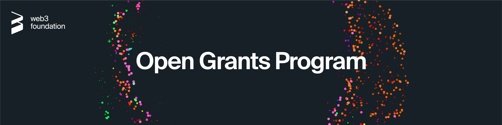

# Open Grants Program

  

**:loudspeaker: Important:** The Web3 Foundation Open Grants Program focuses on technology grants up to **$30k**, which are tracked **transparently** on GitHub and disbursed in **bitcoin**. 

---

- [:clipboard: About](#clipboard-about)
    - [Introduction](#introduction)
    - [Team](#team) 
- [:pencil: Process](#pencil-process)
- [:bulb: Help](#bulb-help)
  - [Additional information](#additional-information)
  - [Real-time conversation](#real-time-conversation)
- [:rocket: Alternative Funding Sources](#rocket-alternative-funding-sources)
  - [Treasury](#treasury)
  - [General Grants Program](#general-grants-program)
- [:information_source: License](#information_source-license)

## :clipboard: About 

### Introduction

The Open Grants Program seeks to allocate resources to projects that are beneficial to the advancement of the Polkadot ecosystem. It tries to achieve this in the following way:
- Fully transparent
- Simple
- Effective  

The Web3 Foundation Open Grants Program focuses on technology grants up to **$30k**, which are tracked **transparently** on GitHub and disbursed in **bitcoin**. For larger grants, payments in other currencies and partly private submissions, please visit our [Web3 Foundation Grants page](https://github.com/w3f/Web3-collaboration/blob/master/grants/grants.md) on GitHub. 

You can find a list of areas in the Web 3.0 Technology Stack that demand particular development [here](https://github.com/w3f/Web3-collaboration/blob/master/grants/grants.md#areas-of-interest-for-technical-grants), as well as a list of previously accepted projects [here](https://github.com/w3f/Web3-collaboration/blob/master/grants/accepted_grant_applications.md). 

### Team

**W3F Grants Committee**

The Committee consists of individuals who know the funding priorities of the Polkadot ecosystem. The committee evaluates grant applications and provides feedback on these applications.

* [Aeron Buchanan](https://github.com/aeronbuchanan)
* [Marcin Górny](https://github.com/mmagician)
* [Fredrik Harrysson](https://github.com/folsen)
* [David Hawig](https://github.com/Noc2)
* [Kasper Mai Jørgensen](https://github.com/KasperJor)
* [Rouven Pérez](https://github.com/RouvenP)
* [Reto Trinkler](https://github.com/retotrinkler)
* [Gavin Wood](https://github.com/gavofyork)

**W3F Grants Evaluators**

Evaluators are individuals able to evaluate the technology delivered as a result of the Open Grants Program. The committee decides about the evaluators and has the right to add or remove evaluators (supermajority needed).

* [Peter Czaban](https://github.com/keorn)
* [Marcin Górny](https://github.com/mmagician)
* [David Hawig](https://github.com/Noc2)

**W3F Operations Team**

Operations Team takes care of legal documents, invoicing and remittances. 

* [Kasper Mai Jørgensen](https://github.com/KasperJor)
* [Rouven Pérez](https://github.com/RouvenP)

## :pencil: Process

1. **Grant Application:**
    1. [Fork](https://github.com/w3f/Open-Grants-Program/fork) this repository
    2. In the newly created fork, create a **copy** of the [application-template.md](./applications/application-template.md). In other words: In the GitHub web interface, you need to create a new file and copy the content of the [application-template.md](./applications/application-template.md) inside the new file. Don't change the template file directly!
    3. Label the file as "project_name.md".
    4. Fill out the template with the details of your project.
    5. Once you have completed the application, click on "create new pull request".
    6. Sign off on the [terms and conditions](https://github.com/w3f/Open-Grants-Program/blob/master/src/T&Cs.md) presented by [claassistantio](https://github.com/claassistantio) as  Contributor License Agreement (CLA). You might need to reload the pull request to see the comment by [claassistantio](https://github.com/claassistantio).
2. **Application Review:**
    1. Committee can issue comments and request changes on the pull request.
    2. The application is accepted when one-third of the committee approves a pull request, the terms and conditions have been agreed and all requested changes are addressed.
3. **Milestone Delivery:**
    1. [Fork](https://github.com/w3f/Grant-Milestone-Delivery/fork) the [Grant Milestone Delivery](https://github.com/w3f/Grant-Milestone-Delivery) repo with the **same GitHub account, which you used to submit the application!**
    2. In the newly created fork, create a **copy** of the [milestone-delivery-template.md](https://github.com/w3f/Grant-Milestone-Delivery/blob/master/deliveries/milestone-delivery-template.md).
    3. Label the file as "project_name_milestone_number.md".
    4. Fill out the [invoice form](https://forms.gle/QvsbeSA3ziuC9k9b9).
    5. Fill out the template with the details of your milestone including a **link to the initial pull request**.
    6. Once you have completed the application, click on "create new pull request".
4. **Milestone Review:**
    1. Evaluators can issue comments and request changes on the pull request.
    2. Grants Evaluators can approve a pull request to accept the deliverable.
5. **Milestone Payment:**
    1. The Operations Team receives a notification once the delivery was accepted or after two weeks without any feedback after the initial delivery. As soon as feedback is provided by the evaluators, this feedback first needs to be resolved.  
    2. Operations Team makes the payment to the Bitcoin address specified in the initial application.

*Grant application can be amended at any time, necessitating a reevaluation by the Committee.* 

Additionally, we try to enforce the [code of conduct](https://github.com/w3f/Open-Grants-Program/blob/master/CODE_OF_CONDUCT.md) and based on this potentially [block users](https://github.blog/2016-04-04-organizations-can-now-block-abusive-users/).

## :rocket: Alternative Funding Sources

### Treasury

The treasury is a pot of on-chain funds collected through transaction fees, slashing, staking inefficiencies, etc. The funds held in the treasury can be spent by making a spending proposal. [Polkadot](https://polkadot.network/) as well as [Kusama](https://kusama.network/) offer everyone the opportunity to apply for funding via the treasury. See:

- [Kusama Treasury Guide](https://docs.google.com/document/d/1p3UQUjph5t8TVaWnTkfrI5mE-BABnM9Xvtuhdlhl6JE/edit)
- [Treasury Wiki](https://wiki.polkadot.network/docs/en/learn-treasury#docsNav)

### General Grants Program

For larger grants, payments in fiat and partly private submissions, please visit our [Web3 Foundation Grants page](https://github.com/w3f/Web3-collaboration/blob/master/grants/grants.md) on GitHub. 

## :bulb: Help

### Additional information

* [W3F Website](https://web3.foundation)
* [W3F Forum](https://forum.web3.foundation)
* [W3F Twitter](https://twitter.com/web3foundation)
* [W3F Medium](https://medium.com/web3foundation)
* [Polkadot Wiki](https://wiki.polkadot.network/en/)
* [Web 3.0 Reddit](https://www.reddit.com/r/web3)

### Real-time conversation
We have Riot channels for real-time discussions on Web3 and Polkadot. Join the conversations.
* [Web3 Foundation](https://riot.im/app/#/room/#web3foundation:matrix.org)
* [Polkadot Watercooler](https://riot.im/app/#/room/#polkadot-watercooler:matrix.org)

## :information_source: License
[Apache License 2.0](https://github.com/w3f/Open-Grants-Program/blob/master/LICENSE) © Web3 Foundation 
