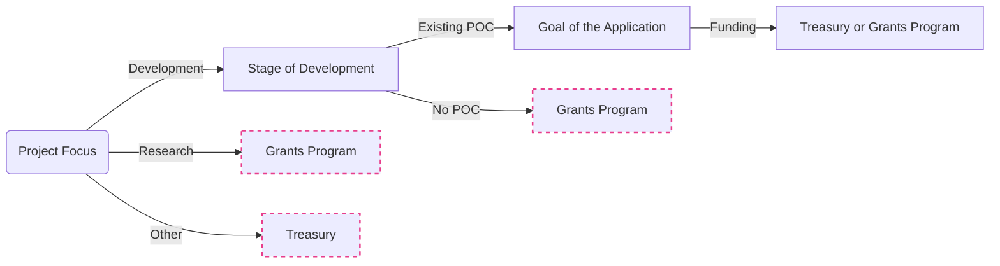

# Polkadot Open Source Grants Bounty<!-- omit in toc -->

- [:wave: Introduction](#wave-introduction)
  - [Guidelines](#guidelines)
  - [Project Ideas](#project-ideas)
  - [Support](#support)
  - [Team](#team)
- [:level\_slider: Levels](#level_slider-levels)
- [:pencil: Process](#pencil-process)
  - [1. Application](#1-application)
  - [2. Application Review](#2-application-review)
  - [3. Milestone Delivery and Payment](#3-milestone-delivery-and-payment)
  - [Changes to a Grant after Approval](#changes-to-a-grant-after-approval)
- [:bulb: Help](#bulb-help)
  - [Real-time Conversation](#real-time-conversation)
- [:rocket: Alternative Funding Sources](#rocket-alternative-funding-sources)
  - [Treasury vs Web3 Grants](#treasury-vs-web3-grants)
  - [Treasury](#treasury)
  - [Hackathons](#hackathons)
  - [Other Grant or Bounty Programs](#other-grant-or-bounty-programs)

## :wave: Introduction

[Open Source Developer Grants Bounty](https://polkadot.polkassembly.io/bounty/59) support individuals and small teams in developing open-source software for the Polkadot ecosystem. This initiative aims to fund up to 15 projects with grants of up to $30,000 each, focusing on those with a proven background in open-source software development. Projects can include proofs of concept, general-purpose libraries, or full-scale dApps that benefit the Polkadot ecosystem.

### Guidelines

The inner workings of the bounty will be loosely based on the [Web3 Foundation Grants Program](https://grants.web3.foundation/). This means teams apply publicly using an application template, where community members can comment and make change suggestions, and applications are accepted or rejected by the curators of this bounty based on the following criteria:
	
* The applications focus on open-source software development directly or indirectly beneficial for the Polkadot ecosystem. Acceptable licenses are The Unlicense, Apache, MIT, or GPL v3.
* Teams need to build solutions on or for the Polkadot Network, which are:
focussed on implementing common good infrastructure and
not the issuer and/or the promoter of any token at the time of the application.
Teams need to successfully undergo a KYC/KYB process.
* Each team can only receive one grant. 
* The technical development is unique and doesn’t already exist in the ecosystem. 
* The curators don’t directly benefit financially from the applications/grants. For individual cases of conflict of interest, the curators must recuse themselves from the evaluation and discussion of the application and milestones.
* Projects must not actively encourage gambling, illicit trade, money laundering, or criminal activities in general.
* The scope and funding amount of the project as a whole and each milestone are subject to discussion. Since grants are focused on software development, funding should closely follow the person-hours estimated for each milestone. 
* If an application is accepted, they can start working on the project. Payments are made once a milestone is delivered and successfully evaluated by one of the curators of the bounty. 

The bounty aims to support roughly 15 projects initially. However, the number of projects that the program can support ultimately depends on the price of DOT after the bounty is approved and the amount being requested by the applicants. No project should receive more than 30,000 USD based on the conversion rate that will be specified in the application itself. For example, if the DOT price doubles, it would be possible to support twice the number of projects with the requested funds. If the DOT price goes down, the number of projects that can be supported will be lower. 

In any case, the money will only be used for the specified scope and returned after no less than eight months if not spent. If the program is successful and all the money is spent before the timeline, we might ask the treasury to top up the funds and continue with the program. However, this also depends on the project summary report and the success of the program.

Anyone is welcome to apply for a grant. Projects funded through our programs are broad in scope, but our focus lies on strong **technical** projects that add value to the ecosystem.

Generally, your project will have better chances to be accepted if:

- It presents a **well-researched** or tested concept, for which, ideally, you are able to show some prior work.
- You can demonstrate that the project will be **maintained** after completion of the grant, be it through an obvious commitment to the technology from your side, additional funding sources, or an existing business model.
- Your team has **proven experience** with the relevant languages and technologies and/or a strong technical background. You will be asked to provide the GitHub profiles of your team members as part of your application, which we will examine for past activity and code quality. Naturally, you can also link to projects on other platforms.
- Your application is **rich in technical details** and well-defined.
- You can clearly present how your project stands out among competitors or implements technology that doesn't exist in the ecosystem yet.

In addition to the information provided on your application, note that your project will need to comply with our [Guidelines for Milestone Deliverables](https://github.com/w3f/Grants-Program/blob/master/docs/Support%20Docs/milestone-deliverables-guidelines.md). In particular, we require all projects to create documentation that explains how their project works. At a minimum, _written_ documentation is required for funding. Tutorials or videos are also helpful for new users to understand how to use your product.

Please also heed our [Announcement Guidelines](https://github.com/w3f/Grants-Program/blob/master/docs/Support%20Docs/announcement-guidelines.md) for grant-related communications.

Finally, we take licensing and the right of all teams in and outside the ecosystem to be recognised for their work very seriously. Using others' work with no attribution or indication that this was not your own work as part of a milestone delivery **will lead to immediate termination**. Please reach out to us before submitting if you have any doubts on how to comply with a specific license and we'll be happy to help.

We also try to enforce our [code of conduct](CODE_OF_CONDUCT.md) and, based on this, may [block users](https://github.blog/2016-04-04-organizations-can-now-block-abusive-users/).

### Project Ideas

An overview of existing projects in the Web 3.0 Technology Stack, along with broad project ideas we would potentially be interested in funding, can be found [here](https://wiki.polkadot.network/docs/build-open-source), as well as a list of previously accepted applications [here](https://github.com/w3f/Grants-Program/blob/master/applications/index.md).

[Requests For Proposals](https://github.com/w3f/Grants-Program/blob/master/docs/rfps.md) (RFPs) represent concrete ideas for projects that we would like to see implemented. Several teams may apply for the same RFP, so even if another team has already applied to implement a certain RFP, we invite you to do the same if you're interested.

Finally, you don't need to start your own project in order to be eligible for a grant. Instead, some teams choose to port existing work to Substrate, where the pertinent licenses allow, or even to contribute to an existing open-source project. In the latter case, you should check in advance that the maintainers of the project are interested in your contribution, and the acceptance of the milestones will generally be tied to the inclusion of your work in said project. See the [Maintenance Grants section](#hammer_and_wrench-maintenance-grants) for more info.

If you have a **good concept of the technical challenges** that your idea entails and would like feedback/input before submitting it, you can send us an [email](mailto:grants@web3.foundation) and tell us about it.

### Support

The scope of our Grants Programs consists of funding and feedback on delivered milestones. This means that we do not provide hands-on support as part of a grant, but if you face specific issues during development, we will do our best and try to direct you to the correct resources. You can find general documentation and more information on Substrate on the [Substrate Developer Hub](https://substrate.dev/), and we encourage you to join the [community](https://substrate.dev/en/community) in order to get help with specific issues or to stay up to date with the most recent developments.

For questions about the grants program itself, see our [FAQ](docs/faq.md#frequently-asked-questions).

### Team

#### Curators<!-- omit in toc -->

The curators consists of individuals who know the funding priorities of the Polkadot ecosystem and is responsible for evaluating grant applications and providing feedback on these.

 - Diogo Mendonca from Ditavia
 - Tommi Enenkel from Alice und Bob
 - Otar Shakarishvili from JUST Open Source
 - Luca von Wyttenbach from Polimec
 - Sebastian Müller from Web3 Foundation

## :level_slider: Grant

- **Target:** Small teams/start-ups
- **Amount:** Up to $30,000
- **Requirements:** 3 approvals
- **Benefits:** ???

## :pencil: Process

> **:loudspeaker:** At least 50% (as defined in your grant agreement) of each milestone payment is made in DOT (linearly vesting over 2 years). The remainder is paid in USDC on the Polkadot [AssetHub](https://wiki.polkadot.network/docs/learn-assets). Please indicate your preference in the application [as outlined in our application template](https://github.com/w3f/Grants-Program/blob/master/applications/application-template.md?plain=1#L7). If you want to apply in **private**, you can do so [:arrow_right: here](https://docs.google.com/forms/d/e/1FAIpQLSfMfjiRmDQDRk-4OhNASM6BAKii7rz_B1jWtbCPkUh6N7M2ww/viewform). Note that this is generally a slower process and imposes stricter requirements on applicants.

### 1. Application

   0. Please read our [FAQs](https://github.com/w3f/Grants-Program/blob/master/docs/faq.md), [category guidelines](https://github.com/w3f/Grants-Program/blob/master/docs/Support%20Docs/grant_guidelines_per_category.md), [announcement guidelines](https://github.com/w3f/Grants-Program/blob/master/docs/Support%20Docs/announcement-guidelines.md) and [Terms & Conditions](https://github.com/w3f/Grants-Program/blob/master/docs/Support%20Docs/T%26Cs.md) to familiarize yourself with the subtleties of grants, applications and the program as a whole.
   1. [Fork](https://github.com/w3f/Grants-Program/fork) this repository.
   2. In the newly created fork, create a copy of the application template ([`applications/application-template.md`](applications/application-template.md)). If you're using the GitHub web interface, you will need to create a new file and copy the [contents](https://raw.githubusercontent.com/w3f/Grants-Program/master/applications/application-template.md) of the template inside the new one. Make sure you **do not modify the template file directly**. In the case of a maintenance application, use the maintenance template ([`maintenance template`](applications/maintenance/maintenance-template.md)) instead. In the case of a research application, use the research template ([`research template`](applications/application-template-research.md)) instead.
   3. Name the new file after your project: `project_name.md`.
   4. Fill out the template with the details of your project. The more information you provide, the faster the review. Please refer to our [Grant guidelines for most popular grant categories](https://github.com/w3f/Grants-Program/blob/master/docs/Support%20Docs/grant_guidelines_per_category.md) and make sure your deliverables present a similar same level of detail. To get an idea of what a strong application looks like, you can have a look at the following examples:  [1](https://github.com/w3f/Grants-Program/blob/master/applications/project_aurras_mvp_phase_1.md), [2](https://github.com/w3f/Grants-Program/blob/master/applications/project_bodhi.md), [3](https://github.com/w3f/Grants-Program/blob/master/applications/pontem.md), [4](https://github.com/w3f/Grants-Program/blob/master/applications/spartan_poc_consensus_module.md). Naturally, if you're only applying for a smaller grant that only consists of, say, UI work, you don't need to provide as much detail.
   5. Once you're done, create a pull request in **our** main [Grants-Program repository](https://github.com/w3f/Grants-Program). The pull request should only contain _one new file_—the Markdown file you created from the template.
   6. You will see a comment template that contains a checklist. You can leave it as is and tick the checkboxes once the pull request has been created. Please read through these items and check all of them.
   7. Sign off on the [terms and conditions](https://github.com/w3f/Grants-Program/blob/master/docs/Support%20Docs/T%26Cs.md) presented by the [CLA assistant](https://github.com/claassistantio) bot as a Contributor License Agreement. You might need to reload the pull request to see its comment.

### 2. Application Review

   1. The [committee](#w3f-grants-committee) can (and usually does) issue comments and request changes on the pull request.
   2. Clarifications and amendments made in the comments _need to be included in the application_. You may address feedback by directly modifying your application and leaving a comment once you're done. Generally, if you don't reply within 2 weeks, the application will be closed due to inactivity, but you're always free to reopen it as long as it hasn't been rejected.
   3. When all requested changes are addressed, and the terms and conditions have been signed, someone will mark your application as `ready for review` and share it internally with the rest of the committee.
   4. The application will be accepted and merged as soon as it receives the required number of approvals (see [levels](#level_slider-levels)) or closed after two weeks of inactivity. Unless specified otherwise, the day on which it is accepted will be considered the starting date of the project, and will be used to estimate delivery dates.

### 3. Milestone Delivery and Payment

   Milestones are to be delivered on the [Grant Milestone Delivery](https://github.com/w3f/Grant-Milestone-Delivery/) repository following the [process](https://github.com/w3f/Grant-Milestone-Delivery#mailbox-milestone-delivery-process) described therein.

### Changes to a Grant after Approval

- Accepted grant applications can be amended at any time. However, this _necessitates a reevaluation by the committee_ and the same number of approvals as an application (according to the [levels](#level_slider-levels)). If your application has been accepted and, during development, you find that your project significantly deviates from the original specification, please open a new pull request that modifies the existing application. This also applies in case of significant delays.
- If your _delivery schedule_ significantly changes, please also open a pull request with an updated timeline.
- If your deliveries are significantly delayed, and we cannot get a hold of you, we will terminate the grant (3 approvals required, regardless of level. If a member of the committee creates the termination PR, only two more approvals are required).

## :bulb: Help

### Real-time Conversation

We have a Matrix channel for grant-related questions and activities. Head over there to ask grants-related questions, share your experience with other applications and grantees, or simply hang out:

- [W3F Grants Community](https://matrix.to/#/!XpynPDLusWUWfDpaqr:matrix.org?via=web3.foundation&via=matrix.org)

We also have Matrix/Element channels for real-time discussions on Web3 and Polkadot. Join the conversation!

- [Web3 Foundation Chat](https://matrix.to/#/#w3f:matrix.org)
- [Polkadot Space](https://matrix.to/#/#polkadot:web3.foundation)
- [Kusama Space](https://matrix.to/#/#kusama:web3.foundation)

## :rocket: Alternative Funding Sources

We encourage you to explore the alternative funding options listed below. Please note, however, that you should not seek to fund the **same scope of work** from multiple sources and that any team found doing so will have its Web3 Foundation support terminated.

### Treasury vs Web3 Grants

The following flowchart gives a rough, oversimplified view of how the W3F Grants Program, the Polkadot and Kusama treasuries relate, and where your project might fit best. Note that this diagram does not include any of the [parachain-specific grants/builders programs](#other-grant-programs) other organisations are offering.  

### Treasury

The treasury is a pot of on-chain funds collected through transaction fees, slashing, staking inefficiencies, etc. The funds held in the treasury can be spent on spending proposals. Both [Polkadot](https://polkadot.network/) and [Kusama](https://kusama.network/) offer everyone the opportunity to apply for funding via the treasury. See:

- [Treasury Bounties](https://polkadot.subsquare.io/treasury/bounties)
- [Polkadot Treasury Guide](https://docs.google.com/document/d/1IZykdp2cyQavcRyZd_dgNj5DcgxgZR6kAqGdcNARu1w)
- [Kusama Treasury Guide](https://docs.google.com/document/d/1p3UQUjph5t8TVaWnTkfrI5mE-BABnM9Xvtuhdlhl6JE)

### Hackathons

From time to time, Web3 Foundation and/or Parity organise hackathons to promote quick prototyping of Polkadot related ideas. We highly encourage you to participate in these hackathons. Bear in mind, however, that you cannot submit the **same work** for a hackathon and the Grants Program. If you have worked or are planning to work on a project for a hackathon, your grant application should either propose a different set of features or otherwise build on top of your hackathon work. The same applies in reverse, although that will likely be less common.

The best way to find out about upcoming hackathons is by following Polkadot on various social channels, such as Element or Twitter.

### Other Grant or Bounty Programs

Below is a list of other grant and bounty programs in the Polkadot/Substrate ecosystem:

- [Acala Ecosystem Program](https://acala.network/ecosystem-program)
- [Aleph Zero Funding Program](https://alephzero.org/ecosystem-funding-program)
- [Avail Uncharted Grants](https://github.com/availproject/avail-uncharted/blob/main/grants/grants.md) 
- [Darwinia Grants Program](https://github.com/darwinia-network/collaboration/blob/master/grant/README.md#grant-program)
- [Decentralized JAM](https://jam.web3.foundation/) 
- [HydraDX Grants and Bounties](https://docs.hydradx.io/spending_fw/)
- [ink!ubator](https://use.ink/ubator/)
- [Moonbeam Grants Program](https://moonbeam.foundation/grants/)
- [Moondance Labs Ecosysytem Funding Program](https://www.moondancelabs.com/ecosystem-grants-w3f)
- [peaq Ecosystem Grant Program](https://www.peaq.network/grant-program)
- [Polkadot Pioneers Prize](https://pioneersprize.polkadot.network/)
- [SubQuery Developer Guild](https://github.com/subquery/developer-guild)
- [Pendulum / Amplitude Grant Programs](https://pendulumchain.org/ecosystem-grant)
- [Polkadot Assurance Legion](https://polkadotassurance.com/)

## :information_source: License<!-- omit in toc -->

[Apache License 2.0](LICENSE) © Web3 Foundation
