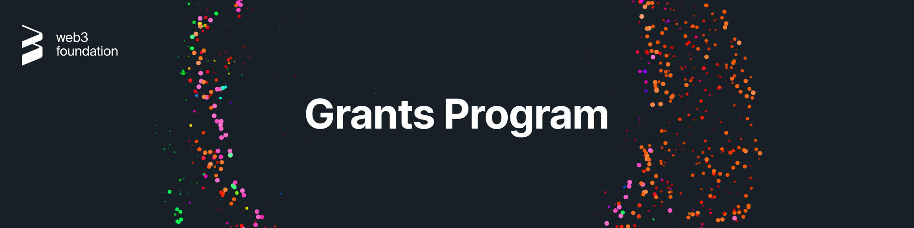
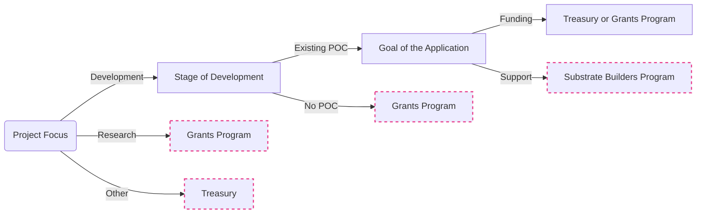

# Web3 Foundation Grants Program<!-- omit in toc -->

  

- [:wave: Introduction](#wave-introduction)
  - [Guidelines](#guidelines)
  - [Project Ideas](#project-ideas)
  - [Support](#support)
  - [Team](#team)
- [:level\_slider: Levels](#level_slider-levels)
- [:pencil: Process](#pencil-process)
  - [1. Application](#1-application)
  - [2. Application Review](#2-application-review)
  - [3. Milestone Delivery and Payment](#3-milestone-delivery-and-payment)
  - [Changes to a Grant after Approval](#changes-to-a-grant-after-approval)
- [:mailbox\_with\_mail: Suggest a Project](#mailbox_with_mail-suggest-a-project)
- [:hammer\_and\_wrench: Maintenance Grants](#hammer_and_wrench-maintenance-grants)
- [:moneybag: Referral Program](#moneybag-referral-program)
- [:bulb: Help](#bulb-help)
  - [Real-time Conversation](#real-time-conversation)
  - [Office Hours](#office-hours)
  - [Additional Information](#additional-information)
- [:rocket: Alternative Funding Sources](#rocket-alternative-funding-sources)
  - [Substrate Builders Program vs Treasury vs Web3 Grants](#substrate-builders-program-vs-treasury-vs-web3-grants)
  - [Substrate Builders Program](#substrate-builders-program)
  - [Treasury](#treasury)
  - [Hackathons](#hackathons)
  - [Other Grant or Bounty Programs](#other-grant-or-bounty-programs)

## :wave: Introduction

As part of our commitment to promoting the Web3 ecosystem, we offer a comprehensive grants program focused on funding software development and research efforts related to **Polkadot and Kusama**. For more information about the Web3 Foundation, please visit the [About page](https://web3.foundation/about/) on our website.

### Guidelines

Anyone is welcome to apply for a grant. Projects funded through our programs are broad in scope, but our focus lies on strong **technical** projects that add value to the ecosystem.

Generally, your project will have better chances to be accepted if:

- It presents a **well-researched** or tested concept, for which, ideally, you are able to show some prior work.
- You can demonstrate that the project will be **maintained** after completion of the grant, be it through an obvious commitment to the technology from your side, additional funding sources, or an existing business model.
- Your team has **proven experience** with the relevant languages and technologies and/or a strong technical background. You will be asked to provide the GitHub profiles of your team members as part of your application, which we will examine for past activity and code quality. Naturally, you can also link to projects on other platforms.
- Your application is **rich in technical details** and well-defined.
- You can clearly present how your project stands out among competitors or implements technology that doesn't exist in the ecosystem yet.

Additionally, it must fulfill the following requirements:

- All code produced as part of a grant must be **open-sourced**, and it must also not rely on closed-source software for full functionality. We prefer Apache 2.0, but GPLv3, MIT, or Unlicense are also acceptable.
- We do not award grants for projects that have been the object of a successful token sale.
- Applications must not mention a specific token. Furthermore, the focus of the application should lie on the software that is being implemented/research being carried out as part of the grant and less on your project/venture/operation. For the purpose of the application and delivery, think about how others might also benefit from your work.
- As a general rule, teams are asked to finish a grant before applying for another one.
- Lastly, we do not fund projects that actively encourage gambling, illicit trade, money laundering, or criminal activities in general.

In addition to the information provided on your application, note that your project will need to comply with our [Guidelines for Milestone Deliverables](https://github.com/w3f/Grants-Program/blob/master/docs/Support%20Docs/milestone-deliverables-guidelines.md). In particular, we require all projects to create documentation that explains how their project works. At a minimum, _written_ documentation is required for funding. Tutorials or videos are also helpful for new users to understand how to use your product.

Please also heed our [Announcement Guidelines](https://github.com/w3f/Grants-Program/blob/master/docs/Support%20Docs/announcement-guidelines.md) for grant-related communications.

Finally, we take licensing and the right of all teams in and outside the ecosystem to be recognised for their work very seriously. Using others' work with no attribution or indication that this was not your own work as part of a milestone delivery **will lead to immediate termination**. Please reach out to us before submitting if you have any doubts on how to comply with a specific license and we'll be happy to help.

We also try to enforce our [code of conduct](CODE_OF_CONDUCT.md) and, based on this, may [block users](https://github.blog/2016-04-04-organizations-can-now-block-abusive-users/).

### Project Ideas

An overview of existing projects in the Web 3.0 Technology Stack, along with broad project ideas we would potentially be interested in funding, can be found [here](https://wiki.polkadot.network/docs/build-open-source), as well as a list of previously accepted applications [here](https://github.com/w3f/Grants-Program/blob/master/applications/index.md).

[Requests For Proposals](https://github.com/w3f/Grants-Program/blob/master/docs/rfps.md) (RFPs) represent concrete ideas for projects that we would like to see implemented. Several teams may apply for the same RFP, so even if another team has already applied to implement a certain RFP, we invite you to do the same if you're interested.

Finally, you don't need to start your own project in order to be eligible for a grant. Instead, some teams choose to port existing work to Substrate, where the pertinent licenses allow, or even to contribute to an existing open-source project. In the latter case, you should check in advance that the maintainers of the project are interested in your contribution, and the acceptance of the milestones will generally be tied to the inclusion of your work in said project. See the [Maintenance Grants section](#hammer_and_wrench-maintenance-grants) for more info.

If you have a **good concept of the technical challenges** that your idea entails and would like feedback/input before submitting it, you can send us an [email](mailto:grants@web3.foundation) and tell us about it.

### Support

The scope of our Grants Programs consists of funding and feedback on delivered milestones. This means that we do not provide hands-on support as part of a grant, but if you face specific issues during development, we will do our best and try to direct you to the correct resources. If this sounds like something you would like however, you may also want to apply to Parity's [Substrate Builders Program](https://www.substrate.io/builders-program/), which provides hands-on technical, ecosystem, and strategical long-term support and access to extensive resources. You can find general documentation and more information on Substrate on the [Substrate Developer Hub](https://substrate.dev/), and we encourage you to join the [community](https://substrate.dev/en/community) in order to get help with specific issues or to stay up to date with the most recent developments.

For questions about the grants program itself, see our [FAQ](docs/faq.md#frequently-asked-questions).

### Team

#### W3F Grants Committee<!-- omit in toc -->

The committee consists of individuals who know the funding priorities of the Polkadot ecosystem and is responsible for evaluating grant applications and providing feedback on these.

In cases where a niche expert opinion is desirable, one of the committee members may request such a review.

- [Santiago Balaguer](https://github.com/SBalaguer)
- [Aeron Buchanan](https://github.com/aeronbuchanan)
- [David Hawig](https://github.com/Noc2)
- [Sebastian Müller](https://github.com/semuelle)
- [Bill Laboon](https://github.com/laboon)
- [Keegan Quigley](https://github.com/keeganquigley)
- [Raul Romanutti](https://github.com/rrtti)
- [Seraya Takahashi](https://github.com/takahser)
- [Benjamin Weiß](https://github.com/BenWhiteJam)
- [Gavin Wood](https://github.com/gavofyork)

#### W3F Grants Evaluators<!-- omit in toc -->

Evaluators are individuals able to evaluate the technology delivered as a result of the Grants Program. The committee has the right to add or remove evaluators on the basis of supermajority.

- [David Hawig](https://github.com/Noc2)
- [Sebastian Müller](https://github.com/semuelle)
- [Keegan Quigley](https://github.com/keeganquigley)
- [Seraya Takahashi](https://github.com/takahser)

#### W3F Operations Team<!-- omit in toc -->

The Operations Team takes care of legal documents, invoicing, and remittances.

- [Melanie Diener](https://github.com/meldien)
- [Rouven Pérez](https://github.com/RouvenP)

## :level_slider: Levels

The W3F Grants Program offers different grant levels to help you best, depending on your current stage.

### :hatching_chick: Level 1 (= InstaGrants)<!-- omit in toc -->

- **Target:** Individuals & small teams
- **Amount:** Up to $10,000
- **Requirements:** 2 approvals
- **Benefits:** Feedback during application process and evaluation, introduction to related teams/projects

### :baby_chick: Level 2<!-- omit in toc -->

- **Target:** Small teams/start-ups
- **Amount:** Up to $30,000
- **Requirements:** 3 approvals
- **Benefits:** All of the above + [co-promotion](https://github.com/w3f/Grants-Program/blob/master/docs/Support%20Docs/announcement-guidelines.md), [Grants Program badge](https://github.com/w3f/Grants-Program/blob/master/docs/Support%20Docs/grant-badge-guidelines.md), fast track to [Substrate Builders Program](https://www.substrate.io/builders-program/)

### :rooster: Level 3<!-- omit in toc -->

- **Target:** Companies/foundations with a proven track record
- **Amount:** Unlimited
- **Requirements:** 5 approvals (for >$100k: Web3 Foundation Council approval + Pitch call)
- **Benefits:** All of the above + VC introductions

## :pencil: Process

> **:loudspeaker:** Payments can be made in USDT and USDC on the Polkadot [AssetHub](https://wiki.polkadot.network/docs/learn-assets) and fiat (USD, EUR, CHF). Please indicate your preference in the application [as outlined in our application template](https://github.com/w3f/Grants-Program/blob/master/applications/application-template.md?plain=1#L7). If you want to apply in **private**, you can do so [:arrow_right: here](https://docs.google.com/forms/d/e/1FAIpQLSfMfjiRmDQDRk-4OhNASM6BAKii7rz_B1jWtbCPkUh6N7M2ww/viewform). Note that this is generally a slower process and imposes stricter requirements on applicants.

### 1. Application

   0. Please read our [FAQs](https://github.com/w3f/Grants-Program/blob/master/docs/faq.md), [category guidelines](https://github.com/w3f/Grants-Program/blob/master/docs/Support%20Docs/grant_guidelines_per_category.md), [announcement guidelines](https://github.com/w3f/Grants-Program/blob/master/docs/Support%20Docs/announcement-guidelines.md) and [Terms & Conditions](https://github.com/w3f/Grants-Program/blob/master/docs/Support%20Docs/T%26Cs.md) to familiarize yourself with the subtleties of grants, applications and the program as a whole.
   1. [Fork](https://github.com/w3f/Grants-Program/fork) this repository.
   2. In the newly created fork, create a copy of the application template ([`applications/application-template.md`](applications/application-template.md)). If you're using the GitHub web interface, you will need to create a new file and copy the [contents](https://raw.githubusercontent.com/w3f/Grants-Program/master/applications/application-template.md) of the template inside the new one. Make sure you **do not modify the template file directly**. In the case of a maintenance application, use the maintenance template ([`maintenance template`](applications/maintenance/maintenance-template.md)) instead. In the case of a research application, use the research template ([`research template`](applications/application-template-research.md)) instead.
   3. Name the new file after your project: `project_name.md`.
   4. Fill out the template with the details of your project. The more information you provide, the faster the review. Please refer to our [Grant guidelines for most popular grant categories](https://github.com/w3f/Grants-Program/blob/master/docs/Support%20Docs/grant_guidelines_per_category.md) and make sure your deliverables present a similar same level of detail. To get an idea of what a strong application looks like, you can have a look at the following examples:  [1](https://github.com/w3f/Grants-Program/blob/master/applications/project_aurras_mvp_phase_1.md), [2](https://github.com/w3f/Grants-Program/blob/master/applications/project_bodhi.md), [3](https://github.com/w3f/Grants-Program/blob/master/applications/pontem.md), [4](https://github.com/w3f/Grants-Program/blob/master/applications/spartan_poc_consensus_module.md). Naturally, if you're only applying for a smaller grant that only consists of, say, UI work, you don't need to provide as much detail.
   5. Once you're done, create a pull request in **our** main [Grants-Program repository](https://github.com/w3f/Grants-Program). The pull request should only contain _one new file_—the Markdown file you created from the template.
   6. You will see a comment template that contains a checklist. You can leave it as is and tick the checkboxes once the pull request has been created. Please read through these items and check all of them.
   7. Sign off on the [terms and conditions](https://github.com/w3f/Grants-Program/blob/master/docs/Support%20Docs/T%26Cs.md) presented by the [CLA assistant](https://github.com/claassistantio) bot as a Contributor License Agreement. You might need to reload the pull request to see its comment.

### 2. Application Review

   1. The [committee](#w3f-grants-committee) can (and usually does) issue comments and request changes on the pull request.
   2. Clarifications and amendments made in the comments _need to be included in the application_. You may address feedback by directly modifying your application and leaving a comment once you're done. Generally, if you don't reply within 2 weeks, the application will be closed due to inactivity, but you're always free to reopen it as long as it hasn't been rejected.
   3. When all requested changes are addressed, and the terms and conditions have been signed, someone will mark your application as `ready for review` and share it internally with the rest of the committee.
   4. The application will be accepted and merged as soon as it receives the required number of approvals (see [levels](#level_slider-levels)) or closed after two weeks of inactivity. Unless specified otherwise, the day on which it is accepted will be considered the starting date of the project, and will be used to estimate delivery dates.

### 3. Milestone Delivery and Payment

   Milestones are to be delivered on the [Grant Milestone Delivery](https://github.com/w3f/Grant-Milestone-Delivery/) repository following the [process](https://github.com/w3f/Grant-Milestone-Delivery#mailbox-milestone-delivery-process) described therein.

### Changes to a Grant after Approval

- Accepted grant applications can be amended at any time. However, this _necessitates a reevaluation by the committee_ and the same number of approvals as an application (according to the [levels](#level_slider-levels)). If your application has been accepted and, during development, you find that your project significantly deviates from the original specification, please open a new pull request that modifies the existing application. This also applies in case of significant delays.
- If your _delivery schedule_ significantly changes, please also open a pull request with an updated timeline.
- If your deliveries are significantly delayed, and we cannot get a hold of you, we will terminate the grant (3 approvals required, regardless of level. If a member of the committee creates the termination PR, only two more approvals are required).

## :mailbox_with_mail: Suggest a Project

If you think that we should support the development of certain tools or projects that aren't in the Polkadot/Kusama [tech stack](https://wiki.polkadot.network/docs/build-open-source), feel free to submit a suggestion using the process described below. We are particularly interested in supporting projects that could be leveraged by other builders in our ecosystem.

**Submit an idea:**

If you have an idea for a project or would like to highlight an area in which you'd like to see teams build but lack the technical background to create a detailed outline, you're welcome to open an [issue](https://github.com/w3f/Grants-Program/issues/new) or add it to the [tech stack](https://wiki.polkadot.network/docs/build-open-source) as a potentially interesting project. We will review your suggestion and, if necessary, will create an RFP based on it and reach out to teams able to build it.

**Submit an RFP (Request for Proposals):**

Ideas generally have better chances of being implemented if they're presented in a project outline format that can be picked up straight away by a team, so if you have a good concept of the milestones required to bring your project to life, you can follow the process below and directly submit an RFP:

1. [Fork](https://github.com/w3f/Grants-Program/fork) this repository.
2. In the newly created fork, create a copy of the suggestion template ([`RFPs/suggestion-template.md`](https://github.com/w3f/Grants-Program/blob/master/docs/RFPs/suggestion-template.md)) inside the [`rfps`](https://github.com/w3f/Grants-Program/tree/master/docs/RFPs) folder. Make sure you create a new file and copy the [contents](https://raw.githubusercontent.com/w3f/Grants-Program/master/docs/RFPs/suggestion-template.md) of the template into the new one, and _do not modify the template file directly._
3. Name the file after your idea: `project_name.md`.
4. Fill out the template with the project details. Please include as many details as possible.
5. Once you're done, create a pull request in **our** main [Grants-Program repository](https://github.com/w3f/Grants-Program/blob/master/README.md). The pull request should only contain _one new file_—the Markdown file you created from the template.
6. You will see the same template as for creating an application. Please replace it with [this one](.github/PULL_REQUEST_TEMPLATE/rfp_pr_template.md).
7. The RFP will be accepted and merged as soon as it receives three approvals from [W3F Grants Committee](https://github.com/w3f/Grants-Program#w3f-grants-committee) members.

## :hammer_and_wrench: Maintenance Grants

Maintenance Grants are yet another idea to get involved with the Polkadot community. If you are a user of an open-source library that has gone out of date, or you simply want to work on small new features/fix bugs in these repos, we can support your contributions via a grant. We are happy to award rolling grants on a monthly basis, as long as the work done within each time period is performed to a quality standard deemed satisfactory by the grant evaluators.

The process of applying for a Maintenance Grant is similar to what was already outlined above, but instead of defining very detailed deliverables for each milestone upfront, we will ask you to specify, where possible:

- The repo(s) that need maintenance
- Outline of why the specific project should continue being supported
- Broad overview of the features/bugs that need development contributions
- An assurance that the current project owners are willing to review/accept your contributions (a note here: if you're fully taking over the project, it would make more sense for the current owners to transfer the repository to your organisation. If you can't get in touch with them, you may, of course, work on a fork)
- Max budget per month

Then, at the end of each month, you will need to provide a comprehensive report of the work done, including the list of issues/bugs/pull requests worked on, time spent on each of these & finally the associated cost. It is quite likely that the time allocation & cost will vary from month to month, depending on the nature of the project you're contributing to. The delivery process and format should follow that of a typical [milestone delivery](https://github.com/w3f/Grant-Milestone-Delivery#mailbox-milestone-delivery-process), as will the processing of the payment.

Please note that:

- Maintenance grants, as the name suggests, are meant to allow teams/individuals to maintain a certain project, and not to continue its development or implement larger features. Please use the traditional application process for this purpose.
- The 1-month timeframe is just a guideline. If you find it unsuitable for you or the chosen project for any reason, feel free to adjust as seen fit and point this out in your application.
- Please bear in mind that the Grants Committee might be stricter in accepting maintainers when compared to typical grants, mostly selecting for applicants with proven experience in the relevant tech stacks.
- Maintenance Grants are only awarded for fixed timeframes. The requested duration needs to be specified in the application.

## :moneybag: Referral Program

We give away 500 USD to each referral of a successful grant application by _anyone having previously worked on a Web3 Foundation grant_ or _a [Polkadot Ambassador](https://wiki.polkadot.network/docs/ambassadors)_. Web3 Foundation and Parity employees do not qualify for the program, even if they previously worked on a grant.

In order to be eligible for the referral bonus, the application itself must contain the name of the [Polkadot Ambassador](https://wiki.polkadot.network/docs/ambassadors) or the GitHub account of the grantee as well as the payment address for the referral bonus (see the [application template](applications/application-template.md)). Payment is made in USDT/USDC on Polkadot AssetHub after delivery and approval of the first milestone.

## :bulb: Help

### Real-time Conversation

We have a Matrix channel for grant-related questions and activities. Head over there to ask grants-related questions, share your experience with other applications and grantees, or simply hang out:

- [W3F Grants Community](https://matrix.to/#/!XpynPDLusWUWfDpaqr:matrix.org?via=web3.foundation&via=matrix.org)

We also have Matrix/Element channels for real-time discussions on Web3 and Polkadot. Join the conversation!

- [Web3 Foundation Chat](https://matrix.to/#/#w3f:matrix.org)
- [Polkadot Space](https://matrix.to/#/#polkadot:web3.foundation)
- [Kusama Space](https://matrix.to/#/#kusama:web3.foundation)

### Office Hours

Web3 Foundation Grants Office Hours are a chance to ask the grants team questions regarding a specific (potential) grant application. It offers

- general guidance regarding the grants program,
- some quick initial feedback and
- help how to navigate the ecosystem.

Apply for Office Hours if you

- need feedback before submitting an application,
- want to find out what kind of support there might be available or
- need help finding the resources you need.

It is **not** a chance to pitch your project, especially since only a small subset of the committee will participate in the call. To apply, please fill out the [Office Hours :alarm_clock: form](https://forms.gle/54xkiqU37WwdN9UR6). Be as specific as possible, so we can help you more quickly. We will get back to you with follow-up questions or a link for booking a timeslot.

### Additional Information

| </img> | </img> | </img> | </img> | </img> |
| :-: | :-: | :-: | :-: | :-: |
| [W3F Website](https://web3.foundation) | [W3F Twitter](https://twitter.com/web3foundation) | [W3F Medium](https://medium.com/web3foundation) | [Polkadot Wiki](https://wiki.polkadot.network/en/) | [W3F YouTube](https://www.youtube.com/channel/UClnw_bcNg4CAzF772qEtq4g) |

## :rocket: Alternative Funding Sources

We encourage you to explore the alternative funding options listed below. Please note, however, that you should not seek to fund the **same scope of work** from multiple sources and that any team found doing so will have its Web3 Foundation support terminated.

### Substrate Builders Program vs Treasury vs Web3 Grants

The following flowchart gives a rough, oversimplified view of how the W3F Grants Program, the Polkadot and Kusama treasuries and Parity's Substrate Builders Program relate, and where your project might fit best. Note that this diagram does not include any of the [parachain-specific grants/builders programs](#other-grant-programs) other organisations are offering.  

### Substrate Builders Program

The [Substrate Builders Program](https://substrate.io/ecosystem/substrate-builders-program/) directly supports you by connecting you with Parity’s extensive resources.

### Treasury

The treasury is a pot of on-chain funds collected through transaction fees, slashing, staking inefficiencies, etc. The funds held in the treasury can be spent on spending proposals. Both [Polkadot](https://polkadot.network/) and [Kusama](https://kusama.network/) offer everyone the opportunity to apply for funding via the treasury. See:

- [Treasury](https://polkadot.network/treasury/)
- [Treasury Bounties](https://polkadot.subsquare.io/treasury/bounties)
- [Polkadot Treasury Guide](https://docs.google.com/document/d/1IZykdp2cyQavcRyZd_dgNj5DcgxgZR6kAqGdcNARu1w)
- [Kusama Treasury Guide](https://docs.google.com/document/d/1p3UQUjph5t8TVaWnTkfrI5mE-BABnM9Xvtuhdlhl6JE)

### Hackathons

From time to time, Web3 Foundation and/or Parity organise hackathons to promote quick prototyping of Polkadot related ideas. We highly encourage you to participate in these hackathons. Bear in mind, however, that you cannot submit the **same work** for a hackathon and the Grants Program. If you have worked or are planning to work on a project for a hackathon, your grant application should either propose a different set of features or otherwise build on top of your hackathon work. The same applies in reverse, although that will likely be less common.

The best way to find out about upcoming hackathons is by following Polkadot on various social channels, such as Element or Twitter.

### Other Grant or Bounty Programs

Below is a list of other grant and bounty programs in the Polkadot/Substrate ecosystem:

- [Acala Grants Program](https://acala.network/ecosystem-program)
- [Aleph Zero Funding Program](https://alephzero.org/ecosystem-funding-program)
- [Astar / Shiden Network Builders Program](https://github.com/PlasmNetwork/Builders-Program)
- [Avail Uncharted Grants](https://github.com/availproject/avail-uncharted/blob/main/grants/grants.md) 
- [Crust Grants Program](https://github.com/crustio/Crust-Grants-Program)
- [Darwinia Grants Program](https://github.com/darwinia-network/collaboration/blob/master/grant/README.md#grant-program)
- [Decentralized Futures Program](https://futures.web3.foundation/) 
- [Edgeware Grants and Bounties](https://gov.edgewa.re/discussion/1132-edgeware-proposal-process-and-template)
- [HydraDX Grants and Bounties](https://docs.hydradx.io/spending_fw/)
- [ink!ubator](https://use.ink/ubator/)
- [Interlay Labs Grants Program](https://github.com/interlay/Grants-Program)
- [KodaDot Ecosystem Grants](https://github.com/kodadot/grants)
- [Moonbeam Grants Program](https://moonbeam.foundation/grants/)
- [OAK’s Developer Grants](https://oak.tech/community/grants/)
- [peaq Ecosystem Grant Program](https://www.peaq.network/grant-program)
- [Phala Builders Program](https://wiki.phala.network/en-us/build/general/builders-program/)
- [Picasso / Composable Grants Program](https://docs.composable.finance/ecosystem/composable-grants/)
- [Polkadot Pioneers Prize](https://pioneersprize.polkadot.network/)
- [SubQuery Grants Programme](https://subquery.network/grants)
- [Pendulum / Amplitude Grant Programs](https://pendulumchain.org/ecosystem-grant)

## :information_source: License<!-- omit in toc -->

[Apache License 2.0](LICENSE) © Web3 Foundation
