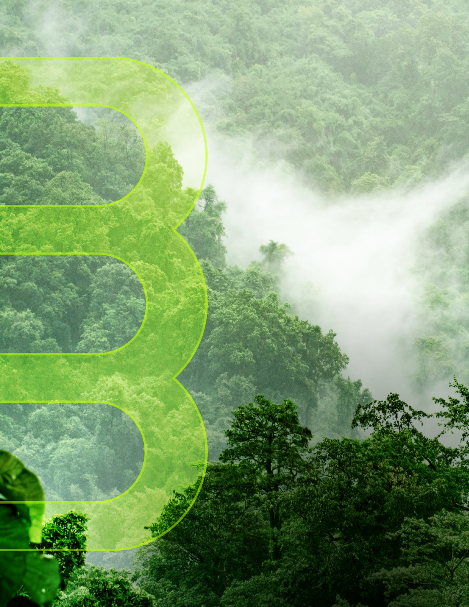
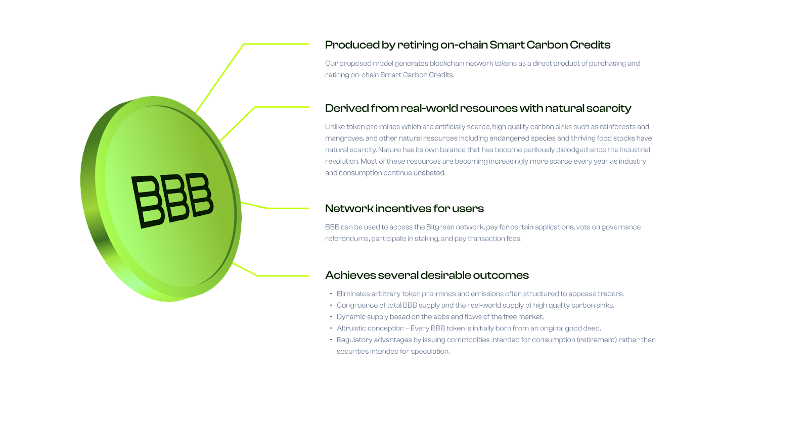

# W3F Grant Proposal

> This document will be part of the terms and conditions of your agreement and therefore needs to contain all the required information about the project. Don't remove any of the mandatory parts presented in bold letters or as headlines! Lines starting with a `>` (such as this one) can be removed.
>
> See the [Grants Program Process](https://github.com/w3f/Grants-Program/#pencil-process) on how to submit a proposal.

- **Project Name:** Carbon-Based Tokenomics
- **Team Name:** Bitgreen Inc
- **Payment Address:** 0x7C9F0962D07AF7EE4A788a1a6576Efb4F121DA3A USDC
- **[Level](https://github.com/w3f/Grants-Program/tree/master#level_slider-levels):** 3
- **Applied Amount:** $100,000

> ⚠️ *The combination of your GitHub account submitting the application and the payment address above will be your unique identifier during the program. Please keep them safe.*

## Project Overview :page_facing_up:

In April 2021 Bitgreen embarked on a research project to investigate the possibility of launching a cryptocurrency
entirely backed by tokenized assets that are “impactful”, such as renewable energy and sequestered carbon, two crucial
leverage points in the deepening crisis over global warming and climate change.

That research phase lasted five months from April to September and included customer development, a technical assessment
of existing blockchain L1s, and a study of carbon financing markets. The end result in September 2021 was the founding
of Bitgreen, a parachain project with the objective of becoming a decentralized digital economy for ESG and
sustainability finance.

A centerpiece of this unveiling is a novel and unprecedented tokenomics model for which we are submitting this research
grant to the Web3 Foundation.

### Climate and Carbon Credits

Scientific consensus suggests that within a decade the pace of climate change will cross a ‘lock-in’, after which
natural feedback loops will trigger chain reactions of accelerated deleterious transformations in the global
environment.

Research models calculate that humanity must remove approximately 22 gigatons of CO2 equivalent (CO2e) from the
atmosphere by the year 2030, and annually every year thereafter, to avert this scenario. Since global GHG emissions in
2021 topped 36 billion tons of CO2e, we require a round-trip swing of 58 gigatons within 8-10 years. It is quite a
herculean task.

So, we need to not only go carbon neutral but carbon negative, and do so quickly, in a decisive fashion.

One free-market mechanism is Carbon Offsetting. Offsets require a low-tech registry for claiming CO2e abatement or
atmospheric removal, known as Carbon Credits. A sovereign or corporation's target to become net-zero often consists of
retiring carbon credits alongside local internal actions to reduce their footprint. Clearly given the 58 gigaton swing
there will not be enough carbon credits for everyone's ambitions to be met, which allows the market to drive up the
price of carbon credits to motivate polluters to decarbonize their means of production.

Several other frictions in the offset market exist. The industry is rather immature, few domain experts, limited
verification techniques, and is largely nonprofit and slow to adapt. Yet McKinsey and others forecast the industry to
expand 30-50x to $30B-$50B. This growth requires new innovation and radical scaling technologies, such as blockchain.

### Carbon Credits Explained

A carbon credit represents one metric ton of CO2 equivalent (CO2e) of avoided emissions or CO2e removed from the
atmosphere. Europe has a mandatory regulated carbon market that tops $680B annually, but for Bitgreen’s immediate
purposes the market that matters is the global voluntary market, breaching $1B last year up 50% since 2020. A higher
quality credit that has successfully met industry-leading standards might sell for $10. Lower quality credits, which are
unfortunately quite prevalent and reputationally damaging, trade for much cheaper.

A buyer who purchases a carbon credit is expected to “retire” it, the industry’s version of burning. This action
timestamps the credit, removes it from the global registry and disqualifies it from resale and double-counting.

The financing for carbon credits is supposed to flow toward conservation and community building, such as developing
schools, hospitals, roads and other economic means for communities who live near environmentally delicate land. This
economic ‘crediting’ system is therefore equal parts a means of economic empowerment and wealth distribution, as it is
environmental protection.

### Why Create Tokenomics From Carbon?

The preponderance of existing tokenomics models use arbitrary assumptions for token supply and emissions. They often
solve for favorable token prices rather than the more crucial questions of chain functionality, longevity, and
distribution. Examples such as Bitcoin (21M), Cardano (45B), and Shiba (1 Quadrillion) are kind of like playing money
games with decimal places. They have conditioned investors to obsess more about the mechanisms for generating artificial
scarcity than actually producing intrinsic value.

Bitgreen has a different idea and one that is fundamentally based on natural scarcity. We believe token scarcity would
be better implemented when tied to an asset that independently and objectively has real-world value along with global
significance. Theoretically this could be any real-world asset with an objectively verifiable price, not limited to
carbon credits.

Therefore our proposed tokenomics scheme and the topic of this research project starts with the goal of designing a
tokenomics system that has (1) Natural Scarcity, (2) Objectively Verifiable Value, and (3) Dynamic Pricing.

## Project Details

**A composable pallet for producing network tokens from the retirement of carbon credits.**

Our proposed model generates blockchain network tokens as a direct product of purchasing and retiring on-chain tokenized
carbon credits. With carbon as the objective measuring stick, we start by acknowledging that avoided GHG emission and
removed atmospheric CO2e are intrinsically valuable targets as a societal goal that has common good to perpetuate and
encourage through financial incentivization.

Unlike token pre-mines which are artificially scarce, high quality carbon sinks such as rainforests and mangroves, and
other natural resources including endangered species and thriving food stocks have natural scarcity. Nature has its own
balance that has become perilously dislodged since the industrial revolution. Most of these resources are becoming
increasingly more scarce every year as industry and consumption continue unabated.

Bitgreen will tokenize high quality carbon credits and offer them for sale and retirement on the Bitgreen parachain. A
user, upon purchasing and retiring a tokenized credit, receives in return an amount of Bitgreen Network Tokens (BNT)
determined by a dynamic tokenomics algorithm. BNT can be used to access the Bitgreen network, pay for certain
applications, vote on governance referendums, participate in staking, and pay transaction fees.

### Benefits

This novel approach would introduce several desirable outcomes:

1. Eliminates arbitrary token pre-mines and emissions often structured to appease traders.
2. Congruence of total BNT supply and the real-world supply of high quality carbon sinks.
3. Dynamic supply based on the ebbs and flows of the free market.
4. Altruistic conception – Every BNT token is initially born from an original good deed.
5. Regulatory advantages by issuing commodities intended for consumption rather than securities intended for
   speculation.

### Schema

### Proof of Concept

The Proof of Concept milestone constitutes a drafted economic model and quantitative assessment expressing a range of
token supply outcomes generated by discrete inputs of two real-world assets with floating market prices and varying
supply. The inputs include:

* Carbon asset price
* Carbon asset supply
* Price of BNT network token
* Emissions (staking) rate of Bitgreen network
* Revenue rate of Bitgreen network
* Burn rate of BNT network tokens

The simulation will illustrate tolerances where certain market conditions could result in runaway inflation, deflation,
or lack of liquidity (market frictions). Upon this, we can develop either a fixed emissions schedule or reflexive
schedule that works in conjunction with market oracles to produce a dynamic tokenomics model based on carbon financing
and climate change mitigation.

### Scope

#### Grant Scope: Carbon-Based Tokenomics

* Engagement with [Lin William Cong](https://www.linkedin.com/in/linwilliamcong/)
* Economic model and quantitative assessment of carbon-based L1 tokenomics
* Open source white paper describing carbon-based tokenomics

#### Potential future development

Development of open source pallet written using Substrate for use by other Polkadot and Kusama teams

## Team :busts_in_silhouette:

### Team members

* CEO, [Adam Carver] (https://www.linkedin.com/in/adamcarver/)
* CTO, Dennis Reichelt
* Marketing, [Alexandra Heller](https://www.linkedin.com/in/alexandraheller/)
* General Counsel, [Jeff Truitt](https://www.linkedin.com/in/carboncryptolawyer/)
* Partnerships, [Gilad Goren](https://www.linkedin.com/in/giladgoren1/)
* Sustainability Metrics & Integrity, [Robin Duchesneau](https://www.linkedin.com/in/robin-duchesneau/)
* Engineering (7): Sam Lande, Marcos Macedo, Mike Latour, Johannes Ill, Trent Rebeiro, Timothee Vialatoux, Stanly
  Johnson

#### Research Team Lead

**[Lin William Cong](https://www.linkedin.com/in/linwilliamcong/)**

* PhD Finance and Statistics, Stanford University
* Cornell University Associate Professor Finance
* Economic Advisor to Chainlink and Dfinity
* Relevant published research: Blockchain Disruption and Smart Contracts, Tax-Loss-Harvesting with Cryptocurrencies,
  Value Premium, Network Adoption, and the Factor Pricing of Crypto Assets

### Contact

- **Contact Name:** Adam Carver
- **Contact Email:** adam@bitgreen.org
- **Website:** https://bitgreen.org

### Legal Structure

- **Registered Address:**
- **Registered Legal Entity:** Bitgreen, Inc. Delaware C corporation filed September 10, 2021

### Team's experience

Please describe the team's relevant experience. If your project involves development work, we would appreciate it if you
singled out a few interesting projects or contributions made by team members in the past. For research-related grants,
references to past publications and projects in a related domain are helpful.

If anyone on your team has applied for a grant at the Web3 Foundation previously, please list the name of the project
and legal entity here.

### Team Code Repos

- [Bitgreen](https://github.com/bitgreen)
- [Custom Browser Wallet](https://github.com/bitgreen/browser-wallet)
- [Parachain](https://github.com/bitgreen/bitg-node)

### Team Members

- [Samuele](https://github.com/orgs/bitgreen/people/samuelelandi)
- [Trent](https://github.com/orgs/bitgreen/people/trentrebeiro)
- [Mike](https://github.com/patedetomates)
- [Stanly](https://github.com/abhath-labs)
- [Johannes](https://github.com/orgs/bitgreen/people/Ulltra7)
- [Timothee](https://github.com/needs)
- [Vlada](https://github.com/rappix)

## Development Status :open_book:

The Bitgreen [Parachain](https://github.com/bitgreen/bitg-node) is well under development and the ecosystems first
product is in the final stage of development and due to release fully in Q3 2022.

## Development Roadmap :nut_and_bolt:

### Overview

* Total Estimated Duration: 3 months
* Full-time equivalent (FTE): 1.5 full-time engineers, the listed members would contribute to different deliverables based on their skill-set.
* Professor Cong and PhD team: $100,000 plus Bitgreen tokens
* Total Cost split:
  * Bitgreen pays its developers plus tokens to Cong Team
  * Web3 grant amounts to Cong cash fee

### Milestone 1 Example — Initial Research & Written Model

- **Estimated duration:** 1 month
- **FTE:**  2
- **Costs:** 40000 USD

| Number | Deliverable | Specification |
| -----: | ----------- | ------------- |
| 0a. | License | Apache 2.0  |
| 0b. | Documentation | We will provide both **inline documentation** of the code and extensive module documentation. |
| 0c. | Testing Guide | Core functions will be fully covered by unit tests to ensure functionality and robustness. In the guide, we will describe how to run these tests. |
| 0d. | Article | We will publish medium articles explaining how the Tokenomics system works.
| 1a. | Relationships | Develop legal relationship with Will Cong based on published, peer-reviewed academic research on crypto-economics and consensus protocols. Co-design project parameters and negotiate consulting & licensing arrangement |  
| 1b. | Documentation | Provide a research team with written project scope, performance indicators, timeline and final deliverables. Reach mutual agreement on scope |  
| 1c. | Initial Proposal | Research team to present initial proposal exhibiting viable model for a dependent emissions system based on a) carbon asset inventory, b) carbon asset price, or c) both |  
| 1d. | Proposal approval and quantititve assesment | Refinement of the initial economics proposal to include a) coin buybacks, b) staking rewards, c) governance and voting rights. Final delivery to comprise a summary written explanation and quantitative assessment  |

### Milestone 2 Example — Palette, White Paper, Article

- **Estimated Duration:** 2 month
- **FTE:**  3
- **Costs:** 60,000 USD

| Number | Deliverable | Specification |
| -----: | ----------- | ------------- |
| 2a | Palette: Amend Bitgreen’s Ecosystem Service Credits (VCU) Palette | Bitgreen developed a Palette which allows to tokenize carbon credits. This palette needs to be properly prepared to allow for the tokenomics concept. |
| 2b | Implement Model | Bitgreen to implement the written and quantitative research into code for implementation on the Bitgreen parachain and open source the module for other teams to implement (using carbon credits or other tokenized real world assets). Implementation will be done using the assets palette allowing for an arbitrary number of assets to be used as triggers. |
| 2c | Documentation | Modul documentation and testing guides | 
| 3 | Security Audit | An external security audit has to be conducted to avoid unwanted minting. Security measures and caps have to be implemented carefully to avoid economic and code attack vectors | 
| 4 | Publicity | Public distribution of white paper and research findings in leading technology and Web3 publications |

## Future Plans

Please include here

- how you intend to use, enhance, promote and support your project in the short term, and
- the team's long-term plans and intentions in relation to it.

## Additional Information :heavy_plus_sign:

**How did you hear about the Grants Program?** Web3 Foundation Website / Medium / Twitter / Element / Announcement by
another team / personal recommendation / etc.

Here you can also add any additional information that you think is relevant to this application but isn't part of it
already, such as:

- Work you have already done.
- If there are any other teams who have already contributed (financially) to the project.
- Previous grants you may have applied for.
