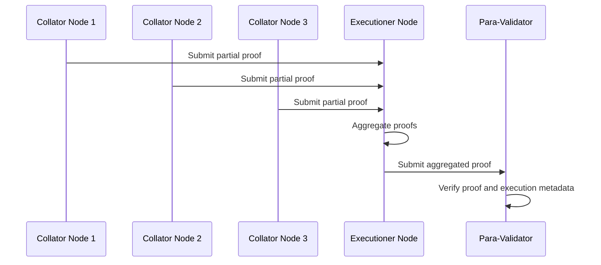
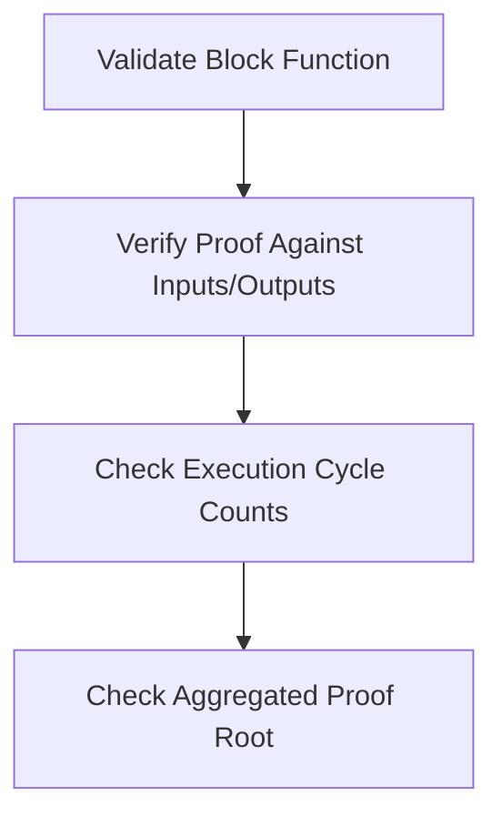

# Cumulus Prover

> [!NOTE]
> This document will be part of the terms and conditions of your agreement and, therefore, needs to contain all the required information about the project. Don't remove any of the mandatory parts presented in bold letters or as headlines (except for the title)! Lines starting with a `>` (such as this one) should be removed. Please use markdown instead of HTML (e.g., `` instead of ``).
>
> See the [Grants Program Process](https://grants.web3.foundation/docs/process) on how to submit a proposal.

- **Team Name:** Navatim Labs
- **Payment Details:**
  - **DOT**: 14uNH42NjxS3c4VSxVyHjZYea5ZyJEYWYxjRzmxKQB75pdRB
  - **Payment**: 14uNH42NjxS3c4VSxVyHjZYea5ZyJEYWYxjRzmxKQB75pdRB (USDT)
- **[Level](https://grants.web3.foundation/docs/Introduction/levels):** 2

> [!IMPORTANT]
> *The combination of your GitHub account submitting the application and the payment address above will be your unique identifier during the program. Please keep them safe.*

## 2. Project Overview

The **Cumulus Prover** project aims to integrate a cryptographic proving system into Substrate parachains by extending the Cumulus node architecture. Our approach introduces out-of-the-box support for generating and verifying execution proofs in parachain consensus. This system is composed of two components:

* **Prover Node**: A modified cumulus node responsible for generating cryptographic proofs of block correctness during execution.
* **Verifier Module**: Integrated with para-validators, enabling them to cheaply verify the correctness of blocks. Since only 5 validators are assigned per `paraId`, this system ensures low overhead.

This architecture introduces a novel and lightweight form of block validation that maintains integrity without compromising performance. This project gives new parachains the ability to opt into a new approach to securing their parachain using a cryptographic proving system while maintaining economic security on Polkadot.

## 3. Project Details

We will modify the cumulus node and the `parachain-system` pallet to implement the proving and verifying logic.

### Technical Implementation

* **Node-Level Modifications (Cumulus)**:
  **Block Builder API**: Will include new cryptographic data fields into the block header structure. Specific changes include:

```rust
struct ExtendedHeader {
    proofs: Vec<Vec<u8>>,
    proof_root: [u8; 32],
    execution_cycles: u64,
    // ...existing fields
}
```

* **Block Execution API**

* Embed an SP1 RISC-V zkVM shell for executing parachain functions with specified inputs

* Update the block header after execution with the resulting proof data and performance metadata

* **Runtime-Level Modifications (pallet-parachain-system)**:

  * Modify the `fn validate_block` function to:

    * Verify the submitted proofs against the expected inputs and outputs
    * Check consistency of execution cycle counts and aggregated proof root

* **Prover Workload Distribution**:

  * After block execution in the zkVM, total cycle count is recorded
  * These cycles are split among connected and registered collator nodes
  * Each collator node processes a portion of cycles to generate partial proofs in parallel
  * Partial proofs are returned to an executioner node, which aggregates them
  * Aggregated proof is sent to para-validators for final verification

This process ensures:

* Minimal overhead on proof generation
* Efficient block production
* Collator parallelism that allows production of multiple blocks simultaneously without computational bottlenecks





## 4. Ecosystem Fit

**Target Audience**: Substrate parachain developers, parachain node runners, and collator infrastructure providers.
**Value Proposition**: Enabling cryptographic block verification out of the box provides a layer of security and integrity for parachains, especially those operating under lightweight or adversarial conditions.

## Key Benefits:

1. Provides a path to alternative real-time cryptographic proving consensus.
2. Enables higher transaction throughput by distributing proof generation across multiple collator nodes in parallel.
3. Preserves and complements Polkadot's shared economic security model.

## 5. Team Members

* **Mrisho Lukamba**
  A Polkadot Blockchain Academy alumni, having 4 years of blockchain protocol engineering experience.
  GitHub: [https://github.com/MrishoLukamba](https://github.com/MrishoLukamba)

* **Taha Farouq**
  A cybersecurity professional with 5 years of experience working with different industries including government, health, finance, law enforcement, and educational institutes. Currently working at OffSec as a Cyber Security Technical Trainer. Specializes in security research and has uncovered multiple CVEs verified by NIST MITRE such as CVE-2023-43959, CVE-2023-43960, and CVE-2023-52275. Holds multiple certifications: eJPT, OSCP, OSWP, OSDA, OSWA, OSCC, CRTO, and OSEP. In his free time, he researches open-source software, contributes to projects, and participates in CTFs and attackathons.
  GitHub: [https://github.com/tahaafarooq/tahaafarooq](https://github.com/tahaafarooq/tahaafarooq)

### Contact

- **Contact Name:** Mrisho 
- **Contact Email:** MrishoLukamba@navatim.com

### Legal Structure

- Yet to be registered, we are planning to register in UAE on August.

## Development Status :open_book:

- We developed a succinct Prover network demo and Wasm ZKVM shell.
* Github: https://github.com/MrishoLukamba/succinct-summer-2.5
* X: video: https://x.com/mrisholukamba/status/1937256784906850705?s=46


## 6. Development Roadmap

### Overview

* **Total Estimated Duration**: 3 months
* **Full-Time Equivalent (FTE)**: 2.1 (2 people @ 1.05 FTE each, average throughout project duration)
* **Total Costs**: $30,000 USD
* **DOT %**: 50% (Percentage of Total Costs to be paid in vested DOT)

### Milestone 1 — Module Setup, Cryptographic Proof Generation and Validation

* **Estimated duration**: 1.5 months
* **FTE**: 1.05
* **Costs**: $14,000 USD

> **Note**
> 
> The default deliverables 0a-0d below are mandatory for all milestones, and deliverable 0e at least for the last one.

| Number | Deliverable | Specification |
|--------|-------------|---------------|
| 0a. | License | Apache 2.0 / GPLv3 / MIT / Unlicense. See the [delivery guidelines](https://github.com/w3f/Grants-Program/blob/master/docs/Support%20Docs/milestone-deliverables-guidelines.md) for details. |
| 0b. | Documentation | We will provide both inline documentation of the code and a comprehensive tutorial that explains how a user can spin up a Cumulus node with prover capabilities, test the proof generation functionality, and understand the cryptographic proof generation process and verification mechanisms. See the [delivery guidelines](https://github.com/w3f/Grants-Program/blob/master/docs/Support%20Docs/milestone-deliverables-guidelines.md) for details. |
| 0c. | Testing and Testing Guide | Core functions will be fully covered by comprehensive unit tests and integration tests covering the prover-verifier interaction to ensure functionality and robustness. In the guide, we will describe how to run these tests. See the [delivery guidelines](https://github.com/w3f/Grants-Program/blob/master/docs/Support%20Docs/milestone-deliverables-guidelines.md) for details. |
| 0d. | Docker | We will provide a Dockerfile(s) that can be used to test all the functionality delivered with this milestone including proof generation and verification. |
| 1. | Cumulus Node: Block Builder API Extension | We will extend the Cumulus block builder API to include cryptographic proof data fields in the block header structure (`ExtendedHeader` with proofs, proof_root, execution_cycles fields). |
| 2. | Cumulus Node: Block Execution API Implementation | We will implement the complete block execution API with full integration points for cryptographic proving, moving beyond stubs to functional implementation. |
| 3. | SP1 RISC-V zkVM Integration | We will integrate the SP1 RISC-V zkVM shell for executing parachain functions and generating cryptographic proofs of execution correctness. |
| 4. | Parachain System Pallet: validate_block Modification | We will modify the `validate_block` function in the `parachain-system` pallet to verify submitted proofs against expected inputs/outputs and check execution cycle consistency. |

### Milestone 2 — Final Testing, Workload Distribution and Developer SDK

* **Estimated duration**: 1.5 months
* **FTE**: 1.05
* **Costs**: $16,000 USD

| Number | Deliverable | Specification |
|--------|-------------|---------------|
| 0a. | License | Apache 2.0 / GPLv3 / MIT / Unlicense. See the [delivery guidelines](https://github.com/w3f/Grants-Program/blob/master/docs/Support%20Docs/milestone-deliverables-guidelines.md) for details. |
| 0b. | Documentation | We will provide comprehensive documentation including developer guides, API references, and example implementations for integrating the Cumulus Prover system. See the [delivery guidelines](https://github.com/w3f/Grants-Program/blob/master/docs/Support%20Docs/milestone-deliverables-guidelines.md) for details. |
| 0c. | Testing and Testing Guide | We will deliver a fully functional end-to-end parachain testnet demonstrating the complete prover/validator system with cryptographic proof generation and verification. In the guide, we will describe how to run these tests. See the [delivery guidelines](https://github.com/w3f/Grants-Program/blob/master/docs/Support%20Docs/milestone-deliverables-guidelines.md) for details. |
| 0d. | Docker | We will provide a complete Docker setup that demonstrates the full end-to-end parachain testnet with prover/validator functionality. |
| 0e. | Technical Video | We will produce and publish a comprehensive technical video on X (Twitter) detailing the completed Cumulus Prover system, performance benchmarks, developer integration guide, and future roadmap for cryptographic proving in parachains to reach a large audience. |
| 1. | Prover Workload Distribution System | We will implement the distributed proving system where collator nodes process partial proofs in parallel, with an executioner node aggregating them for final verification by para-validators, enabling higher transaction throughput. |
| 2. | Transaction Throughput Benchmarking Suite | We will provide comprehensive transaction throughput benchmarks measuring proof generation time, verification overhead, and throughput improvements under various network conditions, demonstrating the higher transaction throughput achieved through workload distribution. |
| 3. | Example Parachain Implementation | We will provide a complete example parachain implementation showcasing how to integrate and configure the Cumulus Prover system, serving as a reference for developers. |


## Future Plans

- Consecutive contributions will involve tipping external contributors from the staking reward of the vested and staked DOT.
- This is a starting ground for the development of realtime cryptographic proving on polkadot sdk standalone chains.


## Additional Information :heavy_plus_sign:

**How did you hear about the Grants Program?** Web3 Foundation Website

- Previous grants you may have applied for.
https://github.com/w3f/Grants-Program/pull/2052
