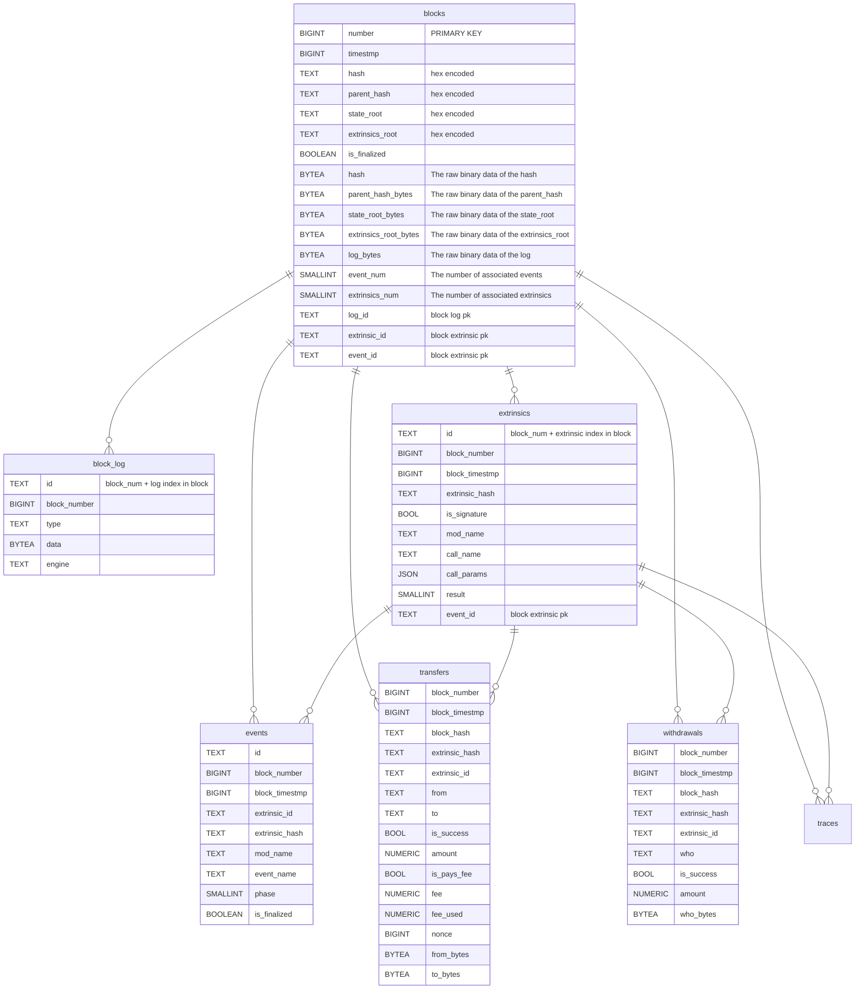
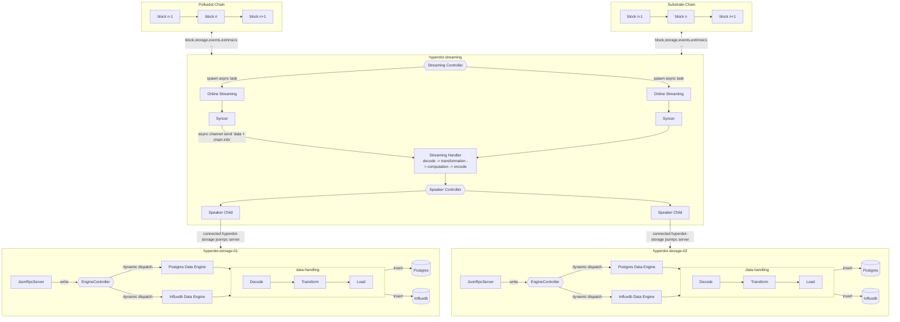

# Hyperdot - Powerful data analysis and creation platform — RFP

- **Team Name:** Infra3
- **Payment Address:** [0xDc2c1814639f113C6EB51b3D8d871372Da9e116A](https://etherscan.io/address/0xDc2c1814639f113C6EB51b3D8d871372Da9e116A)  (Ethereum ERC20 USDC)
- **[Level](https://github.com/w3f/Grants-Program/tree/master#level_slider-levels):** 2

## Project Overview 📄

This is a response for the [Analytics Website/Data Platform](https://github.com/w3f/Grants-Program/blob/master/docs/RFPs/Open/analysis-website-and-data-platform.md) RFP.

### Overview

Crypto data is growing rapidly, and large data companies are not  consider integrating them into their systems.   However, multi-chain crypto data is of significant value to users. The hyperdot is a on-chain data platform for querying, analyzing, and creations, written in Rust. It provides users with powerful capabilities for data querying, analysis, and creations.

With hyperdot, users can easily query and analyze crypto data from **Polkadot**, **Kusama**, and other **parallel chains built on the Substrate Runtime**. Hyperdot separates the indexing and computation of on-chain crypto data from the off-chain data storage, analysis, and querying, addressing scalability issues present in many data analysis platforms. Hyperdot offers multiple data engines to adapt to different scenarios.

Hyperdot provides a dashboard similar to [Dune Analytics](https://dune.com/browse/dashboards) and [Chainbase](https://chainbase.com/), offering powerful data analysis and visualization features currently.   Users can create queries using different data engines and generate visual data dashboards.   Importantly, Hyperdot is dedicated to building a data analysis creations community where data engineers and data scientists can create and share their work based on Hyperdot's data, fostering collaboration and knowledge exchange.

### Project Details

#### The System Overview

The Hyperdot project consists of two main system: hyperdot-node and hyperdot-frontend-end.

hyperdot-Node is written in [rust](https://www.rust-lang.org/) and provides functionalities such as chain data subscription, indexer, synchronization, and storage data to different engines. 

It serves as the backend for hyperdot-frontend-end, offering data querying and backend services. Specifically, the streaming module of hyperdot-node utilizes [subxt](https://github.com/paritytech/subxt) to subscribe to dara from Polkadot, Kusama, and other parallel chains built on Substrate Runtime. The data is then decoded and handled processed using [substrate](https://github.com/paritytech/substrate) some mods and [parity-scale-codec](https://github.com/paritytech/parity-scale-codec) and subsequently distributed to storage nodes.

> Note: We have completed the MVP work, and the code repository can be found at [Infra3-Network/hyperdot](https://github.com/Infra3-Network/hyperdot).

hyperdot-frontend-end is built using [tailwind css](https://tailwindcss.com/) and [next.js](https://nextjs.org/), creating a modern web dashboard. While it works similar to Dune Analytics, it has its own unique features. Hyperdot-Frontend connects to Hyperdot-Node to provide users with user-friendly chain data analysis capabilities. Moreover, it aims to establish a data analysis community where data engineers and data scientists can create and share insights based on the data provided by Hyperdot.

> Note: We provide a data playground at [Infra3-Network/hyperdot-data-playground](https://github.com/Infra3-Network/hyperdot-data-playground)

#### The System Architecutre

We have observed certain limitations in the existing designs of data analytics systems. Most of the designs involve subscribing to or querying on-chain crypto data, or integrating  like Subquery or Thegraph to indexing data with specific schemes, which are then stored in local postgre databases. However, this design suffers from the following issues:

1. With the support for multiple chains and increasing data volumes, a single data service will face scalability challenges.
2. Existing systems often rely on a single data analytics engine. For instance, during our tests on Dune, executing `SELECT * FROM ethereum.blocks` took a long time to load. The key issue is the lack of a dedicated OLAP engine to accelerate queries.
3. Data analytics services need to cater to a global user base, but current systems struggle to provide localized services.

Hyperdot is a system designed with a separation of on-chain block data computation and data storage to address the core challenges of scalability and system availability in multi-chain data.  

The following is the system architecture figure of hyperdot:

The system architecture is divided into three main components: `hyperdot-streaming`, `hyperdot-storage` and `hyperdot-fronted-end`. The `hyperdot-streaming` is responsible for data synchronization, decoding, and computation of on-chain block data, while the  `hyperdot-storage`   is designed to store on-chain data and build powerful data enegines.

The `hyperdot-streaming`  is responsible for on-chain block  subscription, computation and distribution, consisting of the following components:

1. **Streaming Syncer**:
    - Supports multiple chains, including Polkadot, Substrate, and other custom chains.
    - Provides support for multiple runtimes in Substrate to enable greater flexibility in adapting to chains developed on the Substrate framework. 
    - Subscribes to on-chain and indexer data.
    - Designed to be scalable and parallel, with separate asynchronous tasks for different chains.
    - Integrating a new chain only requires adding the corresponding configuration through the system interface, and the Syncer will automatically start data synchronization for that chain.

2. **Streaming Handler**
    - Used to decode on-chain data and extract additional information.
    - The decoded data undergoes necessary computation and transformation.
    - This may involve data cleaning, transformation, and computation to generate more useful data.

3. **Streaming Speaker**
    - Connects to the Hyperdot-Storage layer to distribute processed data to globally distributed storage nodes.
    - Encoded data streams are sent to storage nodes using the JSON-RPC protocol.
    - The Speaker's key functionality lies in ensuring reliable data distribution and storage to meet scalability and availability requirements of the system.

The hyperdot-storage layer is designed for multiple storage nodes and multiple data engines to address the aforementioned challenges. Each storage node is fully peer, accepts data from the hyperdot-streaming layer, and can store data from one or more chains. Data is configured and written to different data engines, and data engines process and write data according to the data model established in advance. For example, postgres has a row-oriented table model, whereas duckdb or clickhous has a column-oriented table model.

The hyperdot-storage consisting of the following components:

1. **Data Engines.** Supports multiple data engine to flexibly adapt to different query scenarios. For instance, postgres, provides a very stable storage and sql query scenario and is the choice for most cases. But when your data grows to tens of millions of rows, you can switch to duckdb or clickhouse to reduce user-perceived latency.

2. **Storage Server**:
   - Provides multiple interface services, including JSON-RPC, HTTP, GraphQL, and Websocket.
   - The JSON-RPC interface receives data from the Streaming layer.
   - HTTP, GraphQL, and Websocket interfaces serve as the backend services for Hyperdot-Frontend.
   - These interfaces support data querying, data analysis, dashboard creation, and fulfill the needs of the data analysis community.

hyperdot-fronted-end provides a user-friendly front-end interface for data analysis, exploration, and collaborative data analysis creation. It is built using modern front-end technologies. The interaction between hyperdot-fronted-end and hyperdot primarily utilizes HTTP, while GraphQL is used for handling complex data queries. WebSockets are employed for subscription-based data updates.

#### The Data Model

Since we support multiple data engines, the way data models are defined varies in each data engine. As a good starting point, we have defined raw data models for Substrate in the PostgreSQL data engine.

For other data engines, the core concepts remain the same, but the expression may differ based on the data engine. For example, in DuckDB and ClickHouse, it might be necessary to modify the data types to make them compatible. In InfluxDB, it might be necessary to switch to a time-series data model to incorporate temporal concepts.

> Note: We have omitted the detailed definition of the trace data model as it is nearly identical to extrinsics.

#### The Data Flow

The high-level data flow of hyperdot handling crypto on-chain data from a substrate chain is as follows:

1. hyperdot-streaming creates a `StreamingSyncer` for each chain to subscribe to the crypto on-chain data. These streaming and syncer are managed through the `StreamingController`.
2. When streaming detects the arrival of data, it sends it through a channel to the `StreamingHandler `for processing. The `StreamingHandler` performs necessary `decoding, transformation, computation, and encoding` of the on-chain data based on the configured chain information and runtime `codegen`.
3. The encoded data is handed over by the `StreamingHandler` to the SpeakerController and transmitted over the network to the `JsonRpcServer` of hyperdot-storage.
4. Upon receiving the data, `hyperdot-storage` invokes the `EngineController` to perform the data writing.
5. The `EngineController` contains pointers to multiple data engines and dynamically dispatches the write operation to the specific data engine at runtime.
6. Each data engine may undergo an optional set of data-handling operations, such as decoding, transforming, and loading, to adapt the data for the specific data engine.
7. Finally, the data engine completes the data writing process.

#### The Live Demo

We have deployed a small [live demo](https://playground.infra-3.xyz/) that you can play directly with.

Querying westend testnet block data

Querying the westend block data uses the index

#### The Tech Stack

**hyperdot is written in rust and its tech stack includes**

- substrate
- subxt
- parity-scale-codec
- jsonrpsee
- tokio
- axum
- postgres
- influxDB
- duckDB
- arrow-rs

**Potential tech stack includes**
- WebAssembly
- RocksDB
- ink!

**The tech stack for hyperdot-front-end includes**
- TypeScript
- Tailwind CSS
- Next.js
- Tremor UI
- Headless UI

**Potential tech stack includes**

- ChatGPT (We aim to utilize ChatGPT for natural language-based data analysis)

### Ecosystem Fit

hyperdot will integrate data from Polkadot, Kusama, and Substrate networks by utilizing the infrastructure of substrate, subxt, and other Parity technology communities. It will support multi-chain and multi-runtime environments. hyperdot will provide a dashboard that enables users to easily query on-chain crypto data using SQL language. Additionally, it will establish a community for data querying, analysis, creation, and sharing, allowing users to exchange insights.

hyperdot is a data querying, analysis, creation, and sharing platform targeting a wide range of users, including data analysts, data scientists, project managers, and anyone interested in analyzing on-chain crypto data using hyperdot.

Currently, we have not found similar projects in the Substrate/Polkadot/Kusama ecosystems. Moreover, data analysis systems that support multi-chain, multi-data engine integration with good scalability are rare in other ecosystems as well. We firmly believe that hyperdot will bring significant value to the community.

## Team

### Team members

- **Ryan Xiao**

- **Ming Dai**

- **Tania**

### Contact
- **Contact Name:** Tania
- **Contact Email:** tania.infra3@gmail.com
- **Website:** https://network.infra-3.xyz

### Legal Structure

- **Registered Address:** N/A
- **Registered Legal Entity:** N/A

### Team's experience

**Ryan Xiao** is a contributor to the Tendermint-rs and Postgres communities and. With nearly 10 years of software development experience, Ryan Xiao is an expert in Rust and C++ programming languages. He specializes in decentralized systems, large-scale distributed data systems, and cloud computing system development. Ryan Xiao has been involved in the development of the Tendermint-rs community and decentralized data systems based on Tendermint-rs and Postgres FDW. He has also contributed to multiple research-oriented databases at CMU, showcasing a deep understanding of databases. Ryan Xiao has conducted extensive research on Web3 consensus protocols and the Substrate framework, published several articles on Substrate development, and organized related presentations. He has been dedicated to helping more technologists become familiar with and understand Web3 development through Substrate.

**Ming Dai** has been working in decentralized exchanges for the past few years, focusing on data security. He has a strong passion for Rust and Substrate and has conducted extensive research on Substrate pallet and runtime development, backed by rich practical experience. Ming Dai has studied the design and implementation of Dune and has implemented a data analysis system for the company based on Ethereum's chain. Additionally, Ming Dai is familiar with smart contracts, dApps, frontend design, and developm

**Tania** has been involved in security audits and operational work at exchanges. She is also an excellent UI designer, dApp creator, and technical document writer. Tania has a deep love for Substrate and ink! and has been exploring the use of ink! to refactor previous smart contracts.

### Team Code Repos

- https://github.com/Infra3-Network/hyperdot
- https://github.com/Infra3-Network/hyperdot-fronted-end
- https://github.com/Infra3-Network/hyperdot-data-playground

Please also provide the GitHub accounts of all team members. If they contain no activity, references to projects hosted elsewhere or live are also fine.

- https://github.com/pidb
- https://github.com/bytesleak
- https://github.com/cattania

## Development Status 📖

In 2022, Ryan started exploring Substrate and The Graph, and at that time, he attempted to add support for Substrate data on The Graph for private chains. This effort lasted for approximately six months. 

Starting from March of this year, Ryan and Ming were inspired by Dune and Chainbase, and they thoroughly studied the architecture design and implementation of these projects. Subsequently, we discussed the feasibility of building a multi-chain, multi-runtime, multi-data engine, scalable platform for web3 data analysis, creation, and a community of web3 data enthusiasts. 

We began designing and implementing Hyperdot, with Tania providing us with a simple data playground. Currently, we have achieved an MVP (Minimum Viable Product) validation of the core components, and they are functioning well. It is estimated that it will take another three months to make them work properly. Therefore, now is the time to apply for a W3F grant and introduce the work we have done to the entire Substrate community.

## Development Roadmap 🔩

### Overview
- Total Estimated Duration: 3 months
- Full-Time Equivalent (FTE): 3 FTEs
- Total Costs: 30,000 USD

### Milestone 1 — Completion of all components and core functionalities of hyperdot-node
- **Estimated duration:** 6 weeks
- **FTE:** 3
- **Costs:** 15,000 USD

| Number  | Deliverable                 | Specification                                                                                                                                                                                                                                 |
| -------:| --------------------------- | --------------------------------------------------------------------------------------------------------------------------------------------------------------------------------------------------------------------------------------------- |
| **0a.** | License                     | Apache 2.0                                                                                                                                                                                                                                |
| **0b.** | Documentation                                                | We will provide both **inline documentation** of the code and a basic **tutorial** that explains how a user can (for example) spin up one of our Substrate nodes and send test transactions, which will show how the new functionality works. |
| **0c.** | Testing and Testing Guide                                    | Core functions will be fully covered by comprehensive unit tests to ensure functionality and robustness. In the guide, we will describe how to run these tests. |
| **0d.** | Docker                                                       | We will provide a Dockerfile(s) that can be used to test all the functionality delivered with this milestone. |
| **0e.** | Article                                                      | We will publish an **article**/workshop that explains [...] (what was done/achieved as part of the grant). (Content, language and medium should reflect your target audience described above.) |
| **1.** | Substrate data model | We will create a data model for Substrate, which will: 1. Create SQL scripts for block, extrinsic, block_log, event, extrinsic_events, transfer, and withdrawals. 2. Implement core data structures for the above data models, including derive codecs and necessary methods. 3. Provide a build program that performs code generation based on the Substrate runtime to generate core runtime metadata for data model encoding and decoding. |
| **2.** | Hyperdot Core | We will implement the core data types, core configurations, parameter items, procedural macros, network protocols, and utility libraries abstracted into hyperdot-core for code reuse in subsequent layers. |
| **3.** | Hyperdot Streaming: On-chain data synchronization, streaming data computation, and distribution | We will implement the required functionalities for the hyperdot streaming layer, including: 1. Provide a **Streaming Controller** to dynamically manage multiple streamings within the system. 2. Implement streaming subscriptions for on-chain data in a generic manner, with a Syncer providing specialized implementations for different runtimes. 3. Implement the **Streaming Handler** to decode data and compute the necessary information for the data model. 4. Provide a **Speaker Controller** to connect to different storage nodes via JSON-RPC and accept streaming information to be written to the storage node. 5. Integrate the above modules to provide the hyperdot-streaming binary executable, which can be launched with parameters and configurations. 6. Provide necessary log tracing and monitoring capabilities for hyperdot-streaming. |
| **4.** | Hyperdot Storage | We will implement the hyperdot storage, including: 1. We will use jsonrpsee to implement a **JSON-RPC server** that receives methods from the streaming data flow and provides other necessary methods. We will also design a pub/sub protocol for real-time data communication with the frontend. 2. Provide an HTTP API server based on Axum, offering RESTful endpoints such as system/dataengine/query/user. For scalability, our RESTful API will use v1, which will be utilized by the frontend to implement the required functionalities. 3. Provide json-rpc client-rs and HTTP API client-rs for easy integration of streaming and other projects with storage. 4. We will implement support for decoding, transforming, writing, and querying data across multiple chains and engines by defining multiple traits and a complex Engine Controller. The Engine Controller will manage multiple data engines and utilize dynamic dispatch and type pointers to accomplish these tasks. 5. Integrate the aforementioned modules and provide the hyperdot-storage binary executable, which can be launched with parameters and configurations. 6. Provide necessary log tracing, monitoring, and health check functionalities for hyperdot-storage. |
| **5.** | Hyperdot Storage: postgres engine | We will integrate the PostgreSQL database engine into hyperdot-storage, which will: 1. Write the data from the mentioned data models into the database. 2. Provide SQL query methods that allow submitting SQL queries to the database. 3. Offer a rows type conversion feature to simplify the restrictions of Rust's static types, enabling us to dynamically return data from any table to the frontend via the API.  Note: We will integrate libpq for parsing the submitted SQL queries. This part will provide the query's AST (Abstract Syntax Tree) and rewrite tree, which will be used in the future to enhance system security. |
| **6.** | Hyperdot Metadata | we will provide a **metadata management module** for hyperdot, includes: 1. Define and implement the data structures for hyperdot system metadata, enabling encoding and serialization in formats such as JSON and YAML. 2. Provide a default metadata configuration for the system and initialize the metadata configuration into a local RocksDB database. 3. Implement the **hyperdot metadata administer** to dynamically manage hyperdot metadata. 4. Enable monitoring of changes in hyperdot metadata, allowing for dynamic updates to streaming and storage functionalities once changes occur. 5. Expose the capabilities of the hyperdot metadata administer to the **system API**. |
| **7.** | Hyperdot ctl tools | To simplify deployment and system configuration, we will provide a tool called hyperdot-ctl. It will: 1. Initialize the Postgres data engine and check the database configuration for the chain using SQL. 2. Write metadata into the RocksDB database. 3. Communicate with hyperdot-streaming and hyperdot-storage to retrieve system information and health status, assisting administrators in better maintaining the system. |
| **8.** | Integration testing | To perform system integration testing, we will integrate hyperdot-streaming and hyperdot-storage by leveraging the data from running a Substrate node and a test network. |
| **9.** | Upgrade utilities             | The Upgrade utility is a tool designed for updating the hyperdot service. It includes the following features: 1. Deployment of new service versions to the target servers. 2. Configuration file updates, allowing users to easily update service parameters. 3. Logging and error reporting capabilities for timely detection and resolution of issues during the upgrade process. We will do this with docker-compose. |

### Milestone 2 — Completion of all components and core functionalities of hyperdot-fronted-end
- Estimated duration: 4 weeks
- FTE: 2
- Costs: 10,000 USD

|  Number | Deliverable                    | Specification                                                |
| ------: | ------------------------------ | ------------------------------------------------------------ |
| **0a.** | License                        | Apache 2.0                                                   |
| **0b.** | Documentation                  | We will provide both **inline documentation** of the code and a basic **tutorial** that explains how a user can (for example) spin up one of our Substrate nodes and send test transactions, which will show how the new functionality works. |
| **0c.** | Testing and Testing Guide      | Core functions will be fully covered by comprehensive unit tests to ensure functionality and robustness. In the guide, we will describe how to run these tests. |
| **0d.** | Docker                         | We will provide a Dockerfile(s) that can be used to test all the functionality delivered with this milestone. |
| **0e.** | Article                        | We will publish an **article**/workshop that explains [...] (what was done/achieved as part of the grant). (Content, language and medium should reflect your target audience described above.) |
|  **1.** | Page Layout                    | We will provide the basic layout, which will  1. A basic header navigation and routing  2. Main, Creation, Favorites, Discovery, User Profile, User Login, Bootstrap dashboard page layout |
|  **2.** | Data Creation - New Query Page | We will provide data analysis querying and creation on the Data Creation Page, and an interactive data analysis querying experience on the New Query Page:  1. New Query Page: This page will display the supported data engines and the associated tables for each engine. 2. Playground Editor: Users will be able to input SQL queries in an interactive manner using the Playground Editor. 3. Dynamic Table: The results of data analysis will be presented using a dynamic table. 4. Visual Chat: We will incorporate a visual chat feature to enhance the objectivity of the data. 5. Save and tag created data queries: Users will have the ability to save their created data queries and add tags to them. |
|  **3.** | Data Creation - New Dashboard  | New Dashboard allows users to create shareable dashboards that it will 1. Create a Dashboard form 2. Visualize the Query created by the user in the New Query Page |
|  **4.** | My Creation                    | My Creation Pages will showcase users' past data analysis creations  1. It will display the query and dashabord name, creator, creation time, and the number of times the creation has been favorited. 2. A search input will be provided for users to search for their own creations. |
|  **5.** | Favorites - Queries            | Favorites Queries will showcase users' past favorite data analysis query creations from other users, including:  1. It will display the creator of the data analysis query, creation time, and the number of times the creation has been favorited by other users.  2. A search input will be provided for users to search for their favorite queries by name.  3. Each query that a user has favorited can be clicked to access the details. The details page will explain the SQL syntax in the Playground Editor and display relevant visualized data tables. |
|  **6.** | Discovery - Queries            | The Discovery  Queries section will showcase data analysis queries created by users in the community. Each creation can be clicked to access the details, where the Playground Editor will explain the SQL syntax and display relevant visualized data tables. |
|  **7.** | Discovery - Dashboards         | The Discovery Dashboards section will show shared visual dashboards created by users in the community. You can click on each creation to access the details, and once inside you can load a dynamic dashboard based on your query. |
|  **8.** | User                           | We will provide user management functionality, including email-based authentication and authentication pages for GitHub third-party login, as well as a logout page. |

### Milestone 3 — Integration、Ergonomics、Docs
- Estimated durat ion: 2 weeks
- FTE: 2
- Costs: 5,000 USD

|  Number | Deliverable                                          | Specification                                                |
| ------: | ---------------------------------------------------- | ------------------------------------------------------------ |
| **0a.** | License                                              | Apache 2.0                                                   |
| **0b.** | Documentation                                        | We will provide both **inline documentation** of the code and a basic **tutorial** that explains how a user can (for example) spin up one of our Substrate nodes and send test transactions, which will show how the new functionality works. |
| **0c.** | Testing and Testing Guide                            | Core functions will be fully covered by comprehensive unit tests to ensure functionality and robustness. In the guide, we will describe how to run these tests. |
| **0d.** | Docker                                               | We will provide a Dockerfile(s) that can be used to test all the functionality delivered with this milestone. |
| **0e.** | Article                                              | We will publish an **article**/workshop that explains [...] (what was done/achieved as part of the grant). (Content, language and medium should reflect your target audience described above.) |
|  **1.** | Integration of Data Creation and Data Query Analysis | We will integrate all the components from Milestone 1 and the data analysis creation and query execution functionality from hyperdot-frontend. |
|  **2.** | Integration of Favorites and Queries                 | We will integrate all the components from Milestone 1 and the Favorites and Queries functionality from hyperdot-frontend. |
|  **3.** | Integration of User Functionality and GitHub Login   | We will integrate the apiserver from Milestone 1 and the GitHub third-party login to provide user login and management functionality for hyperdot-frontend. |
|  **4.** | Integration of Guided Dashboard                      | We will integrate all the components from Milestones 1 and 2 to create default guided dashboards for hyperdot. |
|  **5.** | Ergonomics                                           | 1. We will provide a `--standalone` option in hyperdot-ctl to allow users to directly start a local hyperdot node and simplify the complexity of using hyperdot. 2. We will provide a Docker Compose to facilitate the deployment of the complete hyperdot system. |
|  **6.** | Official Documentation                               | We will create documentation for the deliverables from Milestones 1 and 2. Additionally, we will establish a documentation using GitBook for the entire system, which will: 1. Incorporate the articles from Milestones 1 and 2 as the welcome section of the documentation, introducing what hyperdot is. 2. Provide a quickstart guide to help users get started quickly. 3. Explain the data models in the system and how to execute queries through the documentation. |

## Future Plans

After completing hyperdot and releasing the first  version, we will integrate more data engines, including time series data engines (influxdb), OLAP analytics engines (Clickhouse), and distributed query engines (Spark).

We will consider indexing more types of data, not just raw chain data, but also decoded dex and not data, as well as additional extrinsic data. Additionally, we plan to establish a mechanism where developers can propose data models they want to index through GitHub or the community. Once adopted, these data models will be incorporated into our data engines.

We will also consider **integrating ChatGPT to provide natural language querying capabilities (we are think it's something that's going to get the whole community excited about)**. Specifically, users will no longer need to be proficient in SQL and can run queries using natural language prompts.

We will introduce a P2P structure for storage nodes to make them decentralized. We also plan to optimize and upgrade the UI based on user feedback, such as adding more dashboards and improving the data creation process. Additionally, we will explore integrating Grafana for better data visualization dashboards.

Lastly, we expect to collaborate with foundations to promote our platform and showcase its value to more users. We will also engage with the community through platforms such as Twitter, YouTube, Medium, and others to introduce hyperdot.
