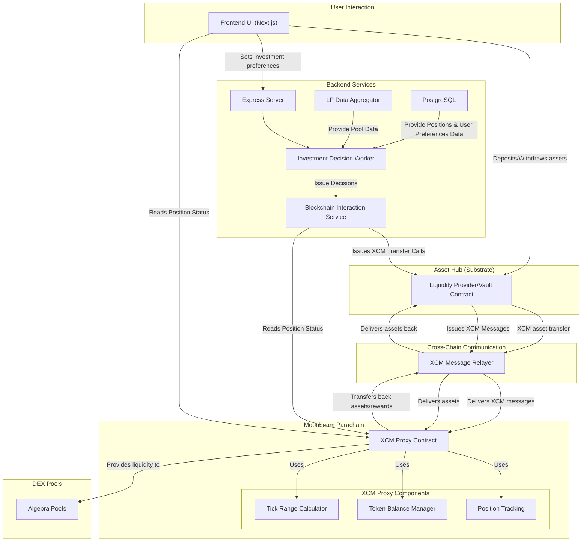

# 📝 Name of your Project

## 🌟 Project Overview

Please provide the following:

- If the name of your project is not descriptive, a tagline (one sentence summary)
- A brief description of your project
- An indication of how your project relates to / integrates into Polkadot
- An indication of why your team is interested in creating this project
- (Optional but **huge bonus points**): [1-min video pitch](https://www.ycombinator.com/video/)

### 🔍 Project Details

We expect applicants to have a solid idea about the project's expected final state. Therefore, please submit (where relevant):

- An overview of the technology stack to be used
  NextJs (Wagmi for wallet) for Frontend,  NestJS (TypeORM , PolkadotJS for blockchain calls) for backend, PostgreSQL for database, Solidity(Openzepelin,Reactive Smart Contracts) for Smart Contracts, AWS for hosting.
- Documentation of core components, protocols, architecture, etc. to be deployed

High Level Diagram

Yap About the way contracts work (Users deposited tokens can only be swapped/Provided as liquidity in the contract definition)

- Any PoC/MVP or other relevant prior work or research on the topic
  [Our Github Project link](https://github.com/gabikreal1/PolkadotHack2025)
  Minimal PoC, with mock frontend,mock backend and simple contracts, using XCM.
- Mockups/designs of any UI components
  Will need to add couple of new components (Gabriel)
  [Video to the Demo](https://www.youtube.com/watch?v=9bX0Up0pLww&feature=youtu.be)
- Data models / API specifications of the core functionality
Refine it with Claude (Gabriel)
Users (Wallet, Balance, Token, UserPreferencesID), 
UserPreferences(Minimum APY, Max Allocation Per Pool, UserCoins, Risk Tolerance, TakeProfit, StopLoss)
*Transactions (Check with claude, could get it of blockchain)
Positions(UserID,PoolID,Amount1,Amount2,TokenID1,TokenID2,TimeStamp,StopLoss,TakeProfit)
Pools(PoolAddress,TokenID1,TokenID2,24hrVolume,TVL,DEXID)
Dexes(DexAddress,ChainAddress)
*Decisions (Check with Claude)
Coins (CoinAddress, MarketCap, Ticker, LatestPrice)

Api specs (unkown, yap potential api with claude)

- What your project is *not* or will *not* provide or implement
  - This is a place for you to manage expectations and clarify any limitations
  - Decisions are not made on web3, we do won't implement zkProofs of decisions computations in the MVP.
  - We will do the MVP only with dexes that provide data via API.
  - (Its not full add later) Chains/Dexes + simple rebalancing/decision making engine
  - Think of more limitations

### 🧩 Ecosystem Fit

Help us locate your project in the Polkadot landscape and what problems it tries to solve by answering each of these questions:

- Where and how does your project fit into the ecosystem?
  Our project is an automated LP manager with cross-chain functionality, designed to optimize capital efficiency and user experience across multiple parachains in the Polkadot ecosystem. This enables users to manage assets and interact with DEXs, DeFi protocols, and liquidity pools a lot more efficiently and across networks like the Hub, Hydration, Moonbeam, Acala, etc, from a single interface and without being confined to a single chain’s limitations. Our project directly supports Polkadot’s vision of a multichain future by reducing fragmentation and improving capital flow across its ecosystem.
  
- Who is your target audience?
  Our project is targeted at crypto enthusiasts looking to optimize their experience within the PolkaDot ecosystem. It is for people who know stuff about crypto already, who are looking for a more reliable way to make money than trading and yet higher potential yield compared to the basic spot/HODL. This can also be an interesting discovery for those who know something about crypto but are newbies in liquidity providing.

Our goal is to also serve developers and projects building on parachains that need efficient, cross-chain liquidity management. We are doing this by providing an automatic and native solution for anyone seeking to maximize yield, reduce manual intervention, and 
seamlessly manage liquidity across multiple Polkadot-connected chains.

Additionally, institutional DeFi participants looking for reliable 
infrastructure to manage large-scale cross-chain liquidity positions 
represent an additional potential future audience.

- What need(s) does your project meet?
Our project addresses several critical needs within the Polkadot ecosystem, particularly around liquidity management and user empowerment in a cross-chain DeFi environment. 
We solve these challenges by offering:

    -Cross-chain liquidity optimization: Using Polkadot’s XCM, we dynamically allocate liquidity across multiple parachains to improve capital efficiency.

    -User-defined strategies: Users can select from risk-based strategies (e.g., conservative, moderate, aggressive) tailored to their goals and risk tolerance.

    -Advanced risk management tools: Features like stop-loss and take-profit thresholds allow users to safeguard positions and automate exits based on market conditions.

    -Custom asset preferences: Users can specify which coins they're interested in, ensuring personalized exposure across pools.

    -Capital control: Users can set maximum allocation per pool, define a minimum acceptable APR, and decide how many pools to distribute their position across.

    -Yield maximization through automation: The system continuously monitors and reallocates liquidity to optimize returns without manual intervention.

    -User-friendly automation: Reduces the operational burden on users by automating complex liquidity management strategies.
- Are there any other projects similar to yours in the Polkadot ecosystem?
  - If so, how is your project different?
  - If not, why might such a project not exist yet?
While there are projects in the Polkadot ecosystem focused on liquidity provision and automated market making (such as HydraDX or various DEXs on Moonbeam and Acala), none currently offer a cross-chain automated liquidity manager with the same level of customization, user control, and strategy-based automation as our solution.

Most existing tools are limited to individual parachains or offer basic liquidity provisioning without features like:

    Cross-chain pool rebalancing via XCM

    Strategy selection (risk-adjusted)

    Stop-loss/take-profit triggers

    Custom coin selection and APR thresholds

    Smart allocation across multiple pools

We believe this gap exists because the complexity of implementing robust cross-chain logic, especially for DeFi strategies.

Our project is built to fill this gap—bridging the technical challenge with a user-first design that empowers participants to take full advantage of Polkadot’s multichain architecture.

> **Note**: We prioritize projects building on Plaza/Polkadot Hub, games, and DeFi applications, though all types of projects will be considered.

## 👥 Team

- **Team Name:** Name of your team. If you apply as a legal entity, please use its name.
- **Contact Name:** Full name of the contact person in your team
- **Contact Email:** Contact email
- **Website:** Your website, GitHub org, blog, or similar

### Team members

Please list the legal name of all grant beneficiaries. Solo developers (1-person teams) are eligible for funding.

#### LinkedIn Profiles (if available)

- https://www.linkedin.com/{person_1}
- https://www.linkedin.com/{person_2}

### Team Code Repos

- https://github.com/{your_organisation}/{project_1}
- https://github.com/{your_organisation}/{project_2}

Please also provide the GitHub accounts of all team members:

- https://github.com/{team_member_1}
- https://github.com/{team_member_2}

### Team's experience

Please describe the team's relevant experience, including any previous blockchain projects or contributions to the ecosystem.

## 📊 Development Status

If you've already started implementing your project, please provide a link and a description of the code. Otherwise, please provide some documentation on the research and other work you have conducted before applying.

## 📅 Development Roadmap

This section should break the development roadmap down into milestones and deliverables. Since these will be part of the agreement, please describe *the functionality we should expect in as much detail as possible*, plus how we can verify and test that functionality.

**Important notes:**
- Each milestone is capped at **$5,000 USD**
- Milestones must be delivered within **3 months** of approval
- The maximum grant amount is **$10,000 USD** per application (up to **$15,000 USD** per project in exceptional cases)
- You will only receive payment after successful milestone delivery

### Overview

- **Estimated Duration:** Duration of the whole project (maximum 3 months)
- **Full-Time Equivalent (FTE):**  Average number of full-time employees working on the project
- **Total Costs:** Requested amount in USD for the whole project (maximum $10,000 USD)

> Note that deliverables 0a to 0d are mandatory. Please adapt their specification to your project.

| Number | Deliverable | Specification |
| -----: | ----------- | ------------- |
| 0a. | License | Apache 2.0 / GPLv3 / MIT / Unlicense |
| 0b. | Documentation | We will provide both **inline documentation** of the code and a basic **tutorial** that explains how a user can... |
| 0c. | Testing and Testing Guide | Core functions will be fully covered by comprehensive unit tests to ensure functionality and robustness. In the guide, we will describe how to run these tests. |
| 0d. | Article | We will publish an **article** that explains what was done/achieved as part of the grant. |
| 1. | Feature X | We will create a feature that will... (Please describe in detail) |
| 2. | Feature Y | The Y feature will... (Please describe in detail) |
| 3. | Feature Z | The Z feature will... (Please describe in detail) |

### 💰 Budget Breakdown

Please provide a breakdown of your budget by milestone:

| Milestone | Deliverables | Cost (USD) | Estimated Completion |
| --- | --- | --- | --- |
| 1 | Features X, Y | $5,000 | 1.5 months |
| 2 | Feature Z | $5,000 | 1.5 months |
| **Total** | | **$10,000** | **3 months** |

Make sure you show clearly what the funding is going towards (e.g. 30 hours of a full time employee at $X / hour).

## 🔮 Future Plans

Please include:

- How you intend to continue development after the Fast-Grant
- Any plans for seeking additional funding (other grants, VC funding, etc.)
- Your vision for the project's growth and impact in the Polkadot ecosystem

## ℹ️ Additional Information

Here you can add any additional information that you think is relevant to this application, such as:

- Work you have already done
- If there are any other teams who have already contributed to the project
- Other funding you may have applied for

Remember that the Fast-Grants Programme is designed as a first step for promising projects. We're looking for projects that can continue to grow beyond this initial funding.
