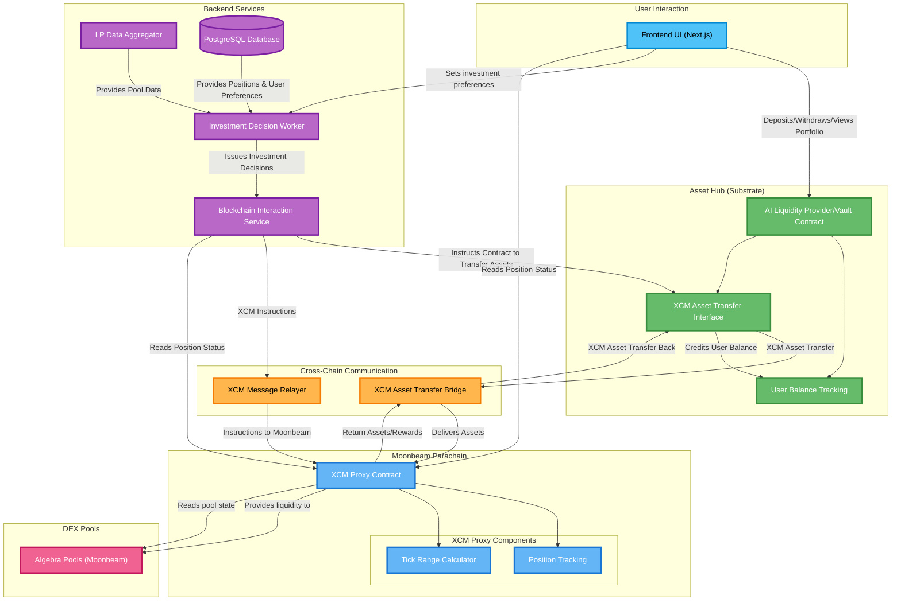

# 📝 Name of your Project

## 🌟 Project Overview

- A brief description of your project
  LiquiDOT is a customizable liquidity provider (LP) manager designed to simplify and improve participation in DeFi. It allows users to automate their LP strategies, set stop loss and take profit levels, and rebalance their positions without needing constant manual oversight. With support for multiple DEXes, LiquiDOT offers a single, user-friendly platform for managing liquidity across different ecosystems. The goal is to bring meaningful control, automation, and flexibility to liquidity providers — something that’s currently missing in the space. 
- An indication of how your project relates to / integrates into Polkadot
  Polkadot provides the ideal foundation for LiquiDOT by enabling seamless interaction across chains through smart contract deployment and cross-chain messaging. This allows us to connect with multiple parachains and decentralized exchanges, giving users the ability to manage liquidity across ecosystems from a single interface. Polkadot’s focus on interoperability and scalability directly supports our aim to build a robust and future-ready LP management tool.
- An indication of why your team is interested in creating this project
  Our team came together around a shared interest in solving a problem we’ve encountered ourselves: the lack of smart, automated tools for liquidity providers. While trading platforms have long supported features like automation, stop loss, and take profit, these tools haven’t yet made their way into LP management — and we saw an opportunity to change that. We wanted to build something that gives users more control and peace of mind when providing liquidity. With backgrounds in fintech, mobile development, and blockchain analytics, we had the right mix of skills to bring the idea to life — and it’s something we’re genuinely excited to use ourselves.

### 🔍 Project Details

We expect applicants to have a solid idea about the project's expected final state. Therefore, please submit (where relevant):

High Level Diagram

Yap About the way contracts work (Users deposited tokens can only be swapped/Provided as liquidity in the contract definition)

- Any PoC/MVP or other relevant prior work or research on the topic
  [Our Github Project link](https://github.com/gabikreal1/PolkadotHack2025)
  Minimal PoC, with mock frontend,mock backend and simple contracts, using XCM.
- Mockups/designs of any UI components
  Will need to add couple of new components (Gabriel)
  [Video to the Demo](https://www.youtube.com/watch?v=9bX0Up0pLww&feature=youtu.be)
- Data models / API specifications of the core functionality
Refine it with Claude (Gabriel)
Users (Wallet, Balance, Token, UserPreferencesID), 
UserPreferences(Minimum APY, Max Allocation Per Pool, UserCoins, Risk Tolerance, TakeProfit, StopLoss)
*Transactions (Check with claude, could get it of blockchain)
Positions(UserID,PoolID,Amount1,Amount2,TokenID1,TokenID2,TimeStamp,StopLoss,TakeProfit)
Pools(PoolAddress,TokenID1,TokenID2,24hrVolume,TVL,DEXID)
Dexes(DexAddress,ChainAddress)
*Decisions (Check with Claude)
Coins (CoinAddress, MarketCap, Ticker, LatestPrice)

Api specs (unkown, yap potential api with claude)

- What your project is *not* or will *not* provide or implement
  - This is a place for you to manage expectations and clarify any limitations
  - Decisions are not made on web3, we do won't implement zkProofs of decisions computations in the MVP.
  - We will do the MVP only with dexes that provide data via API.
  - (Its not full add later) Chains/Dexes + simple rebalancing/decision making engine
  - Think of more limitations

### 🧩 Ecosystem Fit

Help us locate your project in the Polkadot landscape and what problems it tries to solve by answering each of these questions:

- Where and how does your project fit into the ecosystem?
  Our project is an automated LP manager with cross-chain functionality, designed to optimize capital efficiency and user experience across multiple parachains in the Polkadot ecosystem. This enables users to manage assets and interact with DEXs, DeFi protocols, and liquidity pools a lot more efficiently and across networks like the Hub, Hydration, Moonbeam, Acala, etc, from a single interface and without being confined to a single chain’s limitations. Our project directly supports Polkadot’s vision of a multichain future by reducing fragmentation and improving capital flow across its ecosystem.
  
- Who is your target audience?
  Our project is targeted at crypto enthusiasts looking to optimize their experience within the PolkaDot ecosystem. It is for people who know stuff about crypto already, who are looking for a more reliable way to make money than trading and yet higher potential yield compared to the basic spot/HODL. This can also be an interesting discovery for those who know something about crypto but are newbies in liquidity providing.

Our goal is to also serve developers and projects building on parachains that need efficient, cross-chain liquidity management. We are doing this by providing an automatic and native solution for anyone seeking to maximize yield, reduce manual intervention, and 
seamlessly manage liquidity across multiple Polkadot-connected chains.

Additionally, institutional DeFi participants looking for reliable 
infrastructure to manage large-scale cross-chain liquidity positions 
represent an additional potential future audience.

- What need(s) does your project meet?
Our project addresses several critical needs within the Polkadot ecosystem, particularly around liquidity management and user empowerment in a cross-chain DeFi environment. 
We solve these challenges by offering:

    -Cross-chain liquidity optimization: Using Polkadot’s XCM, we dynamically allocate liquidity across multiple parachains to improve capital efficiency.

    -User-defined strategies: Users can select from risk-based strategies (e.g., conservative, moderate, aggressive) tailored to their goals and risk tolerance.

    -Advanced risk management tools: Features like stop-loss and take-profit thresholds allow users to safeguard positions and automate exits based on market conditions.

    -Custom asset preferences: Users can specify which coins they're interested in, ensuring personalized exposure across pools.

    -Capital control: Users can set maximum allocation per pool, define a minimum acceptable APR, and decide how many pools to distribute their position across.

    -Yield maximization through automation: The system continuously monitors and reallocates liquidity to optimize returns without manual intervention.

    -User-friendly automation: Reduces the operational burden on users by automating complex liquidity management strategies.
- Are there any other projects similar to yours in the Polkadot ecosystem?
  - If so, how is your project different?
  - If not, why might such a project not exist yet?
While there are projects in the Polkadot ecosystem focused on liquidity provision and automated market making (such as HydraDX or various DEXs on Moonbeam and Acala), none currently offer a cross-chain automated liquidity manager with the same level of customization, user control, and strategy-based automation as our solution.

Most existing tools are limited to individual parachains or offer basic liquidity provisioning without features like:

    Cross-chain pool rebalancing via XCM

    Strategy selection (risk-adjusted)

    Stop-loss/take-profit triggers

    Custom coin selection and APR thresholds

    Smart allocation across multiple pools

We believe this gap exists because the complexity of implementing robust cross-chain logic, especially for DeFi strategies.

Our project is built to fill this gap—bridging the technical challenge with a user-first design that empowers participants to take full advantage of Polkadot’s multichain architecture.

## 👥 Team

- **Team Name:** LiquiDOT
- **Contact Name:** Gabriel Bandman
- **Contact Email:** gabrielsoftware04@gmail.com
- **Website:** (add later)

### Team members

Please list the legal name of all grant beneficiaries. Solo developers (1-person teams) are eligible for funding.

1. Rashad Hosseini
2. Gabriel Bandman
3. Fedir Maliarenko

#### LinkedIn Profiles (if available)

- [Rashad Hosseini](https://www.linkedin.com/in/rashad-hosseini/)
- [Gabriel Bandman](https://www.linkedin.com/in/gabriel-b-384581265/)
- [Fedir Maliarenko (Telegram) ](t.me/fyodortg)

### Team Code Repos
- [Liquidot Repository](https://github.com/gabikreal1/PolkadotHack2025)

### GitHub accounts of all team members
- [Rashad Hosseini](https://github.com/rashad-h)
- [Gabriel Bandman](https://github.com/gabikreal1)
- [Fedir Maliarenko](https://github.com/fedyacrypto)
  

### Team's experience

(Each of us, should write individual experience, then we could combine into some ending statement)
- **Rashad Hosseini**, a software engineer with a bachelor's degree from the University of Leeds and currently working at the fintech unicorn Checkout.com. With experience in building robust financial technology solutions providing valuable expertise in developing secure and scalable systems, which is essential for creating reliable DeFi applications.

## 📊 Development Status

If you've already started implementing your project, please provide a link and a description of the code. Otherwise, please provide some documentation on the research and other work you have conducted before applying.

(Remention from project details)

## 📅 Development Roadmap

### Overview

- **Estimated Duration:** 8 weeks
- **Full-Time Equivalent (FTE):**  2 Full-Time Equivalent.
- **Total Costs:** $9650

> Note that deliverables 0a to 0d are mandatory. Please adapt their specification to your project.

| Number | Deliverable | Specification |
| -----: | ----------- | ------------- |
| 0a. | License | Apache 2.0 |
| 0b. | Documentation | We will provide both **video tutorial** of how to use the tool and cover all of the LP tool automator parameters for users, and will provide extensive **documentation** for all of the contracts deployed (Via Github Pages) |
| 0c. | Testing and Testing Guide | We will cover the core functions of the contracts deployed with hardhat and foundry (Deposit, withdraw,swap, liquidity minting,liqudity burning, XCM messages). We will cover the backend & frontend with unit tests. All of the testing guide will be on github pages |
| 0d. | Article | [Gabriel](https://x.com/Gabik_B) would be building in public, and covering most of the progress. Upon completion we will publish an article about (milestone 1, milestone 2), our MVP functionalities, and cover future plans of the development.|
| 1. | Core Contracts| We will finish development and test coverage of our Core contracts.  |
| 2. | Core Backend with database | We will develop a comprehensive backend system with two primary components: an LP data aggregator that collects and normalizes liquidity pool data from various DEXes on the Moonbeam parachain (We will be integrating with other paracahins in the future), and an Investment Decision Worker that analyzes market data and user preferences to make optimal LP allocation decisions. The Investment Decision Worker will implement a core algorithm that determines when to rebalance positions and evaluates risk parameters based on user-defined thresholds. The backend will use NestJS and interact with a PostgreSQL database and use PolkadotJS for blockchain communication, enabling it to directly call smart contracts to execute liquidity operations. The PostgreSQL database will store user preferences, historical position data, and pool analytics to inform decision-making. |
| 3. | Core Frontend | We will develop a user-facing interface using NextJS and Wagmi for wallet connectivity. The frontend will feature a dashboard with real-time position monitoring, strategy selection interface, preference configuration panel, and cross-chain position visualization. Key features include: 1) Interactive dashboard displaying current positions, and performance metrics. 2) Strategy configuration wizard allowing users to select risk profiles and set custom parameters; 3) Token selection interface. 4) Advanced settings panel for risk parameter configuration; 5) Transaction history and performance tracking visualizations. The UI will be responsive, with appropriate loading states and error handling for blockchain interactions. |

### 💰 Budget Breakdown

Please provide a breakdown of your budget by milestone:

| Milestone | Deliverables | Cost (USD) | Estimated Completion |
| --- | --- | --- | --- |
| 1 | Core Contracts| $3,600 | 3 weeks |
| 2 | Core Backend| $3,600 | 3 weeks |
| 3 | Feature Z | $2,400 | 2 weeks |
| **Total** | | **$9,650** | **8 weeks** |

1 x 30 hours of full-time employee at $20/hour
2 x 15 hours of part-time employee at $20/hour
$50 AWS hosting, Vercel hosting, Testing Gas Fees, Domain name(Liquidot.xyz)

## 🔮 Future Plans

Please include:

- How you intend to continue development after the Fast-Grant
  - After the Fast-Grant, we plan to focus on having a working proof of concept and onboarding a few initial users. Once we have proven this concept, we will dedicate more resources to the project, integrating more DEXes on other parachains (out next DEX/parachian will most likely be Hydration), across the Polkadot ecosystem and optimizing our investment strategies. We'll continuously improve our decision engine to make smarter investment choices based on user feedback and market performance data. Our primary goal post-grant is to validate the core functionality with real users and refine the product based on their experience before expanding to a wider audience.

   - Further development will include implementing reactive smart contracts that incorporate stop-loss and take-profit functionality, providing users with more advanced risk management tools. We'll also explore the potential decentralization of the decision engine, to become fully DeFi, allowing for smart investment strategies while maintaining security and reliability. We will also be exploring the feature of sending notifications to users, regarding their investments, using a Telegram bot.
 
  
- Any plans for seeking additional funding (other grants, VC funding, etc.)
- (Theo Yap)
- Your vision for the project's growth and impact in the Polkadot ecosystem
- We see LiquiDOT growing into a core piece of DeFi infrastructure within the Polkadot ecosystem. As more and more parachains, DEXes, and assets come emerge, managing liquidity across them will only get more fragmented and time-consuming. Our goal is to solve that with a single, reliable platform that lets users automate their LP strategies, manage risk, and move seamlessly between chains. By integrating closely with Polkadot ecosystem, we aim to offer truly multichain liquidity management from day one. In the long run, we hope LiquiDOT can help lower the barrier to entry for new users, support better capital efficiency for experienced ones, and ultimately encourage deeper participation in Polkadot-based DeFi.

## ℹ️ Additional Information

Here you can add any additional information that you think is relevant to this application, such as:

- Work you have already done (Remention with claude) 
- Other funding you may have applied for (Maybe mention Moonbeam)

Remember that the Fast-Grants Programme is designed as a first step for promising projects. We're looking for projects that can continue to grow beyond this initial funding.
