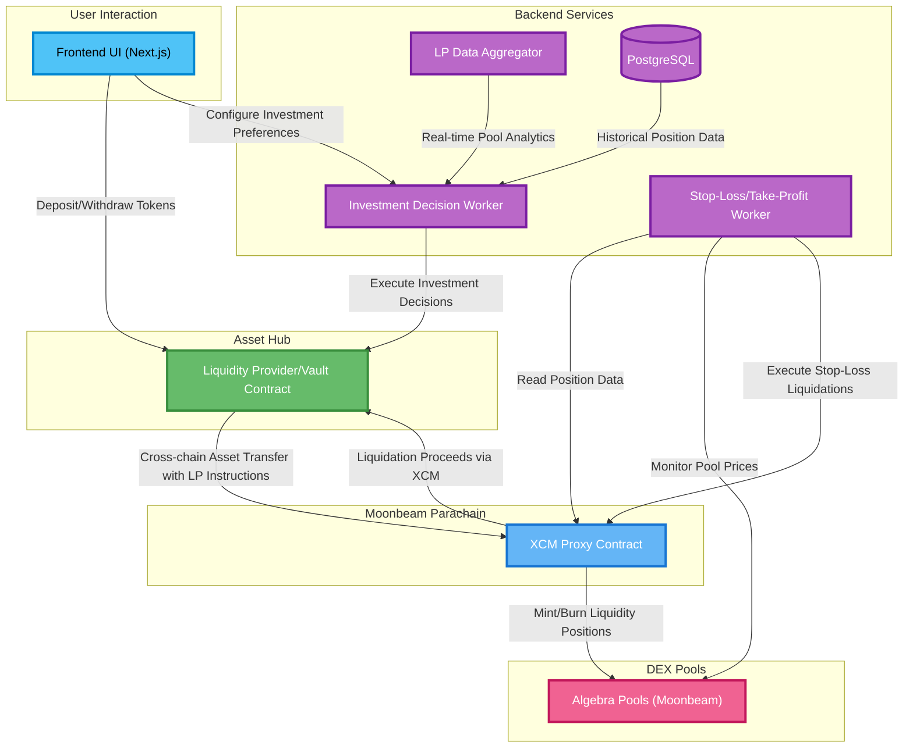

# 📝 LiquiDOT

## 🌟 Project Overview

### Project Description

LiquiDOT is a customizable liquidity provider (LP) manager designed to simplify and improve participation in DeFi. It allows users to automate their LP strategies, set stop loss and take profit levels, and rebalance their positions without needing constant manual oversight. With support for multiple DEXes, LiquiDOT offers a single, user-friendly platform for managing liquidity across different ecosystems. The goal is to bring meaningful control, automation, and flexibility to liquidity providers — something that's currently missing in the space.

### Integration with Polkadot

Polkadot provides the ideal foundation for LiquiDOT by enabling seamless interaction across chains through smart contract deployment and cross-chain messaging. This allows us to connect with multiple parachains and decentralized exchanges, giving users the ability to manage liquidity across ecosystems from a single interface. Polkadot's focus on interoperability and scalability directly supports our aim to build a robust and future-ready LP management tool.

### Our Team's Motivation

Our team came together around a shared interest in solving a problem we've encountered ourselves: the lack of smart, automated tools for liquidity providers. While trading platforms have long supported features like automation, stop loss, and take profit, these tools haven't yet made their way into LP management — and we saw an opportunity to change that. We wanted to build something that gives users more control and peace of mind when providing liquidity. With backgrounds in fintech, mobile development, and blockchain analytics, we had the right mix of skills to bring the idea to life — and it's something we're genuinely excited to use ourselves.


### 🔍 Project Details

### Tech Stack

- Frontend - NextJS (Wagmi, PolkadotJS)
- Backend - NestJS (TypeORM, PolkadotJS)
- Contracts - Solidity (Openzeppelin)
- Deployment - Docker, AWS (ECS)

### Documenation of core components and architecture
#### Liquidot High Level System Diagram


### Core Contracts Documenation

LiquiDOT's smart contract architecture follows a hub-and-spoke model designed for scalable cross-chain liquidity management. The system separates user asset custody (Asset Hub) from execution logic (Moonbeam Proxy), enabling secure, efficient cross-chain operations while maintaining clear separation of concerns. This architecture allows for future parachain integrations without compromising the core vault security or requiring user migration.

#### Asset Hub Vault Contract (Asset Hub/EVM)

The **Asset Hub Vault Contract** serves as the primary custody and accounting layer for user deposits, implementing a secure vault pattern with integrated XCM messaging capabilities. This Solidity contract acts as the single source of truth for user balances and orchestrates all cross-chain operations through standardized XCM calls via Asset Hub's EVM environment.

**Core Responsibilities:**
- **User Balance Management**: Tracks individual user deposits and withdrawals with precision accounting
- **Asset Custody**: Securely holds user funds using battle-tested vault patterns with emergency controls
- **Investment Orchestration**: Initiates cross-chain LP investments by transferring assets and sending instructions via XCM
- **Proceeds Management**: Receives and processes liquidation proceeds from cross-chain positions
- **Multi-Modal Liquidation**: Supports emergency liquidations and strategic rebalancing via XCM
- **Operation State Tracking**: Maintains investment history and status for user transparency and system recovery
- **Access Control**: Implements role-based permissions for automated systems and emergency procedures

**Key Functions:**
- `deposit(amount, asset)` - Accept user deposits with automatic balance updates
- `withdraw(amount, asset)` - Process withdrawals with safety checks and balance verification
- `investInPool(chainId, poolId, baseAsset, amounts, lowerRange, upperRange)` - Initiate cross-chain LP investments via XCM
- `receiveProceeds(chainId, positionId, finalAmounts)` - Receive liquidation proceeds from XCM Proxy
- `emergencyLiquidatePosition(chainId, positionId)` - Emergency liquidation override (admin only)
- `rebalancePosition(chainId, positionId)` - Strategic position rebalancing for portfolio optimization
- `getUserBalance(user, asset)` - Query user balance for specific assets
- `getActiveInvestments(user)` - Query user's active cross-chain positions
- `emergencyPause()` - Circuit breaker for system-wide operations

**Contract Initialization:**
```solidity
function initialize(
    address[] memory _supportedAssets,
    XCMDestination[] memory _xcmDestinations,
    address _investmentDecisionWorker,
    address _feeCollector,
    address _emergencyAdmin
) external initializer
```

#### XCM Proxy Contract (Moonbeam/EVM)

The **XCM Proxy Contract** functions as the execution engine for all DEX interactions, implementing sophisticated liquidity management with automated position monitoring. This contract bridges XCM messages from Asset Hub into concrete DeFi operations on Moonbeam's EVM environment, handling complex LP strategies while maintaining gas efficiency.

**Core Responsibilities:**
- **Cross-Chain Asset Reception**: Receive assets and investment instructions from Asset Hub via XCM
- **Token Swapping & Rebalancing**: Execute optimal token swaps to achieve desired LP position ratios
- **Asymmetric Range LP Management**: Handle LP position creation, modification, and removal with flexible percentage-based ranges (e.g., -5%/+10%, -2%/+15% around current price)
- **Dynamic Tick Range Conversion**: Automatically convert user-friendly asymmetric percentage ranges to precise tick ranges based on current pool state
- **Position Tracking & Monitoring**: Maintain comprehensive position records with real-time health monitoring and range parameters
- **Advanced DEX Integration**: Full Algebra protocol integration with optimized swapping and liquidity operations
- **Multi-Source Liquidation**: Handle liquidations from Stop-Loss Worker (with range validation) and Asset Hub (emergency/rebalancing)
- **Security Validation**: Verify position health before liquidation to prevent unauthorized or erroneous liquidations

**Key Functions:**

*Cross-Chain Investment Execution:*
- `executeInvestment(baseAsset, amounts, poolId, lowerRangePercent, upperRangePercent, positionOwner)` - Complete investment flow: receive assets, swap if needed, mint LP position
- `processSwapAndMint(pool, token0, token1, lowerRangePercent, upperRangePercent, liquidityDesired, positionOwner)` - Internal function to handle token swapping and LP minting
- `calculateOptimalSwap(baseAsset, targetToken0, targetToken1, amounts)` - Determine optimal swap amounts for LP position

*Liquidity Management:*
- `calculateTickRange(pool, lowerRangePercent, upperRangePercent)` - Convert asymmetric percentage ranges to precise tick boundaries based on current pool state
- `executeBurn(pool, bottomTick, topTick, liquidity)` - Remove liquidity from existing positions with automatic token collection
- `findPosition(pool, bottomTick, topTick)` - Locate specific positions by pool and tick range parameters
- `getActivePositions()` - Query all active LP positions for stop-loss monitoring
- `getUserPositions(user)` - Get all positions owned by a specific user with range details

*Asset Management:*
- `receiveAssets(token, user, amount, investmentParams)` - Receive assets and investment instructions from Asset Hub via XCM (owner only)
- `returnAssets(token, user, amount, recipient)` - Return liquidation proceeds to Asset Hub via XCM (owner only)
- `getUserTokenBalance(user, token)` - Check user's token balances for position health calculation
- `getBalance(token)` - Query contract's total token holdings for liquidity analysis

*DEX Integration & Swapping:*
- `swapExactInputSingle(tokenIn, tokenOut, recipient, amountIn, amountOutMinimum, limitSqrtPrice)` - Execute exact input swaps for position liquidations

*Price Quotes & Analysis:*
- `quoteExactInputSingle(tokenIn, tokenOut, amountIn, limitSqrtPrice)` - Get real-time swap quotes without execution

*Stop-Loss & Liquidation:*
- `getPositionDetails(positionId)` - Provide raw position data (entry price, ranges, tokens, pool info) for backend analysis
- `executeFullLiquidation(positionId, liquidationType)` - Complete liquidation flow with validation: burn LP position, swap to base asset, return to Asset Hub
- `isPositionOutOfRange(positionId)` - Validate if position is actually beyond user's asymmetric range (internal security check)
- `swapToBaseAsset(token0Amount, token1Amount, baseAsset)` - Convert position tokens back to original base asset
- `algebraMintCallback(amount0, amount1, data)` - Handle Algebra pool mint callbacks securely

**Contract Initialization:**
```solidity
constructor(
    address _owner,           // Asset Hub contract address (via XCM)
    address _quoterContract,  // Algebra Quoter for price quotes
    address _swapRouterContract // Algebra SwapRouter for swap execution
) {
    owner = _owner;
    quoterContract = _quoterContract;
    swapRouterContract = _swapRouterContract;
}
```

### Integration Architecture

Both contracts work in tandem through a carefully orchestrated flow optimized for percentage-based risk management:

1. **User deposits** assets to Asset Hub Vault Contract and sets risk preferences (e.g., "-5%/+10% range")
2. **Investment Decision Worker** analyzes opportunities and calls Asset Hub's `investInPool()` with specific pool parameters
3. **Asset Hub** transfers assets via XCM to Moonbeam XCM Proxy along with investment instructions (poolId, amounts, asymmetric ranges)
4. **XCM Proxy** receives assets and instructions, executes optimal swaps if needed, converts percentages to precise ticks, and mints LP position
5. **Stop-Loss Worker** continuously monitors XCM Proxy positions to detect when they move outside asymmetric ranges
6. **Automated liquidation** triggers when positions exit ranges: XCM Proxy burns LP, swaps back to base asset, and returns proceeds to Asset Hub via XCM

### Key Architectural Benefits

- **User-Friendly Risk Management**: Users set intuitive asymmetric percentage ranges (-5%/+10%, -2%/+15%) rather than complex tick values  
- **Flexible Risk Profiles**: Different downside and upside ranges allow for tailored risk management based on market conditions
- **Automated Range Conversion**: Smart contracts handle the complex math of converting asymmetric percentages to precise tick boundaries
- **Real-Time Monitoring**: Stop-loss triggers based on actual price movement relative to user's original asymmetric range selection
- **Cross-Chain Efficiency**: All DEX operations, swaps, and liquidations happen on Moonbeam while user fund custody remains secure on Asset Hub
- **Separation of Concerns**: Asset Hub handles custody/orchestration, XCM Proxy handles all DeFi execution and position management

Our architecture ensures **security** (funds custodied on Asset Hub), **user accessibility** (asymmetric percentage-based controls), **mathematical precision** (automated tick conversion), and **scalability** (easy addition of new parachains)

### We have developed minmal PoC
  [Our Github Project link](https://github.com/gabikreal1/LiquiDOT)
### Our Demo of the Frontend UI 
  [Video to the Demo](https://www.youtube.com/watch?v=9bX0Up0pLww&feature=youtu.be)


### Data Models

#### Users
| Column | Type | Description |
|--------|------|-------------|
| Wallet | string | User's wallet address |
| Balance | decimal | User's current balance |
| Token | string | Token identifier |
| UserPreferencesID | integer | Foreign key to UserPreferences |

#### UserPreferences
| Column | Type | Description |
|--------|------|-------------|
| Minimum APY | decimal | Minimum acceptable annual percentage yield |
| Max Allocation Per Pool | decimal | Maximum allocation allowed per pool |
| UserCoins | string[] | Array of preferred coins |
| Risk Tolerance | integer | User's risk tolerance level |
| TakeProfit | decimal | Take profit threshold |
| StopLoss | decimal | Stop loss threshold |

#### Positions
| Column | Type | Description |
|--------|------|-------------|
| UserID | integer | Foreign key to Users |
| PoolID | integer | Foreign key to Pools |
| Amount1Raw | bigint | Raw amount of first token (in smallest unit/wei) |
| Amount2Raw | bigint | Raw amount of second token (in smallest unit/wei) |
| TokenID1 | string | First token identifier |
| TokenID2 | string | Second token identifier |
| TimeStamp | timestamp | Position creation time |
| StopLossRaw | bigint | Position-specific stop loss (in smallest unit) |
| TakeProfitRaw | bigint | Position-specific take profit (in smallest unit) |

#### Pools
| Column | Type | Description |
|--------|------|-------------|
| PoolAddress | string | Pool's contract address |
| TokenID1 | string | First token identifier |
| TokenID2 | string | Second token identifier |
| 24hrVolume | decimal | 24-hour trading volume |
| TVL | decimal | Total value locked |
| DEXID | integer | Foreign key to Dexes |

#### Dexes
| Column | Type | Description |
|--------|------|-------------|
| DexAddress | string | DEX contract address |
| ChainAddress | string | Chain address |

#### Coins
| Column | Type | Description |
|--------|------|-------------|
| CoinAddress | string | Coin's contract address |
| Decimals | integer | Number of decimal places for the token |
| MarketCap | decimal | Market capitalization |
| Ticker | string | Trading symbol |
| LatestPrice | decimal | Most recent price |


### Project Limitations (MVP Scope)

**What LiquiDOT will NOT provide or implement in this initial release:**

- **No Partial Withdrawals**: Only full liquidations and rebalancing are supported - no partial position exits or portfolio adjustments
- **Single Chain DEX Integration**: MVP limited to Moonbeam Algebra pools only - no multi-chain DEX support initially  
- **Basic Investment Logic**: Simple rule-based investment decisions - no AI/ML algorithms or complex predictive models
- **No zkProof Validations**: Investment decision computations happen off-chain without zero-knowledge proofs for verification
- **API-Dependent Pool Data**: Only DEXes that provide reliable API access for pool analytics - no on-chain data parsing for non-API DEXes
- **Limited Asset Support**: Restricted to major assets with established oracles and sufficient liquidity
- **No Governance Token**: MVP operates with centralized decision-making - no DAO governance or community voting
- **Single Strategy Type**: Only automated LP range management - no yield farming, lending, or other DeFi strategies
- **No Impermanent Loss Calculations**: Users must understand IL risks independently - no IL tracking or warnings
- **No 24/7 Guaranteed Uptime**: Backend monitoring may experience maintenance downtime affecting stop-loss execution
- **No Position NFTs / Share Tokens**: For the MVP, user positions live only in the Asset-Hub contract's internal mapping. Transferable position NFTs (ERC-721) or vault share tokens (ERC-20/4626) will be added in a future release.
- **No Tax Reporting Integration**: Users responsible for their own tax calculations and DeFi activity reporting

### 🧩 Ecosystem Fit


### Where and how does our project fit into the ecosystem?
  Our project is an automated LP manager with cross-chain functionality, designed to optimize capital efficiency and user experience across multiple parachains in the Polkadot ecosystem. This enables users to manage assets and interact with DEXs, DeFi protocols, and liquidity pools a lot more efficiently and across networks like the Hub, Hydration, Moonbeam, Acala, etc, from a single interface and without being confined to a single chain's limitations. Our project directly supports Polkadot's vision of a multichain future by reducing fragmentation and improving capital flow across its ecosystem.
  
### Who is our target audience?
  Our project is targeted at crypto enthusiasts looking to optimize their experience within the PolkaDot ecosystem. It is for people who know stuff about crypto already, who are looking for a more reliable way to make money than trading and yet higher potential yield compared to the basic spot/HODL. This can also be an interesting discovery for those who know something about crypto but are newbies in liquidity providing.

Our goal is to also serve developers and projects building on parachains that need efficient, cross-chain liquidity management. We are doing this by providing an automatic and native solution for anyone seeking to maximize yield, reduce manual intervention, and 
seamlessly manage liquidity across multiple Polkadot-connected chains.

Additionally, institutional DeFi participants looking for reliable 
infrastructure to manage large-scale cross-chain liquidity positions 
represent an additional potential future audience.

### What need(s) does your project meet?
Our project addresses several critical needs within the Polkadot ecosystem, particularly around liquidity management and user empowerment in a cross-chain DeFi environment. 
We solve these challenges by offering:

  Cross-chain liquidity optimization: Using Polkadot's XCM, we dynamically allocate liquidity across multiple parachains to improve capital efficiency.

  - User-defined strategies: Users can select from risk-based strategies (e.g., conservative, moderate, aggressive) tailored to their goals and risk tolerance.

  - Advanced risk management tools: Features like stop-loss and take-profit thresholds allow users to safeguard positions and automate exits based on market conditions.

  - Custom asset preferences: Users can specify which coins they're interested in, ensuring personalized exposure across pools.

  - Capital control: Users can set maximum allocation per pool, define a minimum acceptable APR, and decide how many pools to distribute their position across.

  - Yield maximization through automation: The system continuously monitors and reallocates liquidity to optimize returns without manual intervention.

  - User-friendly automation: Reduces the operational burden on users by automating complex liquidity management strategies.
  
#### Are there any other projects similar to yours in the Polkadot ecosystem?
  - If so, how is your project different?
  - If not, why might such a project not exist yet?

While there are projects in the Polkadot ecosystem focused on liquidity provision and automated market making (such as HydraDX or various DEXs on Moonbeam and Acala), none currently offer a cross-chain automated liquidity manager with the same level of customization, user control, and strategy-based automation as our solution.

Most existing tools are limited to individual parachains or offer basic liquidity provisioning without features like:

  - Cross-chain pool rebalancing via XCM
  - Strategy selection (risk-adjusted)
  - Stop-loss/take-profit triggers
  - Custom coin selection and APR thresholds
  - Smart allocation across multiple pools

We believe this gap exists because the complexity of implementing robust cross-chain logic, especially for DeFi strategies.

Our project is built to fill this gap—bridging the technical challenge with a user-first design that empowers participants to take full advantage of Polkadot's multichain architecture.


## 👥 Team

- **Team Name:** LiquiDOT (not a company yet)
- **Contact Name:** Gabriel Bandman
- **Contact Email:** gabrielsoftware04@gmail.com
- **Website:** liquidot.xyz (not operational yet)

### Team members

Please list the legal name of all grant beneficiaries. Solo developers (1-person teams) are eligible for funding.

1. Rashad Hosseini
2. Gabriel Bandman
3. Fedir Maliarenko

#### LinkedIn Profiles (if available)

- [Rashad Hosseini](https://www.linkedin.com/in/rashad-hosseini/)
- [Gabriel Bandman](https://www.linkedin.com/in/gabriel-b-384581265/)
- [Fedir Maliarenko (Telegram) ](t.me/fyodortg)

### Team Code Repos
- [Liquidot Repository](https://github.com/gabikreal1/LiquiDOT)

### GitHub accounts of all team members
- [Rashad Hosseini](https://github.com/rashad-h)
- [Gabriel Bandman](https://github.com/gabikreal1)
- [Fedir Maliarenko](https://github.com/fedyacrypto)
  

### Team's experience


- **Rashad Hosseini**, a software engineer with a bachelor's degree from the University of Leeds and currently working at the fintech unicorn Checkout.com. With experience in building robust financial technology solutions providing valuable expertise in developing secure and scalable systems, which is essential for creating reliable DeFi applications.
- **Fedir Maliarenko**, a crypto enthusiast currently studying Business Analytics at the University of Southampton. With hands-on experience in DeFi protocols, liquidity provision (LP), and automated trading, bringing practical insight into the mechanics of decentralized finance—an essential foundation for contributing to the creation of the product 
- **Gabriel Bandman**, a software engineer and 3-time Web3/DeFi hackathon winner with hands-on experience building AI-driven trading agents, delta-neutral vaults, and liquidity automation systems. With a focus on reactive smart contracts and full-stack product development, bringing deep technical expertise in automating liquidity provision and optimising DeFi strategies—crucial for advancing the protocol's core functionality.


## 📊 Development Status


[Current Repo](https://github.com/gabikreal1/LiquiDOT)

LiquiDOT is currently in an early proof-of-concept phase. The repository contains draft Solidity contracts (Vault, XCM Proxy, Router) that compile and deploy on a local Hardhat network but still need significant security reviews, gas optimisation, and real XCM wiring. A lightweight NestJS service and a wire-frame Next.js dashboard demonstrate the intended deposit → invest → monitor flow, yet most business logic and cross-chain integrations are stubbed out.

The next milestones focus on hardening the contracts, implementing genuine cross-chain calls, expanding the unit-test suite, and upgrading the UI/UX from prototype to production quality. These steps will turn the concept into a robust cross-chain liquidity manager.

## 📅 Development Roadmap


### Overview

- **Estimated Duration:** 8 weeks
- **Full-Time Equivalent (FTE):**  2 Full-Time Equivalent.
- **Total Costs:** $10000

> Note that deliverables 0a to 0d are mandatory. Please adapt their specification to your project.

| Number | Deliverable | Specification |
| -----: | ----------- | ------------- |
| 0a. | License | Apache 2.0 |
| 0b. | Documentation | We will provide both **video tutorial** of how to use the tool and cover all of the LP tool automator parameters for users, and will provide extensive **documentation** for all of the contracts deployed (Via Github Pages) |
| 0c. | Testing and Testing Guide | We will cover the core functions of the contracts deployed with hardhat and foundry (Deposit, withdraw,swap, liquidity minting,liqudity burning, XCM messages). We will cover the backend & frontend with unit tests. All of the testing guide will be on github pages |
| 0d. | Article | [Gabriel](https://x.com/Gabik_B) would be building in public, and covering most of the progress. Upon completion we will publish an article about (milestone 1, milestone 2), our MVP functionalities, and cover future plans of the development.|
| 1. | Core Contracts| We will develop and test two primary smart contracts that form the foundation of our cross-chain liquidity management system: 1) Asset Hub Vault Contract for secure user asset custody and cross-chain orchestration, implementing XCM messaging capabilities and precise balance tracking; 2) XCM Proxy Contract for DEX interactions on Moonbeam, handling LP position management with asymmetric range support and automated liquidation triggers. Both contracts will be thoroughly tested using Hardhat and Foundry, with comprehensive test coverage for deposit/withdraw flows, XCM message handling, LP position creation/modification, and emergency procedures. The contracts will be deployed on Asset Hub and Moonbeam testnets respectively, with full documentation of the deployment process and contract interactions. |
| 2. | Core Backend with database | We will develop a comprehensive backend system with two primary components: an LP data aggregator that collects and normalizes liquidity pool data from various DEXes on the Moonbeam parachain (We will be integrating with other paracahins in the future), and an Investment Decision Worker that analyzes market data and user preferences to make optimal LP allocation decisions. The Investment Decision Worker will implement a core algorithm that determines when to rebalance positions and evaluates risk parameters based on user-defined thresholds. The backend will use NestJS and interact with a PostgreSQL database and use PolkadotJS for blockchain communication, enabling it to directly call smart contracts to execute liquidity operations. The PostgreSQL database will store user preferences, historical position data, and pool analytics to inform decision-making. |
| 3. | Core Frontend | We will develop a user-facing interface using NextJS and Wagmi for wallet connectivity. The frontend will feature a dashboard with real-time position monitoring, strategy selection interface, preference configuration panel, and cross-chain position visualization. Key features include: 1) Interactive dashboard displaying current positions, and performance metrics. 2) Strategy configuration wizard allowing users to select risk profiles and set custom parameters; 3) Token selection interface. 4) Advanced settings panel for risk parameter configuration; 5) Transaction history and performance tracking visualizations. The UI will be responsive, with appropriate loading states and error handling for blockchain interactions. |


### 💰 Budget Breakdown

Please provide a breakdown of your budget by milestone:

| Milestone | Deliverables | Cost (USD) | Estimated Completion |
| --- | --- | --- | --- |
| 1 | Core Contracts| $3,750 | 3 weeks |
| 2 | Core Backend| $3,750 | 3 weeks |
| 3 | Core Frontend | $2,500 | 2 weeks |
| **Total** | | **$10,000** | **8 weeks** |


## 🔮 Future Plans


- How you intend to continue development after the Fast-Grant

   - **Step 1 — Multi-Parachain Expansion**: Integrate Hydration and add additional parachain DEXes via XCM, growing LiquiDOT's coverage beyond Moonbeam.
   - **Step 2 — UX & Onboarding Refinement**: Redesign the dashboard with guided strategy wizards, portfolio summaries, and in-app education to make DeFi onboarding seamless for newcomers.
   - **Step 3 — Data-Driven Strategy Enhancements**: Leverage live performance metrics and user feedback to upgrade the Investment Decision Engine with A/B-tested rebalancing rules and risk scoring.
   - **Progressively decentralised & zk-secured architecture**: Eliminate remaining centralisation points by moving the engine on-chain with **zk-SNARK-verified** instructions, introducing DAO governance, issuing **ERC-721 position NFTs**, and enabling event-driven notifications.  Collectively these upgrades remove the "No zkProof Validations" and "No Position NFTs / Share Tokens" limitations and pave the way for a permissionless LiquiDOT v2.

- Any plans for seeking additional funding (other grants, VC funding, etc.)
- - **Strategic Funding Roadmap**: After delivering the MVP we will actively pursue larger capital injections to accelerate growth.  Our next steps include:
      1. **Polkadot & Web3 Foundation Grants** – submit follow-up proposals to the Web3 Foundation's Web3 Grants Program and the Fast-Grants bounty, and prepare a Treasury spend proposal to the on-chain Polkadot Treasury.
      2. **Moonbeam Ecosystem Grants** – apply for the Moonbeam Ecosystem Grant once cross-chain functionality is proven to extend coverage to additional DEXes on Moonbeam.
      3. **VC Seed Round** – engage Polkadot-focused funds such as Scytale Digital and Harbour Capital to raise a seed round that will finance security audits, liquidity incentives, and team expansion.
      4. **DeFi Infrastructure & Tooling Bounty** – once we have at least USD 5 M TVL and a live main-net deployment, apply for the DeFi Infrastructure bounty to scale backend monitoring and UX tooling.
      These combined resources will provide 12-18 months of runway, allow us to reach > USD 10 M TVL, and position LiquiDOT as core liquidity middleware in the Polkadot ecosystem.

- Your vision for the project's growth and impact in the Polkadot ecosystem

- We see LiquiDOT growing into a core piece of DeFi infrastructure within the Polkadot ecosystem. As more and more parachains, DEXes, and assets come emerge, managing liquidity across them will only get more fragmented and time-consuming. Our goal is to solve that with a single, reliable platform that lets users automate their LP strategies, manage risk, and move seamlessly between chains. By integrating closely with Polkadot ecosystem, we aim to offer truly multichain liquidity management from day one. In the long run, we hope LiquiDOT can help lower the barrier to entry for new users, support better capital efficiency for experienced ones, and ultimately encourage deeper participation in Polkadot-based DeFi.


