# Modular Substrate-Staking Stack (M3S)

- **Team Name:** Auguth Tech Pvt. Ltd, India
- **Payment Details:**
  - **DOT**: 12uzdwVLxAbBtfpTztjX56eMdwbDWs3isJJ1NTPRenJhKDjk.
  - **Payment**: 12uzdwVLxAbBtfpTztjX56eMdwbDWs3isJJ1NTPRenJhKDjk (USDC) 
- **[Level](https://grants.web3.foundation/docs/Introduction/levels):** 3

## Project Overview :page_facing_up:

This proposal builds on the previous [PoCS (Proof of Contract Stake)](https://github.com/w3f/Grants-Program/blob/master/applications/PoCS.md) grant and introduces a **modular staking framework** composed of interoperable Substrate pallets for general-purpose bonding, author (validator) management, and chain operations.  

The project includes one milestone extending the earlier PoCS implementation and additional milestones developing the new modular staking framework. Together, these efforts aim to broaden Substrate and Polkadot’s staking and bonding capabilities.

### Overview

The initial PoCS grant demonstrated a proof of concept using **consumed weights as a staking metric**. This proposal generalizes that approach through `pallet-xp`, which represents Experience Points (XP) as a **fungible yet non-issuance metric**. Because XP cannot use existing staking pallets that rely on [`Balanced`](https://paritytech.github.io/polkadot-sdk/master/frame_support/traits/tokens/fungible/trait.Balanced.html) trait or issusance-queried from [`Fungible`](https://paritytech.github.io/polkadot-sdk/master/frame_support/traits/tokens/fungible/index.html) traits, a new general-purpose modular staking architecture is introduced.

Each pallet is designed with **trait-based modularity** and some with a general-purpose **plugin system**, allowing runtime configuration to easily-swap election, reward, etc models without modifying code. This framework also enables efficient staking and bonding mechanisms—such as pooled & positioned commitments—removing necessity to fork existing pallets for ecosystem projects, promoting reuse.

#### Included Crates

- **`frame-extras`** – Shared traits, types, and macros, including a generic plugin system for Substrate pallets.  
- **`pallet-xp`** – Extends PoCS by implementing Experience Points (XP) with extended-support via `Fungible` trait.  
- **`pallet-commitment`** – General bonding mechanism for fungible assets, with support for pools and indexes.  
- **`pallet-authors`** – Manages author roles lifecycle management and external backing internally via `Commitment` traits.  
- **`pallet-solochain`** – Handles solochain sessions, rewards, and offences. Custom consensus chains (e.g., parachains) can implement its implementation traits for equivalent functionality.

### Project Details

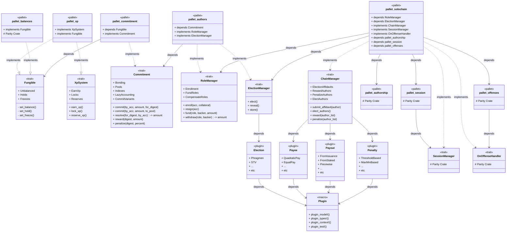

Each module defines a **trait abstraction** where concrete implementations used via **pallet's runtime `Config` trait-bounded associated type**. 

The above class-diagram highlights **high-level dependencies**, where pallets implement or depend on traits and plugins to compose staking/bonding, and author-management and validator selection logic.

- Cross-pallet interaction occurs **only through type-as-trait calls**.  
- Pallets only **expose type-alias, structs and enums publicly** to bind associated types for tighter coupling if neccessary, e.g.:
  ```rust
  type CommitmentAdapter: Commitment<T::AccountId, Asset = ImportedAssetFromPallet>;
  ```
- Trait families remain **reusable and opt-in**, allowing selective feature composition.

#### Runtime Architecture Overview

This section describes the modular runtime architecture and how each pallet contributes to the staking and authoring framework.

It is organized into four core components:
1. [**XP (Experience Points)**](#xp-experience-points) — tracks participation and contribution metrics with fungible-like qualities.
2. [**Commitments**](#general-purpose-commitments) — manages digest-based asset locking and reward accounting.
3. [**Author Roles**](#author-roles) — provides role-based participation, funding, and election logic.
4. [**Solochain (Chain Manager)**](#chain-manager) — handles author elections, affidavits, and reward–penalty coordination.

Additionally [APIs & Extrinsics](#apis--extrinsics) of each pallet and overall [Design Rationale](#design-rationale) from an author (validator/collator) perspective is also included for general clarity.

> **Note:**
>
> * Pallets expose **traits** rather than direct function calls, with extrinsics typically being thin wrappers invoking trait methods.
> * Code snippets provided here are **compact representations** of trait families shown as unified examples.
> * In production, traits are **isolated and includes modular add-ons** over a base trait of the family.
> * Function signatures provided here are illustrative and may include additional parameters, type constraints, or naming differences in milestone delivered-crates.
> * **Runtime Logic** represents either an external pallet or runtime crate's implmentation for the expected logic.

----

#### XP (Experience Points)

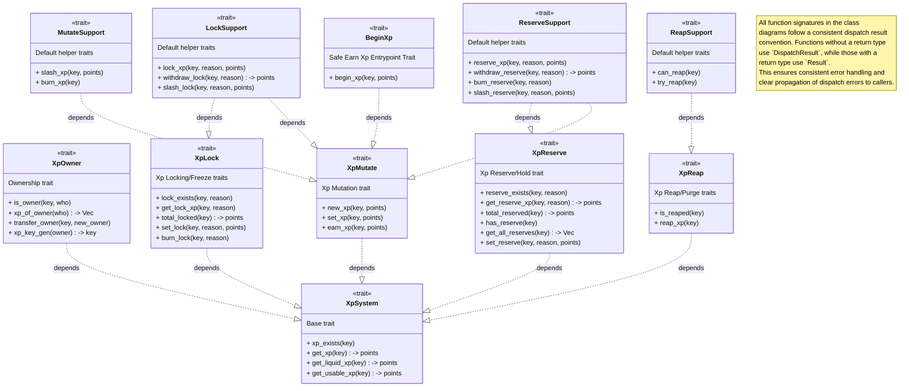

**XP** i.e., `pallet_xp` represents a **non-transferable, earned metric** used to measure *on-chain activity*, *contribution quality*, or *system participation*.
Unlike tokens, XP is not issued or transferred — it is **earned**, **locked**, **reserved**, and **slashed** through runtime logic.

Use cases include:

* Measuring **validator/collator performance or reputation**
* Representing **governance participation weight**
* Acting as a **bonding metric** for commitment or author systems
* Supporting **non-monetary incentive frameworks** (e.g., participation-based rewards)

XP thus extends staking and reward methodology beyond issuance-based token economics while retaining fungible compatibility for reuse across Substrate pallets.

**XP Lifecycle Traits**

XP lifecycle management includes earning, locking, reserving, ownership transferring and slashing.
Each operation is abstracted as part of the `XpSystem` trait.

```rust
/// Will have multiple traits for these methods
/// Hence this is only a conceptual snippet
pub trait XpSystem<AccountId> {

    type XpKey : Parameter + MaxEncodedLen;
    type Points: Balance;
    type LockReason: VariantCount;
    type HoldReason: VariantCount;

    fn earn_xp(key: &Self::XpKey, amount: Self::Points) -> DispatchResult;

    fn lock_xp(
        key: &Self::XpKey,
        reason: Self::LockReason,
        amount: Self::Points,
    ) -> DispatchResult;

    fn reserve_xp(
        key: &Self::XpKey,
        reason: Self::HoldReason,
        amount: Self::Points,
    ) -> DispatchResult;

    fn slash_xp(key: &Self::XpKey, amount: Self::Points) -> DispatchResult;

    fn transfer_xp(owner: &AccountId, new_owner: &AccountId, key: &Self::XpKey)
}
```

**Deterministic XP Keys**

To support reproducible and namespaced XP records, `pallet_xp` will use **deterministic key derivation** via our `KeyGen` traits and structs (`frame_extras` crate, utilizable by any pallet requiring a generic key-gen utility). 

```rust
pub trait KeyGen<Id, Item, Salt, Hasher, T> {
    fn gen_key(target: &Id, item: &Item, salt: Salt) -> Option<Id>;
}
```

Features:

* Deterministic key generation for sub-identities or scoped XP accounts 
    ```
    AccountId -> (XpKey_0, XpKey_1,..)
    ```
* Collision resistance through `nonce` based salted hashing

**Discrete XP Accumulation**

To model **XP levels** or **progression systems**, `pallet_xp` uses a `DiscreteAccumulator` trait for **step-based accumulation** with configurable growth logic. This allows XP to scale non-linearly — threshold based to allow runtime parameters and also avoid type value exhaustion.

```rust
pub trait DiscreteAccumulator {
    type Value;        
    type Step;         
    type Accumulator;  
    type Stepper;      
    fn increment(accum: &mut Self::Accumulator, stepper: &Self::Stepper);
    fn decrement(accum: &mut Self::Accumulator, stepper: &Self::Stepper);
    fn reveal(accum: &Self::Accumulator) -> Self::Value;
}
```

Applications
- Progressive XP multipliers or level-ups
- Threshold-based advancement
- Reputation scaling and rank systems

**XP as a Fungible-like Metric (Without Issuance & Transfers)**

```mermaid
classDiagram
    %% ======================
    %% Pallet XP (Core)
    %% ======================
    class pallet_xp {
        <<pallet>>
        Implements Unbalanced Fungible traits 
        via XP abstraction
        + implements Inspect
        + implements Unbalanced
        + implements Mutate
        + implements InspectHold
        + implements UnbalancedHold
        + implements MutateHold
        + implements InspectFreeze
        + implements MutateFreeze
    }

    %% ======================
    %% Fungible Trait Hierarchy
    %% ======================

    class Inspect {
        <<trait>>
        - Read-only fungible trait
        - Some functions may panic to avoid 
        issuance maintenance
        + total_issuance() -> panic!
        + minimum_balance() -> points
        + balance(key) -> points
        + reducible_balance(key) -> points
        + can_deposit(key, points) -> consequence
        + can_withdraw(key, points) -> consequence
        + active_issuance() -> panic!
    }

    class Unbalanced {
        <<trait>>
        - Low-level balance mutation trait
        + write_balance(key, points) -> 
        + increase_balance(key, points) -> points
        + decrease_balance(key, points) -> points
    }

    class Mutate {
        <<trait>>
        - Standard fungible mutation interface
        - transfer() always fails
        + mint_into(key, points) -> points
        + burn_from(key, points) -> points
        + shelve(key, points) -> points
        + restore(key, points) -> points
        + transfer(source, dest, points) -> err 
    }

    class InspectHold {
        <<trait>>
        - Read-only view for held or 
        reserved balances
        + total_balance_on_hold(key) -> points
        + balance_on_hold(reason, key) -> points
    }

    class UnbalancedHold {
        <<trait>>
        - Low-level reserve mutation trait
        + set_balance_on_hold(reason, key, points)
    }

    class MutateHold {
        <<trait>>
        - Combines hold manipulation traits
    }

    class InspectFreeze {
        <<trait>>
        - Read-only access to locked/frozen balances
        + balance_frozen(id, key) -> (points)
        + can_freeze(id, key) -> (bool)
    }

    class MutateFreeze {
        <<trait>>
        - Mutation interface for freeze/lock logic
        + set_freeze(id, key, points)
        + extend_freeze(id, key, points)
        + thaw(id, key)
    }

    %% ======================
    %% XP Traits Used
    %% ======================

    class XpSystem {
        <<trait>>
        - Base XP query and read access
        + xp_exists(key)
        + get_xp(key)
        + get_liquid_xp(key)
        + get_usable_xp(key)
    }

    class XpMutate {
        <<trait>>
        - Low-level XP mutation
        - Includes helper support traits
        + new_xp(key, points)
        + set_xp(key, points)
        + earn_xp(key, points)
    }

    class XpLock {
        <<trait>>
        - XP lock/freeze management
        - Includes LockSupport helpers
        + lock_exists(key, reason)
        + get_lock_xp(key, reason)
        + set_lock(key, reason, points)
        + burn_lock(key, reason)
    }

    class XpReserve {
        <<trait>>
        - XP reserve/hold management
        - Includes ReserveSupport helpers
        + reserve_exists(key, reason)
        + get_reserve_xp(key, reason)
        + set_reserve(key, reason, points)
        + total_reserved(key)
    }

    %% ======================
    %% Relationships
    %% ======================

    %% Pallet Implementations
    pallet_xp ..|> Inspect : implements
    pallet_xp ..|> Unbalanced : implements
    pallet_xp ..|> Mutate : implements
    pallet_xp ..|> InspectHold : implements
    pallet_xp ..|> UnbalancedHold : implements
    pallet_xp ..|> MutateHold : implements
    pallet_xp ..|> InspectFreeze : implements
    pallet_xp ..|> MutateFreeze : implements

    %% Trait Dependencies
    Inspect --> XpSystem : uses
    Unbalanced --> XpSystem : uses
    Unbalanced --> XpMutate : uses
    Mutate --> XpMutate : uses
    InspectHold --> XpReserve : uses
    UnbalancedHold --> XpReserve : uses
    MutateHold --> XpReserve : uses
    InspectFreeze --> XpLock : uses
    MutateFreeze --> XpLock : uses

    %% ======================
    %% NOTE
    %% ======================
    note "All function signatures in the class 
    diagrams follow a consistent dispatch result 
    convention. Functions without a return type 
    use `DispatchResult`, while those with a 
    return type use `Result<T, DispatchError>`. 
    This ensures consistent error handling and 
    clear propagation of dispatch errors to callers."
```

While XP behaves similarly to token balances (quantifiable, id-based, and fungible), it omits all **issuance, minting, and points-transfer design-mechanics**. This ensures XP remains a **reputation or merit-based** system rather than a tradable asset.

* `pallet_xp` will implement **`Unbalanced`** traits from the `Fungible` trait family.
* Enables use with its `Config` type **`FungibleAdapter`** trait bounds in dependent pallets.
* Maintains **compatibility** with Substrate’s fungible accounting models.

> This makes `pallet_xp` also suitable for generic-staking framework use-case as it involves existing low-level fungible properties.

---

#### General Purpose Commitments

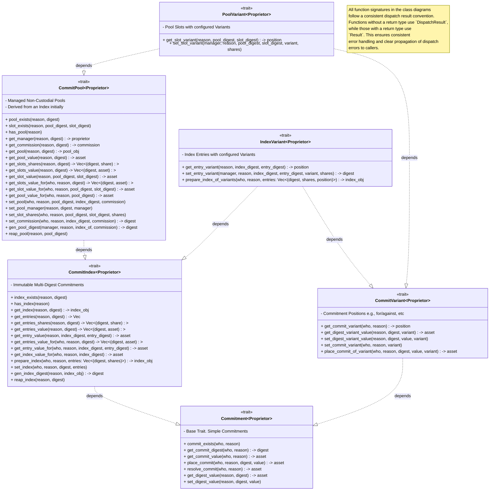

`pallet-commitment` provides a **generic framework for managing fungible-asset commitments**. A **commitment** represents an **asset lock** tied to a *reason* (defined by the runtime logic/ utilizing pallet) and a *digest* (a unique identifier for the commitment context).

The pallet acts as a **trait implementation module** without public extrinsics, except for read-only queries. All interactions occur through loosely-coupled trait calls from other pallets. Accounting is **lazy**, with balance adjustments applied on demand to ensure proportional updates when rewards or penalties affect a digest.

**Commitment Model**

Each commitment associates:

* **Reason** – contextual identifier, i.e., a fungible lock/freeze reason (e.g., `AuthorFunds`, `AuthorCollateral`).
* **Digest** – unique key (often a hash) representing a commitment’s scope (e.g., Authors External Funding IDs).

A *digest* represents the collective balance of all related commitments. Runtime logic may adjust digest balances to apply rewards or penalties, and individual commitments reflect those changes automatically i.e., lazily.

```rust
pub trait Commitment<Proprietor> {
    type Asset: Balance;
    type Reason: VariantCount;
    type Digest: Parameter + MaxEncodedLen;

    fn place_commit(
        who: &Proprietor,
        reason: &Self::Reason,
        digest: &Self::Digest,
        value: Self::Asset,
    ) -> DispatchResult;

    fn resolve_commit(
        who: &Proprietor,
        reason: &Self::Reason,
    ) -> Result<Self::Asset, DispatchError>;

    fn set_digest_value(
        reason: &Self::Reason,
        digest: &Self::Digest,
        value: Self::Asset
    ) -> DispatchResult;
}
```

Commitments follow a consistent lifecycle of placement and resolution. The digest serves as the single correction point for rewards and penalties, ensuring consistent and fair proportional updates.

**Lazy Accounting**

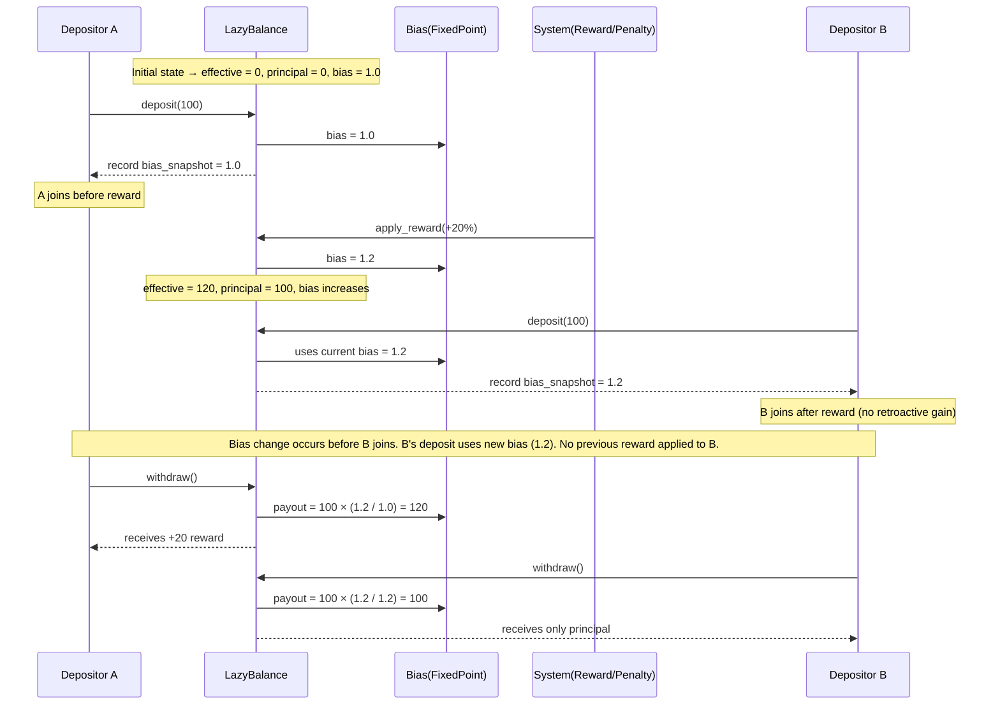

Lazy accounting model separates **principal** (initial deposit) from **effective** balance (real-time value) using a **bias factor** to track proportional changes. This enables proportional reward or penalty distribution without immediate recalculation, improving efficiency across digest-level updates.

For depositor ($i \in {1,2,\dots,n}$) with principal ($p_i$) and bias snapshot ($r_i$) at deposit time, and global bias ($r_{\text{now}}$) at withdrawal:

$$
\text{payout}_i = p_i \cdot \frac{r_{\text{now}}}{r_i}
$$

- If ($r_{\text{now}} > r_i$), depositor ($i$) gains proportionally (reward).
- If ($r_{\text{now}} < r_i$), depositor ($i$) incurs a loss (penalty).

This ensures that only participants present during a bias change experience its effect, while later depositors remain unaffected.

```rust
pub struct LazyBalance<Amount, FixedPoint> {
    pub effective: Amount,
    pub principal: Amount,
    pub bias: FixedPoint,
    pub stale: bool,
}
```

**Indexed Commitments**

`CommitIndex` trait supports commitments distributed across multiple digests for diversified exposure or unmanaged delegation scenarios under a single reason. Indexes are immutable; changes require preparing a new index digest, unlike mutable pools.

```rust
pub trait CommitIndex<Proprietor>: Commitment<Proprietor> {
    type Index: Clone;
    type Shares: Unsigned;

    fn prepare_index(
        who: &Proprietor,
        reason: &Self::Reason,
        entries: Vec<(Self::Digest, Self::Shares)>,
    ) -> Result<Self::Index, DispatchError>;
}
```

**Pooled Commitments**

`CommitPool` trait defines **non-custodial pools**, where a **manager** allocates commitments across digests without asset withdrawal rights. 

- A *commission-on-withdraw* model will be available to compensate pool managers. 
- Each pool is **instantiated from an existing index digest**, inheriting its structure and entry distribution.

```rust
pub trait CommitPool<Proprietor>: Commitment<Proprietor> {
    fn add_to_pool(
        who: &Proprietor,
        reason: &Self::Reason,
        pool_of: &Self::Digest,
        value: Self::Asset,
    ) -> DispatchResult;
}
```

**Commitment Variants**

`CommitVariant` adds **variant-based classification**, allowing commitments to represent directional or stateful contexts (e.g., long/short, for/against).

```rust
pub trait CommitVariant<Proprietor>: Commitment<Proprietor> {
    type Position: VariantCount + PartialEq;

    fn place_commit_of_variant(
        who: &Proprietor,
        reason: &Self::Reason,
        digest: &Self::Digest,
        value: Self::Asset,
        variant: &Self::Position,
    ) -> Result<Self::Asset, DispatchError>;
}
```

- Variants enable extended semantics without altering core commitment logic, useful for **derivative, governance, or reputation-based** systems.
- Normal commitments effectively revolve around this model by assigning a default variant, ensuring backward compatibility.
- Each digest maintains its own balance per variant, providing clear separation of directional states and accurate lazy accounting across commitment types.

**Indexed and Pooled Variants**

`IndexVariant` and `PoolVariant` combine variant metadata with index and pool structures:

* **`IndexVariant`** – binds variants to immutable index entries.
* **`PoolVariant`** – binds variants to mutable pool slots.

These extensions remain modular and optional, preserving compatibility with the base `Commitment` trait.

**Safety & Modular**

* **Digest-based updates:** all rewards and penalties apply at the **digest level only**. Commitments, index, pools remain un-affected at all scenarios.
* **Fungible asset instance:** `pallet_commitment` acts as an instance of a fungible asset type, enabling shared accounting for pallets using the same asset (e.g., `pallet_balances`, `pallet_xp`).

----

#### Author Roles

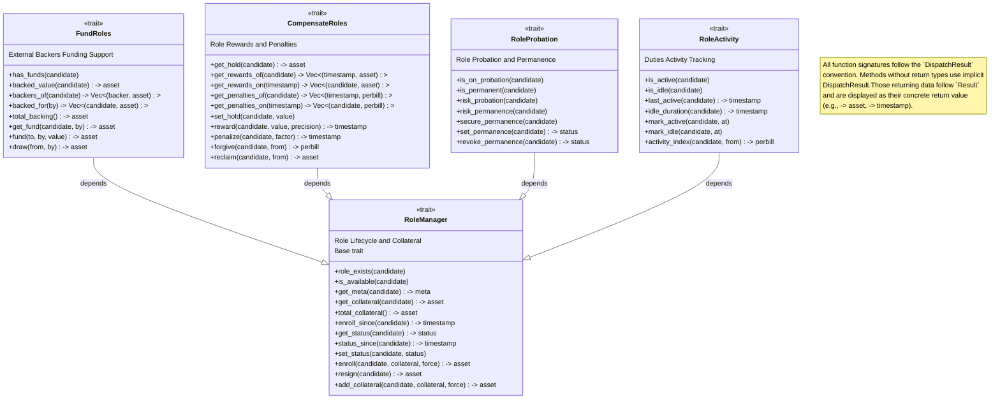

`pallet_authors` manages **author roles** in the runtime through the `RoleManager` trait familiy and related abstractions. Roles can represent general-purpose decentralized actors of the runtime with modular, composable lifecycles.

**Role Lifecycle**

`pallet_authors` implement the `RoleManager` trait, defining enrollment, funding, activity, and resignation.

* **Enrollment:** Authors lock collateral via `Commitment` traits, ensuring accountable participation.
* **Probation/Activity:** Roles may enter probation (`RoleProbation` trait) and have duties verified via `RoleActivity` - a hook trait in `pallet_authors` implemented by external pallets (e.g., `pallet_solochain`).
* **Funding/Compensation:** Roles can receive funding (`FundRoles` trait) and receive rewards or penalties (`CompensateRoles` trait) based on duties performed i.e., role activity.

```rust
pub trait RoleManager<AccountId> {
    type Asset;
    fn enroll(who: &AccountId, collateral: Self::Asset) -> DispatchResult;
    fn resign(who: &AccountId) -> DispatchResult;
    fn fund(who: &AccountId, value: Self::Asset) -> DispatchResult;
    fn slash(who: &AccountId, penalty: Perbill) -> DispatchResult;
}
```

**Election Management and Plugins**

Special Author-Set selection is managed by the **`ElectionManager`** trait family (seperate from `RoleManager` trait family), which uses a **plugin-based computation model** for stateless, type-safe, and configurable election logic. Computation-logic is delegated to external **runtime-plugins declared via macros**.

```rust
pub trait ElectionManager<Candidate, Weight>: InspectWeight<Candidate, Weight> {
    type Params: Default + FromIterator<(Candidate, Weight)>;
    type Elected: Default + FromIterator<Candidate>;

    plugin_trait_types!(
        input: Self::Params,
        output: Self::Elected,
        model: ElectionModel,
        context: ElectionContext,
    );

    fn prepare(from: Self::Params) -> DispatchResult;
    fn reveal() -> Result<Self::Elected, DispatchError>;
}
```

This lets runtime crate or external support crates i.e., `frame_extras` to define, or extend via multiple-election logics without modifying pallet code.

**Plugin System Overview**

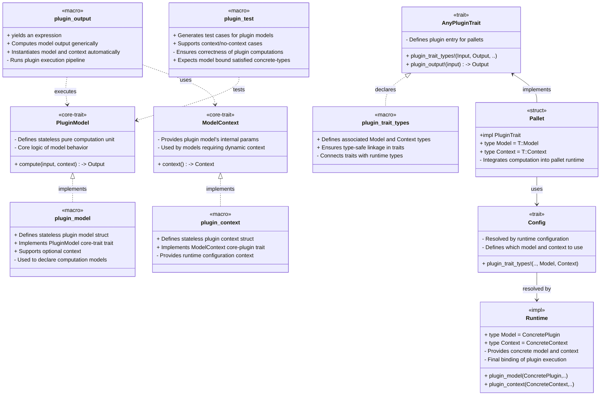

The plugin system provides a **stateless, generic** computation layer. Algorithms are implemented as **pluggable models** using macros, allowing runtime logic to be replaced or extended safely at compile time.

**Context and Runtime Binding**

Each plugin optionally runs with a **context** providing runtime parameters (e.g., thresholds, limits). Both input (`internal def`) and context (`external def`) are used for deterministic computation:

```rust
pub struct ElectionContext { pub min_weight: u64, pub max_candidates: u32 }
```
```rust
// yields an expression
plugin_output!(
    input: params,
    model: Self::ElectionModel,
    context: Self::ElectionContext
);
```

Plugins bind generically to runtime types through **trait bounds**, as internally there are no concrete types.

**Plugin Macros**

* `plugin_trait_types!()` – Declares plugin input, output, model, and context in trait definitions.
* `plugin_output!()` – Executes plugin computation deterministically in trait definition default methods.
* `plugin_model!()` – Defines plugin model's logic using generic-idents and bounds for plugin trait's associated type resolution.
* `plugin_test!()` – Enables standalone testing for plugin models using mock concrete types.

Plugins define **input**, **output**, and optional **context** as generic, bounded types. It removes runtime coupling between logic and data flow. 

```rust
plugin_model! {
    name: TopDownModel,
    input: Input,
    output: Output,
    others: [Candidate, FlatWeight],
    context: None,
    bounds: [
        Input: FromIterator<(Candidate, FlatWeight)> + IntoIterator<Item = (Candidate, FlatWeight)> + Clone,
        Output: FromIterator<Candidate>,
        FlatWeight: Ord + Clone,
        Candidate: Clone,
    ],
    compute: |input, _context| {
        let mut items: Vec<(Candidate, FlatWeight)> = Vec::new();
        for pair in input.clone() {
            items.push(pair);
        }
        let mut output: Vec<Candidate> = Vec::new();
        for (candidate, _) in items {
            output.push(candidate);
        }
        output.into_iter().collect()
    }
}
```
Other models (e.g., weighted majority, phragmen, stv, etc) can be defined similarly with minimal boilerplate and optional context specific to the model as well.

**Integration with Author Roles**

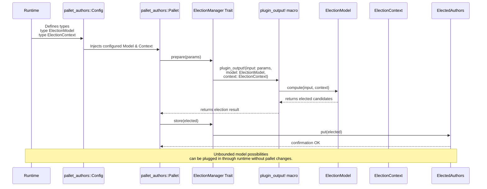

`pallet_authors` will use plugin-based elections to determine active authors.
Results from plugin computation are stored and managed through the `ElectionManager` trait-interface.

```rust
impl<T: crate::Config, Candidate> ElectionManager<Candidate> for Pallet<T> {
    fn prepare(params: Self::Params) -> DispatchResult {
        let result = plugin_output!(
            input: params,
            model: Self::ElectionModel,
            context: Self::ElectionContext
        );
        Self::store(result)
    }

    fn store(elected: Self::Elected) -> DispatchResult {
        <ElectedAuthors<T>>::put(elected);
        Ok(())
    }
}
```

---

#### Chain Manager

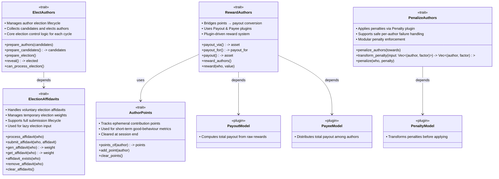

`pallet_solochain` implements the **`ChainManager`** trait family — a coordination layer for **author elections**, **affidavit declarations**, and **reward or penalty distribution** in solochains.
`ChainManager` generalizes author management for **solochains, parachains, or custom runtimes**, providing a consistent interface for block production where **authors** act as the primary entities maintaining network liveness and consensus.

**Author Management Integration**

`pallet_solochain` integrates with lower-level **`RoleManager`** traits, enabling author enrollment, funding, and compensation management.
It uses `FundRoles` to query author election weights and `CompensateRoles` to handle reward and penalty applications.

```rust
/// Will have multiple traits for these methods
/// Hence this is only a conceptual snippet
pub trait ChainManager<AccountId>: RoleManager<AccountId> {
    fn submit_affidavit(who: &AccountId) -> DispatchResult;
    fn elect_authors() -> DispatchResult;
    fn reward_authors() -> DispatchResult;
    fn penalize_authors() -> DispatchResult;
}
```

This defines a author/validator lifecycle in `pallet_solochain` as:

```
affidavit → election → block production → reward/penalty
```

and maintains compatibility with Substrate’s `SessionManager` and `OffenceHandler` systems.

**Affidavit Declaration**

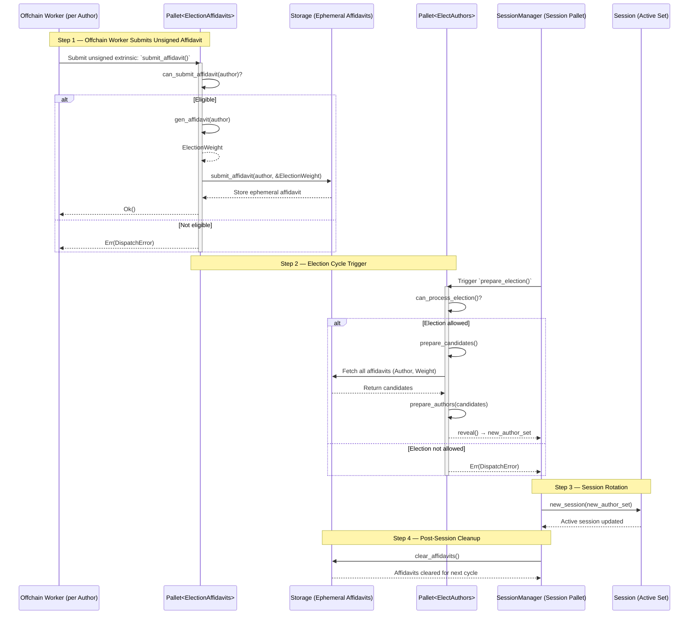

Instead of automatically considering all authors, `ChainManager` supports **affidavit-based self-declaration**.
This ensures that only **willing and active authors** participate in elections, reducing unnecessary computation and improving clarity in author selection.
It also facilitates a **simplified opt-out or chilling process**, allowing authors to exit participation without causing runtime inconsistencies.

```rust
pub trait ElectionAffidavits<Author> {
    fn submit_affidavit(who: &Author) -> DispatchResult;
    fn declared() -> Vec<Author>;
}
```

Example usage:

```rust
ChainManager::submit_affidavit(&author)?;
let candidates = ElectionAffidavits::<T>::declared();
<<T as crate::Config>::RoleAdapter as ElectionManager>::prepare(candidates)?;
```

The affidavit pipeline in `pallet_solochain` is lightweight, using unsigned extrinsics and short-lived (emphemeral) storage items to minimize Offchain-workers (OCW) overhead and its implementations will offer safety over unsigned-replay attacks. 

**Plugin-Based Rewarding and Penalization**

While `CompensateRoles` from `RoleManager` trait (`pallet_authors`) rewards or slashes individual roles, `ChainManager` operates at a higher level for collective enactments for author roles, using **plugin-based traits** — `RewardAuthors` and `PenalizeAuthors` — for configurable reward and penalty logic.

```rust
pub trait RewardAuthors<Author, Asset> {
    type Points: Unsigned;
    type Params: Default + FromIterator<(Author, Self::Points)>;
    type Payees: Default + FromIterator<(Author, Asset)>;

    plugin_trait_types!(
        input: Self::Params,
        output: Self::Payees,
        model: RewardModel,
        context: RewardContext,
    );

    fn distribute(points: &Self::Params) -> DispatchResult {
        let payees = plugin_output!(
            input: points,
            model: Self::RewardModel,
            context: Self::RewardContext
        );
        Self::reward(payees)
    }

    fn reward(payees: &Self::Payees) -> DispatchResult;
}
```

Reward plugins can determine:

* **Total payout or inflation derivation** per session (based on total issuance or stake) via curves, parameters, etc., configured in the runtime logic.
* **Payee distribution models**, such as proportional or equal rewards if reward mapping requires adjustment

Penalization uses a similar structure, providing runtime flexibility through pluggable penalty models:

```rust
pub trait PenalizeAuthors<Author> {
    type Params: Default + FromIterator<(Author, Perbill)>;

    plugin_trait_types!(
        input: Self::Params,
        output: Self::Params,
        model: PenaltyModel,
        context: PenaltyContext,
    );

    fn apply_penalties(factors: &Self::Params) -> DispatchResult {
        let penalties = plugin_output!(
            input: factors,
            model: Self::PenaltyModel,
            context: Self::PenaltyContext
        );
        Self::penalize(penalties)
    }

    fn penalize(penalties: &Self::Params) -> DispatchResult;
}
```

This structure separates reward and penalty policies from the pallet core, enabling flexible runtime configurations without altering internal logic.

**Author Points**

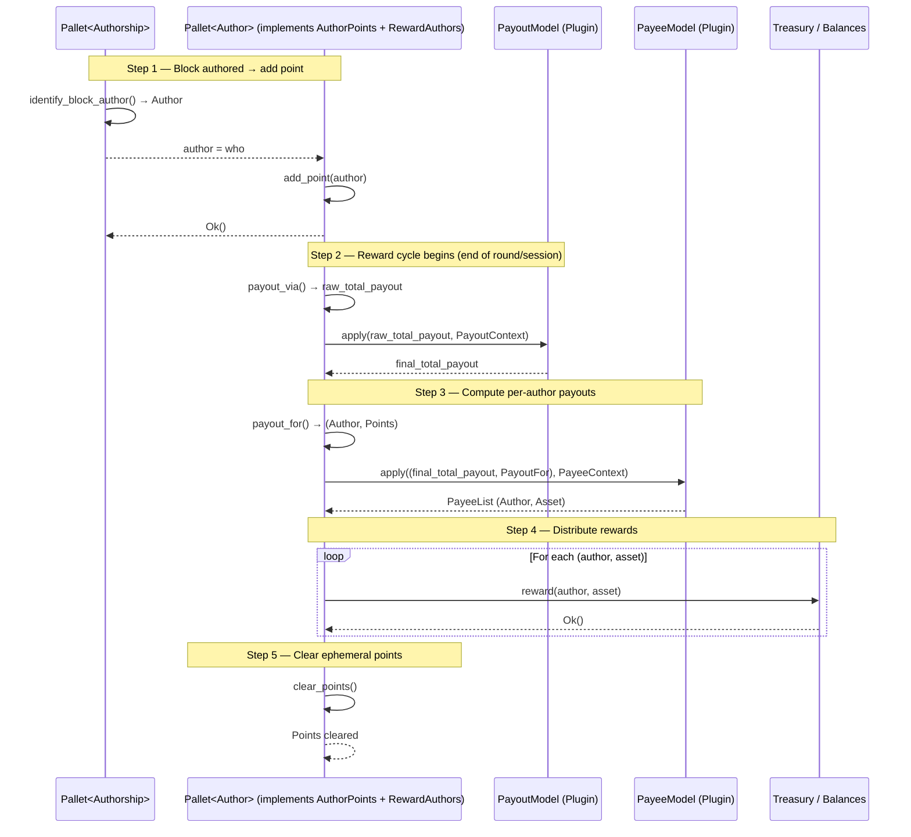

`AuthorPoints` provides session-based scoring used to derive proportional rewards. Points accumulate for generic positive behavior (in `pallet_solochain` its successful block authorship - can extend) and reset each session after payout.

```rust
pub trait AuthorPoints<Author> {
    type Points: Unsigned;
    fn add_point(who: &Author);
    fn points_of(who: &Author) -> Self::Points;
    fn clear_points();
}
```

This mapping makes performance measurable and directly tied to session reward outcomes.

**Election and Session Integration**

The **`ElectAuthors`** trait bridges author elections with Substrate’s session infrastructure.
`pallet_solochain` implements this to forward elected authors to `SessionManager` and enforce penalties using `OffenceHandlers`, maintaining interoperability with core consensus modules.

```rust
pub trait ElectAuthors<Author> {
    type Elected: Default + FromIterator<Author>;
    fn elect() -> DispatchResult;
    fn reveal() -> Self::Elected;
}
```

**Chain-Wide Utility**

The `ChainManager` trait abstraction provides a modular interface for consistent author management, reward logic, and offense handling across chain types:

* **Solochains** – complete local author election and reward cycles, for which `pallet_solochain` serves as a reference implementation of `ChainManager`.
* **Parachains** – integrate local collator election and incentive models alongside relay-chain.
* **Custom domains** – define alternative election or penalty mechanisms.

This modular approach keeps block production and author incentives consistent, reusable, and adaptable across runtime designs.

---

#### APIs & Extrinsics

All pallets act as **trait implementation pallets**, exposing functionality through trait-based APIs. Extrinsics are provided **only where direct signed interaction is required** and for storage-computed-stateless queries.

Each pallet may also define **root-modifiable extrinsics** for updating configurable storage items — `StorageValue` that are **not constants** but influence the pallet’s overall runtime behavior. These serve as **runtime-adjustable parameters**, similar to genesis configurations, allowing controlled evolution of pallet behavior without redeployment or migration safely.

**`pallet_xp`**

`pallet_xp` provides a **general-purpose XP accounting system** usable by any runtime pallet. It exposes APIs through the `XpSystem` trait and selectively implements the `Fungible` trait family, excluding issuance-related functionality.

Trait APIs include:

([code snippet](#xp-experience-points) given above)

* Defines XP operations for **earning**, **locking**, **reserving**, and **slashing** and **ownership-transfering**.
* Dependent pallets may apply their own validation or safe-accounting over the **`Unbalanced`** subset of the `Fungible` traits for fine-grained control.

Extrinsics include:

```rust
pub fn lock(origin: OriginFor<T>, xp_key: XpOf<T>, reason: LockReasonOf<T>, amount: XpPoints<T>) -> DispatchResult;
pub fn reserve(origin: OriginFor<T>, xp_key: XpOf<T>, reason: HoldReasonOf<T>, amount: XpPoints<T>) -> DispatchResult;
pub fn call(origin: OriginFor<T>, xp_key: XpOf<T>, inner_call: Box<<T as Config>::RuntimeCall>) -> DispatchResult;
```

* `lock` and `reserve` provide direct user access to XP state modifications.
* `call` acts as a **proxy extrinsic**, enabling operations on XP-linked records that lack cryptographic keys. It routes execution through the origin account (XP owner), authorizing actions on behalf of the XP identity.

**`pallet_commitment`**

`pallet_commitment` functions as a **trait-only implementation pallet**, providing a generic framework for **digest-based asset commitments**.
It enables dependent pallets to manage staking, bonding, or collateral mechanisms through shared, type-safe abstractions—without redefining storage or accounting logic.

Trait APIs include:

([code snippet](#general-purpose-commitments) given above)

* Defines the core **place** and **resolve** operations for managing commitments.
* The **`CommitDigest`** type is **shared** across **index** and **pool** commitments for consistent resolution and reward or penalty propagation.
* The **`CommitReason`** type is defined by the utilizing pallet, enabling flexible integration with custom locking or freezing logic.

Storage Integration:

`pallet_commitment` maintains an **isolated storage schema**, allowing any pallet to register and manage commitments through its own contextual `LockReason` or `FreezeReason` type. This design enables concurrent usage by multiple pallets without requiring additional storage definitions or risking state conflicts.

Runtime and Asset Instance Support:

The pallet supports **multiple runtime instances**, each operating independently for distinct **asset types** (e.g., native balances, XP points, derivatives).
Each instance reuses the same trait and storage interface, allowing any fungible-asset-utilizing pallet to integrate `pallet_commitment` safely without storage or type interference.

State Queries:

```rust
pub fn commit_balance(who: Proprietor, reason: CommitReason) -> Result<Asset, DispatchError>;
```

* Extrinsics Provides **read-only access** to commitment state.
* `pallet_commitments` will include **no stateful extrinsics**; all state mutations occur via **trait calls** invoked by dependent pallets or runtime.

Read-only extrinsics may expose finer commitment aggregates (e.g., all committers per digest, real-time value tracking, since storage doesn't expose accurate values due to **lazy** accounting) for analytics or inspection purposes.

**`pallet_authors`**

`pallet_authors` manages **author participation**, **collateral management**, and **backing relationships** within the runtime. It provides **dispatchable extrinsics** for operational actions and exposes **trait-based APIs** for integration with election, reward, and commitment systems.

Extrinsics include:

```rust
pub fn enroll(origin: OriginFor<T>, collateral: BalanceOf<T>) -> DispatchResult;

pub fn resign(origin: OriginFor<T>) -> DispatchResult;

pub fn back_author(origin: OriginFor<T>, author: AuthorOf<T>, amount: BalanceOf<T>) -> DispatchResult;

pub fn withdraw_backing(origin: OriginFor<T>, author: AuthorOf<T>, amount: BalanceOf<T>) -> DispatchResult;

pub fn create_pool(origin: OriginFor<T>, slots: Vec<(AuthorOf<T>, ShareOf<T>)>) -> DispatchResult;

pub fn create_index(origin: OriginFor<T>, entries: Vec<(AuthorOf<T>, ShareOf<T>)>) -> DispatchResult;

pub fn back_pool(origin: OriginFor<T>, pool_id: PoolIdOf<T>, amount: BalanceOf<T>) -> DispatchResult;

pub fn back_index(origin: OriginFor<T>, index_id: IndexIdOf<T>, amount: BalanceOf<T>) -> DispatchResult;

pub fn set_pool_share(origin: OriginFor<T>, pool_id: PoolIdOf<T>, author: AuthorOf<T>, share: ShareOf<T>) -> DispatchResult;
```

* **Enrollment** registers authors with the requiredi.e., configured collateral.
* **Resignation** allows authors to exit participation and recover collateral.
* **Backing** and **withdrawal** manage contributions between supporters and authors, pools, or indexes.
* **Pool** and **index creation** establish registries for grouped author funding and commitment tracking. Since `pallet_commitment` exposes only trait-based APIs, these registries are initialized and routed via `pallet_authors`.
* **Pool management extrinsics** such as `set_pool_share` allow the pool’s designated manager to redistribute pooled funds among slot authors based on the configured share or distribution scheme.

Author **election** and **rotation** remain governed by **trait-based logic**, executed by higher-level coordination pallets such as `pallet_solochain`, ensuring consistent runtime-driven behavior.

**`pallet_solochain`**

`pallet_solochain` coordinates **author validation**, **affidavit declaration**, and **author election** logic at the network level.
It provides both **signed extrinsics** for author participation control and **unsigned extrinsics** for automated election workflows, supporting on-chain and off-chain interaction.

Extrinsics include:

```rust
pub fn validate(origin: OriginFor<T>, affidavit_pub: AffidavitId<T>) -> DispatchResult;

pub fn chill(origin: OriginFor<T>, affidavit_pub: AffidavitId<T>) -> DispatchResult;

pub fn declare_affidavits(origin: OriginFor<T>, payload: AffidavitPayload<T>, signature: T::Signature) -> DispatchResult;

pub fn elect_authors(origin: OriginFor<T>, payload: ElectionPayload<T>, signature: T::Signature) -> DispatchResult;
```

* **`validate`** enables authors to signal readiness to participate in block production or next session's affidavit submission using their **affidavit session key** (i.e., application-specific crypto keys).
* **`chill`** allows authors to temporarily suspend their duties without incurring penalties, maintaining state consistency during inactivity.
* **`declare_affidavits`** and **`elect_authors`** are **unsigned extrinsics** automatically submitted by off-chain workers. These use **ephemeral affidavit keys** for signing and are verified through `ValidateUnsigned` and `AppCrypto, SigningTypes` - unsigned-extrinsics supporting traits.
* Automated off-chain submission ensures deterministic affidavit collection and author election execution without requiring user-triggered transactions.

This structure allows `pallet_solochain` to function as a coordination layer for session-based author management, while remaining interoperable with `SessionManager` and `OffenceHandler` trait implementations.

#### Design Rationale

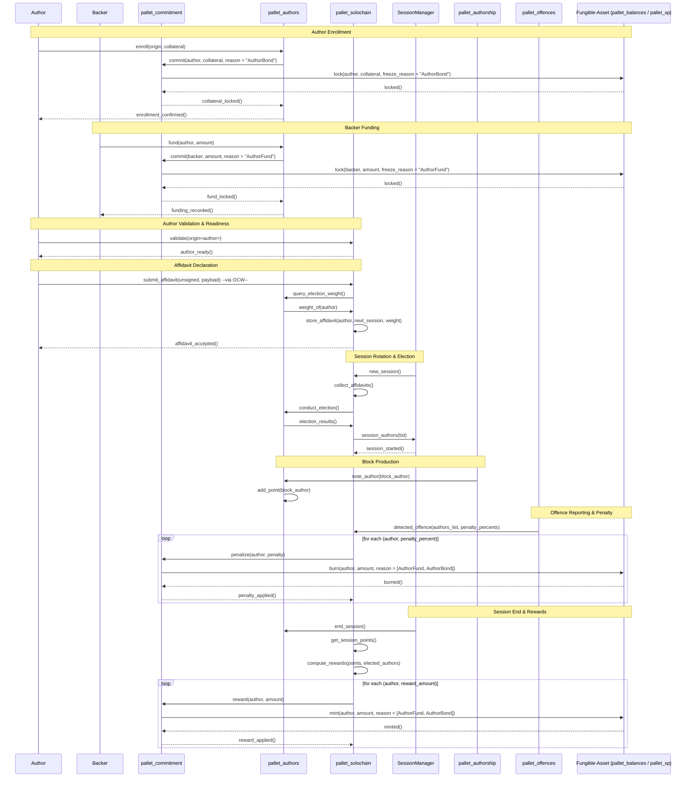

The above sequence-graph focuses specifically on **authors**, illustrating how the modular flow operates for block producers. However, each pallet is designed to function independently and may serve a broader range of participants—such as **asset holders**, **general bonding users**, or **other runtime actors** implementing the same trait interfaces.

The architecture emphasizes **modularity, maintainability, and asset-agnostic design**, supporting flexible integration with both token-based (`pallet_balances`) and XP-based (`pallet_xp`) systems.

### Ecosystem Fit

#### Where and how does your project fit into the ecosystem

M3S is a **runtime-level primitives stack** for staking, bonding, and author management in Substrate-based chains. It complements and generalizes existing modules like [`pallet_staking`][1], [`pallet_nomination_pools`][2], and [`pallet_delegated_staking`][4], replacing some of their **nPoS-specific coupling** with a **new fully-composable-staking framework**.
It serves as a reusable foundation for validator and collator lifecycle management — bonding, election, reward, and penalty — adaptable to varied runtime needs without forking staking internals.

Our work on previous grant [PoCS](https://github.com/w3f/Grants-Program/blob/master/applications/PoCS.md) — exposed this need directly. Integrating `xp-points` based staking required forking `pallet_staking` or writing tightly coupled logic. M3S emerged as a generalized solution to this constraint, designed for flexible configuration and reuse across ecosystems.

#### Target audience

* **Runtime and parachain developers** needing adaptable staking or bonding logic.
* **Protocol/DApp authors** building pooled or delegated commitment systems.
* **Wallet and explorer developers** requiring standardized runtime primitives.
* **Infrastructure teams** implementing collator or validator incentives.
* **Substrate contributors** seeking modular alternatives to current staking dependencies.

#### Problems addressed

* **No generic bonding abstraction:** Substrate provides holds and locks ([`pallet_balances`][8]) but no shared, pooled accounting layer.
* **Tightly coupled staking logic:** [`pallet_staking`][1] integrates under a single model, limiting configurability.
* **Forking and fragmentation:** extensions like [`pallet_nomination_pools`][2] works around existing rigidity.
* **Non-modular rewards and penalties:** logic like [`staking-reward-curve`][7] remains a singular-curve-derivation choice rather than composable.

#### Evidence

* **Ecosystem trends:** creation of pooling and delegation extensions ([`nomination-pools`][2], [`delegated-staking`][4]) indicates recurring demand for flexible primitives.
* **Community discussions:** developers report `pallet_staking` and NPoS is complex and resource-heavy for parachains ([Stack Exchange][3]) and there's been continued-development to modularize the monolithic system.
* **API evolution:** the move from locks to holds/freezes in [`pallet_balances`][8] reflects ongoing efforts toward modular abstractions — a gap M3S fills at the commitment layer.

#### Related work and distinction

| Existing module | Limitation | M3S |
| -------| ---------| ----------|
| [`pallet_staking`][1] | Fixed nPoS design; tightly coupled reward/era logic. | Modular trait families for bonding, election, and rewards. |
| [`pallet_nomination_pools`][2]  | Pooling tied to staking context only. | Digest-based pooling usable across pallets. |
| [`pallet_delegated_staking`][4] | Parachain-specific design. | Generic, configurable plugin architecture. |
| [`pallet_balances`][8] | Provides holds/locks only.| Adds context-aware-locks i.e., commitment abstraction.|

#### Comparison to other ecosystems

Systems such as **Lido**, **Rocket Pool**, or **Aptos Delegated Staking** address single-model-delegation at the contract or module layer.
M3S introduces equivalent multi-model-flexibility at the **runtime level**, enabling native trait-based configuration within Substrate’s consensus and session model.

#### M3S approach

* **`pallet_commitment`** — digest-based, pooled commitments with unified lock reasons.
* **Composable trait families** — replace hardcoded logic with configurable election, role-management, reward, and penalty behaviors.
* **XP and token compatibility** — supports fungible and semi-fungible (non-issuance) metrics as first-class bonding assets.
* **Plugin structure** — enables flexible runtime upgrades without major refactoring.

M3S addresses a structural limitation in the Substrate runtime stack — the lack of a **generic, composable bonding and staking framework**.
Born from practical challenges developing an XP-based system, it targets a broader ecosystem need for flexibility, maintainability, and modular runtime design.
By separating bonding, election, and reward logic into independent pallets and trait interfaces, M3S provides a foundation for reusable staking architectures across runtimes.


[1]: https://paritytech.github.io/substrate/master/pallet_staking/index.html
[2]: https://docs.rs/crate/pallet-nomination-pools/latest
[3]: https://substrate.stackexchange.com/questions/2843/how-can-the-substrate-staking-pallet-be-used-in-a-parachain
[4]: https://paritytech.github.io/polkadot-sdk/master/pallet_delegated_staking/index.html
[5]: https://crates.io/crates/pallet-curveless-staking
[6]: https://aptos.dev/network/blockchain/delegated-staking
[7]: https://crates.io/crates/pallet-staking-reward-curve
[8]: https://paritytech.github.io/substrate/master/pallet_balances/index.html


## Team :busts_in_silhouette:

### Team Members

* **Joby Reuben** – Chief Engineer & Research Lead
* **Naveen Jose** – Senior Rust Engineer
* **Two Junior Developers** – Runtime and test support (engaged as required)
* **One Project Manager** – Coordination and documentation oversight

### Contact

* **Contact Name:** Joby Reuben
* **Email:** [jobyreuben@gmail.com](mailto:jobyreuben@gmail.com)

### Legal Structure

* **Registered Legal Entity:** Auguth Tech Pvt. Ltd.
* **Registered Address:** 22A/5, Gandhi Nagar, Oddanchatram, Dindigul, Tamil Nadu, India – 624619

### Team’s Experience

**Joby Reuben** is a **systems programmer and researcher** with experience in **operating system internals**, **compiler design**, and **blockchain runtime engineering**. He has developed **runtime schedulers**, **interpreters**, and **trait-based frameworks** emphasizing composability and type safety—core principles reflected in the **M3S** architecture.

**Naveen Jose** is a **Senior Rust Engineer** specializing in **Substrate runtime development**, **protocol optimization**, and **system-level programming**. Within **M3S**, he leads the **implementation of core runtime components** and ensures **runtime correctness** alongside **Joby Reuben**.

Both have contributed to advanced **closed-source systems** involving compilers, runtimes, and protocol frameworks. The experience from these efforts underpins the **design and modularity** of M3S.

The team also delivered the earlier **Web3 Foundation–supported PoCS (Proof of Contract Stake)** project (Early 2024), which validated XP-based staking mechanisms. The findings from that work directly inform the M3S framework, evolving it from a single proof-of-concept into a **general-purpose staking and bonding architecture** suitable for broader ecosystem use.

### Team Code Repositories

Most prior projects from **Auguth Tech** and the senior team members are **proprietary**, developed over several years and incorporating **original research** in **consensus mechanisms**, **runtime parallelization**, and **state mechanics**. These works remain confidential due to their **continued relevance to internal R&D and forthcoming commercialization efforts**, forming the foundation for future releases. This confidentiality has also contributed to the significant **interval between the team’s initial [PoCS](https://github.com/w3f/Grants-Program/blob/master/applications/PoCS.md) grant and the current proposal**, as efforts were directed toward advancing and validating these core systems.

Reviewers are requested to evaluate this proposal based on its **technical precision, architectural transparency, and implementation clarity**, which collectively demonstrate the team’s engineering depth and systematic design approach. A **dedicated public repository** for **M3S** will be released with the **first milestone**.

**GitHub Profiles**

* [Joby Reuben](https://github.com/jobyreuben)
* [Naveen Jose](https://github.com/silvernberry)

**LinkedIn Profiles**

* [Joby Reuben](https://www.linkedin.com/in/jobyreuben)
* [Naveen Jose](https://www.linkedin.com/in/naveen-jose-568b02144)

## Development Status :open_book:

The **modular framework traits** for M3S have already been designed, defining the architecture for **commitment**, **author**, and **election** abstractions.
Core development is actively progressing, with each pallet implemented as an independent module conforming to shared trait families.

While a simplified **proof-of-concept** could be demonstrated, the team intentionally chose **not to deliver a standalone PoC**. Instead, the project milestones are structured around **coupled trait-and-pallet implementations**, ensuring that the abstractions are validated through **real, concrete logic** rather than mock implementations.
This approach provides stronger verification that the designed traits remain **decoupled and reusable** across multiple potential runtimes, not tailored to a single test scenario.

Delivering these **per-pallet milestones** allows reviewers to assess progress in clear, functional units while maintaining architectural coherence. It also ensures that each trait family is reviewed alongside its working implementation, offering both technical completeness and transparency during evaluation.

The current stage includes finalized design-architecture and a full-feasibility-checked partial implementation of:

* `pallet_commitment` – core bonding and asset abstraction layer,
* `pallet_authors` – author lifecycle and funding management, and
* `pallet_solochain` – chain coordination and election logic.

Further milestones will extend these components, completing the modular staking stack with core-logic, integrated tests and runtime documentation.

## Development Roadmap :nut_and_bolt:

### Overview

* **Total Estimated Duration:** 5.5–7.3 months (24-32 weeks)
* **Full-Time Equivalent (FTE):** ~3.9 (average across duration)
* **Total Costs:** **225,000 USD**
* **DOT %:** 50% vested DOT

The development will be divided into **five self-contained milestones**, each corresponding to a distinct pallet within the M3S runtime stack.

Junior developers from Auguth Tech’s internal team will be rotated across milestones to support:

* **unit test coverage** (state-transition and runtime tests),
* **documentation** (generalized pallet usage guides), and
* **expected state design** for test scenarios.

All **core components, abstractions, and runtime logic** will be designed and implemented by senior engineers to ensure **consistency, performance, and long-term maintainability**. This structure maintains high code quality standards while efficiently utilizing internal resources for testing and documentation.

**Expense Structure**

Each **expense category** has been evaluated as an independent work package, with estimated hours and rates benchmarked against **prevailing market averages in moderate-cost regions** for comparable technical scope and duration. While the work involves **advanced Rust engineering**, the applied rates remain **reasonable and market-aligned**, ensuring an objective and transparent cost structure.

Each milestone includes a **category-wise cost and percentage allocation** to provide clear visibility into effort distribution and expense justification.

**Expense Categories:**

* **Architecture & Design** – System and trait architecture, specification design, and framework validation.
* **Core Development** – Implementation of core logic, algorithms, and reusable runtime components.
* **Pallet Integration** – Runtime integration of storages, extrinsics, and interoperability hooks.
* **Testing & QA** – Unit, integration, and runtime testing with state and invariant validation.
* **Documentation & Developer Guide** – Inline documentation and developer-facing guides.
* **Docker & Testing Environment** – Reproducible environments for testing and demonstration.
* **Project Management & Delivery** – Coordination, milestone tracking, and delivery oversight.

**Funding Structure and DOT Justification**

The proposed **50% vested DOT** allocation reflects the balanced scope of this proposal. While the **M3S Stack** is developed as a **general-purpose Substrate runtime framework**, it delivers **broad utility** to the **Polkadot parachain ecosystem** by introducing modular, interoperable, and reusable runtime abstractions. Core components such as the **Commitment**, **Roles**, and **XP systems** are designed for seamless integration within **Substrate’s shared runtime architecture**, reducing complexity for parachain teams adopting advanced runtime functionalities.

A funding structure of **50% USDC** and **50% vested DOT** ensures both immediate project sustainability and long-term alignment with the Polkadot network. The **USDC portion** supports near-term development and operational needs, while the **vested DOT** reinforces long-term engagement and alignment with Polkadot, W3F, and Substrate. Additionally, once this grant is completed, the **USDC allocation** will also support the next phase of upcoming grants focused on similar general-purpose pallet research, continuing to utilize USDC for development while maintaining DOT as a symbol of ongoing commitment to the ecosystem.

### Milestone 1 — `pallet_xp` (XP Abstraction Layer)

* **Estimated Duration:** 4–5 weeks
* **FTE:** 3.0
* **Costs:** 30,000 USD

| **Number** | **Deliverable** | **Specification** |
| :--------: | -------------| ------------|
| **0a.**  | **License** | Apache 2.0 |
| **0b.**  | **Documentation**  | Inline Rust documentation for all modules, traits, and structures. |
|   **0c.**  | **Testing and Testing Guide**   | - Comprehensive unit and integration tests covering:<br>   • XP accounting and transitions<br>   • Accumulator behavior<br>   • Deterministic key generation<br>   • Fungible balance conversions.<br> - Includes a **testing guide** describing validation procedures.|
| **0d.** | **Docker** | - Dockerfile for building and running the `pallet_xp` runtime node.<br>  |
|   **1.** | **Crate: `frame_extras`** | - Introduces the **`XpSystem`** trait family with inline documentation and default methods.<br> - Includes:<br>   • `Accumulators` for threshold-based XP scaling<br>   • `KeyGen` for deterministic key generation.<br> - Provides **mock (`std`) implementations** to verify traits coherence and abstraction validity. |
| **2.**| **Pallet: `pallet_xp`**         | - Implements `XpSystem` and `Accumulators` traits.<br> - Integrates with Substrate’s `Fungible` traits for XP management.<br> - Provides runtime extrinsics for XP operations.|
| **3.** | **Substrate Node (XP Runtime)** | - Minimal Substrate node integrating `pallet_xp`.<br> - Demonstrates:<br>   • XP minting<br>   • Xp extrinsics<br> - Includes full runtime configuration and build setup.|

**Effort Allocation:**

| Role | FTE | Duration (weeks) | Estimated Effort (hours) | Responsibility |
| ---------| ------- | ------| ----------| ----------|
| Senior Engineers (2)| 2.0 | 4–5 | ~320–400 | Core architecture, traits, and integration |
| Junior Developers (2) | 1.0 | 4–5 | ~160–200 | Testing, documentation, and support development |
| Project Manager | 0.5 | 4–5| ~80–100 | Coordination and delivery management|
| **Total**  | **3.0** | **4–5 weeks**| **~560–700 hours** | — |

**Expense Allocation:**

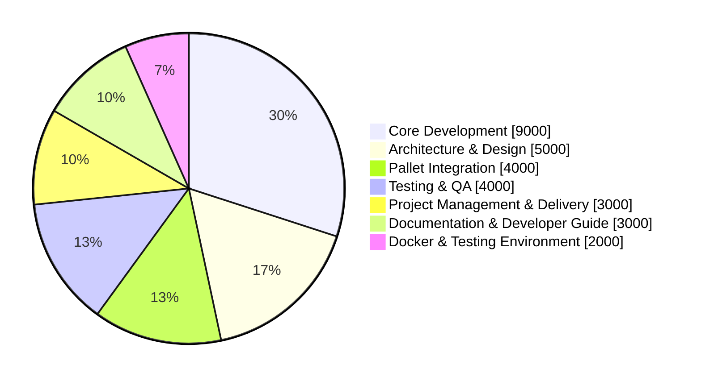

**Justification for Cost:** 

The cost accounts for design and implementation of multiple reusable trait abstractions, integration into a runtime pallet, and a demonstrable Substrate node for validation. Work includes trait modularity, type-safe arithmetic, runtime-agnostic extrinsics, and thorough documentation and testing to ensure maintainability and alignment with later milestones.


### Milestone 2 — `pallet_commitment` (Bonding and Pooling Framework)

* **Estimated Duration:** 5–7 weeks
* **FTE:** 4.5
* **Costs:** 60,000 USD

| **Number** | **Deliverable** | **Specification** |
| :--------: | ------------| ----------|
| **0a.**  | **License** | Apache 2.0 |
|**0b.**  | **Documentation** | Inline Rust documentation for all modules, traits and structures|
| **0c.**  | **Testing and Testing Guide** | - Unit and integration tests validating:<br>   • Bond creation and unbonding<br>   • Pooled and indexed commitments<br>   • State consistency across multiple assets.<br> - Includes a **testing guide** describing validation procedures. |
| **0d.**  | **Docker** | Dockerfile for building and testing the Substrate runtime with `pallet_commitment`. |
|  **1.**   | **Crate: `frame_extras`** | - Defines the **`Commitment`** trait family supporting:<br>   • `Indexes`, `Pools`, and `Variants` for commitment management.<br>   • Asset abstractions `LazyBalance` and `DerivedBalance` for deferred accounting.<br> - Provides default methods and **mock implementations** (`std`) for runtime-agnostic verification. |
| **2.** | **Pallet: `pallet_commitment`**  | - Implements the **`Commitment`** traits to enable digest-based/index/pooled bonding and unbonding.<br> - Introduces unified **lock** and **hold** semantics for assets.<br> - Exposes helper traits for reuse in other pallets requiring similar commitment logic. <br> - Exposes query extrinsics for real-time locked value |
|   **3.**   | **Substrate Node (Commitment Runtime)** | - Minimal Substrate node integrating `pallet_commitment`.<br> - Demonstrates:<br>   • Commitment operations<br>   • Asset bonding and unlocking<br>   • Runtime-level validation flows.<br> - Includes configuration and full build instructions.|

**Effort Allocation:**

| Role | FTE | Duration (weeks) | Estimated Effort (hours) | Responsibility |
| -------| ------- | -------| ----------| -----------------|
| Senior Engineers (2)| 2.0| 5–7 | ~400–560| Core architecture, bonding logic, and trait implementation |
| Junior Developers (2) | 2.0 | 5–7 | ~400–560 | Testing, documentation, and auxiliary development |
| Project Manager | 0.5 | 5–7 | ~100–140 | Coordination and delivery oversight |
| **Total**  | **4.5** | **5–7 weeks** | **~900–1260 hours** | — |

**Expense Allocation:**

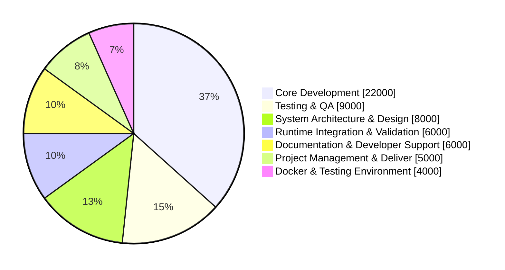

**Justification for Cost:**

This milestone involves a logic-heavy implementation centered on precise arithmetic, asset-instance state management, and invariant-safe transitions. It establishes the generic bonding foundation for future pallets, provides indirect funding operations via indexes and pools, enabling reuse across runtimes. Inline documentation and structured error handling will aid maintainability and audit readiness.

### Milestone 3 — `pallet_authors` (Author Management and Election Models)

* **Estimated Duration:** 5–7 weeks
* **FTE:** 4.5
* **Costs:** 60,000 USD

| **Number** | **Deliverable** | **Specification**|
| :--------: | ----------| ----------|
| **0a.**  | **License**| Apache 2.0|
| **0b.**  | **Documentation** | Inline documentation for all modules, traits, and structures.|
|  **0c.**  | **Testing and Testing Guide** | - Unit and integration tests covering:<br>   • Author lifecycle and election flows<br>   • Funding and collateralization<br>   • Election Plugin models and deterministic fixed-point math operations.<br> - Includes a **testing guide** describing validation procedures.|
| **0d.**  | **Docker** | - Dockerfile for a Substrate node demonstrating:<br>   • Author enrollment and election execution<br>   • Plugin model integration and runtime testing. |
| **1.** | **Crate: `frame_extras`** | - Defines the **`RoleManager`** trait family:<br>   • `FundRoles`, `CompensateRoles`, `RoleProbation`, and `RoleActivity`.<br> - Adds a **generic `ElectionManager`** trait supporting weighted candidate elections.<br> - Provides **deterministic fixed-point arithmetic** utilities (`log`, `sqrt`, etc.) e.g., using the **Newton–Raphson** method for `sqrt`.<br> - Introduces **plugin support** via `PluginModel`, `ModelContext` traits, and user-facing macros `plugin_model!()`, `plugin_trait_types!()`, `plugin_context!()`, `plugin_test!()`.<br> - Includes **ten reference election models** demonstrating extensibility. <br> - Include author lifecycle and external backing extrinsics|
| **2.** | **Pallet: `pallet_authors`**  | - Implements the `RoleManager` and `ElectionManager` traits.<br> - Integrates **funding and collateral logic** internally via `pallet_commitment`.<br> - Provides runtime hooks for author activity tracking, probation, and election rewards. |
| **3.** | **Substrate Node (Demo Runtime)** | - Demonstrates `pallet_authors` integration with:<br>   • Active plugin models<br>   • Fixed-point computations<br>   • Author lifecycle and reward configuration.<br> - Includes runtime setup and configuration examples. |

**Effort Allocation:**

| Role | FTE | Duration (weeks) | Estimated Effort (hours) | Responsibility |
| ----------| ------- | --------| ----------| ---------
| Senior Engineers (2)| 2.0 | 5–7 | ~400–560 | Trait architecture, plugin framework, and fixed-point subsystem |
| Junior Developers (2) | 2.0 | 5–7 | ~400–560 | Testing, plugin model development, and documentation |
| Project Manager | 0.5 | 5–7 | ~100–120 | Coordination, QA, and delivery management |
| **Total** | **4.5** | **5–7 weeks** | **~900–1,240 hours** | —  |

**Expense Allocation:**

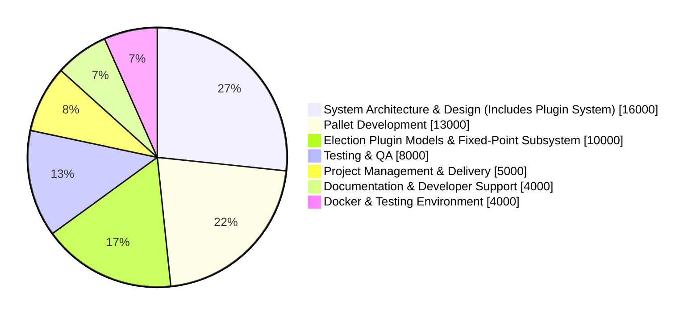

**Justification for Cost:**

This milestone delivers extensible author and election management based on composable traits and reusable plugins. It includes a fixed-point arithmetic subsystem supporting deterministic mathematical operations for election algorithms and broader runtime use. The plugin system is designed for reuse across other pallets requiring stateless pluggable models or deterministic computation support. The combination of heavy-generic abstractions, macro-based plugin architecture, and math-heavy logic justifies the complexity and cost. 

### Milestone 4 — `pallet_solochain` (Session, Reward, Penalty, and Runtime Coordination)

* **Estimated Duration:** 5–6 weeks
* **FTE:** 4.5
* **Costs:** 45,000 USD

| **Number** | **Deliverable** | **Specification** |
| :--------: | ---------| -------------|
| **0a.**  | **License** | Apache 2.0 |
| **0b.**  | **Documentation** | - Inline Rust documentation for all traits, modules, and structures.<br> - Describes session management, author coordination, and reward/penalty logic. |
| **0c.** | **Testing and Testing Guide** | - Comprehensive **unit and integration tests** covering:<br>   • Reward and penalty models<br>   • Cross-pallet interactions (`authors`, `commitment`)<br>   • Session transitions and state consistency<br>   • Offchain worker routines and payload verification.<br> - Includes a detailed **testing guide** describing validation steps. |
| **0d.**  | **Docker** | - Dockerfile for building and running the `pallet_solochain` runtime node.<br> - Demonstrates session flow, author duties, and reward/penalty execution. |
| **1.** | **Crate: `frame_extras`** | - Defines the **`ChainManager`** trait family with subtraits:<br>   • `ElectAuthors`, `ElectionAffidavit`, `RewardAuthors`, and `PenalizeAuthors`.<br> - Unifies **author coordination** within session contexts.<br> - Implements **Reward** and **Penalty** model traits with:<br>   • 10 reward plugins and 10 penalty plugins.<br> - Provides general-purpose trait abstractions for **offchain worker routines**, logging, and node key-value storage.<br> • Uses **fully generic type bounds** for compatibility across runtimes. |
| **2.** | **Pallet: `pallet_solochain`** | - Implements the `ChainManager` trait family.<br> - Integrates with `pallet_authors` and `pallet_commitment` implemented traits for session lifecycle and economic logic.<br> - Implements Substrate’s **`SessionManager`** and **`OnOffenceHandler`** traits.<br> - Exposes **signed and unsigned extrinsics** for author lifecycle management.<br> - Integrates **offchain worker services** with **Ed25519** and **Sr25519** (32 byte) signature support. |
| **3.** | **Substrate Node (Solochain Runtime)** | - Demonstrates full integration of `pallet_solochain` with other M3S pallets.<br> - Validates runtime coordination, author management, and modular reward/penalty mechanisms.<br> - Includes configuration examples and demo-network setup. |

**Effort Allocation:**

| Role | FTE  | Duration (weeks) | Estimated Effort (hours) | Responsibility |
| ----------| ------- | ------| ------------| --------------|
| Senior Engineers (2)  | 2.0 | 5–6 | ~400–480 | Trait architecture, model design, cross-pallet coordination |
| Junior Developers (2) | 2.0 | 5–6 | ~400–480 | Testing, validation, and documentation |
| Project Manager | 0.5 | 5–6 | ~100–120  | Oversight and delivery coordination  |
| **Total** | **4.5** | **5–6 weeks** | **~900–1,080 hours** | —   |


**Expense Allocation:**

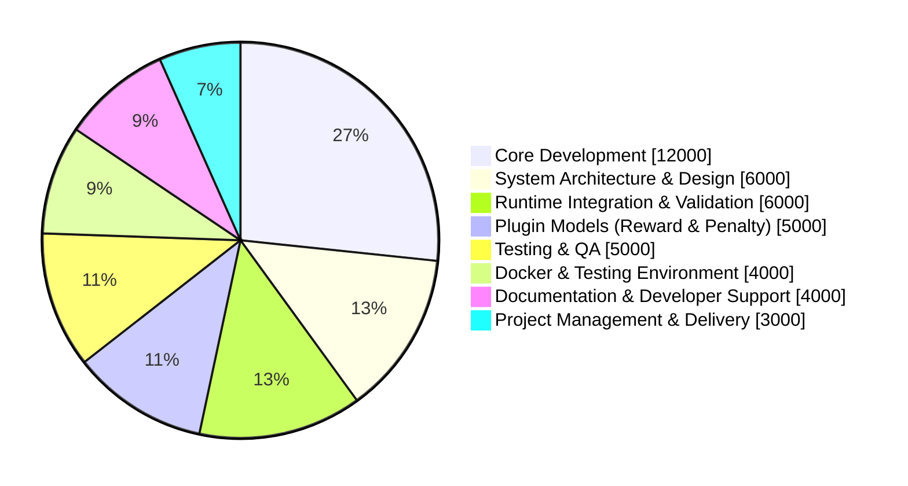

**Justification for Cost:**

This milestone centers on **generic runtime coordination**, where all logic is implemented through **associated types and nested trait bounds**, without any inherent concrete types. This enables runtime-level flexibility, allowing implementers to redefine behavior without modifying core code. The design supports modular reward and penalty composition while maintaining strong type safety and interoperability across pallets. Testing ensures deterministic session simulation, inter-pallet communication, and runtime correctness under variable configurations.

### Milestone 5 — Documentation, Reports, and Integration Deliverables

* **Estimated Duration:** 5–7 weeks
* **FTE:** 3.0
* **Costs:** 30,000 USD

> Note: The deliverable **0b** - **0d** is intentionally left out since it is not qualifiable for this milestone's scope. 

|  Number | Deliverable | Specification |
| :-----: | -------------| ----------------|
| **0a.** | Copyright and Licenses | CC BY 4.0 |
|  **1.** | **M3S Technical Specification Papers** | Finalized design and interface specification documents for each M3S pallet, detailing architecture, dependencies, and integration points. |
|  **2.** | **Testing Report**                     | Consolidated report of unit, integration, and cross-pallet tests, including performance metrics and validation logs. |
|  **3.** | **Integration Guide**                  | Step-by-step manual for assembling and running the full M3S runtime with `pallet_balances`, including validation and reproduction instructions. |
|  **4.** | **M3S Node Template** | A public GitHub Substrate node template pre-integrated with all M3S pallets and `pallet_balances`, derived from the Integration Guide, ready for developer experimentation and extension. |
|  **5.** | **Crates.io Publication** | Release of all M3S pallets and libraries to [crates.io](https://crates.io) under **unstable versioning**, with metadata, inline documentation, and changelogs. |
|  **6.** | **Educational Materials** | Developer-focused educational content — one tutorial per M3S module (four total), plus a runtime assembly walkthrough video. |
|  **7.** | **Technical Blogs** | A comprehensive technical blog posts for all four pallet for developer outreach. |

**Effort Allocation:**

| Role | FTE | Duration (weeks) | Estimated Effort (hours) | Responsibility |
| ---------| ------- | --------| ------------| ----------------|
| Senior Engineers (2)| 1.7| 5–7| ~340–480                 | Technical specifications, validation reports, crate publishing, and integration documentation |
| Junior Developers (2) | 1.0 | 5–7 | ~200–280| Template development, test report consolidation, and documentation support |
| Project Manager| 0.3  | 5–7 | ~60–80                   | Review coordination, editorial supervision, and delivery scheduling |
| **Total** | **3.0** | **5–7 weeks**| **~600–840 hours** | — |

**Expense Allocation:**

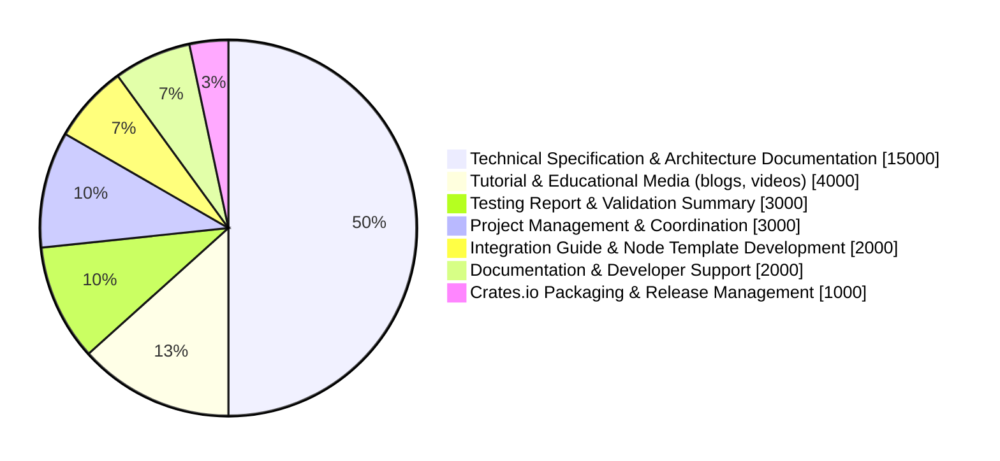

**Justification of Cost:**

Although direct development work is lower, this milestone involves **significant mathematical-specification, documentation, and educational effort** across the entire M3S stack. The cost accounts for detailed technical papers, reproducible testing materials, and **educational resources for each modular entity**, as well as the **M3S Node Template** and **unstable crates.io submissions**. Together, these deliverables enhance clarity, accessibility, and maintainability for ecosystem developers.

## Future Plans

The M3S framework will continue to evolve through long-term maintenance, feature expansion, and community support/collaboration. Upcoming work includes:

* **Generic Multi-Phase Support:** Introduction of multi-phase extrinsics and inherents, indirectly enabling multi-phase election mechanisms within M3S.
* **Runtime Plugin Models:** Development of runtime-level plugin switching (beyond compile-time) to reduce the need for frequent runtime upgrades.
* **ReapSupport Mechanism:** Implementation of a generic mechanism to redirect asset commitment penalties (currently burned) for governance or treasury use.

Ongoing efforts will focus on maintaining and extending **plugin models in `frame_extras`**, with contributions from other chains and developers. The team will also ensure periodic **audits and QA reviews** once the framework reaches production stability.

A future grant will expand on **XP computation logic**, formalizing runtime code ownership and weight-based contribution tracking. In the long term, Auguth Tech will be extending into broader Substrate areas such as **generic transaction-payment models**, **governance primitives**, and **authoring-finality mechanisms**.

## Additional Information :heavy_plus_sign:

**How did you hear about the Grants Program?**: Web3 Foundation Website.

M3S aligns with the objectives outlined in the [W3F Grants Program](https://github.com/w3f/Grants-Program):

* **Technical focus:** Concentrates on runtime-level improvements to Substrate’s staking and bonding architecture.
* **Open source:** Released under Apache 2.0 for integration by any parachain or solo chain.
* **Non-commercial scope:** Focused purely on general-purpose software development, without token sales or business activity.
* **Ecosystem relevance:** Addresses structural rigidity in [`pallet_staking`](https://paritytech.github.io/substrate/master/pallet_staking/index.html) through modular, trait-based design.
* **Prior work:** Builds upon experience from earlier PoCS Grant, which highlighted the need for a general staking framework.
* **Maintenance & deliverables:** Includes documentation, testing, tutorials, and video materials consistent with [W3F deliverable guidelines](https://github.com/w3f/Grants-Program/blob/master/docs/Support%20Docs/milestone-deliverables-guidelines.md).
* **Public value:** Aims to improve developer experience, reduce code duplication, and increase flexibility in staking models across Substrate, Polkadot and Kusama runtimes.

### Expected Questions & Responses

To anticipate feedback typically raised for **framework-level runtime proposals**, this section provides concise, factual answers to recurring technical and procedural questions. The points below reflect our current engineering perspective and practical understanding of **M3S**’s design, implementation, and scope. 

> **Note**: Although some responses include forward-looking statements or concise affirmations of feasibility, this is primarily because a full technical exposition would make the proposal excessively lengthy, not due to any lack of technical depth. Every point referenced here is grounded in verified design work or internal prototypes. If any concern arises regarding these affirmations or their underlying feasibility, detailed confirmations, architectural expressions, or implementation proofs can be provided upon request.


|  **#** | **Reviewer Question** | **Response** |
| :----: | ----------------| ---------------------|
| **1** | *The scope seems theoretical — where is the proof this architecture is needed?* | **M3S’s abstraction layer** directly stems from concrete engineering constraints encountered in our prior **W3F-funded PoCS** project. Each trait family — `Commitment`, `RoleManager`, and `ChainManager` — was designed to address real compatibility gaps observed in Substrate’s `pallet_staking` and **nPoS** architecture. These abstractions are therefore not theoretical but derived from practical, validated design needs. They generalize proven requirement into modular, reusable patterns aligned with Substrate’s ongoing push for deeper runtime composability.|
| **2** | *No public Substrate repos are shown — how can technical ability be verified?*  | The **PoCS grant repository**, already public under W3F, demonstrates our team’s Substrate development capacity and serves as the **technical foundation** for M3S, although PoCS was very-narrower in scope. All storage schemas and state transitions have been **feasibility-checked**, ensuring implementability. Each M3S milestone delivers independently testable **Substrate nodes, Docker environments, and fully documented code**, providing objective evaluation from the first deliverable. If reviewers require **concrete runtime expressions or transition maps**, we are ready to provide them upon request — we’ve intentionally summarized all technical details to maintain clarity until feasibility itself is questioned. |
| **3** | *The total cost seems high for a framework grant.* | The cost reflects the scope: This proposal delivers four fully featured pallets plus a shared trait library and integration node, each with documentation, testing, and runtime validation. Rates are consistent for standard Rust engineers (~$40–70/hour junior-senior). Beyond the `XpSystem`, `Commitment`, and `ChainManager` modules, M3S introduces a **`RoleManager`** layer that can be extended for governance use cases. The **plugin system** is designed not just for M3S but for **any Substrate pallet** requiring stateless logic pluggability, while keeping pallet logic stateful and generic. This high level of generality allows **future pallets to be composed more easily**, reducing long-term engineering costs and expanding runtime reusability. The initial cost is higher because this approach demands **advanced Rust design and trait specialization**, as well as close alignment with Substrate’s evolving modular framework model. |
| **4** | *Does this duplicate `pallet_staking`, `nomination_pools`, or `delegated_staking`?* | No. **M3S** does not duplicate these pallets — it **abstracts** the bonding, election, and authoring layers that those implementations currently hardcode. Each M3S pallet derives from a distinct trait family (`Commitment`, `RoleManager`, `ChainManager`), and all are **universally reusable** by other pallets and runtimes. For example, while Substrate’s `pallet_staking` ties bonding strictly to validators, the **`Commitment`** abstraction generalizes this into a **bonding primitive for any runtime use case** — governance roles, collateral mechanisms, contribution rewards, and many more. M3S therefore transforms staking-specific logic into **modular, general-purpose runtime components**, enabling developers to build flexible and composable staking-like systems without inheriting the complexity or constraints of nPoS or any specific-staking-model. |
| **5** | *How will the framework be maintained after the grant ends?* | The team commits to **12 months of active maintenance** after delivery, including semantic versioning, documentation updates, and open GitHub access. Because M3S is **trait-based and plugin-driven**, external developers can easily extend or patch functionality without touching the core pallets. We will maintain the **public `frame_extras` plugin registry module**, encourage other-chain developers to contribute new plugin models, and provide direct support for their integration as well. Moreover, the proposal’s **Future Plans section** already defines concrete evolution paths — such as runtime plugin switching, multi-phase extrinsics, and generalized `ReapSupport` — all of which enhance M3S’s longevity by **reducing runtime-upgrade frequency** and **opening opportunities for continuous feature growth**. Together, these mechanisms ensure that M3S remains sustainable, community-extendable, and aligned with Substrate’s long-term direction. |
| **6** | *Why introduce an “XP” system that’s not standard in staking?* | The **XP system** is not an alternative to token staking but a **generic metric abstraction** demonstrating M3S’s ability to handle **non-monetary commitments** such as reputation, contribution, or participation scores. It reflects our long-term direction toward a **token-less public blockchain**, where staking and bonding are based on measurable activity rather than currency. At the same time, M3S remains fully **compatible with fungible tokens** through its `Commitment` layer and support for the standard `pallet_balances` model. XP therefore functions as a **validation case** showing that M3S can unify both **token-based and token-less economies** under one framework. Rather than deviating from staking standards, it **extends their applicability**, proving that Substrate runtimes can share a single, reusable bonding architecture across diverse economic and governance models. |
| **7** | *A plugin and macro system sounds risky for consensus-critical logic — how is safety guaranteed?* | The M3S plugin system is entirely **static and compile-time safe**. All plugins are **monomorphized generic code**, expanded deterministically through declarative macros (e.g., `plugin_model!`) into plain, typed Rust — similar in principle to existing FRAME macros. There is **no dynamic linking, runtime code injection, or unsafe behavior**. Rust’s strict type system and monomorphization ensure full compile-time verification of every plugin instance. The system is currently **declarative**, but if future flexibility requires procedural macros, they will be introduced without breaking syntax or backward compatibility. Because the plugins rely on **generic heavy implementations**, only advanced developers can implement them, and all logic remains **statically checked, auditable, and deterministic**, preserving consensus safety while improving modularity. |
| **8** | *Could M3S fragment the ecosystem by introducing another staking model?* | No — M3S aims to **reduce fragmentation** by replacing the current pattern of multiple, isolated forks of `pallet_staking` with a **unified, trait-based framework**. Instead of embedding a single staking model, M3S externalizes logic through **plugins**, allowing different staking or bonding strategies to coexist without forking core pallets. These plugins can be contributed to a **shared model registry**, encouraging open-source reuse and ecosystem-wide standardization. This structure gives **runtime constructors**, the freedom to select staking behavior — much like choosing an algorithm from a library rather than a hard-coded one. The result is greater **neutrality, interoperability, and maintainability** across Substrate-based chains, ensuring M3S acts as a stabilizing, not fragmenting, influence. |
| **9** | *Why not submit smaller, per-pallet grants instead of one integrated proposal?* | The framework’s purpose is to demonstrate **coherent staking architecture** rather than isolated modules. Separating pallets into individual grants would fragment the design and delay validation of the **cross-pallet relationships** that define M3S’s core value — namely, the interaction between `Commitment`, `RoleManager`, and `ChainManager`, forming a broader security-via-risking layer within Substrate. Moreover, our forthcoming proposals will follow a similar **multi-pallet, generic-solution pattern**. A unified submission therefore maintains architectural integrity, accelerates delivery of future framework components, and ensures consistent engineering and testing standards. The final milestone will also include **formal specification documents**, providing mathematical and design-level validation after the full engineering phase. This approach results in a denser but more coherent grant structure aligned with our long-term R&D trajectory. |
| **10** | *Does introducing so many layers (traits, macros, plugins) risk over-engineering or slowing runtime performance?* | **Performance impact is minimal.** All trait layers and plugins in M3S are **compile-time constructs** — monomorphized generics expanded into static Rust code. Unused features remain **fully optimized out** by the compiler since the design is opt-in at the trait level. There are **no runtime dispatch costs, dynamic linking, or inline macro overheads** involved. While some complex plugin models may use **fixed-point arithmetic**, any resulting overhead is deterministic and expected for precision-sensitive reward or election logic. In our methodology, **correctness and invariant safety** take precedence over micro-optimization, but we plan to include a **post-audit efficiency review and benchmarking phase** once the framework is complete. If needed, future improvements — such as inline-optimized arithmetic or specialized plugin models — can be introduced without migration, as the system is entirely **decoupled and non-concrete in type design**. |
| **11** | *If every chain can define its own plugin logic, how do you prevent logic divergence or security inconsistencies across chains?* | M3S treats plugin logic as **runtime-defined but verifiable**. While individual chains can create their own plugins, we will maintain a **curated set of audited models** within the public `frame_extras` crate. Developers can validate their custom plugins using the provided **`plugin_test!()` macro**, which enables isolated, reproducible unit tests. Chains that complete independent audits can submit their verified plugins as pull requests to the registry, promoting shared review, reuse, and ecosystem consistency. This approach preserves developer freedom while encouraging **standardization through community-audited models**, ensuring safety and interoperability across runtimes. |
| **12** | *The proposal emphasizes modularity, but how will this interact with Substrate’s runtime upgrade system?* | M3S fully aligns with Substrate’s standard upgrade and migration process. All pallets expose a `Config` trait where plugin and context types are resolved, so upgrades behave identically to existing FRAME modules. To minimize upgrade frequency, constants are limited to structural bounds (e.g., `BoundedVec` limits), while all logic-affecting parameters are **stored in runtime-configurable `StorageValue`s**, modifiable through **root or governance-controlled extrinsics**. This allows safe behavior changes without redeploying or migrating state. The team also plans to explore **runtime plugin swapping**—restricted to a **compile-time–whitelisted set** for safety—to enable selective logic replacement without full upgrades. In practice, M3S should **not increase upgrade complexity**, as its configuration model follows FRAME conventions while providing more flexibility through runtime-adjustable storage. |
| **13** | *You mention governance extensibility via RoleManager — does this overlap with OpenGov or risk introducing a second governance model?* | The `RoleManager` abstraction can indeed be **extended for governance systems**, as it defines a general-purpose runtime role lifecycle that any pallet may adopt — including those managing referenda or voting. However, its design scope differs fundamentally from OpenGov. Whereas OpenGov governs **decision-making and enactment**, `RoleManager` focuses on **role definition, lifecycle control, and responsibility mapping** within runtimes. In future grants, we may explore governance primitives built upon `RoleManager`, but they will remain **structurally distinct** from OpenGov, serving as **alternative or complementary layers** rather than replacements. This ensures both coexistence and interoperability without affecting existing OpenGov processes. |
| **14** | *How are testing and auditability handled for such a highly generic framework?* | Each pallet and trait implementation includes **comprehensive unit tests** covering all code paths, including both success and failure outcomes. To verify that all generic components behave deterministically, every generic type and trait bound is **resolved through mock runtimes** configured specifically for testing. This ensures that all combinations of associated types, plugins, and runtime integrations can be compiled, executed, and validated under controlled conditions. **Integration tests** further verify end-to-end workflows — for example, multiple users committing to a digest, distributing rewards and penalties, and performing withdrawals with accurately updated state. A **dedicated runtime-test pallet** is also planned to check cross-pallet safety and interoperability before external audits; while not a formal milestone deliverable, it may be included if time allows as part of our commitment to reliability. Finally, **all invariants are implemented as explicit pallet `Error` variants**, allowing failures to be triggered and asserted in tests, ensuring that invalid transitions are caught deterministically and simplifying external audit verification. |
| **15** | *Will other developers actually adopt this, or will it remain too complex for average Substrate teams?* | M3S is designed to be **accessible at multiple levels of complexity**. For most Substrate teams — particularly those building PoA, standalone, or parameterized staking networks — adoption will be straightforward: they can import ready-made plugin models from the **`frame_extras`** registry, configure pallet types like any standard FRAME module, and set genesis values without custom logic. However, teams developing **custom runtime logic**, such as defining their own plugin models or implementing trait interfaces directly, will require **advanced Substrate and Rust expertise**. This is by design — M3S serves both as a reusable framework and a low-level foundation for specialized runtime behavior. For instance, parachains can directly use `pallet_commitment` and `pallet_authors`, whereas solochains depend on the `SessionManager` integrated with consensus layers like BABE or Aura, making `pallet_solochain` unsuitable for parachains. In such cases, parachains can implement their own `ChainManager` to define affidavit-based collator elections, reward logic, or penalties aligned with Polkadot’s shared security model. The framework thus prioritizes **flexibility and correctness over simplicity**, while comprehensive documentation and reference plugin models are planned to ease onboarding for most development teams. |
| **16** | *How are compatibility and migration handled for existing pallets that already use `pallet_staking` or other staking derivatives?* | Because M3S defines abstractions at a different structural level than `pallet_staking` or its derivatives, **direct migration is not automatic**. The internal logic and storage models differ, as M3S separates bonding, role, and chain management layers into independent modules. However, a **custom `on_runtime_upgrade` hook** can be written to perform a controlled, multi-block migration procedure from `pallet_staking` to `pallet_commitment` if a chain explicitly wishes to consolidate or reduce code duplication. We don’t anticipate this as a common path, but it remains technically feasible. In general, M3S is designed to **coexist alongside existing staking systems**, allowing chains to adopt it gradually or for specific use cases without disrupting existing validator or nomination mechanics. |
| **17** | *Can the XP-based or token-less staking approach integrate with Polkadot or parachain consensus mechanisms?* | Yes — M3S is fully compatible with Polkadot-style consensus frameworks. The current `pallet_xp` only defines APIs for other pallets or runtime modules to assign and manage XP points logically; it does not yet prescribe how XP is earned. Future grant proposals will extend this toward concrete XP accumulation models, similar in spirit to our earlier PoCS project where contract execution weights served as XP metrics. For now, M3S treats XP and token-based commitments as parallel, interoperable primitives — both can coexist within the same runtime. Parachains may therefore integrate M3S using either model, provided their XP metric aligns with their consensus or economic security goals. |
| **18** | *Given the project’s ambition, what prevents scope creep or delays during multi-pallet development?* | The timeline has been structured realistically around ongoing work and early prototypes. Each milestone includes defined minimum and maximum completion windows to accommodate the inherent unpredictability of highly generic Rust development, particularly where complex trait bounds and macro expansions are involved. We recognize that generic-to-concrete type resolution can expose late compiler or bound mismatches — this is expected and already factored in. Additional time is reserved for implementing a **FixedPoint arithmetic subsystem**, required for deterministic decimal precision within plugin and election logic. If any early implementation later proves overly concrete, it will be generalized systematically rather than patched, maintaining architectural coherence. While the timeline may appear condensed, it reflects the fact that a substantial portion of groundwork has already been completed, and the remaining tasks are scoped precisely to fit within the proposed timeframe without compromising quality or correctness. |
| **19** | *Does the heavy reliance on generics and trait families risk creating steep compile times or difficult-to-debug runtime errors? How will you mitigate developer friction?* | We acknowledge that extensive use of generics and macros naturally increases compile times, as Rust must monomorphize all type paths before linking. However, only the **concrete plugin models** selected by each pallet are actually monomorphized, keeping final binaries efficient. Compile overhead will mainly come from the **frame_extras registry**, which exposes multiple plugin models, not from runtime execution itself — everything remains statically linked and deterministic. Debugging complexity is also expected at compile time rather than runtime, since the framework eliminates dynamic behavior. Declarative macros are used intentionally to preserve transparency and simplify stack traces; while procedural macros could improve diagnostics (e.g., span errors), they would unnecessarily expand scope at this stage. If the ecosystem demands it later, we may evolve the macros to procedural forms without changing syntax, ensuring backward compatibility. For now, clear documentation and example placements mitigate friction, making compile-time debugging predictable even in advanced configurations. |
| **20** | *Could the introduction of new abstraction layers (e.g., Commitment, RoleManager) make audits or runtime security reviews more complex or expensive?* | While M3S introduces multiple abstraction layers, each pallet (`Commitment`, `RoleManager`, `ChainManager`) is **self-contained and independently auditable**, following the same isolation principles as standard FRAME pallets. This modularity simplifies targeted audits compared to tightly coupled systems like `pallet_staking`, which require holistic review. Each pallet defines explicit invariants as `Error` variants, enabling traceable validation during both testing and external audits. Furthermore, M3S operates under a **lazy evaluation model** — no eager state reads or prefetching are required. Components such as commitment accounting, election affidavits, and session transitions execute only when invoked, allowing validators and runtime actors to reuse existing state safely between rounds. This ensures predictable state flow, bounded audit scope, and reduced review overhead without sacrificing runtime safety or determinism. |
| **21** | *Is there a risk that M3S’s generalized approach dilutes Substrate’s philosophy of minimal, composable pallets by introducing too much indirection?* | M3S follows the same design philosophy that underpins Substrate — modularity, composability, and minimal duplication. The added abstraction layers serve to **reduce repetition** across staking-like systems rather than to introduce complexity for its own sake. For instance, while `pallet_commitment` may appear broad in scope, its purpose is to consolidate bonding and accounting primitives so that other pallets need not redefine their own storage or logic. The framework maintains **clear separation of concerns** and relies on standard FRAME patterns (traits, macros, and config types). In essence, M3S extends Substrate’s modular ethos to a higher level of reuse, keeping the ecosystem consistent while enabling broader applicability. |
| **22** | *Given that M3S depends heavily on compile-time macros and trait specialization, how will you handle compiler version changes or breaking updates in Rust nightly or Substrate versions?* | M3S does not rely on Nightly, unstable Rust features, or any targeted compilation flags. It uses only stable Rust generics and deterministic declarative macro expansion, similar to `frame-support` and other `no_std` FRAME crates, ensuring predictable and compiler-stable builds. In case of Substrate version changes, M3S will remain largely unaffected since its abstractions depend on standard Rust patterns rather than tightly coupled internal APIs. However, if major framework updates occur, our **node-building specifications or runtime composition flow** may require adjustments to align with new Substrate standards. If Substrate introduces a major structural change — such as the earlier transition from `construct_runtime!` to FRAME proc macros — we will ensure backward syntax compatibility and evolve our work accordingly. Overall, the framework is designed for long-term compiler and version resilience with minimal maintenance overhead. |
| **23** | *What governance or curation model will manage inclusion of third-party plugin contributions in the public `frame_extras` registry? Who reviews and merges them?* | The `frame_extras` registry will follow a **tiered internal review process**. All third-party plugin submissions will first be validated by the **maintenance team** for structure, compilation, and test coverage. Once validated, they will undergo a **technical review** by senior developers from the M3S core team — the same team responsible for the framework’s design and security model. Only plugins that meet correctness, safety, and documentation standards will be merged into the main registry. This process ensures a balance between **community contribution** and **curated quality control**, minimizing risks of unsafe or inconsistent logic inclusion. |
| **24** | *How will M3S integrate into existing Substrate toolchains (Polkadot-JS, Subxt, etc.) without requiring custom API bindings?* | Some **custom API bindings** will be required to fully support the user experience and expose the new M3S primitives through existing Substrate toolchains. Our team primarily focuses on **R&D and core runtime logic**, but we plan to either develop these bindings in subsequent phases or seek **W3F guidance on drafting an RFP** to standardize such interfaces. In the meantime, we will assist developers who wish to extend Polkadot-JS or Subxt to interact with M3S components, ensuring that eventual integration remains aligned with existing Substrate SDK patterns and does not fragment developer tooling. |
| **25** | *What is your post-grant evaluation strategy? How will success be measured beyond code completion — e.g., adoption, forks, or use in live runtimes?* | Post-grant evaluation will prioritize **practical adoption and developer engagement** rather than code delivery alone. After initial audits and once the experimental flag is lifted, we will focus on **integrating M3S into live test networks** to validate stability and interoperability. In parallel, we plan to **collaborate with existing Substrate chains and developer communities** through documentation, workshops, and open technical sessions to promote understanding of the M3S architecture. Success metrics will include adoption in external runtimes, developer contributions to the `frame_extras` plugin registry, and integrations demonstrating real-world utility. |
| **26** | *Who constitutes the M3S core team post-grant, and what governance model ensures continuity if maintainers leave?* | The M3S core team will continue maintaining the framework under its current organizational structure. In the unlikely event that a key maintainer leaves, internal succession planning ensures a qualified replacement is assigned to preserve project continuity. As an open-source initiative, M3S is also designed for **community resilience** — the repository and documentation will remain public, allowing forks or community maintenance if required. Given its general-purpose scope and strong technical foundation, long-term sustainability is expected through both **organizational continuity** and **open contribution pathways**. |

### Final Note

This proposal intentionally condenses a broad technical scope into a concise submission, presenting all essential primitives and design elements in a compact, Rust–Substrate–centric format for technical review and evaluation. It also includes clarifications on non-technical aspects such as work allocation, expense distribution, and rationale behind key strategic choices, etc, ensuring transparency and addressing common evaluation considerations beyond the technical domain.

> **Fun Fact:** The acronym **M3S** stands for *“Modular Substrate Staking Stack”*, where the “3” represents its three foundational pallets — `pallet_commitment`, `pallet_authors`, and `pallet_solochain` — aligned with the respective three trait families `Commitment`, `RoleManager`, and `ChainManager`. The three **“S”s** derive from *“Modular **S**ubstrate **S**taking **S**tack”* and are conceptually unified into a single “S” in **M3S**, symbolizing the framework’s **cohesive yet layered modular architecture** via the Substrate runtime environment.

We look forward to delivering the M3S Stack to enable flexible staking and an XP-based incentive model, helping broaden adoption and developer engagement across Substrate runtimes.
