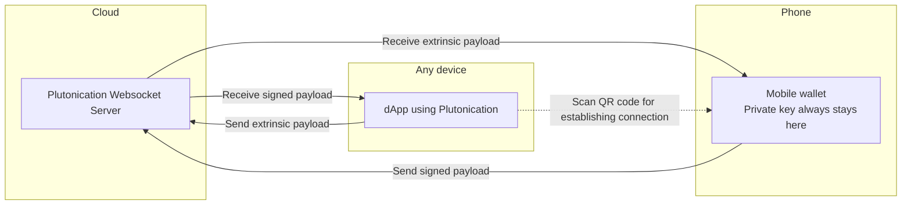

# Plutonication

- **Team Name:** Plutonication
- **Payment Address:** 1WmPE1X9Ykpb7QcVamPtUSRjEZy2GMDeTm5N72DyXYiqMCo (USDT)
- **[Level](https://github.com/w3f/Grants-Program/tree/master#level_slider-levels):** 2

## Project Overview :page_facing_up:

### Overview

Please provide the following:

#### If the name of your project is not descriptive, a tag line (one sentence summary).

- Communications protocol that enables seamless interactions between dApps and wallets across all platforms.

#### A brief description of your project.

- Plutonication allows users to connect PlutoWallet to other dApps seamlessly on any platforms, accross multiple codebases.
DApp just generates a QR code and once it is scanned in the wallet, they will pair and the wallet will be able to receive transaction requests from the dApp. It works on the same principle as WalletConnect protocol.

- You can see a short (90 sec) demo here: https://youtu.be/hw2B8-sBc9A?si=O8MiWa0Wq1jxfZdr

#### An indication of how your project relates to / integrates into Substrate / Polkadot / Kusama.

- Currently, the only way to connect your mobile wallet to other dApps is to use Wallet connect protocol, or a very clunky Polkadot Vault (Parity signer).

- We think, we will be good competitors to WalletConnect and that we will do will better than them!

- Our Plutonication Extension already works with most of the web dApps as supposed to WalletConnect, which is implemented into only a handful of dApps.

- WalletConnect is also only available in javascript and we would like to expand it further to other programming languages.

- C# is a very popular programming language for games and there have not been much focus on it in the Polkadot Ecosystem appart from Ajuna Network and their excellent Substrate.NetApi. We are dirrectly communicating with Ajuna developers to help better coordinate the Substrate.NetApi development and Plutonication, so that their are dirrectly compatible with each other.

#### An indication of why your team is interested in creating this project.

- We have been very pationate about Plutonication since the beginning. We have noticed the lack of WalletConnect protocol before it was available.

- We have been working on Plutonication in our free time to prove the concepts are possible.

- We have also landed a second place at Polkadot Global Series: Europe edition 2023 hackathon in Web3 and Tooling category.

### Project Details

We expect the teams to already have a solid idea about your project's expected final state. Therefore, we ask the teams to submit (where relevant):

#### Data models / API specifications of the core functionality

Native Plutonication:



Plutonication on existing polkadot.js apps: 
```mermaid
flowchart LR

subgraph Cloud
S[Plutonication Websocket Server]
end

subgraph Web
D[dApp using Polkadot.js] ~~~ E[Plutonication Extension]
E -. Connection via Polkadot.js extension .- D
end

subgraph Phone
W["Mobile wallet
    Private key always stays here"]
end

S -- Receive signed payload --> E
E -- Send extrinsic payload --> S

S -- Receive extrinsic payload --> W
W -- Send signed payload --> S

E -. Scan QR code for establishing connection .-> W;
```

#### An overview of the technology stack to be used

1) Plutonication server (Python): Flask, Flask-SocketIO
2) Mobile Wallet: https://github.com/rostislavLitovkin/plutowallet
3) Plutonication Native (C#): SocketIOClient, Substrate.NetApi
4) Plutonication Native (TS): socket.io-client, Polkadot.js
5) Plutonication Extension: socket.io-client, Polkadot.js extension

#### Documentation of core components, protocols, architecture, etc. to be deployed

##### Plutonication Server
- Used for reliable establishing of connection.
- Passes payloads between Wallets and dApps.

##### Mobile Wallet
- Has access to the private key
- signs the payloads and sends them back to the dApp.
- Never exposes the private key

##### dApp
- needs to have access to either: Plutonication Native / Plutonication Extension

##### Plutonication Native
- A simple package that allows the dApp get connected with the Mobile Wallet.
- Connects the dApp with the Plutonication server.
- Helps to generate a QR code for the Wallet to establish the connection.

##### Plutonication Extension
- a polkadot.js extension that works with any existing dApp that supports polkadot.js extension.
- Connects the dApp with the Plutonication server.
- Generate a QR code for the Wallet to establish the connection.

#### PoC/MVP or other relevant prior work or research on the topic
- Second place at Polkadot Global Series: Europe edition 2023 hackathon in Web3 and Tooling category.
- https://github.com/cisar2218/Plutonication
- Plutonication is integrated to: https://github.com/rostislavLitovkin/plutowallet
- https://github.com/rostislavLitovkin/plutonicationextension

#### What your project is _not_ or will _not_ provide or implement

- Any improvements to PlutoWallet appart from the things needed for Plutonication to work in the PlutoWallet.

- Although it is planned support Kotlin and Swift programming languages as well, it is not part of this grant proposal.

- We are certainly willing to make PRs to other popular dApps to utilise Plutonication, it is also not part of this grant proposal. We would be willing to do a follow-up grant or get a treasury funding to make the PRs.

### Ecosystem Fit

Help us locate your project in the Polkadot/Substrate/Kusama landscape and what problems it tries to solve by answering each of these questions:

#### Where and how does your project fit into the ecosystem?

- Our project is comparable to WalletConnect, which was also our inspiration.

##### [WalletConnect](https://walletconnect.com/)
- When we started making our first prototypes in February, WalletConnect was not available in the Polkadot Ecosystem yet.
Even thought they have taken a lot of time and had a lot more experience then us, they were unable to make quick and elegant deliveries.
WalletConnect still is not supported by most of the dApps. We think we can do better. Actually, we already did.

- We made a Plutonication Extension, which already allows you to interact with existing dApps, even though they have not implemented the Plutonication standard directly. This can be a perfect middle ground during the transition of popularizing the Plutonication. Even if the user wanted to use a new niche dApp, they can do so with Plutonication.

- Wallet connect is also only supported in javascript. We want to make Plutonication available in more languages, including a very popular C# language, which is mostly used for game development. We will make web3 gaming possible on game consoles, thanks to the Plutonication.

- WalletConnect's server solution (also known as WalletConnect cloud) is not opensourced. We want to be open to everybody and fully opensourced.

##### [SubConnect](https://github.com/Koniverse/SubConnect)
- This is a great aggregation of wallets. This certainly improves the UX and simplifies the development for developers. However, it is not trying to do the same thing as Plutonication. Plutonication tries to achieve connection between 2 different platforms (like mobile wallet on Android and dApp on web on Windows).

- It may be certainly a good idea to talk to SubWallet to implement Plutonication into the SubConnect solution. 

##### [Tesseract](https://github.com/tesseract-one/Tesseract.rs)

- Tesseract is a great solution for connecting a wallet and a dApp together on a single device. However, Plutonication allows wallets and dApps to be connected across different devices.

##### [@talismn/connect](https://github.com/TalismanSociety/talisman-connect)

- This is similar to SubConnect. Once again, we try to solve a completely different problem.

#### Who is your target audience (parachain/dapp/wallet/UI developers, designers, your own user base, some dapp's userbase, yourself)?

- dApps developers - To integrate the Plutonication in their dApps. We will ensure that the developers will receive a good documentation.

- Wallet developers - We are welcoming other wallets to use the Plutonication. We would like to help them make this possible.

- Users - In the end, it will be mainly used by mobile focused users. They will be able to interact with web3 apps on unusual platforms, like game consoles, smartwatches ...

#### What need(s) does your project meet?

- You are unable securely interact with dApps on gaming consoles, smartwatches and other unusual platforms. Without Plutonication, you would have to expose your private key, which is very unsafe.

- You can also interact with existing web dApps with your mobile wallet. Again, you do not need to expose your private key to multiple places (in this case browser extension wallet), which would be very unsafe.

#### Are there any other projects similar to yours in the Substrate / Polkadot / Kusama ecosystem?

- Yes, WalletConnect.

#### If so, how is your project different?

- We support more programming languages. We also have a browser extension that enables Plutonication on existing dApps.

- WalletConnect also mainly focuses on Ethereum ecosystem. We are focusing only on Polkadot.    

## Team :busts_in_silhouette:

### Team members

#### Name of team leader: 

Rostislav Litovkin

#### Names of team members:

Valentina Gómez

Dušan Jánsky

### Contact

- **Contact Name:** Rostislav Litovkin
- **Contact Email:** rostislavlitovkin@gmail.com
- **Website:** https://github.com/cisar2218/Plutonication

### Legal Structure

- **Registered Address:** Píškova 1946/12, 155 00, Prague, Czech republic
- **Registered Legal Entity:** None

### Team's experience

#### [Rostislav Litovkin](http://rostislavlitovkin.pythonanywhere.com/aboutme)
- Alumnus at Polkadot Blockchain Academy 2023 in Berkeley
- Experienced .net MAUI developer, e.g.:
   - [Galaxy Logic Game](https://github.com/RostislavLitovkin/galaxylogicgamemaui) (successful game for watches and mobiles, 50k+ downloads)
- Frontend developer at [Calamar explorer](https://calamar.app/)
- Successful student at Polkadot DevCamp #2
- Successful student at [Solana Summer School](https://ackeeblockchain.com/school-of-solana)
- Polkadot Global Series 2023 (Europe) - second place
- Audience choice prize at EthPrague 2023

#### Valentina Gómez
- Alumnus at Polkadot Blockchain Academy 2023 - Berkeley.
- Full stack web developer in TeamClass.
- Financial Engineer

#### Dušan Jánsky
- Alumnus at Polkadot Blockchain Academy 2023 in Berkeley
- Student at Faculty of Electrical Engineering Czech Technical University in Prague - Opens Informatics (specialization in computer games and computer graphics)
- Fullstack developer at [Universal Scientific Technologies](https://www.ust.cz/)
- Polkadot Global Series 2023 (Europe) - second place

#### If anyone on your team has applied for a grant at the Web3 Foundation previously, please list the name of the project and legal entity here.

Rostislav Litovkin helped with **Calamar.app - TopMonks s.r.o**

### Team Code Repos

- https://github.com/ThunderFly-aerospace/thumby
- https://github.com/topmonks/calamar
- https://github.com/RostislavLitovkin/GalaxyLogicGameMAUI
- https://github.com/RostislavLitovkin/Uniquery.Net

#### Please also provide the GitHub accounts of all team members. If they contain no activity, references to projects hosted elsewhere or live are also fine.

- https://github.com/cisar2218
- https://github.com/rostislavlitovkin

### Team LinkedIn Profiles (if available)

- https://www.linkedin.com/in/dusan-jansky-6aab69239/
- https://www.linkedin.com/in/valentinaga1/

## Development Status :open_book:

If you've already started implementing your project or it is part of a larger repository, please provide a link and a description of the code here. In any case, please provide some documentation on the research and other work you have conducted before applying. This could be:

- The idea was already tested by WalletConnect. Now, we are expanding it further in the Polkadot ecosystem.

- We have already made working MVPs which can be found here:

    - https://github.com/cisar2218/Plutonication

    - https://github.com/rostislavLitovkin/plutowallet

    - https://github.com/rostislavLitovkin/plutonicationextension

## Development Roadmap :nut_and_bolt:

This section should break the development roadmap down into milestones and deliverables. To assist you in defining it, we have created a document with examples for some grant categories [here](../docs/Support%20Docs/grant_guidelines_per_category.md). Since these will be part of the agreement, it helps to describe _the functionality we should expect in as much detail as possible_, plus how we can verify and test that functionality. Whenever milestones are delivered, we refer to this document to ensure that everything has been delivered as expected.

Below we provide an **example roadmap**. In the descriptions, it should be clear how your project is related to Substrate, Kusama or Polkadot. We _recommend_ that teams structure their roadmap as 1 milestone ≈ 1 month.

> :exclamation: If any of your deliverables is based on somebody else's work, make sure you work and publish _under the terms of the license_ of the respective project and that you **highlight this fact in your milestone documentation** and in the source code if applicable! **Projects that submit other people's work without proper attribution will be immediately terminated.**

### Overview

- **Total Estimated Duration:** 2 months
- **Full-Time Equivalent (FTE):**  0.83 FTE
- **Total Costs:** 25,000 USD

### Milestone 1 Plutonication Server (Python: Flask)

- **Estimated Duration:** 1 month
- **FTE:**  0.33
- **Costs:** 5,000 USD

| Number | Deliverable | Specification |
| -----: | ----------- | ------------- |
| **0a.** | License | MIT |
| **0b.** | Documentation | We will provide both **in code documentation for individual methods**. We will also provide a tutorial on how to run the Plutonication Server locally and in cloud. |
| **0c.** | Testing and Testing Guide | ~~All of the functions will be end-to-end tested with a sample dApp written in typescript (with Plutonication and Polkadot.js api) and a sample Wallet (PlutoWallet)~~ Unit tests for all of the functions |
| **0d.** | Docker | We will provide a Dockerfile(s) that can be used to test all the functionality delivered with this milestone and for running the server in production. |
| 1. | PlutonicationServerFlask | A Python server with Flask and Flask-SocketIO used for establishing a stable websocket connection between the dApp and Wallet. Use of server is crucial for reliable establishing of connection. |
| 1a. | create_room | dApp creates room |
| 1b. | pubkey | Sends an account address (SS58 encoded) from wallet to dApp |
| 1c. | sign_payload | dApp requests an extrinsic payload signature |
| 1d. | sign_raw | dApp requests a raw message signature |
| 1e. | payload_signature | wallet provides an extrinsic payload signature |
| 1f. | raw_signature | wallet provides a raw message signature |
| 2. | database requirements | none |

### Milestone 2 Plutonication Typescript version

- **Estimated Duration:** 1 month
- **FTE:**  0.5
- **Costs:** 7500 USD

| Number | Deliverable | Specification |
| -----: | ----------- | ------------- |
| **0a.** | License | MIT |
| **0b.** | Documentation | We will provide both **in code documentation for individual methods** and a **tutorial** explaining how to integrate Plutonication into a javascript/typescript dApp. |
| **0c.** | Testing and Testing Guide | All of the functions will be end-to-end tested with a sample dApp written in typescript (with Plutonication and Polkadot.js api) and a sample Wallet (PlutoWallet) |
| **0d.** | Docker | We will provide a Dockerfile for a sample dApp that can be used to test all the functionality delivered with this milestone. |
| 1. | PlutonicationDAppClient | This would be a series of methods tailored for use with dApps. We will make sure that it is compatible with polkadot.js api |
| 1a. | Initialize(AccessCredentials ac) -> void | Method used for initializing the PlutonicationDAppClient |
| 1b. | ReceiveAddress() -> Address | Handles the receiving of SS58 encoded address |
| 1c. | SendPayloadAsync(Payload payload) -> void | Method used for requesting an extrinsic payload sign |
| 1d. | SendRawAsync(Bytes rawMessage) -> void | Method used for requesting a raw message sign |
| 2. | PlutonicationWalletClient | This would be a series of methods tailored for use with wallets. |
| 2a. | SendAddress(Address address) -> void | Sends the SS58 encoded address of the account in the wallet |
| 2b. | SendSignedPayloadAsync(Payload signedPayload) -> void | Method used for sending a signed extrinsic payload back to the dApp. The signed extrinsic payload will then be added to the extrinsic and submitted to chain. |
| 2c. | SendSignedRawAsync(bytes signedRaw) -> void | Method used for sending a signed raw message back to the dApp. |
| 3. | QR code pop-up | We will provide a function that would embed an HTML qr code popup into a dApp. The QR code is used for establishing a connection. |
| 4. | NPM package | We will provide an NPM package, which is commonly used it javascript/typescript development. |
| 5. | Sample dApp | We will make a sample typescript console dApp (with Plutonication and Polkadot.js api) published to a public github repo. |

### Milestone 3 Plutonication C# version

- **Estimated duration:** 1 month
- **FTE:**  0.5
- **Costs:** 7500 USD

> :exclamation: **The default deliverables 0a-0d below are mandatory for all milestones**, and deliverable 0e at least for the last one. 

| Number | Deliverable | Specification |
| -----: | ----------- | ------------- |
| **0a.** | License | MIT |
| **0b.** | Documentation | We will provide both **in code documentation for individual methods** and a **tutorial** explaining how to integrate Plutonication into a c# dApp. |
| **0c.** | Testing and Testing Guide | All of the functions will be end-to-end tested with a sample dApp written in c# (with Plutonication and Substrate.NetApi) and a sample Wallet (PlutoWallet) |
| **0d.** | Docker | We will provide a Dockerfile for a sample dApp that can be used to test all the functionality delivered with this milestone. |
| 1. | PlutonicationDAppClient | This would be a series of methods tailored for use with dApps. We will make sure that it is compatible with Substrate.NetApi |
| 1a. | Initialize(AccessCredentials ac) -> void | Method used for initializing the PlutonicationDAppClient |
| 1b. | ReceiveAddress() -> Address | Handles the receiving of SS58 encoded address |
| 1c. | SendPayloadAsync(Payload payload) -> void | Method used for requesting an extrinsic payload sign |
| 1d. | SendRawAsync(bytes rawMessage) -> void | Method used for requesting a raw message sign |
| 2. | PlutonicationWalletClient | This would be a series of methods tailored for use with wallets. |
| 2a. | SendAddress() -> Address | Sends the SS58 encoded address of the account in the wallet |
| 2b. | SendSignedPayloadAsync(Payload payload) -> void | Method used for sending a signed extrinsic payload back to the dApp. The signed extrinsic payload will then be added to the extrinsic and submitted to chain. |
| 2c. | SendSignedRawAsync(bytes signedRaw) -> void | Method used for sending a signed raw message back to the dApp. |
| 3. | NuGet package | We will provide a NuGet package, which is commonly used it c# development. It is comparable to NPM packages in Javascript world. |
| 4. | Sample dApp | We will make a sample C# console dApp (with Plutonication and Substrate.NetApi) published to a public github repo. |
| 5. | Testing moved from milestone 1 | All of the functions will be end-to-end tested with a sample dApp written in typescript (with Plutonication and Polkadot.js api) and a sample Wallet (PlutoWallet) |

### Milestone 4 Plutonication extension

- **Estimated Duration:** 1 month
- **FTE:**  0.33
- **Costs:** 5,000 USD

| Number | Deliverable | Specification |
| -----: | ----------- | ------------- |
| **0a.** | License | MIT |
| **0b.** | Documentation | We will provide **inline documentation of the code**. |
| **0c.** | Testing and Testing Guide | All of the functions will be end-to-end tested with a sample dApp (https://polkadot.js.org/apps/) and a sample Wallet (PlutoWallet) |
| **0d.** | Docker | We will not provide a docker file |
| **0e.** | Article | We will publish an article that explains what was done as part of the grant. We will mention how Plutonication is ground-breaking and can be used by anyone. |  
| 1. | Plutonication Extension | This is a [polkadot.js extension](https://github.com/polkadot-js/extension) compatible browser extension for Plutonication. |
| 1a. | Inject(..) | Injects the browser extension into the polkadot.js dApp. |
| 1b. | ReceiveAddress(..) | Handles the receiving of SS58 encoded address |
| 1c. | SendPayloadAsync(..) | Method used for requesting an extrinsic payload sign |
| 1d. | ReceiveSignedPayloadAsync(..) | Method used for receiving a signed extrinsic payload data. This signed extrinsic payload will then be added to the extrinsic and submitted to chain. (Done automatically by polkadot.js) |
| 1e. | SendRawAsync(..) | Method used for requesting a raw message sign |
| 1f. | ReceiveSignedRawAsync(..) | Method used for receiving a signed raw message. |
| 2. | Chrome browser extension | Released to Chrome Web Store |

## Future Plans

Please include here

#### how you intend to use, enhance, promote and support your project in the short term, and

- Once all of these 4 milestones are completed, we will have a solid ground to start integrating Plutonication to other dApps.

#### the team's long-term plans and intentions in relation to it.

- Our goal would be to create multiple PRs to already popular dApps to utilise Plutonication. At that point, other wallet companies will have a solid motivation to start integrating Plutonication into their wallets too.

- Further plans are to combine Plutonication with PlutoWallet custom layouts (find more in PlutoWallet readme: https://github.com/RostislavLitovkin/PlutoWallet) and make onboarding of new users easier.

- The endgoal would be to become a defaultly used solution for wallet injection.

## Referral Program (optional) :moneybag: 

You can find more information about the program [here](../README.md#moneybag-referral-program).
- **Referrer:** https://github.com/topmonks
- **Payment Address:** 32NoFbB4x8bZ7YNvjra1DUYcje2B2XQwP3 (BTC)

- They are a grants alumni.

## Additional Information :heavy_plus_sign:

**How did you hear about the Grants Program?** - personal recommendation

Here you can also add any additional information that you think is relevant to this application but isn't part of it already, such as:

#### Work you have already done.

- https://github.com/cisar2218/Plutonication

- https://github.com/rostislavLitovkin/plutonicationextension

- https://github.com/rostislavLitovkin/plutowallet

#### If there are any other teams who have already contributed (financially) to the project.

- Nobody has financially supported the project.

#### Previous grants you may have applied for.

- None yet.

#### Why are you focusing on C#? Do you have any relation to Ajuna?

- I was a c# developer and I still like it to this day. It is probably the best option for game development and in my opinion also the best way to develop mobile applications.
Originally, I wanted to create a mobile dApp with c# frontend, so I did my research and that is how I discovered Ajuna and their [Substrate.NetApi](https://github.com/SubstrateGaming/Substrate.NET.API).
It was an excellent tool to get started and without it, I would have probably gave up and moved on. I still noticed that few of the important features were missing, like these:
    - how to securely connect a foreign wallet to a c# dApp.
    - how to efficiently query NFT data.
    - how to elegantly interact with smart contracts (namely ink! contracts) from c#.

- So I started addressing them one by one.
    - First is Plutonication.
    - Second is https://github.com/rostislavlitovkin/uniquery.net (this one is already production ready)
    - Third was just brainstormed during PBA. It might be my next project in the future.

- Regarding Ajuna, I am currently in a very close relationship with them. We discuss a lot of the potential changes and updates made to the Substrate.NetApi.
They are very supportive to me.
Last week, I had a chance to represent Ajuna at the Token2049. So, I was showing off all of the projects that have built on the Substrate.NetApi so far ^^.

#### Is Plutonication made just for PlutoWallet?

- Although the name may suggest it, it is not true. The name came from the hackathon, so we figured out a combination of __Pluto + Comunication =__ **Plutonication**. Once we figure out a better name, we will rename it to something more generic. It is totally meant to be used by anyone. We are willing to write a good documentation to make it simple for any developers to use.

#### Can you share some user numbers or other metrics that show adoption of PlutoWallet?

- It is in an MVP stage currently, meaning it works quite well, suports all of the important features, can be run on any platform and demonstrates well the idea of customizable layouts. It is on a good track to get released by the end of this year.

#### Regarding deliverable 4.1, you mean polkadot.js apps, not the extension, correct?

- I truly meant [polkadot.js extension](https://github.com/polkadot-js/extension) (https://polkadot.js.org/docs/extension/usage/).
This Polkadot.js extension is implemented in polkadot.js.org/apps, which means, that it will also work with polkadot.js apps.

- Also on the demo video, it already works with polkadot.js.org/apps ^^

- What I am trying to say is that it is not just limited to polkadot.js.org/apps, but it can work with any dApp that implements the extension package, which most of the dApps did.

#### Wallet Connect does have both a [Dapp integration guide](https://docs.walletconnect.com/advanced/multichain/polkadot/dapp-integration-guide) and a [wallet integration guide](https://docs.walletconnect.com/advanced/multichain/polkadot/wallet-integration-guide) for Polkadot. Can you compare to this and what is missing that your solution would provide?

- WalletConnect for Polkadot is not available for c#.

- WalletConnect also is not optimised for use with Substrate.NetApi.
This is very important because all of the c# projects currently building on Polkadot ecosystem are using Substrate.NetApi.

#### You point out that the only way to connect a mobile wallet to a Dapp is through Substrate Connect or Vault, but afaik mobile wallets such as Talisman and Fearless will also let you connect.

- Substrate Connect / Vault are not very elegant and do not work on any device. The device needs to have access to a camera, which for example consoles do not have. Desktops also do not come with webcam out of the box. Smartwatches also do not have access to camera.

- Talisman is not a mobile wallet. Sorry, I do not understand the second part of the question.

#### How do you plan to get developers to use your solution?

- The developers want to provide secure and easy to use dApps. If they do not have to deal about key management, they can focus on other parts of development.

- For users, it is very risky to expose the private key. This way, they never expose their private key. The developers should recognize this risk and solve it with this easy to use solution.

- As far as I know, this is the only solution so far for c# that allows the users to connect their wallet to a Substrate.NetApi dApp.
