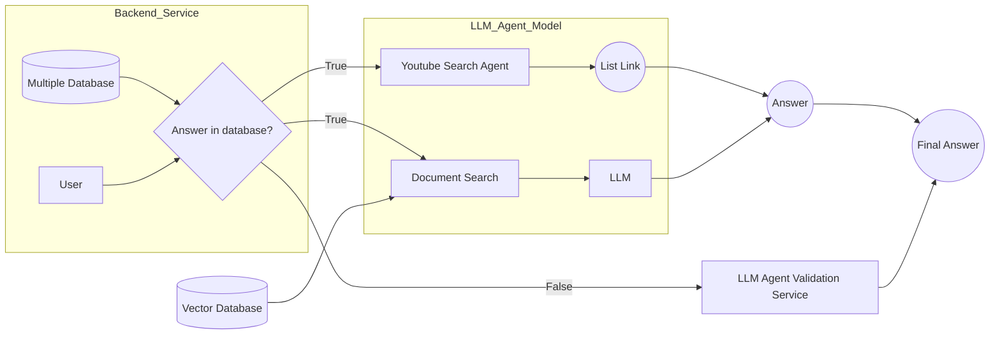

# PolkaGPT - All about Polka-lover 

- **Team Name:** Eul
- **Payment Address:** ETH :  0xb210Ed16Dbcb2C08b9216DD62Eaa64F7FF2eDF4B
- **[Level](https://github.com/w3f/Grants-Program/tree/master#level_slider-levels):** 1

## Project Overview :page_facing_up:

`PolkaGPT` is an application tool for the `LLM (Large Language Model)` model designed for developers, researchers, and users to search for documents, suggest code, hint at bug solutions, and more. Additionally, the Polkadot-loving open-source community can contribute to the data repository so that PolkaGPT can be updated continuously

1. **In-Depth Content:**

`PolkaGPT` provides detailed content covering various aspects of the Polkadot ecosystem:

+ Parachain
+ Polkadot/Kusama
+ Polkadot SDK
+ Developer tool
+ More 

2. **Developer Resources:**

`PolkaGPT` offers a good resources, including coding examples, best practices, and insights into the tools and frameworks available for efficient development.

3. **Open-source Contribution**:

Based on feedback from the developer community, users, and researchers, `PolkaGPT` can provide more accurate information more quickly. At the same time, it offers the source documentation that `PolkaGPT` has been trained on

4. **Specialized Knowledge:**

`PolkaGPT` is designed to be a specialized hub for anyone wanting to explore the **Polkadot** network comprehensively.

### Project Details

To illustrate how `PolkaGPT` works:

#### Architecture

#### Demonstration 

### Ecosystem Fit

`PolkaGPT` will help new developers or users in easily and quickly accessing the **Polkadot** ecosystem. The system will provide user-friendly information surrounding **Polkadot**, offering valuable and in-depth insights. Therefore, the information provided is highly useful and specialized. **`BUT POLKAGPT MAY MAKE MISTAKES, SO IT'S NECESSARY TO DOUBLE-CHECK THE INFORMATION`**

## Team :busts_in_silhouette:

### Team members / Contact

- **Contact Name:** Dung Ho Dinh (Dustin) / Nhat Cuong / Dzung Doan / Tinh Do Pham Phuc 
- **Contact Email:** hodinhdung1997@gmail.com / vonhatcuongyy@gmail.com / doanvietdung273@gmaiil.com / dpptinh@gmail.com

### Team's experience

+ Dustin is Blockchain Developer. He has 3+ years of experience in Smart Contract like: Solidity language programming (EVM-based) in ETH, BSC,... or Rust in NEAR, Polkadot. And He also have worked in Rust/Substrate in the Polkadot ecosystem.

+ Nhat Cuong is currently working in Research and Development at VBI Academy with 2 years of experience in the field of artificial intelligence. He is currently researching the application of LLMs in educational systems. Additionally, he has experience in Rust and DevOps.

+ Dzung is an AI/Blockchain Developer with over 5 years of expertise in the AI sector, contributing to the development of diverse products including eKYC, Chatbots, and Recommendation systems. Additionally, he possesses proficiency as a blockchain developer, demonstrating familiarity with Solidity and Rust. His portfolio includes on-chain projects like Nearlend protocol, DinoLand, and Mechmaster

+ Tinh's major is Data Science at University of Information Technology, VNU-HCM. He is interested in natural language processing, especially question answering and conversation AI (chatbot)

### Team Code Repos

- https://github.com/CocDap
- https://github.com/vonhatcuong
- https://github.com/Vietdung113

## Development Status :open_book:
`PolkaGPT` stops at the level of ideas and is currently implementing a complete MVP

## Development Roadmap :nut_and_bolt:

### Overview

- **Total Estimated Duration:** 8 weeks
- **Full-Time Equivalent (FTE):** 1.0 FTE
- **Total Costs:** 10,000 USD.

## Future Plans
+ Optimize Backend Service
+ Optimize AI prompt  
+ `Trustworthy Data` based on Blockchain Technology ( In Researching)

