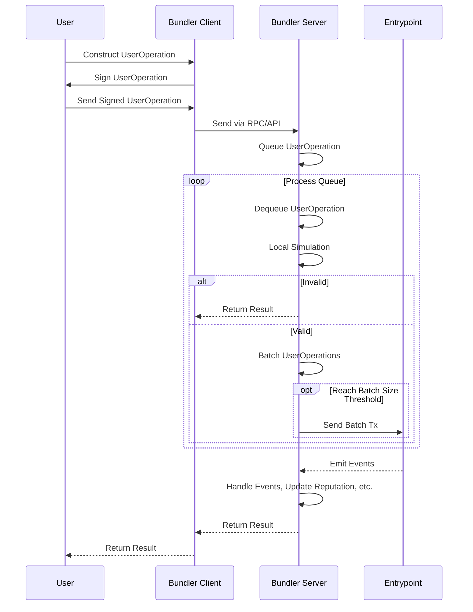
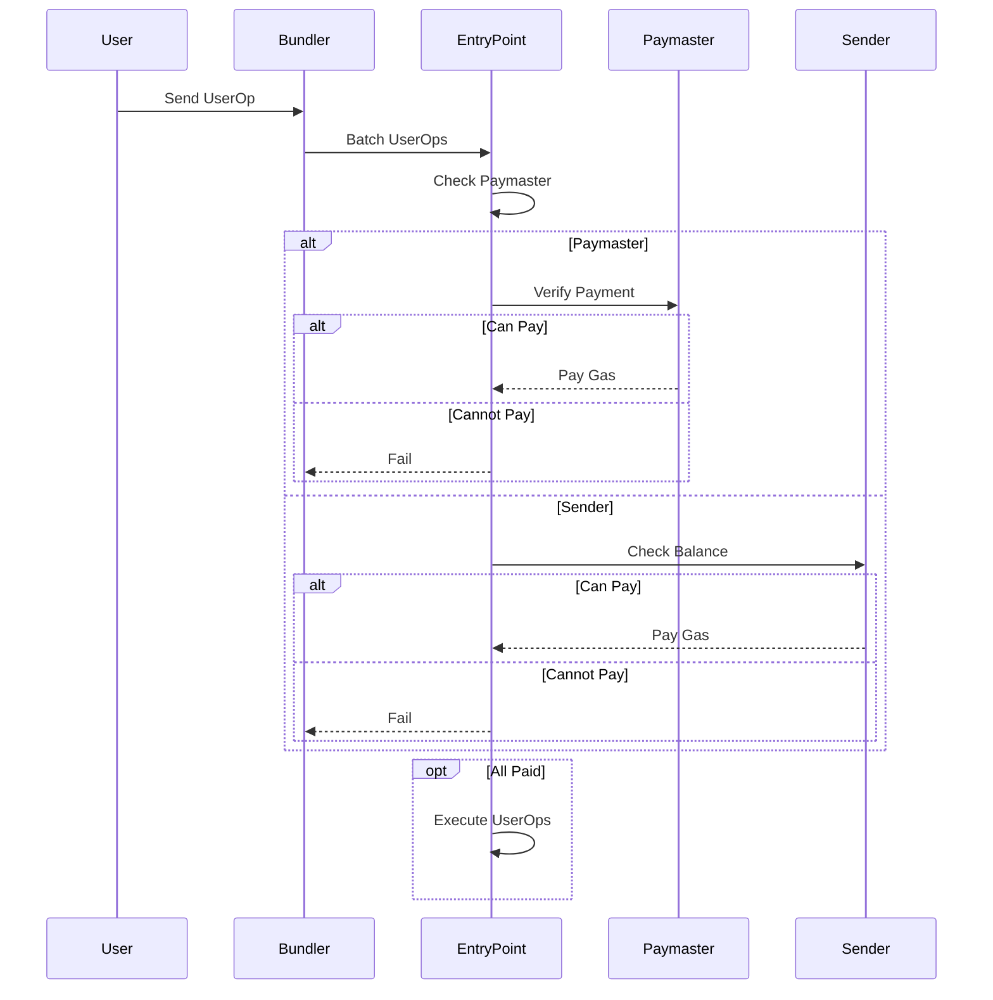

# Polkadot Smart Account

- **Team Name:** Pns
- **Payment Address:** Ethereum - 0x7682ba569e3823ca1b7317017f5769f8aa8842d4 (USDT/USDC)
- **[Level](https://github.com/w3f/Grants-Program/tree/master#level_slider-levels):** 3

## Project Overview :page_facing_up:

Polkadot Smart Account is a project that brings Ethereum's EIP-4337 account abstraction to the Substrate ecosystem. It implements account abstraction at the application level without the need for blockchain-level protocol changes.

The project is initiated by the PNS project team, which provides a decentralized identity and account management solution. We believe that the Substrate and Polkadot ecosystems need their own account abstraction standards, which is why we started this project.

### Overview

#### Motivation

- Existing account management methods have usability issues and cannot provide a good user experience.

- Account abstraction can enhance security, support more account functions, and improve the user experience.

- The current account abstraction solution requires blockchain-level protocol changes, which are difficult to promote.

- The Substrate ecosystem needs an account abstraction standard that can be implemented without protocol changes.

#### Solution

Polkadot Smart Account implements account abstraction at the application level by introducing the concepts of User Operations and Bundlers, without the need for blockchain protocol adjustments.

It allows users to use smart contract wallets instead of Externally Owned Accounts (EOAs) as their main accounts, and the wallet contracts can contain any verification logic. It also supports payment management, signature aggregation, and other functions.

We will implement this solution in the `ink!` ecosystem and ultimately extract a PSP standard specification suitable for Substrate. We chose to use `ink!` because it offers greater flexibility at the application layer, allowing users to employ different recovery logics. In the future, we are also considering providing a `pallet` version.

### Project Details

#### User Operation Flow

The User Operation flow is as follows:

1. The user constructs a UserOperation object containing the operation to be executed.

2. The user broadcasts the UserOperation to the public User Operation Memory Pool.

3. The Bundler retrieves UserOperations from the memory pool and runs a local simulation to verify their validity.

4. The Bundler bundles validated UserOperations into a transaction and calls Entrypoint's `handle_ops` method.

5. Entrypoint verifies and executes each UserOperation and interacts with the chain.

The Bundler plays a pivotal role in the User Operation flow by receiving, validating, batching, and ultimately sending UserOperations on-chain. Its workflow is shown in the following diagram:



After the Bundler bundles validated UserOperations and sends the transaction to Entrypoint, further processing logic is executed:

The Entrypoint contract implements the core logic for processing UserOperations. It contains methods like `handle_ops` to process batched UserOperations, `handle_aggregated_ops` for aggregated signatures, etc.

Entrypoint also implements functionalities related to deposit, withdrawal, gas payment, and deposit protection. It interacts with the chain to update state based on the UserOperations.

The workflow is shown below:



#### Bundler

The Bundler is an independent component responsible for retrieving UserOperations, validating, batching, and sending them to Entrypoint for execution.

Its main functions include:

- Providing RPC/REST APIs to receive UserOperations

- Queuing and processing UserOperations

- Validating UserOperations via local simulation

- Batching validated UserOperations into transactions

- Calling Entrypoint's `handle_ops` to execute transactions

- Implementing a reputation system, event monitoring

- Caching, debugging interfaces

The Bundler enables the closed-loop User Operation flow, achieving account abstraction without blockchain changes.

The Bundler plays a key role by receiving, validating, batching user operations, and sending them to Entrypoint. It is a pivotal component that connects the off-chain User Operation construction and on-chain execution.

### Ecosystem Fit

- Where and how does your project fit into the ecosystem?

  Polkadot Smart Account provides account abstraction for users in the Polkadot/Substrate ecosystem, improving usability and security.

- Who is your target audience (parachain/dapp/wallet/UI developers, designers, your own user base, some dapp's userbase, yourself)?

  The solution targets wallet providers, dApp developers, and end users who need better account management.

- What need(s) does your project meet?

  It meets the need for more user-friendly and secure account management.

- Are there any other projects similar to yours in the Substrate / Polkadot / Kusama ecosystem?

  There are few existing solutions specifically addressing this problem of blockchain account abstraction.

- If so, how is your project different?

  Our solution uniquely uses User Operations and Bundlers to achieve account abstraction without blockchain changes.

- If not, are there similar projects in related ecosystems?

  Ethereum's EIP-4337 is similar, but we adapted the concept for Substrate compatibility.

## Team :busts_in_silhouette:

### Team members

- cupnfish - Rust Engineer of Parallel Identity, responsible for core protocol development.
- escher - Solidity Developer of Parallel Identity, responsible for smart contract development.
- fangda - Frontend Engineer of Parallel Identity, responsible for UI and frontend code.
- cat - Blockchain Researcher of Parallel Identity, responsible for documentation and research.

### Contact

- **Contact Name:** Cupnfish
- **Contact Email:** <hello@pns.link>
- **Website:** <http://www.pns.link>

### Team's experience

The team has experience building blockchain solutions and won 1st place at the Polkadot Hackathon Smart Contracts track. We are excited to further develop Polkadot Smart Account into a production-ready solution.

### Team Code Repos

- https://github.com/pnsproject/pns-pallets
- https://github.com/pnsproject/ink-aa

The GitHub accounts of team members:

- https://github.com/jiangplus
- https://github.com/Cupnfish
- https://github.com/qieman

## Development Status :open_book:

We have developed a minimal proof-of-concept implementation of the Polkadot Smart Account solution. The code is available at:

**GitHub Repo**: https://github.com/pnsproject/ink-aa

This initial implementation includes:

- Basic EntryPoint smart contract

  - Implements core logic to process UserOperations
  - Methods to handle batched and aggregated UserOperations

- Sample Bundler service

  - Provides API to receive UserOperations
  - Simulates validation and batches UserOperations

- Testing scripts
  - Unit tests for core EntryPoint and Bundler functionality

### EntryPoint Contract

The `EntryPoint` contract contains two main methods that implement the processing logic for `UserOperations`: `handle_ops` and `handle_aggregated_ops`.

The `handle_ops` method takes a batch of `UserOperation`s as input, validates and executes each operation. The method signature in Rust is as follows:

```rust
pub fn handle_ops(&mut self, ops: Vec<UserOperation>) -> Result<()>
```

The `handle_aggregated_ops` method is similar to `handle_ops`, but it is used for processing `UserOperation`s with signature aggregation. It first validates the signature aggregation and then validates and executes each operation. The method signature in Rust is as follows:

```rust
pub fn handle_aggregated_ops(&mut self, ops: Vec<UserOperation>) -> Result<()>
```

In addition to these methods, the `EntryPoint` contract also implements several related functions such as deposit, withdraw, and deposit security.

The `deposit` function is used to deposit funds for the user. The method signature in Rust is as follows:

```rust
pub fn deposit(&mut self) -> Result<()>
```

The `withdraw` function is used to withdraw funds for the user. It takes the amount to withdraw as input and returns a `Result` indicating success or failure. The method signature in Rust is as follows:

```rust
pub fn withdraw(&mut self, amount: Balance) -> Result<()>
```

Overall, the `EntryPoint` contract provides the main entry point for processing user operations and related functions for managing user funds.

### Bundler

The Bundler implements the key functionality of receiving, validating, batching user operations, and sending them to the Entrypoint for execution.

The Bundler provides RPC and REST APIs for receiving `UserOperations` from users:

```rust
#[rpc(server, client)]
pub trait BundlerRpc {

  /// Send a user operation.
  #[method(name = "sendUserOperation")]
  async fn send_user_op(&self, op: UserOperation) -> Result<OpHash, Error>;

  /// Get the status of a user operation.
  #[method(name = "getUserOpStatus")]
  async fn get_user_op_status(&self, op_hash: OpHash) -> Result<OpStatus, Error>;
}
```

After receiving a `UserOperation`, the Bundler adds it to a queue for processing:

```rust
#[derive(Debug, Serialize, Deserialize, Clone)]
pub struct UserOperation {
  //...
  pub signature: Vec<u8>,
}

// Add UserOperation to processing queue.
fn add_to_queue(user_op: UserOperation) {
  let queue = ...;
  queue.push(user_op);
}
```

The Bundler periodically takes `UserOperations` from the queue and performs local simulation to verify them:

```rust
// Periodically take and verify UserOperations from queue.
fn process_queue() {
  let user_op = queue.pop();
  if verify_user_op(user_op) {
    // Verification succeeded, batch process.
  } else {
    // Verification failed, return an error.
  }
}
```

After verification succeeds, the Bundler batches and packages the `UserOperations` and sends them to the Entrypoint for execution.

The Bundler implements the key functionality of taking user operations constructed off-chain and sending them on-chain for execution.

_Note: The interfaces shown are subject to change during further development._

## Development Roadmap :nut_and_bolt:

### Overview

- **Total Estimated Duration:** 5 months
- **Full-Time Equivalent (FTE):** 3
- **Total Costs:** 60,500 USD

### Milestone 1: Develop EntryPoint and Bundler

- **Estimated duration**: 3 months
- **FTE**: 3
- **Costs**: 40,500 USD

| Number  | Deliverable         | Specification                                                     |
| ------- | ------------------- | ----------------------------------------------------------------- |
| **0a.** | License             | Apache 2.0                                                        |
| **0b.** | Documentation       | We will draft documentation for EntryPoint and Bundler.           |
| **0c.** | Testing Guide       | Core functions will have comprehensive unit test coverage (80+%). |
| **0d.** | Docker              | Provide docker image to enable testing.                           |
| 0e.     | Article             | We will publish an article elucidating our work.                  |
| 1.      | EntryPoint Contract | Implement core logic to process UserOperations.                   |
| 2.      | Bundler             | Implement receiving, validating, batching UserOperations.         |

### Milestone 2: Develop Web App with UI to manage smart account

- **Estimated duration**: 1 month
- **FTE**: 2
- **Costs**: 8,000 USD

| Number  | Deliverable                 | Specification                                              |
| ------- | --------------------------- | ---------------------------------------------------------- |
| **0a.** | License                     | Apache 2.0                                                 |
| **0b.** | Documentation               | We will provide documentation for the Web App.             |
| **0c.** | Testing Guide               | Core functions will have comprehensive unit test coverage. |
| **0d.** | Docker                      | Provide docker image for testing.                          |
| 0e.     | Article                     | We will publish an article elucidating our work.           |
| 1.      | Web App code implementation | Build with TypeScript, React and Vite.                     |

### Milestone 3: Integrate Passkey

- **Estimated duration**: 1 month
- **FTE**: 3
- **Costs**: 12,000 USD

| Number  | Deliverable                                   | Specification                                                         |
| ------- | --------------------------------------------- | --------------------------------------------------------------------- |
| **0a.** | License                                       | Apache 2.0                                                            |
| **0b.** | Documentation                                 | Update documentation detailing Passkey integration.                   |
| **0c.** | Testing Guide                                 | Update tests to cover Passkey integration.                            |
| **0d.** | Docker                                        | Provide docker image for testing.                                     |
| 0e.     | Article                                       | We will publish an article elucidating our work and implementation.   |
| 1.      | Integrate Passkey into Polkadot Smart Account | Incorporate Passkey standard for passwordless, secure authentication. |
| 2.      | Integrate Passkey into Web APP                | Web APP integration enabling seamless Passkey use for users.          |

Passkey standard allows passwordless authentication that is resistant to phishing attacks. We will integrate this standard to allow users to directly sign with biometrics etc. without needing to manage keys themselves. This further simplifies the user operation flow and improves security.

## Future Plans

- **How you intend to use, enhance, promote and support your project in the short term**

  - We will actively maintain and upgrade the Polkadot Smart Account solution, releasing improved versions and adding new features.

  - We plan to write technical articles, create tutorials, and organize workshops to promote adoption in the developer community.

  - We will collaborate with wallet projects and dApps to integrate Polkadot Smart Account, improving their account features.

- **The team's long-term plans and intentions in relation to it**

  - In the long run, we intend to propose Polkadot Smart Account as a PSP standard for adoption in Substrate and Polkadot ecosystems.

  - We hope to build an open-source community around Polkadot Smart Account to encourage contribution and participation from developers.

  - We plan to explore and research innovative extensions like meta-transactions and signature aggregation to further enhance account usability and security.

## Additional Information :heavy_plus_sign:

**How did you hear about the Grants Program?**

We learned about the Web3 Foundation Grants Program through participating in Polkadot Hackathon.

**What work has been done already?**

We have developed a minimal proof-of-concept implementation of the Polkadot Smart Account solution during the Polkadot Asia Hackathon 2023. This included basic contracts for the EntryPoint contract component.

Our project "Polkadot Smart Account" won 1st place in the Smart Contracts track at the Polkadot Asia Hackathon 2023. We want to further develop the initial proof-of-concept.
