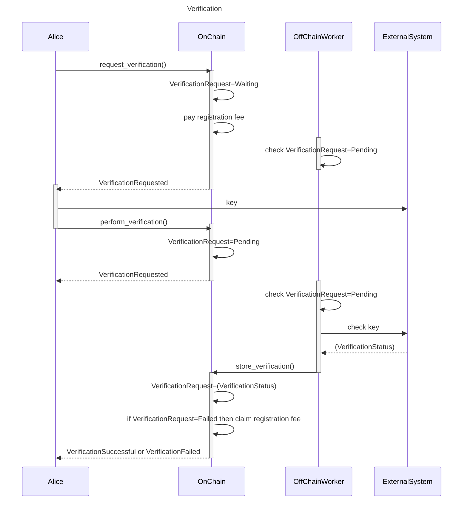
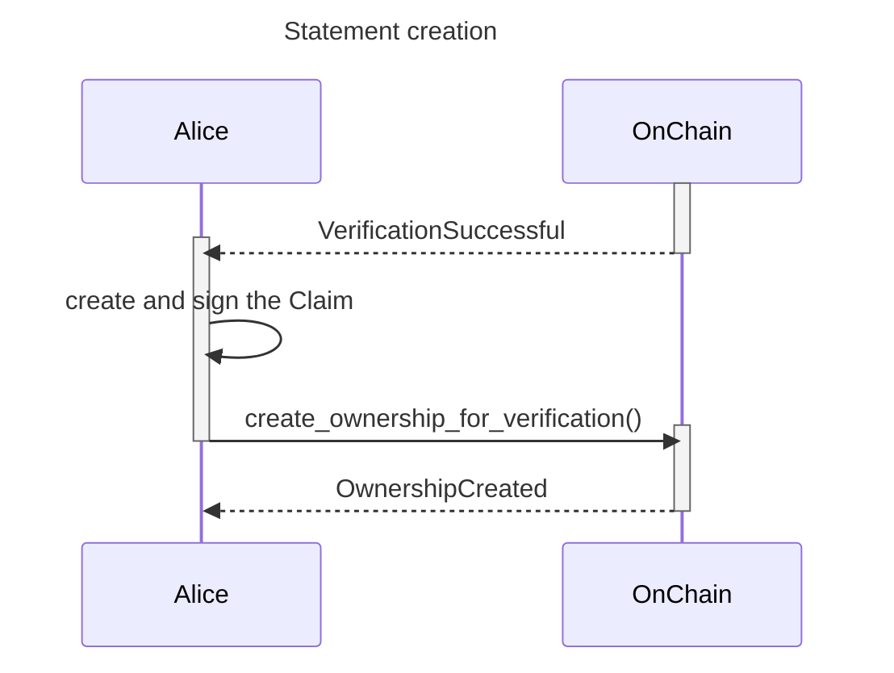
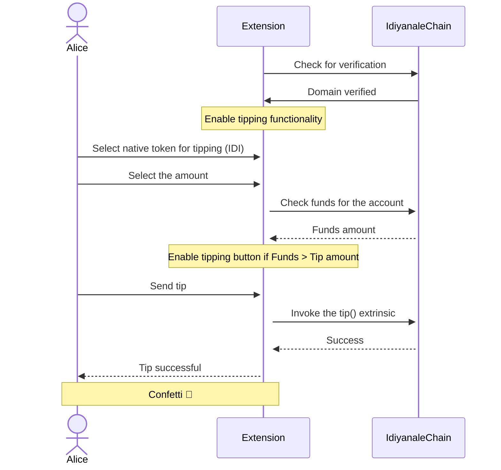

# Project Idiyanale - Multi-token community contributions for verified creators

- **Team Name:** Anagolay
- **Payment Address:** `0x3da76bca7ccc8f92dc9c3bc000ea5fc64d7f76b8` (USDT-erc20)
- **[Level](https://github.com/w3f/Grants-Program/tree/master#level_slider-levels):** 2

## Project Overview :page_facing_up:

This application is a continuation of the previously successfully delivered grant called `Project Idiyanale - Phase 1` approved on this [PR-719](https://github.com/w3f/Grants-Program/pull/719).

### Overview

As you already know, Anagolay is a peer-to-peer framework for storing and transferring records of Rights (such as Ownership, Copyright & Licenses), based on verified proofs for any digital content. Previously we have worked on building the base for the deterministic and transparent processes we call Workflows, and the on-chain permanent storage for the verifiable Statements. In this grant, we will combine it all and add two more pallets to accomplish truly decentralized community-powered contributions for all verified creators.

From Idiyanale's point of view, verified creators are the users that have verified their online identity like a domain, subdomain, social account, or repository on Idiyanale. This approach was partially pioneered by Keybase and became a trusted way to determine that a specific user or an organization has correct rights to the given resource. Keybases' approach doesn't include the feature where the community can support the creators in a monetary way. Such a feature was pioneered by Brave when they created the *Brave publishers' program* and issued their cryptocurrency called BAT. The creators would claim ownership of their internet identities similarly as with Keybase, with a big difference: users could support (tip) the creators. This approach didn't gain much traction because it required the use of Brave browser, which most users still don't know about.

We have identified why the above projects did not succeed in enabling community contributions for verified creators and mitigated them. Keybase is centralized, and people must trust that it will not go down, shut down, or get sold (as it was). Brave's currency is available only within the Brave browser, which limits its usage on other browsers; its verification process is centralized and not transparent.

Within the scope of this grant proposal, we are upgrading the idea of enabling community support for verified creators and combining it with the processes we built to support Anagolay that allow for transparency, decentralization, and interconnectivity.

We are creating a transparent and trusted process for verifying internet identities that will enable content creators and open-source developers to monetize the support from their communities without relying on a centralized solution.

The use case we work on expands the Polkadot and Kusama ecosystem to the whole new communities of creators previously using platforms like Patreon (content creators) and OpenCollective (open-source projects) and provides them with a sound decentralized alternative.

### Project Details

We expect the teams to already have a solid idea about your project's expected final state. Therefore, we ask the teams to submit (where relevant):

- Mockups/designs of any UI components
  - they are in the dedicated sections in the milestones
- Data models / API specifications of the core functionality
  - they are in the dedicated sections in the milestones
- An overview of the technology stack to be used
  - Substrate, Rust, Typescript, Svelte, Tailwind, Chrome extensions APIs
- Documentation of core components, protocols, architecture, etc. to be deployed
  - After every milestone, we will deploy the deliverables on our infra for testing.
- PoC/MVP or other relevant prior work or research on the topic
  - No PoC or MVP for the scope of this grant
- What your project is _not_ or will _not_ provide or implement
  - NA

### Ecosystem Fit

Help us locate your project in the Polkadot/Substrate/Kusama landscape and what problems it tries to solve by answering each of these questions:

- Where and how does your project fit into the ecosystem?
  - the creation of the functionality that are in this grant are intended to be used by the whole ecosystem, either via the Idiyanale and the Browser extension or standalone by integrating the `verification` and `tipping` pallets
- Who is your target audience (parachain/dapp/wallet/UI developers, designers, your own user base, some dapp's userbase, yourself)?
  - every person that has or will have any of the ecosystems tokens and that is willing to support creators
  - any substrate based chain/parachain
- What need(s) does your project meet?
  - Enabling creators monetize community support: secure & p2p
  - Enabling everybody to support individual projects and creators.
  - Expanding the Polkadot and Kusama ecosystem to digital creators domain ( non NFT )
  - Disrupting the platforms like Patreon ( creators ) and OpenCollective ( open-source projects )
- Are there any other projects similar to yours in the Substrate / Polkadot / Kusama ecosystem?
  - None that we are aware of that are active

## Team :busts_in_silhouette:

### Team members

- Adriano Dalpane
- Daniel Maricic

### Contact

- **Contact Name:** Daniel Maricic
- **Contact Email:** daniel@woss.io
- **Website:** [https://anagolay.network](https://anagolay.network)

### Legal Structure

- **Registered Address:** Harju maakond, Tallinn, Kesklinna linnaosa, Viru väljak 2, 10111
- **Registered Legal Entity:** KELP DIGITAL OÜ

### Team's experience

Both of the team members have been involved in the [successfully delivered grant](https://github.com/w3f/Grants-Program/pull/719).

### Team Code Repos

- [https://gitlab.com/anagolay/docs](https://gitlab.com/anagolay/docs)
- [https://github.com/anagolay/anagolay-chain](https://github.com/anagolay/anagolay-chain)
- [https://github.com/anagolay/anagolay-js-sdk](https://github.com/anagolay/anagolay-js-sdk)

Please also provide the GitHub accounts of all team members. If they contain no activity, references to projects hosted elsewhere or live are also fine.

- [https://github.com/digitalillusion](https://github.com/digitalillusion)
- [https://github.com/woss](https://github.com/woss)

### Team LinkedIn Profiles (if available)

- [https://www.linkedin.com/in/adriano-dalpane/](https://www.linkedin.com/in/adriano-dalpane/)
- [https://www.linkedin.com/in/danielmaricic/](https://www.linkedin.com/in/danielmaricic/)

## Development Status :open_book:

The ongoing development happens on https://github.com/anagolay and its repos.

# Development Roadmap :nut_and_bolt:

## Overview

- **Total Estimated Duration:** 2 months
- **Full-Time Equivalent (FTE):** 2 FTE
- **Total Costs:** 24000 USDT

## Milestone 1

- **Estimated duration:** 1 month
- **FTE:** 2
- **Costs:** 12,000 USD

| Number | Deliverable                      | Specification                                                                                                                                                                                                             |
| ------ | -------------------------------- | ------------------------------------------------------------------------------------------------------------------------------------------------------------------------------------------------------------------------- |
| 0a.    | License                          | Apache 2.0                                                                                                                                                                                                                |
| 0b.    | Documentation                    | We will provide both inline documentation of the code and a basic tutorial that explains how a user can perform verification of ownership of a domain through DNS TXT record                                              |
| 0c.    | Testing and Testing Guide        | Comprehensive unit tests will fully cover core functions to ensure functionality and robustness. In the guide, we will describe how to run these tests.                                                                   |
| 0d.    | Docker                           | We will provide a Dockerfile(s) that can be used to test all the functionality delivered with this milestone                                                                                                              |
| 0e.    | Demo video tutorial              | We will publish a video showing the implemented functionality.                                                                                                                                                            |
| 1.     | Substrate module: verification   | We will create a Substrate module that will 1) request a domain verification, 2) perform a domain verification, and 3) list all verified domains. This module requires an off-chain worker and is independent of Anagolay |
| 2.     | Statement pallet update          | Update the existing Statements pallet to be able to store the rights and connection to the Verification pallet                                                                                                            |
| 3.     | UI for claiming domain ownership | A new page in the Anagolay App where people can claim the ownership of a domain                                                                                                                                           |

### Pallet `verification`

This pallet’s responsibility is to keep records of the verified items and their proofs and to know how to handle different types of verification processes and how to store them. There can be any number of Strategies implemented to handle one or more different verification scenarios. In this grant, we will implement the base code needed to run all Strategies and a `DNSVerificationStrategy`, which will verify domains and subdomains using the DNS TXT record.

In the following description, we’ll speak of DNS verification, but the same procedure applies similarly to other verification strategies as well. Alice, the client, requests the verification providing the appropriate context (domain, subdomain…), and the request is stored on the chain with `Waiting` status. At the subsequent execution of the off-chain worker, such requests which are in `Waiting` status are ignored. Meanwhile, Alice has received a `VerificationRequested` event with the instructions for the verification challenge, putting a specific key in a DNS TXT record.

At this stage, the client can halt the process and perform the DoH queries before the `perform_verification` extrinsic call because this will incur the transaction fee if it fails.

The call to perform verification will update the state of the request to `Pending`, signaling to the off-chain worker that, on the next execution, the challenge must be verified. A registration fee is also deducted from Alice's account during this transition from `Waiting` or `Failed` to `Pending`: this will be the bounty that other users can claim if, at any point in time, they verify that Alice’s domain no longer contains the correct DNS TXT and she neglected to update the verification status herself.

At execution, the appropriate verification strategy is instantiated, `DNSVerificationStrategy` in this case. It performs a call to the DNS resolve provider. The request is then updated on the chain with the call to a local unsigned extrinsic to store the verification with the appropriate status `Success` or `Failure`. If the verification fails, the registration fee is attributed to the account which is the origin of the call to perform verification, in appreciation of the behavior of external actors that validate that `VerificationRequest` validity is not expired.

**Storage**

- `VerificationRequestByAccountIdVerificationContext` provides the `VerificationRequest`s indexed by their holder `AccountId` and `VerificationContext`

**Types**

- `Bytes` is an alias for `BoundedVec<u8, Get<u32>>`
- `DomainVerificationContext` is an enumeration providing the switch to verify (full URL + breakdown) and implements the `VerificationContext` trait
  - a domain (ex: anagolay.dev)
  - a domain with a username (ex: github.com/anagolay)
  - a domain with a subdomain (ex: adriano.anagolay.network)
  - a domain with a username and a repository (ex: github.com/woss/git-gpg-remote-sign)
- `VerificationStrategy` is a trait that mimics the behavior of verification strategies on a `VerificationContext` trait, providing the following methods:
  - `supports(VerificationContext) -> bool` : defines whether a `VerificationContext` is supported or not
  - `verify() -> VerificationStatus`: performs an HTTP call to check the required criterion to pass the verification
- `VerificationStatus` is an enumeration representing the status of the verification:
  - `Waiting`
  - `Pending`
  - `Failure`
  - `Success`
- `VerificationRequest` a structure representing the request to verify:
  - `context`: one of the supported `VerificationContext`s
  - `status`: the `VerificationStatus`
  - `holder`: the `AccountId` issuing the request
  - `action`: an indication of the action that the holder must perform to pass verification, which is the verification strategy
  - `key`: a `Bytes` field containing a challenge string. This is in complete control of the invoked Strategy
  - `id`: an `Option<Bytes>` the feedback from the holder pointing at the exact place where the verification should happen (TweetId, etc…)

**Events**

- `VerificationRequested(AccountId, VerificationRequest)` produced upon newly requested verification to communicate to the holder the expected action to take
- `VerificationSuccessful` produced upon successful verification
- `VerificationFailed(Bytes)` produced upon failed verification provides a textual explanation of what went wrong.

**Errors**

- `VerificationAlreadyIssued` whether the `VerificationContext` is submitted twice, no matter the `VerificationStatus`

**Extrinsics**

1. `request_verification()` accepts a `VerificationContext` and produces the information for the holder about the action to take in order for the verification to succeed. A `VerificationRequest` is initialized, iterating through all known `VerificationStrategy` in order to find the one that supports the `VerificationContext` The `VerificationRequest` is stored in `VerificationRequestByAccountIdAndVerificationContext ` with the status `Waiting`, and a `VerificationRequested` event is emitted.
2. `perform_verification()` accepts a `VerificationContext` and `id` and signals that the holder has taken the appropriate action in order for the verification to succeed. The respective `VerificationRequest` from `VerificationRequestByContext` is stored in the off-chain worker indexing database with the status `Pending` and the holder pays a certain amount as a registration fee for the first time only: it will be possible to claim this amount back later. As soon as the off-chain worker runs, it finds the pending request in the off-chain worker indexing database and instantiates the required strategy to perform the verification, which depends on the specific implementation. At this point, an unsigned local transaction is submitted to `store_verification()`, passing the `VerificationStatus`.
3. `store_verification()` updates the `VerificationRequest` present in `VerificationRequestByAccountIdAndVerificationContext` storage with the `VerificationStatus` coming from the off-chain worker. This extrinsic accepts to be called only as an unsigned local transaction, thus not from the external world. One of the `VerificationSuccesful` or `VerificationFailed` events is raised according to the status.
   1. when the `VerificationRequest` `status` translates from `Success` to `Failure`, an economic incentive is attributed to the account that is the origin of the `perform_verification()`. The amount is initially paid by the `VerificationRequest` holder, who has either failed to notify the invalidation of the domain or is claiming the amount back.

**DNSVerificationStrategy**

This strategy depends on setting the correct TXT record that is checked in an off-chain worker using the HTTP call to a DoH (DNS over) service at the moment the verification is performed, so the TXT record must be in place for verification to succeed.

### Statement pallet update - Integration with Anagolay

The `verification` pallet is intended to be used by the substrate community; however, the `statements` pallet is modified to integrate these previous verification steps and to allow the holder of a successful verification request to produce a Statement of ownership out of the verification result.

**Storage**

- `StatementIdByVerificationContext` provides the `StatementId` indexed by the respective `VerificationContext`, if some.

**Types**

- Statement validity, expiration, and creation time must be expressed in block time and moved to the `extra` field of the `AnagolayStructure`. A validity `status` is also added so that the Statement is revoked when expiration is reached.

**Extrinsics**

1. The new extrinsic `create_ownership_for_verification()` will also create the `ProofData`, filling it with the signature holder, the `VerificationContext`, and checking that the respective `VerificationRequest` is successful. The data is also complemented with some data coming from the strategy, like `workflow_id`. A Proof is generated and associated with the Statement, while the link between verification and Statement is inserted into `StatementIdByVerificationContext` storage. An `OwnershipCreated` event is raised at the end
2. change the existing `create_ownership()` and `create_copyright()` extrinsic to accept the `ProofData`, then invoke the `proofs` pallet to create the Proof with an invariant proof_id

### UI for claiming domain ownership

We will create the new publicly available page in Anagolay DApp called `claim-domain-ownership`. On this page, users can go through the process of claiming domain ownership using the DNS verification strategy. The final goal is to store the Ownership Statement on-chain successfully.

Anagolay App is using the PolkadotJS browser extension and expects to be able to inject the accounts. We will not provide a tutorial on how to transfer the assets nor how to create the account in the extension. The verification will fail if the selected account doesn’t have enough funds.

Mockup:

## Milestone 2

- **Estimated Duration:** 1 month
- **FTE:** 2
- **Costs:** 12,000 USD

| Number | Deliverable               | Specification                                                                                                                                           |
| ------ | ------------------------- | ------------------------------------------------------------------------------------------------------------------------------------------------------- |
| 0a.    | License                   | AGPLv3                                                                                                                                                  |
| 0b.    | Documentation             | We will provide inline documentation of the code and a basic tutorial that explains how a user can perform tipping to a verified domain                 |
| 0c.    | Testing and Testing Guide | Comprehensive unit tests will fully cover core functions to ensure functionality and robustness. In the guide, we will describe how to run these tests. |
| 0d.    | Docker                    | We will provide a Dockerfile(s) that can be used to test all the functionality delivered with this milestone.                                           |
| 0e.    | Demo video tutorial       | We will publish a video showing the implemented functionality.                                                                                          |
| 1.     | Substrate module: tipping | We will create a Substrate module that will 1) allow sending tokens to the holder of the verification of a domain 2) list all the tips received         |
| 2.     | Anagolay Extension        | We will deliver a chrome browser extension that allows a substrate account to send tips using the chosen token                                          |
| 3.     | UI: `my-domains` page     | A new page in Anagolay App for enabling and setting up tipping                                                                                          |

### Pallet `tipping`

Tipping pallet is the core feature in our attempt to build the functionality and features to support creators’ economy in a truly decentralized manner. Every creator can verify their revenue channels like websites, subdomains, or a username on commercial websites and accept payment from anybody in crypto. This pallet, together with the Anagolay Extension, can be used to support open-source projects per user and per repository. To prevent the misuse of the pallet and to make sure that the correct people are supported, the tipping pallet depends on the `verification` pallet to get the proofs of the domain, username or repository verification, and `statements` pallet for the ownership.

**Storage**

- `TippingSettingsByReceiverAccountId` provides the `TippingSettings` indexed by their respective `ReceiverAccountId`
- `TipsByReceiverAccountIdAndVerificationContext` provides a collection of `Tips` indexed by their respective `ReceiverAccountId` and `VerificationContext`.

**Events**

- `TipCreated(SenderAccountId, ReceiverAccountId, Tip)` produced upon the newly created tip

**Types**

- `TippingToken` enumeration of the supported tokens for tipping
- `TippingSettings` is a structure associated with every domain, providing the following fields:
  - `enabled`: specifies that the tipping is enabled or not
  - `accounts`: a map having `TippingToken` key and `ReceiverAccountId` values, where each entry specifies to which wallet to send the tips given in some kind of token
- `Tip` structure representing a tip, providing the following fields:
  - `index` the position of the tip in the collection of tips for the same `VerificationContext`
  - `amount` - quantity of tokens tipped
  - `token` - `TippingToken` One of the TippingToken values
  - `sender` - `AccountId` A user that is tipping
  - `createdAt` UNIX timestamp of the tip

**Extrinsic**

1. `tip` accepts a `Tip` and a receiver `AccountId` along with a `VerificationContext` and stores them in the `TipsByAccountIdAndVerificationContext` then initiates the transfer of the required amount from the account of the sender to the account of the receiver.
2. custom RPC that allows retrieving the paginated list of `Tip`s

### Anagolay browser extension

Anagolay Extension is the extension for chrome based browsers that is used as an entry point for the Tipping and community support of the verified creators. Users can tip other users in supported currencies or tokens in just a few clicks, completely secure and p2p. Idiyanale does not take any additional fees apart from the standard extrinsic fees. To prevent misuse, the extension will not allow tipping for the domains, usernames, and repositories that are not verified.

We don’t want to write yet another browser-based wallet, and we are very strict about the user's security and private keys; for that reason, we are using the PolkadotJs extension for all crypto and account-based actions like signing the transactions.

Here is the Sequence Diagram when the user selects the Idiyanale token.

Anagolay Browser Extension Mockup:

# Future Plans

As the members of the SBP we have already solid understanding what we are building in next 1 year. Next improvements that are related to this grant are building more Strategies, a UI for the creators similar to OpenCollective. We will also improve the Extension integrating a DEX, ( Polkadex is a possibility ), and much more. All this goes hand-in-hand with our Mission and Vision to bring the decentralized Rights management, protect the creators IPs.

# Additional Information :heavy_plus_sign:

**How did you hear about the Grants Program?**

We had successfully delivered previous grant [PR-719](https://github.com/w3f/Grants-Program/pull/719).
