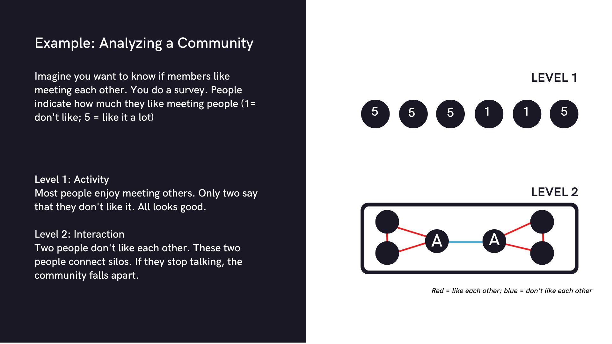

# Community Health Analytics and Benchmarking

- **Team Name:** TogetherCrew
- **Payment Address:** eth:0x6612213880f80b298aB66375789E8Ef15e98604E
- **[Level](https://github.com/w3f/Grants-Program/tree/master#level_slider-levels):** 2

## Project Overview :page_facing_up:

### Overview

If Web3 is all about communities, how do we know if we’re heading in the right direction? We can guess or use anecdotal evidence. Or we can use science and analytics to map our paths. 

We are proposing a project to:

- develop a framework for Community Health with actionable metrics
- create an open source data collection tool
- implement the tool in Polkadot and Kusama communities 
- analyse the interactions and perceptions data to validate the framework and provide insights to advance the communities

**An indication of how your project relates to Polkadot / Kusama.**
Polkadot is a diverse ecosystem with "[more than 200 teams](https://polkadot.network/blog/polkadot-2022-roundup/)" building using Polkadot's technology stack. A lot of development within the ecosystem makes it increasingly difficult for community members to stay on top of everything. Our report includes the *small world metric*, a measure of how much the ecosystem allows for specialized cliques while, at the same time, enabling the flow of information between cliques. Knowing this metric for the ecosystem will provide community leaders and contributors with actionable data on where more alignment is necessary, where silos are forming, and what teams build strong bridges. 

The health check will be extended to also include the Kusama ecosystem. Given that the two ecosystems are related, it is expected that movements in one system (e.g., conflicts, sudden inflow or outflow of many members) will impact the other. 

**An indication of why your team is interested in creating this project**

### Problem Space

Community dashboards provide a first basic level of insights into a community: individual activity, but ignore that the building block of a healthy community isn't just posting messages but the interaction between people. Current community dashboards (e.g., Orbit, Commosor, Blazer, Statbot) focus on members’ posting behavior and event or meeting attendance. Community members are treated in isolation, ignoring that humans are social beings and thrive thanks to interactions. From [team research](https://www.cs.cmu.edu/~ab/Salon/research/Woolley_et_al_Science_2010-2.pdf) we know that a team's collective intelligence is a primary predictor of performance, and not the individual skills and knowledge team members contribute. One key component of collective intelligence is conversational turn-taking, letting other people talk. 

### Problem Solution
We are creating community health checks that are based on the relationships between people and their sense of belonging and ownership in the community. We do this by creating a science-based community health framework. This framework rests on years of research on communities and social network research.
We are using two data sources for our health check: Discord data for measuring the relationships and computing network metrics and tiny pulse data to measure members' perceptions. Together these two data sources provide insights into members' outer world (their interaction with others) and thier inner world (their feeling toward the community).

Our community health checks focus on the interactions between community members and the pattern of interactions that exit within the wider ecosystem. Interactions between contributors are a vital data point: During interactions, members exchange knowledge, develop ideas, and influence each others perspective. Therefore, a community dashboard that measures interaction patterns, compared to solely activity, acknowledges that contributors do not act in isolation. 
 

The project consists of a research part (conceptual framework) and a development part (open source data collection tool). 

For the **conceptual framework**, we have assembled a team including two PhDs in network science and an organisation designer with significant DAO and community building experience to bridge both theory and practice. We’ve reviewed over 50 papers on Community, Social Network Analysis, Resilience, Trust, Engagement, and more. We synthesized all of these findings to define the key indicators with high validity and predictive capacity for community health, while also taking a holistic perspective that accounts for member’s wellbeing.

For the **data collection tool**, we’re going beyond traditional surveys by combining interaction data from Discord with short, targeted pulse surveys. The first data source provides us with objective data about what is happening inside the community (social network data). In addition, the second data source offers insights into members' beliefs and emotional attachment to the community (pulse surveys). 

Social network data and its methodology (Social Network Analysis; SNA) is a structured way to visualize how communications, information, and value creation occur through an organization based on interaction graphs. Although a relatively new decision-making tool for leaders, SNA is gaining popularity over traditional survey tools. SNA has been linked to a wide range of insights, such as improving contributor retention, avoiding member burnout, predicting team performance and community resilience, identifying key contributors, enabling decentralization, and improving coordination.

Pulse Surveys are frequent and automated micro-surveys that provide qualitative and quantitative insights. In traditional organizations, they have been shown to increase employee response rates and employee engagement with related initiatives. They’re also used as a tool for culture design and implementing culture change. Lastly, Pulse Surveys significantly reduce admin work for community managers and related roles.

The data is anonymised and collected in a central repository for this first phase (we’re exploring decentralised hosting) and managed by a team having received ethics training and at risk of losing their credentials should it be misused.

### Rationale

The techniques used (SNA based on communication and Pulse Surveys) provide maximum insights intoo Community Health compared with exclusively on-chain data analysis. And provide minimum disruption for community members and minimal admin compared to long-form surveys and user interviews. Crucially, the techniques selected and the usage of Discord messages increase participation by those less likely to respond to long surveys e.g. those less engaged and thus possible with the most valuable feedback to give.

Although our initial focus is Community Health metrics, the proposed approach sets the foundation for further applications. The combination of SNA and pulse surveys offers unprecedented actionable insights in real-time. Some of the potential applications and insights for the ecosystem are

- Generate baseline metrics for Community Health / vibez to quantify and better understand the impact a specific event is having on a community and/or sub-groups within the community
- Identify measurements of decentralization to serve as KPIs or Insights metrics
- Build funnels to track member onboarding and identify areas for improvement
- Monitor specific topics like contributor wellbeing, alignment, community experience, etc. in near real-time
- Attract talent and investment with objective Community Health metrics instead of proxy metrics like member count or proposal count, or financial metrics such as TVL
- Help new contributors find context-rich mentors outside of the existing pool of well-known but time-poor candidates

The community health check will provide insights into three areas:
1. Overall Community Health: The section combines the community's digital footprint (objective interaction data assessing interactions within a community) with members' sense of community (subjective sense of ownership). Using network science, we measure how much the community resembles a small world, and how cohesive and socially decentralized the community is. 
2. Community Insights: The section displays metrics for specific contributor types. We compute the number of interactions they are part of for every contributor and group them accordingly.    
3. Member Insights: The section displays the pulse survey results, measuring members' sense of community. 

- What your project is _not_ or will _not_ provide or implement
Currently, we only integrate with Discord. For communities spread on different platforms, the resulting score only represents a facet of truth. However, we plan to integrate data from Discourse, Twitter, and Telegram.

At this stage, we do not provide sentiment or keyword analysis at the community or interaction level. We start with a neutral perspective on interaction (two people interacting with each other) and do not consider finer nuances (is the interaction positive or negative).

- An overview of the technology stack to be used
Our dashboard is built using a combination of Nextjs (Typescript). Also, we use Python for analytics & ExpressJs for the backend. Data is stored in a MongoDB.

- Documentation of core components, protocols, architecture, etc. to be deployed
Installation instructions for the first version of our community health checks: 
- data extraction bot: https://www.notion.so/netnigma/Community-Health-bot-Tutorial-94a4b089681f41aeb028e1bffd25aaad
- DIY health checks: https://www.notion.so/netnigma/Getting-started-with-the-Health-Pulse-Onboarding-guide-8545d383ec5d4d70aeb4b2aae22d97d7

- PoC/MVP or other relevant prior work or research on the topic
We published our research framework ([Long version](https://rndao.mirror.xyz/F-SMj6p_jdYvrMMkR1d9Hd6YbEg39qItTKfjo-zkgqM); [summary](https://rndao.mirror.xyz/fsCGRlYR5rieDCVPnAnSAGL98wNWJyFbf1T_A2r-_6Y))

We did a health check for MetaGame, who tweeted it [here](https://twitter.com/MetaFam/status/1603818967528718336).

We are running the community health check on our small team: [Figma prototype](https://www.figma.com/proto/jflSBwHW3b5KgohsaYExuN/TogetherCrew?scaling=scale-down-width&page-id=0%3A1&starting-point-node-id=1%3A49&show-proto-sidebar=1&node-id=1%3A49&hide-ui=1).

### Ecosystem Fit

Help us locate your project in the Polkadot/Substrate/Kusama landscape and what problems it tries to solve by answering each of these questions:

- Where and how does your project fit into the ecosystem?
Our project gives the ecosystem information about its health by measuring the interactions (conversations, relationships) between contributors. We consider this a "soft performance indicator", because it doesn't measure objective aspects (e.g., performance, dapps launched, bugs fixed) but centers on the humans of the ecosystem. 

- Who is your target audience (parachain/dapp/wallet/UI developers, designers, your own user base, some dapp's userbase, yourself)?
The community health check is for community managers and moderators to support them in their work. For example, we measure how many joined people also interact with others after joining and if this level of interaction is sustained over time. This gives moderators insights into the onboarding of new members. This section of the health check is action-oriented and suitable for experimenting with new flows and processes in the community. 

The overall health section provides every member of the community with key performance indicators. Acting upon them requires strategic thinking and community involvement. A single person can not improve them. This is due to the nature of the data. 

- What need(s) does your project meet?
Our project provides moderators, leaders, and contributors with a bird's eye view of what is happening inside the ecosystem. 

- Are there any other projects similar to yours in the Substrate / Polkadot / Kusama ecosystem?
Our current approach rests on off-chain data. Other community analytics dashboard exists, fetching data from various off-chain data. However, they focus on posting behavior and not on the  interaction between members. Orbit.love reach metric, conceptually, comes close to our metrics. However, Orbit uses individual posting behavior as their data point and not interaction data. 

Looking at on-chain community analysis, Chainverse is similar in terms of methodology (network analysis). However, they are currently solely focusing on on-chain data. In addition, we go beyond network analysis and include pulse surveys to get a holistic picture. 

## Team :busts_in_silhouette:

### Contact

- **Contact Name:** Katerina Bohle Carbonell
- **Contact Email:** katerina@netnigma.com
- **Website:** http://www.togethercrew.com/

### Legal Structure

- **Registered Address:** na
- **Registered Legal Entity:** na

### Team Member and their experience

We combine deep expertise in Network Science and Organisational Network Mapping, Business Intelligence, DAOs and Community Building.

**Team Leads**

Katerinabc
Ph.D. in Team Dynamics using Social Network Analysis, Teaching Collaboration, and Organizational Performance at Northwestern University (since 2016).
Co-organized Learning in Networks sessions at the International Conference of Social Network Analysis (2018 - 2020), and previously advised a people analytics company on social network metrics.
- Twitter: twitter.com/katerinabohlec 1
- Linkedin: linkedin.com/in/katerinab
- Github: https://github.com/katerinabc/

Danielo
Previously, Head of Governance at Aragon, 8 years experience in Organization Design consulting (clients include Google, BCG, Daymler, The UN, and multiple startups), and visiting lecturer at Oxford University.
- Twitter: https://twitter.com/_Daniel_Ospina
- LinkedIn: https://www.linkedin.com/in/conductal/

Thegadget.eth
Software Engineer. Previously, Product Manager at Neolyze (Business Intelligence Dashboard for Instagram).
- Github: https://github.com/thegadget-eth/
- Twitter: https://twitter.com/mr_gadget22

Part of our team is also a tech lead ([Mehrdad](https://github.com/mehrdadmms)), UX designer ([DenisFox](https://www.linkedin.com/in/denisabrichtova)), Front-end developer ([Nima](https://github.com/Zueis), Back-End developer ([MagicPalm](https://github.com/magicpalmtree)), data analyst ([Ene](https://github.com/TjitsevdM)), and operations/business development (Ashish).

**Team Advisor**

Sam
Previously, Head of Technical Research at Aragon. Previously, Lead Developer of the official JavaScript API for the Ethereum blockchain.
- Github: https://github.com/nivida 1
- Twitter: https://twitter.com/furter_samuel

### Team Code Repos 

All repos with the *tc* preface are part of the TogetherCrew project (community health check)
- https://github.com/RnDAO

## Development Status :open_book:

We began to work on the community health check in Spring 2022. We started with reviewing the academic literature of (online) communities to create a [conceptual framework](https://rndao.mirror.xyz/F-SMj6p_jdYvrMMkR1d9Hd6YbEg39qItTKfjo-zkgqM). This framework describes the different nested systems within a community and details a number of metrics (*vital signs*). An interesting prior article that helped us shape our thinking was on [network biomimicky](https://network.mirror.xyz/EaRncgRP-8_UzHzlZtu4G8FVxcK-GvgtouYbkEVFrc4), from one of our team members. 

The following step was to implement the framework in communities. The goal was to translate the technical description of metrics into user-understandable terms and intuitively present the metrics. In this stage, we have delivered several community health reports (Aragon, MetaGame, Verida, Canabis Genom DAO, LexClinic), built a [prototype of our dashboard](https://www.figma.com/proto/whU3PlyPvdoSWdhUYQW7e9/Community-Health?node-id=4428%3A3647&scaling=min-zoom&page-id=3314%3A6028&starting-point-node-id=4428%3A3647&disable-default-keyboard-nav=1&hide-ui=1) and conducted ten user interviews. 

After our first report, we scaled down the network metrics. We have adopted a step-wise approach to integrating the network metrics, focusing on providing a clear, concise, jargon-free explanation. In addition, we have included a simulation section in our health reports to showcase what the health metric could be if the interaction pattern changes or if there is a large change in the community size. 

Based on the user interviews, we have singled out the most exciting feature and are building the community health dashboard. At the end of January 2023, we launched our alpha version. This alpha version of our dashboard includes one chart (when is your community  most active). This feature was identified as the most intuitive to understand for users. In addition, it is built on the number of interactions per user and therefore contains the raw data for all other metrics. This will help further development of the dashboard.

While this development is ongoing, we continue to deliver low fidelity dashboards to interested communities. This lets us interact closely with users, helping us learn more about their problems and shape onboarding material for users.

Early development of this project has been funded by [Aragon](https://forum.aragon.org/t/real-time-community-health-analytics), Polygon DAO, [Aave](https://noturhandle.gitbook.io/rndao/proposals/proposals/grant-proposal-aave), [MetaCartel](https://forum.metacartel.org/t/grant-request-community-health-a-project-by-rndao/2354) and Near.

## Development Roadmap :nut_and_bolt:

### Overview

- **Total Estimated Duration:** 3 months
- **Full-Time Equivalent (FTE):**  6.5
- **Total Costs:** 25 000 USD

We are following a grant-matching processes to spread the risk among different communities. 

### Milestone 1 — Community Health check for Polkadot

- **Estimated duration:** 1 month
- **FTE:**  3
- **Costs:** 7 500 USD

| Number | Deliverable | Specification |
| -----: | ----------- | ------------- |
| 0a. | License | The code for data fetching and storage is already available in a public github folder (Unlicensed). We will specify an OSS license. |
| 0b. | Documentation | We will provide a tutorial for users to understand how to run the health checks themselves. Our current version will be updated to include recent development.|
| 0c. | Testing and Testing Guide | Testing and Testing Guide is unnecessary for the community health check. |
| 0d. | Docker | A docker file is not necessary for using the community health check. |
| 0e. | Article | In addition to the dashboard, we sent clients a handout. This is a walkthrough of the dashboard, explaining each metric if the score is good or bad, and a list of recommendations. This is shared with the contact person at Polkadot. This person also decides if the dashboard and handout is shared publicly with the wider community. We do support this. In practice, the contact person does not make these discussion alone, however, from our side it is easier if there is one person to reach out to and coordinate instead of a team. |
| 1. | Polakdot Dashboard - data fetching | We will fetch the last 4 weeks of interaction data from Discord. In consultation with the contact person, this period can be changed. The contact person decides which channels should be included in this data export. |
| 2. | Polakdot Dashboard - pulse survey | We will send out a sense of community survey (max 5 questions). This survey can be send to every community member or to specific roles.   |
| 3. | Polakdot Dashboard - creating the dashboard & handout | We will create a low-fidelity dashboard for Polkadot using Figma.  |
| 4. | Polakdot Dashboard - simulations & ad-hoc analysis | Together with Polkadot community, we can decide to test specific scenarios (e.g., How healthy is the community if 10% of members leave). The success of this milestone will depend on the interaction between TogetherCrew and Polkadot to define interesting scenarios. Result of these simulations will be included in the handout.  |
| 4. | Polakdot Dashboard - workshop/call | We will hold a workshop or call to answer any questions about the dashboard and handout.  |

### Milestone 2 — Community Health check for Kusama

- **Estimated duration:** 1 month
- **FTE:**  3
- **Costs:** 7 500 USD

*The deliverables for this milestone are the same as for Milestone 1*

| Number | Deliverable | Specification |
| -----: | ----------- | ------------- |
| 0a. | License | The code for data fetching and storage aisre already available in a public github folder (Unlicensed). We will specify an OSS license. |
| 0b. | Documentation | We will provide a tutorial for users to understand how to run the health checks themselves. Our current version will be updated to include recent development.|
| 0c. | Testing and Testing Guide | Testing and Testing Guide is not necessary for the community health check. |
| 0d. | Docker | A docker file is not necessary for using the community health check. |
| 0e. | Article | In addition to the dashboard, we sent clients a handout. This is a walkthrough of the dashboard, explaining each metric if the score is good or bad, and a list of recommendations. This is shared with our contact person at Kusama. This person also decides if the dashboard and handout is shared publicly with the wider community. We do support this. In practice, the contact person does not make these discussion alone, however, from our side it is easier if there is one person to reach out to and coordinate instead of a team.  |
| 1. | Kusama Dashboard - data fetching | We will fetch the last 4 weeks of interaction data from Discord. In consultation with the contact person, this period can be changed. The contact person decides which channels should be included in this data export.  |
| 2. | Kusama Dashboard - pulse survey | We will send out a sense of community survey (max 5 questions). This survey can be send to every community member or to specific roles.   |
| 3. | Kusama Dashboard - creating the dashboard & handout | We will create a low-fidelity dashboard for Kusama using Figma.  |
| 4. | Kusama Dashboard - simulations & ad-hoc analysis | Together with Kusama community, we can decide to test specific scenarios (e.g., How healthy is the community if 10% of members leave). The success of this milestone will depend on the interaction between TogetherCrew and Kusama to define interesting scenarios. Result of these simualtions will be included in the handout.  |
| 4. | Kusama Dashboard - workshop/call | We will hold a workshop or call to answer any questions about the dashboard and handout.  |

### Milestone 3 — Community Health check for the ecosystem

- **Estimated duration:** 2 month
- **FTE:**  3
- **Costs:** 10 000 USD

*The aim of this milestone is to go beyond one community, and look at the ecosystem. To conduct an ecosystem health check it is necessary to work with several communities building on Polkadot and Kusama and using Discord. We can only deliver on this milestone if there is some overlap between membership in the different Discord servers. The costs are for doing an ecosystem health check using only the Polkadot and Kusama discord servers. The data for running this health check will have been collected in milestone 1 (Polkadot) and milestone 2 (Kusama). If other communities that build on Polkadot or Kusama should be included, depending on the number and their size, we should negotiate the budget.*

| Number | Deliverable | Specification |
| -----: | ----------- | ------------- |
| 0a. | License | The code for data fetching and storage is already available in a public github folder (Unlicensed). We will specify an OSS license. |
| 0b. | Documentation | We will provide a tutorial for users to understand how to run the health checks themselves. Our current version will be updated to include recent development.|
| 0c. | Testing and Testing Guide | Testing and Testing Guide is not necessary for the community health check. |
| 0d. | Docker | A docker file is not necessary for using the community health check. |
| 0e. | Article | In addition to the dashboard, we sent clients a handout. This is a walkthrough of the dashboard, explaining each metric, if the score is good or bad, and a list of recommendations. This is shared with the contact person, who decides if the dashboard and handout is shared publicly with the wider community. We do support this. |
| 1. | Ecosystem Dashboard - creating the dashboard & handout | We will create a low-fidelity dashboard for the ecosystem using Figma. This will include specific ecosystem metrics not included in the previous dashboards. These metrics will be based on our previous research on community health and ecosystem networks. We will define a narrow set of usable and intuitive ecosystem metrics.|
| 2. | Ecosystem Dashboard - simulations & ad-hoc analysis | Together with the communities, we can decide to test specific scenarios (e.g., How healthy is the community if an additional 10% of members become active in the other community). The success of this milestone will depend on the interaction between TogetherCrew and the communities to define interesting scenarios. Result of these simualtions will be included in the handout.|
| 3. | Ecosystem Dashboard - workshop/call | We will hold a workshop or call to answer any questions about the dashboard and handout.|

## Future Plans

The custom health checks we are doing for communities currently include metrics that are not included in our app. We are planning to include these metrics using a step-wise approach. They are first tested and fine-tuned using the custom health checks for communities and subsequently included in our app. By April 2023, we plan to have the following features included in the app: 
- When is your community most active (already included)
- Insights into active community members (February 2023)
- Insights into inactive community members (March 2023)
- Small world network (April 2023)

Beyond the additional metrics, we are planning to extend our data pipeline to include Twitter and Discourse (work started end of January). We are discussing weather adding governance data (e.g., Snapshot) or more advanced artificial intelligence (e.g., GPT3) would be more beneficial for users. 

## Additional Information :heavy_plus_sign:

**How did you hear about the Grants Program?** Web3 Foundation Website / Medium / Twitter / Element / Announcement by another team / personal recommendation / etc.

Here you can also add any additional information that you think is relevant to this application but isn't part of it already, such as:

- Early development of this project has been funded by [Aragon](https://forum.aragon.org/t/real-time-community-health-analytics/3472), Polygon DAO, [Aave](https://noturhandle.gitbook.io/rndao/proposals/proposals/grant-proposal-aave), [MetaCartel](https://forum.metacartel.org/t/grant-request-community-health-a-project-by-rndao/2354) and Near. Total project costs will be split across multiple participating communities.
- We have delivered a community health check for Aragon, MetaGame, Veridia, Cannabis Genome DAO, and LexClinic. 
- [Podcast](https://www.binance.com/en/live/video?roomId=2115823) about our community health framework with DAOrayki.