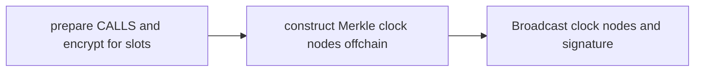
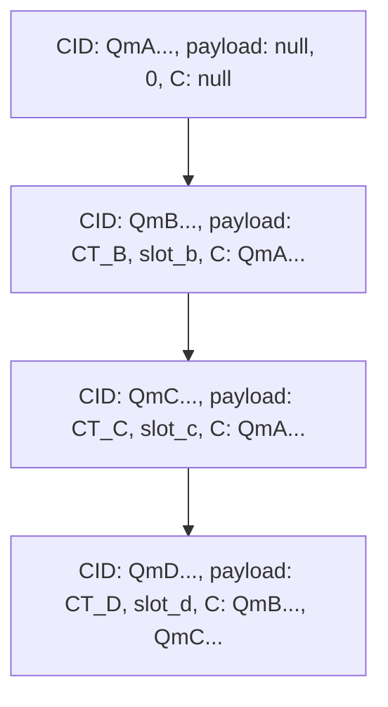
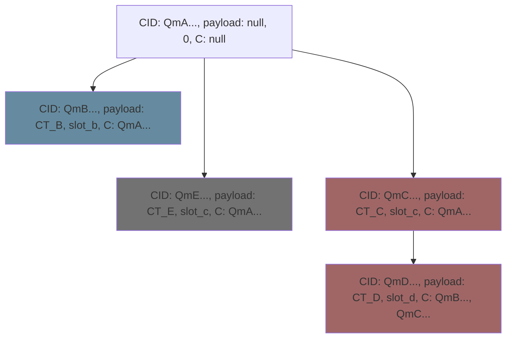
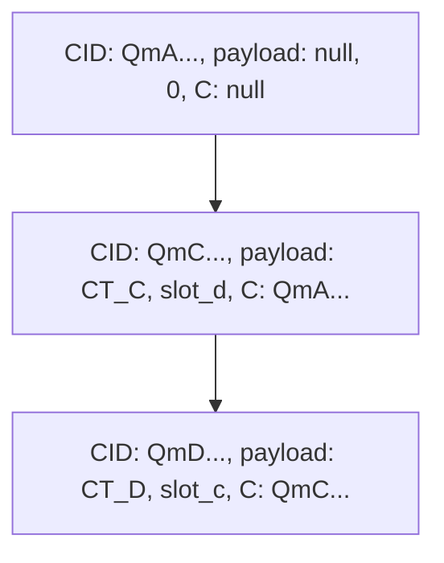
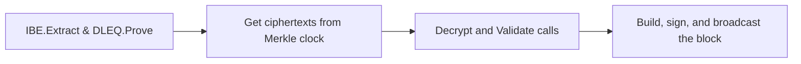
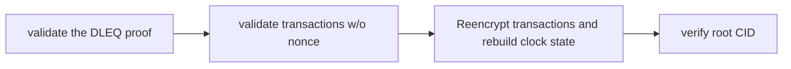

 # ETF Network

- **Team Name:** Ideal Labs
- **Payment Address:** 0x2CDA3C7D6e21Cc4f43C170c0dFf2e9F3B3B5E889 (USDC)
- **[Level](https://github.com/w3f/Grants-Program/tree/master#level_slider-levels):** 3

## Project Overview :page_facing_up:

This is a followup to [cryptex](https://github.com/w3f/Grants-Program/pull/1660).

### Overview

The ETF Network (“encryption to the future”) is a substrate-based blockchain that uses a `proof-of-extract` consensus, enabling *timelock encryption*. In this followup grant proposal, we aim to develop a **secure delayed transactions framework** on the ETF network, enabling trustless MPC protocols implemented as smart contracts. This will allow for use cases that are:

- Front-running resistant: the delayed transaction is encrypted with timelock encryption, ensuring no information can be gained prior to its execution (however, this is not true of finality, which we do not cover)
- Non-interactive: participants only need to submit a delayed transaction and wait for its execution, with no further participation required (e.g. no commit-reveal style interactions would be needed)
- Trustless and Predictable: Users can schedule transactions for the future, enabling use cases where they can rely on specific transaction executions as promised

The network uses identity-based encryption and DLEQ proofs to implement a “proof-of-extract” consensus mechanism, wherein validators leak IBE secret keys with each block produced. In our initial grant, we delivered a proof of authority version of our consensus mechanism, along with rust and typescript libraries for enabling timelock encryption in standalone libraries and in the browser, along with a proof-of-concept auction application. 

In this followup grant:

1. We aim to ensure the security and scalability of the network by implementing a `dynamic-committee proactive secret sharing` to safely add and remove validators from the network.
2. We develop a `timelocked-transaction pool` based on Merkle clocks and implement custom transaction validation logic, allowing for the construction of a timelock-encrypted 'parallel future state'.
3. We revamp the rust and javascript SDKs built during the previous milestone to include tools to build and verify timelocked transactions offchain.
4. We will also develop browser-based tools (etf.js and a transaction manager dapp) that allows users to easily construct, manage, and monitor delayed transactions (i.e. Merkle clocks).

### Project Details

#### Dynamic Committe Proactive Secret Sharing

##### Background + Description

We may require that the network’s authority set (committee) be dynamic, where authority membership can change, or where authorities may become unreachable or be banned from the network. In the initial version of our consensus mechanism, all authorities are also IBE master key custodians, each having complete knowledge of the IBE master secret, making it very difficult to securely modify the authority set of the network without a large degree of centralization since we would need to distribute the master key. 

A verifiable secret sharing scheme (such as that used by [drand](https://drand.love/docs/cryptography/#verifiable-secret-sharing)) allows for secret shares to be publicly verified, however, it does not support a dynamic committee (drand has a static set of nodes, called the "League of Entropy"). In order to realize this, we need to distribute the secret key in a way that allows outgoing committees (validator sets) to produce shares for incoming committees. A [proactive secret sharing scheme](https://www.researchgate.net/profile/Amir-Herzberg/publication/221355399_Proactive_Secret_Sharing_Or_How_to_Cope_With_Perpetual_Leakage/links/02e7e52e0ecf4dbae1000000/Proactive-Secret-Sharing-Or-How-to-Cope-With-Perpetual-Leakage.pdf) allows for secret shares to be periodically refreshed, however, this still doesn’t meet the requirement, as it does not account for committee changes. Thus, we require a dynamic committee proactive secret sharing scheme. We intend to use the scheme detailed [here](https://eprint.iacr.org/2022/971.pdf), which relies on a bivariate polynomial in order to build new keys for the next committee. We will perform additional research into the feasibility of replacing the paillier encryption used in the paper above with el gamal encryption instead, as it is also a homomorphic encryption scheme but boasts somewhat better performance (see [here](https://arxiv.org/pdf/2202.02960.pdf)).

By properly handling the handoff of keys to upcoming committees, we can ensure that the membership of the validator set can be made dynamic while also preserving the security of the system.

##### Implementation

We will implement the dynamic committee proactive secret sharing (DPSS) mechanism using the Arkworks library, specifically making heavy usage of the arkworks/algebra crates.

In the blockchain runtime, we will use substrate’s [session management](https://paritytech.github.io/polkadot-sdk/master/pallet_session/trait.SessionManager.html) capabilities in order for validators to participate in the protocol, as well as to incentivize them to behave honestly. To be specific, we will use the session manager to integrate the ‘handoff’ between committees into consensus. Further, we will upgrade our node to run within a [TEE](https://polkadot.network/blog/trusted-execution-environments-and-the-polkadot-ecosystem) to ensure the security of the secret keys and their derivation.

Our network will then reward honest participants with our inflationary native token, else lock their account if they behave adversarially. For example, for failing to participate in the protocol (by issuing invalid shares). 

In addition, we will revisit the [timelock encryption](https://ideal-lab5.github.io/etf.html#timelock-encryption-with-etf-network) developed in the previous grant in order to account for the changes above. We can provide more mathematical detail on this upon request (whitepaper WIP). 

#### Delayed Transactions

There are several mechanisms in place in substrate/polkadot to delay transaction execution, for example with the [scheduler pallet](https://github.com/paritytech/substrate/blob/master/frame/scheduler/src/lib.rs), prototypes on a [delayed xcm queue](https://forum.polkadot.network/t/deferred-execution-of-xcmp-messages/2513), and of course the [time-delay proxy](https://wiki.polkadot.network/docs/learn-proxies#time-delayed-proxy), but each solution is vulnerable to front-running attacks, among other implications of ‘knowing the future’. In order to make this process more secure, we will use our timelock encryption scheme to seal transactions for the future, ensuring they can be placed onchain but kept secret until an appropriate time. That is, we require:

- transactions are encrypted with timelock encryption (for specific future slots)
- there is an automatic/implicit execution of transctions at pre-determined times

By delaying transactions for the future, we quickly run into an obstacle: nonces. Blockchains require a total ordering of all transactions from an account. Normally, transaction nonces are monotonically increasing sequences starting at 1 (or 0). Any origin that encrypts a transaction for a future block must specify a nonce in the transaction, say k for example. By committing to this nonce, the account must only use at most nonce k-1 before the future transaction is executed, otherwise the nonce will be invalid. This is quite a major limitation for an account, as it essentially means the account needs to, at some point, *not* be able to execute anything. A naive solution could look like using a chain of proxy accounts, essentially using one 'controller' account but separate nonces via proxy. 

In order to solve this problem, we will replace nonce validation completely through the usage of [Merkle clocks](https://research.protocol.ai/publications/merkle-crdts-merkle-dags-meet-crdts/psaras2020.pdf). A merkle clock is a type of logical clock based on Merkle DAGs, were each node in the "clock" contains some "event" data, a CID, and a reference to its direct descendents (a CID set). 

Essentially, each account will be able to submit 'delayed transactions' by first defining their 'schedule' as a merkle clock, which is then merged with other clocks to build a global *total* ordering of future events (transactions). By attaching auxiliary information (or weights) to each clock-node we can obtain a global total ordering of future events to be executed. That is, each event in the merkle clock corresponds to the some signed transaction. Validators will be responsible for decrypting, verifying, and applying these transactions. They can then prune the global merkle DAG to remove executed transactions (as they would normally do in a transaction pool).
##### Overview + Design

A [Merkle-clock DAG](https://research.protocol.ai/publications/merkle-crdts-merkle-dags-meet-crdts/psaras2020.pdf) is a Merkle DAG based logical clock to represent causality information between events in a distributed system. Each node in the DAG represents an event and allows for the construction of a grow-only set of events in a distributed system. It provides a mechanism for defining a partial ordering of all events defined in the clock, and by merging with other clocks, we can produce a partial ordering of their union. Here, partial ordering means we can tell if an event `A` happened before, after, or during another event `B`. We can easily introduce total ordering to the merkle clock by including extra information related to an external clock against which the logical clock 'ticks'. Watch this youtube video from protocol labs [at the 18 minute mark](https://youtu.be/ukfrmBVrpo8?t=1078) to get a better idea of how a Merkle clock works. In general, the entire video will provide a significant amount of context beyond what we can provide in the scope of this proposal.

##### Merkle Clock-Based Transaction Pool

A transaction pool, coupled with nonces, is used to define a total global ordering of events in the system by building a total global ordering of per-account transactions. By constructing a Merkle clock for a set of future transactions to be executed at specific future slots (in consensus), we can construct a "hash-based nonce". Or rather, we can **remove nonces completely** by constructing a total global ordering of transactions using a Merkle clock instead. The idea is that each node has a local Merkle clock which serves as a 'future transaction pool'. It can update its own Merkle clock by syncing with the Merkle clock of other participants in the network, in the same way that transactions are propogated through the network. Nodes in the clock contain timelocked transactions (weighted with a slot identity) which validators are responsible for decrypting when they calculate an IBE secret and apply the transaction to the state. This can be thought of as a **future transaction pool**. This Merkle DAG based approach still retains all the security guarantess of a traditional, numerical nonce: 

- replay protection: timelocked transactions are encrypted for specific blocks, which ensure that they cannot be decrypted by secrets leaked in other blocks. Transaction signatures rely on the CID of the transaction, which ensures that it is 'in the DAG' already.
- duplicate transaction submission: Duplicate transactions would have the same CID, and so we can easily validate if it is a duplicate

The general flow for producing a chain of transactions is then:

and when syncing clock nodes received from peers:

where clock nodes are considered valid as long as the AUX data does not invalidate the **strong clock property**. That is, 'later' events must have 'later' slots associated with them, more on that later.

There is additional computational load on validators and increased storage requirements. Instead of a storing a single number to represent an account nonce, each account requires a Merkle DAG. This contains the merkle clock nodes (described in detail below), which could quickly lead to large storage requirements for the entire chain. This can be minimized via on-chain economics, enforcing upper limits, and by pruning the clock nodes. We can also offload some storage to IPFS (the actual ciphertexts). We do not have a solution yet but we will consider these issues and keep them in mind as we develop the solution.

**Timelock Encryption** 

Briefly we want to discuss how the timelock encryption scheme works at a very high level. We can represent it with three algorithms:

1. $(SK, nonce) \leftarrow Setup(1^\lambda)$ which gives us a random 128-bit secret key and 12-bit nonce (for AES-GCM).
2. $(CT, capsule) \leftarrow Tlock.Enc(M, SK, nonce, t, \{ID_i\}_{i \in [n]})$ where $M \in \{0, 1\}^*$ is any message, and $(SK, nonce)$ are the output of the setup function. Each $ID_i$ is a unique slot identity and $t < n$ is some threshold of slot secrets required to recover $SK$.
3. $M \leftarrow Tlock.Dec(CT, capsule, nonce, \{sk_i\}_{i \in [n']})$ where $\{sk_i\}_{i \in [n']}$ consists of some threshold $t < n' \leq n$ secret keys leaked by the ETF consensus mechansim, without knowledge of $SK$.

When convenient, we will just use $CT$ to represent the output of the encryption function.

Now, we will describe the timelocked-transaction pool in detail.

**Setup**

Each event in our Merkle clock represents a timelocked call, where by call we mean in the same way as [substrate](https://docs.substrate.io/reference/transaction-format/) defines a call (CALL = (EXT, DATA)). The clock node payload contains a ciphertext, a call encrypted for some slot $sl_i$ ($CT \leftarrow TLock.Enc(tx, ID(sl_i))$). We will modify the merkle clock node slightly so that it includes AUX data (or a weight on the node), which we can use to build a global total ordering of events in the clock. Each node in our Merkle clock looks like:

$(CID_i, (CT_i, AUX), \mathcal{C}_{CID_i})$
 
 where $CT_i$ is the timelocked call, $CID_i$ is the CID of the payload, $\mathcal{C}_{CID_i}$ are its direct descendents' CIDs, and $AUX$ refers to a [slot identity](https://etf.idealabs.network/docs/ETF-extras/architecture#slot-identity) for which the ciphertext is encrypted. That is, $AUX = ID(sl_k)$ for some slot $sl_k$.

**Call Encryption and Clock Construction**

Assume that the chain has some set of extrinsics that can be called. Then we can represent a runtime call as $CALL = (EXT, DATA)$, where $EXT$ refers to the extrinsic and $DATA$ refers to the input parameters to the extrinsic. In this construction, we assume that each account has a local Merkle clock that they can sync with other nodes. They can broadcast signed messages to peers which contains updates to their local clock. This is done in much the same way as transactions would normally be broadcast between peers. When receiving new, valid clock nodes from peers, nodes 'sync' them to the future transaction pool by merging with their local clocks.

1. Construct a chain of calls that you want to execute: $\{CALL_i\}_{i \in [m]}$. Each call will be sealed for a future slot and encoded in a node in the Merkle clock.
2. Instantiate an empty Merkle clock.
3. For each $CALL_i$, determine some future slot $sl_i$ and encrypt the message for the corresponding slot identity, producing $CT_i \leftarrow Tlock.Enc(CALL_i, ID(sl_i))$.
4. Based on the ordering defined in the previous step, construct and add clock nodes to the merkle clock, with the first event referencing some already-known reference CID in the rest of the peers' clocks (any event in your clock that is before the one you want to submit but will not be executed/pruned yet).
5. Each $CALL_i$'s "nonce" is then the resulting CID of the merkle-clock node $(CID_i, (CT_i, ID(sl_i)), \mathcal{C}_i)$.
6. Produce a signature for each CALL/CID combination, $SIG_i = SIGN(H(CALL_i) \oplus CID_i)$. Signatures must be made available onchain prior to execution of any given call. They don't necessarily need to be known when submitting the Merkle clock nodes though. We will need to track these signatures in a separate data structure that reference the clock nodes, a mapping $CID \to SIG$
7. Finally broadcast the constructed Merkle clock and signatures.

When receiving new clock nodes from peers:
1. Verify that the received clock does not invalidate the existing clock. If signatures have been submitted for specific clock nodes, inserting any nodes prior would invalidate these signatures. We do not have an easy way to cancel delayed transactions once they have been added to the clock. This is a pretty big liminitation that we will solve in the future. 
2. Merge the clocks and verify the CID matches an expected one (broadcast along with clock nodes just received)

It should be clear that alongside the merkle clock we also require a store of signatures for the transactions (i.e. which are valid on the decrypted ciphertexts). This would look like a storage map to associate: [CID -> SIGNATURE]

Here is a visual example of what the merkle clock would look like for three transactions built on top of a 'genesis' event.

Here, some account, say Alice, has constructed a Merkle clock for her delayed transactions, where the payload of each clock node contains both the encrypted CALL alongside the slot in blockchain consensus when that call can be decrypted.

**Merging Clocks**

When there are several clocks, they can be merged to form a global, partially ordered Merkle Clock. By using the AUX data (slot identities), we can induce a global total ordering on all events. We won't define the merging algorithm in the scope of this proposal, however, we will visually elaborate the idea:

note: the colors in this diagram work best in dark mode.

Clocks can only be merged if they are valid. That is, for any clock nodes, we must validate the AUX data associated with the node to ensure that 'later events' have slots that INCREASE within the AUX data. For example, look at the image above. There are three clocks being merged, the blue clock, $B = (n_b)$, the green one, $G = (n_e)$, and the red one $R = (n_c, n_d)$. Since each clock node in each clock is valid, where the AUX data increases with each event in the clock, the three clocks can be merged. It is then easy to see how this defines a global total ordering. The Merkle clock structure provides a partial order, and then by inspecting AUX data, we arrive at a total order, which is: $A => B => {E, C} => D$, where the ordering of $E$ and $C$ is somewhat arbitrary and left to the discretion of individual block producers.

If we replaced the red clock in the diagram with nodes where the slots are not increasing, then we would NOT merge that clock. The clock below would be invalid:

**Future Transaction Pool Validation and Execution**

Note: We know that this solution has clear limits to scalability. We do not plan to address that in the scope of this grant (and are open to suggestions).

Validator nodes are responsible for decrypting ciphertexts and executing transactions when they author blocks. They do this by first calculating an IBE secret (and DLEQ proof, as in the ETF consensus mechanism) and subsequently use it to decrypt ciphertexts. You can read more on the proof-of-extract mechanism [here](https://etf.idealabs.network/docs/ETF-extras/architecture#consensus-and-encryption-to-the-future). Instead of fetching the highest-priority transactions from the transation pool, validators use their latest known Merkle clock to fetch transactions that are weighted with the current slot identity. Once decrypted, transaction validation logic can continue unchanged, but we do not perform nonce validation and we verify the signature using the CID from the Merkle clock node.

The block contains the DLEQ proof in the block header along with a value, $r$, per transaction. This value is calculated when the ciphertext is decrypted by the validator and allows for the ciphertext to be re-encrypted in the same way. Using these value, a block importer can verify the transactions against the merkle clock. The transactions consist of unsealed timelocked transactions. After submitting the transactions, the validator prunes its state (but does not broadcast this). 

When a block is imported, a block importer verifies the DLEQ proof and the signature on the block (note: we could potentially only require a DLEQ proof). Then, they validate the transactions as usual, excluding nonce validation. Instead, validation requires that the transactions be re-encrypted and the Merkle clock be rebuilt, after which the root CID can be calculated and compared.

That is, upon receiving a block:

It could be better if we has some type of Identity based homomporphic encryption, where we could perform some calculation on the sealed call data to check if the decrypted transactions are valid without requiring re-encryption of the transactions.

##### Implementation Details

There are three large pieces of the implementation:

1. Constructing, Scheduling, Encrypting, and submitting clock nodes: 
   - This includes constructing a Merkle clock offchain and then submitting it onchain. 
   - We will use our [etf.js](https://github.com/ideal-lab5/etf.js) library as a basis for constructing clock nodes offchain, where they construct transactions, encrypt them, then define their clock.
   - This would also include the introduction of a txwrapper for constructing custom calls to the network via polkadotjs.
   
2. The Future Transaction Pool: 
   - This is the implementation of a transaction pool based on Merkle clocks. 
   - The existing transaction pool implementation in substrate will serve as the basis for this work. In fact, substrate's tx pool implementation contains `requires/provides` fields that allow for transactions to be organized into a DAG. We intend to leverage this field in order to build the Merkle Clock. 
   - Each transaction submission contains a tuple, $(CT, deadline ,requires, provides)$ where $CT$ is the ciphertext, $deadline$ is the slot when it should be decrypted, $requires$ is the CID-set $\mathcal{C}$ of direct descendents, and $provides$ is the CID of the clock node itself.
   - We will modify what a "transaction" contains (the struct), as it will no longer contain an `Extrinsic` (a ciphertext instead, so essentially just a blob of data). This, along with an additional field to represent the 'weight' on each clock node, we can quite feasibly implement this.
  
3. Transaction Execution and Clock Pruning:
   - this is mostly validator-only functionality, including block production and block import as outlined above
   - we will build this on top of our existing consensus modules, etf-aura
   - pruning will occur in much the same way as it would normally, but subject to extra checks (to account for change in ordering)
 
#### Delayed Transaction Manager

The delayed transaction manager is a set of tools and a user interface that enables users to:

- prepare and submit delayed transactions
- inspect the current chain state
- monitor delayed transaction status

Much of this functionality, such as the block explorer and preparing calls, will behave similarly to polkadotjs 'under the hood'. We also will investigate using some notification system to provide alerts on execution of delayed transactions. This will serve as a fundamental piece that allows end-users to interact with the system and prepare delayed transactions. 

There are two major components, the `scheduler` and the `explorer`.

**Scheduler UI**
The scheduler module will allow users to construct transactions and chains of transactions through a visual interface. Users would be able to schedule transactions to be executed in the future, either independently or as part of a chain of transactions. A chain of transactions is a valid merkle clock that other nodes agree to merge (i.e. valid calls chained together with provides/requires). It will incorporate tools to:

- Construct, sign, encrypt, and schedule transactions for future blocks
- Define chains of calls/transactions
- display fee estimation for future transactions

**Explorer UI**
The explorer module will allow visualization of scheduled transactions and provide options to get details during their lifecycle. It will incorporate tools to:
- Query/Search scheduled transactions (past and future).
- View detailed information on scheduled transactions
- Monitor the execution of scheduled transactions, and chains of transactions through a visual interface.
- Stretch: Subscribe to get notifications about status changes on specific scheduled transactions.

Below, we present the timelock auction version 2:

### Timelock Auction Version 2: using timelocked transactions

In our previous grant we developed a timelock auction (https://auction.idealabs.network) which uses timelock encryption to seal bids for a future deadline. After the auction's deadline, the contract allows a ‘complete’ function to be called, which requires that ciphertexts (sealed bids) be decrypted offchain, then supplied to the contract (where the data is hashed and verified against original commitments). This is not ideal, as it first requires offchain computation in order to complete the auction, and secondly it either requires  that each participant calls the complete function, or else that they have a degree of trust that another participant called it with their unsealed bid. For more detailed information, see the docs [here](https://ideal-lab5.github.io/timelock_auction.html).

By introducing delayed transactions to the auction, we can make the process require less trust and to be non-interactive. By using delayed transactions as described above, we no longer need to perform the commit-reveal style interaction that is currently in place. Instead, participants only need to schedule a single transaction onchain and wait until the scheduled transactions are executed (at the ‘deadline’ block), after which payouts can immediately be claimed from the contract with no specific input from any other participants. That is, by performing the IBE decryption in the on_initilaize hook of the scheduler pallet, we no longer require the COMPLETE function that exists in version one of the contract.

To elaborate, the auction contract we built has two functions, BID and COMPLETE, as mentioned above. In version 1 of the contract, BID accepts a timelocked ‘bid’, which should decrypt to a bid amount, whereas COMPLETE expects the revealed, decrypted value (which it verifies by checking the hash). Above the auction is an orchestrator contract, which proxies calls to the auction (so all interaction is actually through the orchestrator). After an auction is finished, the orchestrator allows a CLAIM function to be called to claim a payout. To make this non-interactive with delayed transactions, this would look like preparing a timelocked transaction to call the BID function of the contract, passing a bid amount b. That is, an account Alice prepares a call like CALL = (contract.call, BID(b)), then encrypts it for a future slot and broadcasts their merkle clock node. After the transaction is executed, the CLAIM function of the orchestrator can be invoked, with no need to “Complete” the auction. That is, we've gone from [place bid -> decrypt bids after deadline -> submit bids -> complete auction -> claim payout] to a more streamlined flow: [place bid -> claim payout].

### Ecosystem Fit

- Where and how does your project fit into the ecosystem?

ETF Network is a substrate-based chain, with most of our tools being dependent on tools built by parity and others in the community (e.g. heavy usage of polkadotjs, smoldot, substrate-connect). Beyond being a substrate-based chain, we aim to become a parachain and provide the capability to delay transactions from any other parachain.

- Who is your target audience (parachain/dapp/wallet/UI developers, designers, your own user base, some dapp's userbase, yourself)?
	
At this stage, our target audience includes developers and designers who may want to incorporate timelock encryption into their applications. As we strive to eventually provide delayed transaction capabilities in a cross-chain way (with XCM), our target audience also includes other parachains, and developers on other chains who would want to use delayed transactions.

- What need(s) does your project meet?

ETF Network enables timelock encryption, which allows us to develop the delayed transactions mechanism and ultimately act as an MPC-as-a-Service layer. This solves several problems that exist in web3 systems, most notably front-running, by allowing scheduled transactions to remain secret until desired.

As stated in the description of [delayed transactions](#delayed-transactions), there are a multitude of methods for delaying transactions both within the ecosystem and externally (e.g. scheduler pallet, delayed XCM execution, OAK network, or like this project [on ethereum](https://github.com/ethereum-alarm-clock/ethereum-alarm-clock)), but none of these approaches lend themselves to enabling MPC-type protocols, or for constructing a 'timelocked future state'. We fill this gap and are capable of easily providing front running protection to other chains.

- Are there any other projects similar to yours in the Substrate / Polkadot / Kusama ecosystem?

Not exactly. To the best of our knowledge, there are no projects that accomplish timelock encryption in the ecosystem. There are also no projects that allow for future transactions to be scheduled this way. To the best of my knowledge, I know of no other project that relies on a Merkle clock for transaction ordering, as opposed to nonces.

The most similar project could be [Oak](https://oak.tech/), which allows transactions to be scheduled for future times, however, they do not use timelock encryption and they rely on an onchain scheduler to process transactions. Their whitepaper [in section 6.2](https://docs.oak.tech/papers/oak_whitepaper.pdf) even specifically mentions that the network is vulnerable front-running attacks, which our solution specifically prevents.

Outside of the ecosystem, [drand](https://drand.love/) is the most similar project, which this proposal takes some inspiration from. Unlike drand, however, which relies on the “League of Entropy” nodes to produce randomness, we will rely on our consensus mechanism instead, as we don’t explicitly tout ourselves as a randomness beacon. There is also no mechanism to specifically delay transactions via drand, though this scheme could be modified to use drand instead of ETF Network. If ETF Network were used as a beacon, this would imply that delayed transaction layers could be implemented in other chains as well.

Additionally, the approach to delayed transactions takes inspiration from projects such as [pail](https://github.com/alanshaw/pail), though the use case is totally unrelated.

## Team :busts_in_silhouette:

### Team members

- Tony Riemer
- Carlos Montoya
- Valentina Gomez
- We are searching for a fourth team member.

### Contact

- **Contact Name:** Tony Riemer
- **Contact Email:** driemworks@idealabs.network
- **Website:** https://idealabs.network

### Legal Structure

- **Registered Address:** 604 Fort Worth Ave, Dallas, Texas 75208, USA
- **Registered Legal Entity:** Ideal Labs, LLC

### Team's experience

### Tony Riemer

I am an engineer and math-lover with a passion for exploring new ideas. I studied mathematics at the University of Wisconsin and subsequently worked at [Fannie Mae](https://en.wikipedia.org/wiki/Fannie_Mae) and then [Capital One](https://en.wikipedia.org/wiki/Capital_One), where I mainly focused on fintech products, including systems for loan servicing, efficient real-time pricing algorithms, and automation of critical customer needs. Since early 2022, I've been working exclusively in the web3 space, including having worked on previous web3 foundation grants [here](https://github.com/w3f/Grants-Program/blob/master/applications/iris.md) and [here](https://github.com/w3f/Grants-Program/blob/master/applications/iris_followup.md) and as an independent consultant. Beyond the web3-sphere, I have dabbled in many open source projects as well as have built several of my own, ranging from computer vision, machine learning, to IoT and video games. In January 2023, I attended (and graduated from) the Polkadot Blockchain Academy in Buenos Aires. Most recently, I have completed a web3 foundation grant which built the initial version of the ETF network.

### Carlos Montoya
I have been doing software for more than 20 years, most recently in the startup world. I am currently building the ETF Network as part of our mission at Ideal Labs. My passion for web3 started a couple of years ago during covid. I started my journey building smart contracts with solidity, and took part in some boot-camps and hackathons through 2021 and 2022. I built several apps, one of them a decentralized job-board protocol called [web3Jobs](https://ethglobal.com/showcase/web3jobsfevm-inz64) ([Repo](https://github.com/encode-g2-project)). Early this year I had the fortune to participate in the PBA hosted in Buenos Aires, and I have been in love with Substrate and Rust since then. The ETF Network idea emerged during my time in the academy. Furthermore, since early 2021 I have been building [TeamClass](https://www.teamclass.com) as CTO and partner. TeamClass is a b2b marketplace for helping companies with their team-building initiatives through virtual events. Previously, between 2016 and 2020 I was focused on building [StellarEmploy](https://www.stellaremploy.com) with my co-founders, where we had the opportunity to participate in NY ERA (Accelerator), and got institutional capital. StellarEmploy's technology was recently acquired by Learning Collider. Finally, between 2004 and 2015, I was CTO and Chief Architect at [MVM Software Engineering](https://www.mvm.com.co/?lang=en), a technology firm focused on power energy solutions. During my time there I had the responsibility of defining the way of doing software for the entire company, leading very skilled people, building complex software products, and managing hundreds of initiatives for helping the company to expand its operations in Colombia, the Dominican Republic, and Mexico. 

### Valentina Gomez

I'm a financial engineer who has successfully transitioned into the world of software development. Over the past two years, I've immersed myself in web development, using technologies such as Next.js, GraphQL, ReactJS, and MongoDB to create interactive functionalities on TeamClass web platform.
With an eye on the future and a strong curiosity to comprehend the technologies behind cryptocurrencies, such as Blockchain, and explore their potential applications in another fields, I've taken steps into the world of web3 and blockchain by attending  the Polkadot Blockchain Academy in Berkeley, California, where I get the essential skills to navigate this revolutionary domain.

### Team Code Repos

The intended repos for this project are (but possibly subject to name change): 

- https://github.com/ideal-lab5/etf
- https://github.com/ideal-lab5/etf-sdk
- https://github.com/ideal-lab5/etf.js
- https://github.com/ideal-lab5/contracts

Please also provide the GitHub accounts of all team members. If they contain no activity, references to projects hosted elsewhere or live are also fine.

- https://github.com/driemworks
- https://github.com/carloskiron
- https://github.com/Valentinaga1

### Team LinkedIn Profiles

- https://www.linkedin.com/in/tony-riemer/
- https://www.linkedin.com/in/cmonvel/
- https://www.linkedin.com/in/valentinaga1/

## Development Status :open_book:

- This proposal is a continuation of our first ETF Network [grant](https://github.com/w3f/Grants-Program/blob/master/applications/cryptex.md).
- The ETF Network documentation, and its current development status can be found [here](https://ideal-lab5.github.io/).

## Development Roadmap :nut_and_bolt:

In summary, the four milestones are:

1. Implement DPSS and integrate into consensus
2. Timelock Transaction Pool and Validation
3. etf.js, ETF-SDK upgrades
4. Delayed transaction manager 

### Overview

- **Total Estimated Duration:** 16 weeks
- **Full-Time Equivalent (FTE):**  2.5
- **Total Costs:** 70,000

### Milestone 1 — Upgrade Consensus with DPSS

- **Estimated duration:** 5 weeks
- **FTE:**  2.5 (12.5 weeks total capacity, 10 weeks ~ 80%)
- **Costs:** 25,000 USD (2.5 FTE @ 50 USD/hr)

Goal: To implement a secure and dynamic version of our consensus mechanism using DPSS. This enhances the security and scalability of the system, ensuring proper randomness used when performing the IBE Extract step. This ensures that we can modify the validator set without requiring redistribution of the master IBE key.

| Number | Deliverable | Specification |
| -----: | ----------- | ------------- |
| **0a.** | License | GPLv3 |
| **0b.** | Documentation (.5 weeks) | We will provide both **inline documentation** of the code and update our documentation at **etf.idealabs.network** to include the most up-to-date detailed, technical information regarding the implementation of the DPSS scheme as well as its integration into Aura. |
| **0c.** | Testing and Testing Guide (.5 weeks) | Core functions will be fully covered by comprehensive unit tests to ensure functionality and robustness. This includes unit tests for the DPSS impl, its integration into Aura, the timelock-encryption modifications, and code modifications needed to run within a TEE. We will use the cargo tarpauling tool to ensure > 80% coverage on all new lines of code. We will also perform benchmarking of the DPSS implementation, as well as its integration in to Aura, and ensure any performance issues are well-documented if unabel to be entirely resolved. |
| **0d.** | Docker (.5 day) | We will provide a Dockerfile(s) for a node which uses the consensus mechanism build as part of deliverable (2). |
| **0e.** | Article (2 days) | We will publish a substack article detailing the deliverables, accomplishments, and obstacles encountered during the implementation of this milestone. |
| **1.** | Implement DPSS (2 weeks) | We implement a dynamic committee proactive secret sharing scheme using rust. This will be an open source implementation based on [this paper](https://eprint.iacr.org/2022/971.pdf). We implement this using Arkworks, and will experiement with replacing the paillier encryption + ZKP construction with el gamal + DLEQ proofs. We do this as part of the etf-crypto-primtives code base, which is part of the etf-sdk. We also perform benchmarking of our construction. We will also test performance of the implementation by running benchamrks (like with [hyperfine](https://github.com/sharkdp/hyperfine)). |
| **2.** | Substrate module: ETF/Aura integration (2 weeks) | We integrate the DPSS scheme into the existing etf/aura implementation in order to perform a handoff of keys to new committees (authority sets) as epochs change. We also enable ETF consensus by modifying block author logic to calculate slot secrets and block import logic to verify the secrets. |
| **3.** | ETF-SDK Timelock encryption (1 week) | We update our timelock encryption scheme to account for the change as part of (1) and (2). Here, we need to ensure the correct public keys are used when encrypting messages. |
| **4.** | Substrate Module: TEE integration (2 weeks) | We modify block authoring logic to ensure that slot secrets are calculated in a TEE. We also revisit the DPSS scheme, specifically the setup phase where participants generate random polynomials, in order to perform this calculation within a TEE as well. |

Total estimated weeks: 10 weeks capacity required

### Milestone 2 — Delayed Transactions

- **Estimated Duration:** 5 weeks
- **FTE:**  2.5 (12.5 weeks total capacity, 10 weeks ~ 80%)
- **Costs:** 25,000 USD (2.5 FTE @ 50 USD/hr)

Goal: To implement the Merkle-clock based transaction pool, validator logic, and update the etf.js library to be able to add clock nodes (i.e. transactions).

| Number | Deliverable | Specification |
| -----: | ----------- | ------------- |
| **0a.** | License | GPLv3 |
| **0b.** | Documentation (.5 weeks) | We will provide both **inline documentation** of the code and update our documentation at **etf.idealabs.network** to include the most up-to-date detailed, technical information regarding the implementation of delayed transactions. |
| **0c.** | Testing and Testing Guide (.5 weeks) | Core functions will be fully covered by comprehensive unit tests to ensure functionality and robustness. We will perform benchmarks to gauge the performance of the new features in our consensus, estimating the change in computation and storage. As before, we will use cargo tarpauling to ensure > 80% coverage on new code. We will use jest in order to test the etf.js library. |
| **0d.** | Docker (1 day) | We will provide a Dockerfile(s) for a node which allows for delayed transactions. |
| **0e.** | Article (2 days) | We will publish a substack article detailing the deliverables, accomplishments, and obstacles encountered during the implementation of this milestone. |
| **1.** | Substrate Module: Merkle-Clock Transaction Pool (2 weeks) | We implement a Merkle-Clock based transaction pool. As describe above, this relies on the provides/requries fields and adds a new field to represent clock weights. |
| **2.** | Substrate Module: Validator Execution (2 weeks) | We modify validator logic to ensure that they can fetch proper merkle clock nodes, decrypt their payloads, and apply the transactions if valid. Additionally, block import logic will be modified to ensure that they can verify transactions against their own Merkle clocks. |
| **3.** | ETF.js updates (2 weeks) | We update the etf.js library to be able to submit "Merkle clock nodes" as opposed to transactions to the network. This includes building a tx-wrapper module (txwrapper-etf) in order to properly build runtime calls and the usage of our timelock encryption to encrypt transactions. This will include development of a basic testbest/example to demonstrate the functionality. |

Total estimated weeks: at least 10 weeks capacity needed

### Milestone 3: Delayed Tx Manager

- **Estimated Duration:** 4 weeks
- **FTE:**  2.5 (10 weeks total, 8 weeks ~ 80%)
- **Costs:** 20,000 USD

Goal: We build a dapp for scheduling and monitoring delayed transactions. The product will provide a way of handling derivation of accounts and managing proxy status. Likely the delayed transactions manager will be a typescript application, likely a Next.js application though we have not committed to that specific framework yet. 

| Number | Deliverable | Specification |
| -----: | ----------- | ------------- |
| **0a.** | License | GPLv3 |
| **0b.** | Documentation (.5 weeks) | We will provide both **inline documentation** of the code and a basic **tutorial** that explains how a user can use the delayed tx manager's features to manage proxy status and to use and monitor delayed transactions. We will deliver a comprehensive video demonstration which details all features of the dapp. |
| **0c.** | Testing and Testing Guide (.5 weeks) | We will test using the jest framework to ensure proper functionality of the dapp. We will also strive to use the jasmine testing framework to ensure e2e functionality of the application. |
| **0d.** | Docker (1 day) | We will provide a Dockerfile of the delayed tx manager which allows for easy deployments and local testing. |
| **0e.** | Article (2 days) | We will publish a substack article detailing the deliverables, accomplishments, and obstacles encountered during the implementation of this milestone. |
| **1.** | Scheduler UI (2 weeks) | We develop a visual tool for defining a chain of delayed transactions. This component builds transactions using the txwrapper-etf, encrypts messages with the etf.js encryption functions, and signs transactions using polkadotjs. |
| **2.** | Explorer UI (2 weeks) | We build a user interface to monitor the status of scheduled transactions and to access execution details. This interface will heavily rely on events emitted by the network. In addition, we explore the usage of too    ls such as Subquery to enhance and streamline this experience. |
| **3.** | Timelock Auction V2 (3 weeks) | We update our timelock auction delivered in the previous grant to use delayed transactions instead of timelocked bids. In addition, we demonstrate how participants can bid in auction and monitor the outcome through the delayed transaction manager. |

Note: We intend to host the UI on IPFS and also on Vercel to ensure decentralization of the application. Specifically, we will host our build on IPFS Infura.

Total estimated weeks: at least 8 weeks capacity needed

## Future Plans

In general, we plan to:
- Perform a security audit and address findings
- Complete a whitepaper which details the design (already drafted, WIP)
- We aim to deploy to kusama and become a parachain

In the next phase of the project, we intend to:  
- enable x-chain delayed transaction capabilities
- more generally, to provide "MPC-as-a-Service" across chains
- explore scalability solutions

## Additional Information :heavy_plus_sign:

- This proposal is a continuation of our first ETF Network [grant](https://github.com/w3f/Grants-Program/blob/master/applications/cryptex.md), as 'cryptex' (that name is copyrighted in the US). Furthermore, Ideal Labs and the ETF Network project was recently accepted as part of the SBP program.
- We can provide more mathematical details on request.

