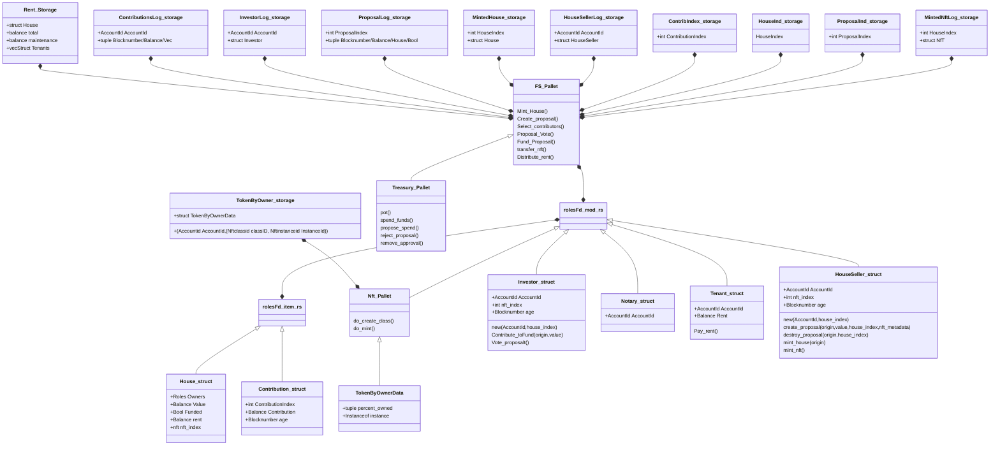

# W3F Grant Proposal 

- **Project Name:** Fair Squares (FS)
- **Team Name:** FS
- **Payment Address:** //TODO DAI(agreed)
- **[Level](https://github.com/w3f/Grants-Program/tree/master#level_slider-levels):** 2

## Project Overview :page_facing_up:

### Overview

Fair Squares aims is to co-create a more transparent and fair housing market for tenants, co-owners and social investors. In order to make rental housing more affordable and accessible to a larger group of people. 

- A brief description of our project.

Fair squares aims to implement the return-on-rent variable on rental houses that has fractional ownership. This variable brings the investor and tenant in direct relationship. Our goal is to find the right balance for the affordable housing gap. A group of individuals, each bundling their capital to invest in a house that is for sale, with the purpose to rent it out. Based on their individual fractional share of the house they will get a yield which is the social return-on-rent.

In order to create affordable housing, while offering investors a better return compared to other defensive investments. The community agrees on the capped yield, which controls the rent and keeps it affordable. These parameters are governed by the council and stakeholders that strive for a fair housing market. 

To achieve the above we rely on bringing assets on-chain and verifiable by real world actors that have the credentials to do so. By using Web3 technology in a semi-permissionless system for real-world assets together with digital currencies and decision making tools, we can lower the barrier to entry to invest in the housing market and make it transparent and equitable. 

- Integration into Substrate / Polkadot / Kusama.

The Kusama and Polkadot ecosystem allows us to use the required building blocks through the relay-chain. The substrate framework allows us to configure runtime to the custom needs and bring out a protocol that works like clockwork to onboard assets and rent them out. The already open-sourced frame pallets and other teams building blocks are helping us a lot in achieving the above.

For our the social mission to be succesful we require several actions on-chain, such as voting, selection of funds, governing and reccuring payments. We are looking to build a feeless parachain while getting the security from the relay-chain. We believe that the parachain functiunality collaboration is crucial to our mission by using multi-chain services for DIDs, stablecoins, storage protocols within the substrate web3 ecosystem. 

- Our Motivativation.

It is exciting to see the rise of DeFi, the increasing TVL of liquidity, taking over traditional finance roles such as a market-maker, but not fully. We as a team are users of these (DeFi) products and believe there is not turning back from this. Nevertheless we are seeing the negative social economical consequences, collapsing protocols, or not being fully educated just because of a juicy APR. We want to focus on the blockchain technology that is equitable no matter the time-frame you enter that creates more intervowen links to the real-world and usable in the multi-chain world. We want people to still earn returns on their investments, while building equitable systems that are accesible for all. Another  stop the profit maximization mechanisms on basic needs. 

### Project Details

We are looking to develop a first usable version of the fair-squares node and interface. A fully rounded MVP that allows us to use the core functions. We have been already coding on this since September 2021 on the code-base while participating to the APAC hackathon. Where we in very hacky way achieved parts of milestones 1 & 2 reusing parts of old archived substrate.dev codecase and our own logic on top. 

Since then we having been discussing what the modules and pallets are required to make this a working software. We ave created this type of [interface](https://youtu.be/_8mnawfNpBQ) that will be for now our front-end. In the last milestone we have a UI sepcialist on board

#### Data model

The techstack that will be created:
- Substrate node template, frame pallets and customized pallets based on FS logic
- Front-end template connected through WS,  Polkadot.js for testing specific features through the extensics.

//TODO
 deliver per milestones drawings of the flows. 

We are not aiming for an immediate parachain or live application. We are aiming for a live testnet, where a lot more testing, experimenting and interaction is required. After completion of all milestones we will  with other parachains are required to happen after the completed milestones. 

### Ecosystem Fit

- Where and how does your project fit into the ecosystem?

Looking at Kusama & Polkadot onboarding more specialized parachains offering generic functionality. We want to make use of these functions such as stable tokens, DIDs/ID, storage, privacy and messaging. We want to focus on creating a protocol and platform that focuses on solving affordable housing. It's a very specific idea in the substrate ecosystem, it has a social good focus with coordination of funds and actions in which we can automate the flow in the runtime. The fit is in the usage of relay-chain security and using all the parachain connectivity while allowing our own custom logic for the Fair Squares solution. 

- Who is your target audience (parachain/dapp/wallet/UI developers, designers, your own user base, some dapp's userbase, yourself)?

The target audience for using the developed pallets are the end-users such as investors, sellers, verifiers, oracles. The current short-term goal is to further research and experiment. We are in talks with several institutions in the Netherlands that we rely on for a functional application for affordable housing. Our goal is to get into a functional MVP that can handle a case and learn from the interaction. This will help us gather information about the limitations of interactions between Blockchain and real-world processes, and devise additional solutions.

- What need(s) does your project meet?

FS project focuses is on utilizing the available building blocks that are known in the cryptosphere to make affordable housing possible with maximum as possible transparancy, while respecting pseudonimity of the users. The real world integration of blockchains are still minimal. We have payments for pyshical goods, but nothing really interacting with the real world, business and retailers. We believe that crypto systems implementation will look very different 5-10 years from now, we hope kick that of by focusing on a real-world problem. For now the need is for the solution just to be functional, but combined with good token-design fair distributions that gives access to equitable systems for future users.

- Are there any other projects similar to yours in the Substrate / Polkadot / Kusama ecosystem?

No projects we aware of that are focusing on housing and/or real estate. There are however big parts of our design heavily inspired by the design of the governance layers in Kusama / Polkadot and Phragmén method for allocating funds in an asset. Outside of substrate based ecosystem there are a couple of real estate projects, maybe the most notable is RealT, but it just focuses on the return of rental houses, where the LLC takes care of everything on the background and users just see their tokens and returns. We want to open this up fully and create an open transparent system while lowering housing costs. 

## Team :busts_in_silhouette:

### Team members

- Name of team leader: Ilhan  Ünlü
- Names of team members: Mahir Özdemir, Kazunobu Ndong, Stephen Meyo Mba, Thibaut Segura and and Mrisho Lukamba 

### Contact

- **Contact Name:** Ilhan Unlu
- **Contact Email:** ilhan@fair-squares.nl
- **Website:** https://fair-squares.nl

### Legal Structure

- **Registered Address:** 's-Gravelandseweg 258 Room 226, 3125BK Schiedam, The Netherlands
- **Registered Legal Entity:** Fair Squares B.V.

### Team's experience

The idea of Fair Squares and work has been existing for 2 years. We wrote a light-paper to put things on paper and develop our idea further on paper. After that finished we decided to publish the idea in a hackathon to get some exposure and experience. The team that stuck after the APAC hackathon (Ilhan & Kazu). The team had limited experience in developing with Rust and Substrate, this is growing by the day.  After finishing the hackathon we had a much more clear idea of what we needed in terms of skills. After the hackathon Stephen joined us. We are not seasoned system developers, this will reflect in the FTE en Amount asked in the rest of our proposal, but we are very eager to achieve the milestones presented. 

- __Ilhan__: has experience with different blockchain development architectures. During his time with the Blocklab.nl (a innovation arm /subsidiary of the Port Authorities in Rotterdam) he has created different applications for Energy and Supply-chains using a decentralized stack. He was also a part of the first cohort runtime developers academy. Active member in Kusama / Polkadot blockchains governance and validating. 
- __Kazu__: Engineer in mechanical design at Fuji Electric. He started studying Rust in August 2021 and participated in 3 hackathons (2 with Polkadot and 1 with Phala) between August and November 2021. Most of what he has done can be found on [GitHub](https://github.com/ndkazu).  The first original program written with Rust is demonstrated in this [video](https://youtu.be/sMpUnaz_AiY)
- __Stephen__: Is a software engineer with experience mainly in .net environment, web app and desktop applications for different clients in banks, health and sport. He started to learn Rust in December with the objective to help concretize the project with his development skills according to the roadmap that we will define further. 
- __Mahir__: is responsible for the market part of the FS research and the pilots with municipalities and other stakeholders. He is involved as an entrepreneur and consultant in various IT solutions such as [unlocQed](https://www.unlocQed.com) (honest recruitment) and works on Weconomics Blockchain projects and is responsible for research, design and valorization. Mahir is not taking part in the grants program as his contribution is not technical, but is vital part of the team for busuiness development. 
- __Thibaut__: MBA and industrial design graduate, 15+ years of experience designing digital products and services for finance, insurance, luxury industry and governments. Thibaut will be focusing on th design and the front-end mainly in the last milestone. 
- __Mrisho__: Mrisho was a part of the APAC hackathon team but didn't get to really contribute. He is an active member in different substrate ecosystem channels. Studies intelligence robotics in multimedia at Malaysia University. Has 2 years experience on software engineering journey. 

Part of the team  team together has only ideating and been working on Fair squares and has not applied for other Web3F grants. 

### Team Code Repos

- https://github.com/Fair-squares  - Github Organisation
- https://github.com/Fair-Squares/fair-squares - substrate node-software
- https://github.com/Fair-Squares/fair-square-front-end- front-end for FS

Please also provide the GitHub accounts of all team members. If they contain no activity, references to projects hosted elsewhere or live are also fine.

- https://github.com/ilhanu
- https://github.com/ndkazu
- https://github.com/letodunc
- https://github.com/toosolid2003
- https://github.com/MrishoLukamba

### Team LinkedIn Profiles (if available)

- https://www.linkedin.com/in/ilhan-%C3%BCnl%C3%BC-blocklab/
- https://www.linkedin.com/in/kazunobu-ndong-469313170/
- https://www.linkedin.com/in/stephen-meyo-193109a/
- https://www.linkedin.com/in/mahirozdemir/
- https://www.linkedin.com/in/thibautsegura/
- https://www.linkedin.com/in/mrisho-lukamba/

## Development Status :open_book:

- We started of with publishing a [light-paper](https://fair-squares.nl/lightpaper/fair/squares/2021/09/14/english_whitepaper.html). To bring light to the problem and structure the idea. We have interviewed 4 organisations about these research questions presented in the light-paper that we thought needed to be enlightened. The link to the research results can be found [here](https://docs.google.com/document/d/1Y50h3JthlXBGSiG92eQP8MghSd4H07N8GKhO9d_nz7w).
- We have presented our project at amsterDOT conference, the link for the video can be found [here](https://youtu.be/rZdqHgn69wU)
- We have discussed this project with several members of the polkadot community. We talked about it couple of times with Raul from the Polkadot community whether a treasury proposal would be good, we didn't go for this as we saw a lot of parachain development projects to Kusama of Polkadot being rejected by the council. 

## Development Roadmap :nut_and_bolt:

### Overview

- **Total Estimated Duration:** 7 months
- **Full-Time Equivalent (FTE):**  2
- **Total Costs:** 36000 USD

### Milestone 1 — Implement module roles, fund and role-verifiers 

- **Estimated duration:** 6 weeks
- **FTE:**  2
- **Costs:** 7200 USD

| Number | Deliverable | Specification |
| -----: | ----------- | ------------- |
| 0a. | License | Apache 2.0 |
| 0b. | Documentation | We will provide both **inline documentation** of the code and a basic **tutorial** that explains how a user can spin up the fs-node and how to interact with the housing-fund functionality works and how to use it.|
| 0c. | Testing Guide | Core functions will be fully covered by unit tests to ensure functionality and robustness. In the guide, we will describe how to run these tests. |
| 0d. | Docker | We will provide a Dockerfile(s) that can be used to test all the functionality delivered with this milestone. |
| 0e. | Article | We will publish an **article** that explains the roles modules. In which a user can register on-chain with minimal information and participate in the fair-squares platform |
| 1. |  **pallet-roles** | We will create a Substrate pallet in which users can set their roles when they register, for now this will be a single role per address. They can choose between investor, seller, tenant, servicer (generic in this milestone). Picking a role should give the user the rights to fullfill it's role in the coming modules. | 
| 2. | __pallet-housing-fund__ | We will create a Substrate module in wich users can desposit and withdraw their funds. This fund registers which `accountId`, `amount`, and `blocknr` the funds are commited. Other variables such as the `total_contribution_user` keep up the total per user and if a user has `withdrawn(bool)` their funds. The housing fund needs to have a getter for the `total_funds`. These storages will be used further in next modules for the selection of investors. The housing fund will bid for a house, if it has the funds to bid for an asset, so it also needs a function to allow the bidding mechanism to `reserve`, `lock` and `transfer` the amount out of the housing fund and eventually is able to bid. |  
| 3. | module: **role-verifier** | built in the **roles-pallet**, this module will focus on the roles that need verification, such as businesses that will report data on-chain. These roles will be appraisers, notaries, technical verifiers, these roles might again verify retailers or other users.| 
| 4. | Substrate chain _M1_ | The end-result after this milestone that on current chain. Users and businesses should be able to register. The verification of roles will at this point be done with the help of the sudo key or activate a verifier or KYC activator that can do the rest. If roles are set users can contribute, as it will be mandatory to invest with the role.  This will be in the future connected to a DID system and KYC (not our focus at this moment). With role setting which will be built on in further milestones. |  

### Milestone 2  — Onboarding a house (asset)

- **Estimated Duration:** 6 weeks
- **FTE:**  2
- **Costs:** 7200 USD

| Number | Deliverable | Specification |
| -----: | ----------- | ------------- |
| 0a. | License | Apache 2.0 |
| 0b. | Documentation | We will provide both **inline documentation** of the code and a basic **tutorial** that explains new pallets 1 and 2. How a seller can onboard a house. How a seller can delegate the rights of selling to a real-estate agent, plus commission setting. What are the required documents, price setting and deposit required settings that are variables to be set. 
| 0c. | Testing Guide | Core functions will be fully covered by unit tests to ensure functionality and robustness. Also there will be integration tests covering the pallets and modules of milestone 1. In the guide, we will describe how to run these tests. |
| 0d. | Docker | We will provide a Dockerfile(s) that can be used to test all the functionality delivered with this milestone. |
| 0e. | Article | We will publish an **article** that explains the onboarding module, governance structure for onboarding a house and flows that are possible. 
| 1. | **pallet-onboarding** | The asset (houses) are unique assets, for this the `pallet-uniques` will be used. The additional functionalities we will extend from the pallet-uniques add fracationalizing functionality. The asset needs to fractionalize after a sale is concluded to the new owners. Furthermore only a seller can onboard an asset we will set a deposit mechanism, so not everybody can just onbaord an asset. The user will have to present some proof in this early MVP that he/she is the legal owner, this will be coded in a shortcuted way. Currently we can't really connect live systems to proof an asset is our. 
| 2. | **pallet-voting**| We will create a pallet on top the known frame pallets. collective pallet and devise the pallet to democratic systems that are required for FS. The housing-council will be very much the first line of defence and it's structure and selection is very similar to the council as we know from kusama/polkadot. The housing council will be able to asses an asset and approve, reject, request more info. We need to give the housing council access to these tools. When approved the asset can continue to the investor voting. The investor voting is set by their role. We can set a minimum to the investors of investing. We ask the investors to vote from a POV of wether they see the asset presented to them worthy of investing. The investors don't know with certainty that their capital will be allocated on the house their voting. It's being voted from the POV that the housing fund will be used.|  
| 3. | Substrate chain _M2_ | Pallets **onboarding** and **voting** will allow onboarding of assets even though it will be a very of onboarding assets while on-chain governance by the housing council act as a 2-step due diligence. The steps from milestone 1 will also be upgraded with this as we need new roles for council members. |  

### Milestone 3  — Bidding Mechanism

- **Estimated Duration:** 6 weeks
- **FTE:**  2
- **Costs:** 7200 USD

| Number | Deliverable | Specification |
| -----: | ----------- | ------------- |
| 0a. | License | Apache 2.0 |
| 0b. | Documentation | We will provide both **inline documentation** of the code and a basic **tutorial** that explains what the bidding mechanism does and why it's designed that way. 
| 0c. | Testing Guide | Core functions will be fully covered by unit tests to ensure functionality and robustness. Also there will be integration tests covering the pallets and modules of milestone 1,2 and 3. In the guide, we will describe how to run these tests. |
| 0d. | Docker | We will provide a Dockerfile(s) that can be used to test all the functionality delivered with this milestone. |
| 0e. | Article | We will publish an **article** that explains the bidding mechanism, what purpose it serves and why it's necessary. Furthermore in the artcile we will expand on the timer module and the flow of the bidding mechanism. The effects of the scenario's we will run through.
| 1. | **pallet-bidding** | The bidding mechanism is a big part of what makes FS fair, the bidding pallets job is calculating the allocations from the `housing_fund` it will assemble different investors according to the fair rule-set, which will be be configurable on-chain. The Rules are as follows: _1._ First come, first serve (blocknr) based on deposit _2._ If a share of the contribution is taken out the user will drop in the ranking (points ranking) _3._ No more than X% share per participant and no more than X participants. _4._ The housing fund is programmed to make a bid, but has to adhere to the above rules, then a bid can be placed. When a bid is made, the set of investors are known, if the bid is succesful this is taken along with the fractional share investors get based on the price.|
| 3. | Module: **timer** | The timer is the on-chain mechanism that checks every X hours (session) if new and old assets are available and it can bid on assets, if it has enough funds in housing fund. If already a bid took place it takes no action. If the housing-fund doesn't have the funds, it's doesn't bid. All events are registered. 
| 4. | Module: **fractioning** | When the bidding-pallet has assembled the set of investors and the bid is succesful. This is passed along to the fractionalizing module that fractions the assets purchase price with the  the investors and gives them a share of the unique-asset.| 
| 5. | Substrate chain _M3_ | The combination of the previous milestones and this one, with **pallet-bidding** gives us automation that FS can bid on a asset (house) based on the funds it has on-chain. In a still a simplified flow, however with the next milestone more on-chain verificaton is added based on verified roles in the off-chain world. **Note**: _for this milestone we will take a shortcut with finalizing the sale, the next milestone we will focus on making it more secure the interaction with the off-chain world._ |  

### Milestone 4  — finalizing sale, representative, finding a tenant 

- **Estimated Duration:** 6 weeks
- **FTE:**  2
- **Costs:** 7200 USD

| Number | Deliverable | Specification |
| -----: | ----------- | ------------- |
| 0a. | License | Apache 2.0 |
| 0b. | Documentation | We will provide both **inline documentation** of the code and a basic **tutorial** that walks through how finalization works, how this role can be acquired and why it was created. The same applies to the representative. Both have a different function and can be called upon after specific situations. We will also walk through 
| 0c. | Testing Guide | Core functions will be fully covered by unit tests to ensure functionality and robustness. Also there will be integration tests covering the pallets and modules of milestone 1,2,3,4 . In the guide, we will describe how to run these tests. |
| 0d. | Docker | We will provide a Dockerfile(s) that can be used to test all the functionality delivered with this milestone. |
| 0e. | Article | We will publish an **article** that explains the the usage of the functionality in additon to the previous milestones. The article will emphasize why finalization of the asset acquirement is required, why a representative is needed and what it's role is. How other previous stakeholders interact with the new functions and roles.|
| 1. | **pallet-finalizer** | Before the house title can be transfered to the fractional new owners when the sale of an asset sale is succesful there needs to be checks done by the appointed notary. This is the authority, also in the current finalization of the title transfers. Notaries make sure the new buyers are aware of what they are buing and the notary makes sure no one else can write the asset on their name. In FS's case this swap is done by the blockchain, but the notary would give the green light. The finalization will be it's own pallet and functionality will be expanded in the future. The roles will be set in **pallet-roles**, which gives the notary and the land registry users rights to let the exchange pass. The transfer titles need to be proofs, the proof for now will be simplified random hashes, but only the notary role should be allowed to and sigantures by the notary roles |
| 2. | Module: **representative** | When the sale of an asset is finalized, the new fractionalized owners are to be assigned a representative. The representative of the owners finds a tenant from the pools of tentants registered on-chain. The representatitive has to find the match based on region, total inhabitants and costs. The tenant will have to provide all this information. that will represent the house owners and find a tenant. |
| 3. | Module: **landlord-voting** | With the sale being finalized the new asset-owners/landlords can vote in a representative, vote over improvements, lay-down a representative if it doesn't perform or represent the best interest of the owners. This module is created in the **pallet-roles** and **pallet-voting** |
| 4. | FS-chain | In milestones we build the functionality further with the **pallet-finalizer** the finalizer, gives us the certainty that a sworn trusting legal entity is able to finalize the sale and with the representatitve we us the finalization of the asset and fractional owners. With the following new modules landlord voting, we can give the shareholders of a house a say in who get's to be the representative. So the next steps for matching can be handled.   | 

### Milestone 5 — Matching, reccuring payments and UI development

- **Estimated Duration:** 6 weeks
- **FTE:**  2
- **Costs:** 7200 USD

| Number | Deliverable | Specification |
| -----: | ----------- | ------------- |
| 0a. | License | Apache 2.0 |
| 0b. | Documentation | We will provide both **inline documentation** of the code and a basic **tutorial**  that explains how the user can navigate through the interface. 
| 0c. | Testing Guide | Core functions will be fully covered by unit tests to ensure functionality and robustness. In the guide, we will describe how to run these tests. |
| 0d. | Docker | We will provide a Dockerfile(s) that can be used to test all the functionality delivered with this milestone. |
| 0e. | Article | We will publish an **article** and **video** that explains what actions you can take on the front-end does and the build up of the several pages. 
| 1. |  Module: **matching** | We will expand on the tenants registration, we will be keeping when a tenant is registered, what region they are applying for and how big their family is. We will also epand on this on the asset (home) features side. So we can the offer with the demand. The representative, will have the  these two things. |
| 2. |  **pallet-recurring-payments** | The renter will have to place a deposit and the monthly rent in. The rent can be credited per x-block basis. The recurring payment can also go in the negative if the renter cannot pay the rent on time, let's say per rule-of-law 14 days and it signals the representative after this time to get in touch. |
| 2. |  **UI & frond-end** | During the time of development also in previous milestone we will have produced several wire-frames and a front-end frame we will work with. We want to have for each main section page, which are: Funding, Onboarding, Voting, Finalizing and Renting. These will be the most used functionalities. If time allows also a front-end a dashboard that shows the total homes that are on the platformm, the value locked etc. |
| 2. | Total product FS | The combination of the previous milestones and this one, with UI gives us the  us the automation the first iteration of the Fair Squares platform that will allow us a crowdfunded fair housing protocol, with an simplified legal acceptance framework. | 

## Future Plans

### Short to medium term

- We intend to enter the substrate builders program with our developed solution, hopefully we are elegible to be fast-tracked. 
- We intend to bring-up a public live testnet with an interface in which everyone can use Fair squares. The developed solution is based on all of the functionality on the milestones. The time frames  might be tweaked so the platform can work faster. Setting roles will be publicly available and we will be monitoring the chain to see if we can assist and verify users. 
- We will notify partners we have interviewed and see based on our solution we have built to get their feedback and see if we can continue experimenting with them to build a next iteration, not only the software but also the 
- On the medium term we are looking to have funding that is neutral and benefits from this solution. This is usually falls into the corner of public institutions. 

### Long Term
In 1-3 years from now we hope to found a legal framework and partnership with municipality, state or governmental level that gives us the pass to implement this. We aim to organize from the bottom-up with other parties that find this relevant and iterate together with them. Ideally we would needed to get funded by a neutral party that benefits from this. But we like to take it step for step. 

## Additional Information :heavy_plus_sign:

**How did you hear about the Grants Program?** 
We have been around in the ecosystem for some time and we knew from the W3F grants program since it's inception.

 Work you have already done?
  - We have all finished most of the substrate.dev tutorials and guides that are available. We are well aware of all usable pallets the tools and support places we can ask.
  - Since the amsterDOT some teams such as Acala have offered to also support technically and other ways. Before the amsterDot we were in talks with Litentry for the DID programme, this resulted in a technical chat with their runtime engineers that we can get technical support from, but the application is not continuing anymore because of a change in their structure. 
  - We are in talks with municipalities in the Netherlands to build towards a case and apart from the technical part, we just need the partnerships and coalition just as much as the node-software.
  - Some structural parts of the milestones are done in the branche [structure-template](https://github.com/Fair-Squares/fair-squares/tree/structure_template)