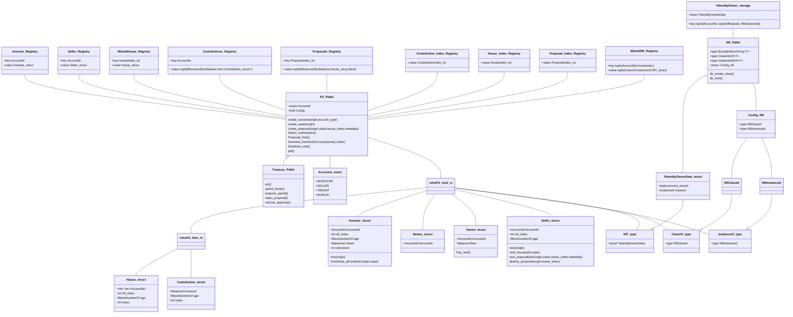
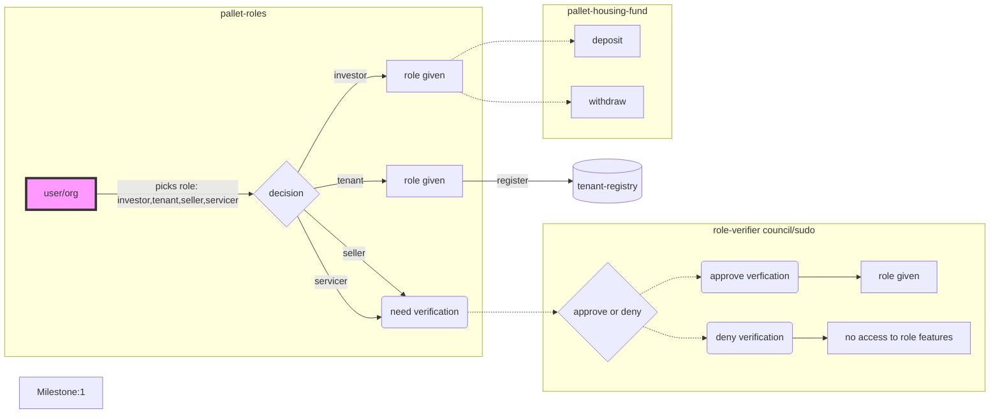
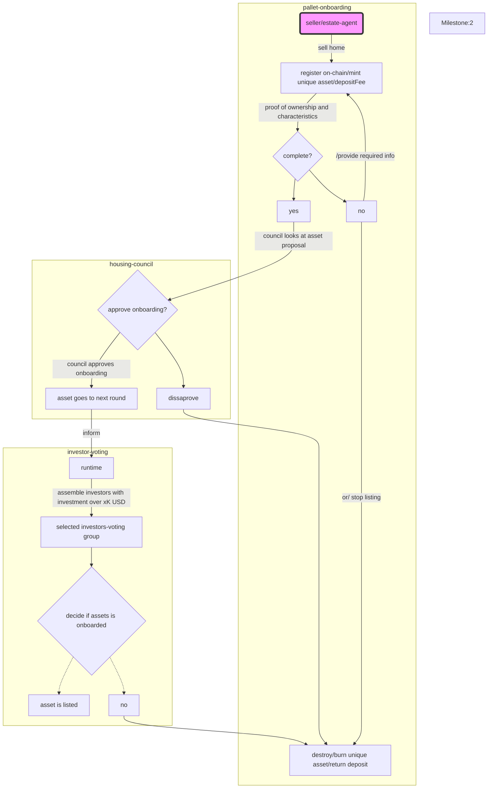
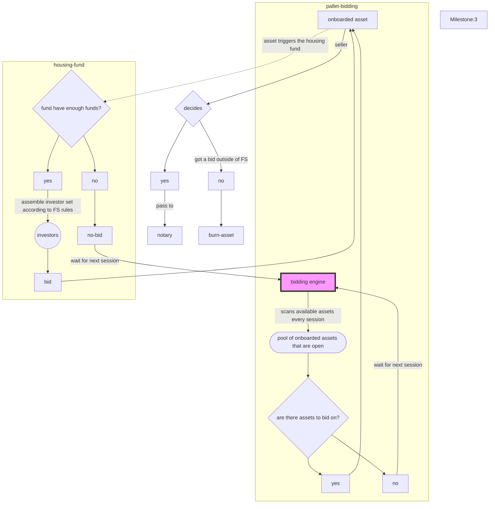
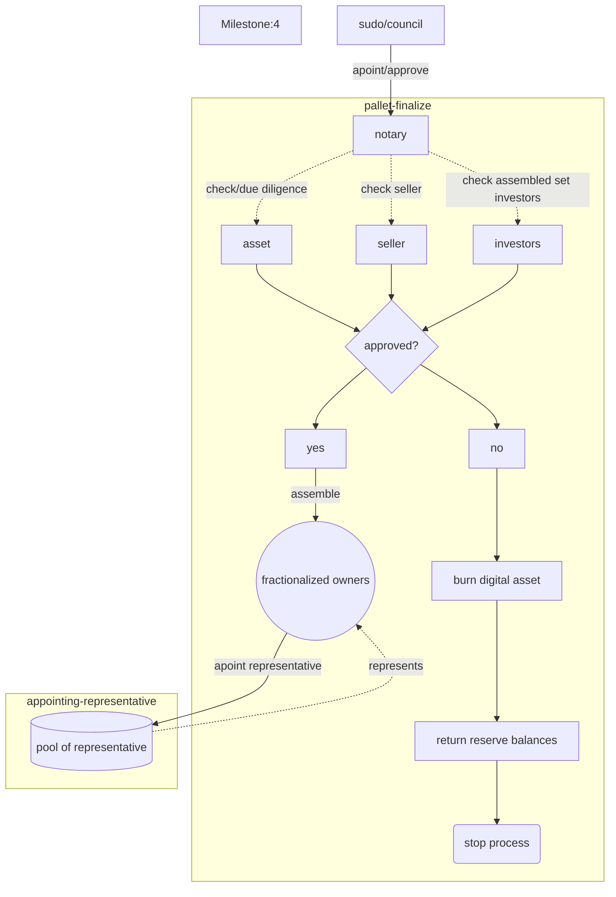

# Fair Squares (FS)

- **Team Name:** FS
- **Payment Address:** 0xED3f3bB424F4a3b254DF0D1a51DD4e7BC5f40e66 (ETH/DAI)
- **[Level](https://github.com/w3f/Grants-Program/tree/master#level_slider-levels):** 2

## Project Overview :page_facing_up:

### Overview

Fair Squares aims to co-create a more transparent and fair housing market for tenants, co-owners and social investors. In order to make rental housing more affordable and accessible to a larger group of people. 

- A brief description of our project.

Fair squares is a coordination framework for onboarding, financing and housing of real estate assets where affordability & equitability are the guiding principles. It implements a return-on-rent model for the new fractional owners. The return-on-rent variable brings the investor and tenant in direct relationship, with a view to create the right balance to close the affordable housing gap. A group of individual investors, each bundling their capital to invest in a house that is for sale, get together with purpose to rent it out. Based on their individual fractional share of the house, their investment produces an acceptable yield, which is the social return-on-rent.

The purpose of this project is to stimulate affordable housing, through the use of a blockchain, while offering investors a similar return compared to other defensive investments. The blockchain runtime has the required modules to finance, onboard assets, bid, transact and rent out. These parameters are governed by the council and stakeholders that strive for a fair housing market. 

To achieve the above, we rely on bringing assets on-chain and verifiable by real world actors that have the credentials to do so. By using Web3 technology in a semi-permissionless system for real-world assets, together with digital currencies and decision making tools, we can lower the barrier to entry to invest in the housing market and make it transparent and equitable for investors and renters.

- Integration into Substrate / Polkadot / Kusama.

The substrate framework allows us to configure runtime to the custom needs to create a protocol that works to onboard assets and rent them out. The already open-sourced frame pallets and other teams building blocks are helping us to achieve our goal. 

For our social mission to be succesful, we require several actions on-chain, such as voting, selection of funds, governing and reccuring payments. We are looking to build a feeless parachain while getting the security from the relay-chain. We believe that the parachain functiunality collaboration is crucial to our mission by using other multi-chain services for DIDs, stablecoins and storage protocols within the substrate web3 ecosystem.

- Our motivation.

It is exciting to see the rise of DeFi, the increasing TVL of liquidity, taking over traditional finance roles such as a market-maker, but not quite. We as a team, are users of these (DeFi) products and believe there is no turning back from this. Nevertheless, we are seeing the negative social economical consequences , collapsing protocols, or not being fully educated just because of a juicy return.

 We want to focus on the blockchain technology that is equitable, no matter the time-frame you enter the blockchain, so you don't have the feeling your missing out something. 
 
Finally, our project will contribute to stop profit maximization on basic needs while striving to keep both ends of the supply and demand in balance. We strongly believe that the blockahin is the perfect technology to reconcile all stakeholders invovled in the social real-estate market, thus working to stregthen public good.

### Project Details

We are looking to develop a first usable version of the Fair squares node and interface: a fully rounded MVP that allows future users to use the core functions. We have been already coding on this since September 2021 on the code-base while participating to the APAC hackathon. We managed to reach parts of milestones 1 & 2 by reusing parts of old archived substrate.dev codecase while adding our own logic on top.

Since then, we having been discussing what the modules and pallets are required to do to make this a working poiece of software. We ave created this type of [interface](https://youtu.be/_8mnawfNpBQ) that will be for _now_ our front-end. In the last milestone, we are set to have a UI specialist on board.

#### Data model

The **techstack** that is currently focused on:

- Substrate node, substrate pallets and customized pallets based on FS logic
- Front-end template connected through WS,  Polkadot.js for testing specific features through the extrinsics.

We are building this system so we can create a testnet and invite and educate the committed organizations, such as municipalities, housing coops and other important roles. We aim at co-creating simulations against current financing structures and trigger real user feedback.  We want to go first for a live testnet where further testing, experimenting and coordination can take place. This will give us the time to focus and iterate again after completion of all milestones.

### Ecosystem Fit

- Where and how does your project fit into the ecosystem?

Looking at Kusama & Polkadot, there are more specialized parachains being onboarded that offer generic functionalities. We want to make use of these functions such as stable tokens, DIDs/ID, storage, privacy and messaging. We want to focus on creating a protocol and platform that focuses on solving affordable housing. It's a very specific idea in the substrate ecosystem, it has a social good focus with coordination of funds and actions in which we can automate the flow in the runtime. The fit is in the usage of relay-chain security and using all the parachain connectivity while allowing our own custom logic for the Fair Squares solution.

- Who is your target audience ?

The target audience for using the developed pallets are the end-users such as investors, sellers, verifiers, oracles. The current short-term goal is to further research, experiment and zero-in on our product/market fit. We are in talks with several institutions in the Netherlands that we rely on for further developing this concept to bring it in the longer term future to be a  functional application for affordable housing. Our goal is to get into a functional MVP that can handle a case and learn from the interactions. This will help us gather information about the limitations of interactions between FS blockchain and real-world processes, and devise additional solutions.

- What need(s) does your project meet?

FS project focuses is on utilizing the available building blocks that are known in the  to make affordable housing possible with maximum as possible transparancy, while respecting pseudonimity of the users. The real world integration of blockchains are still minimal. We have payments for pyshical goods, but nothing really interacting with the real world, business and retailers. We believe that crypto systems implementation will look very different 5-10 years from now, we hope to kick-start that by focusing on a real-world problem. For now, the need is for the solution just to be functional enough to allow real-world testing, but combined with good token-design and fair distributions that give access to equitable systems for future users.

- Are there any other projects similar to yours in the Substrate / Polkadot / Kusama ecosystem?

We are not aware of any other projects that are focusing on housing and/or real estate in the Substrate / Polkadot / Kusama ecosystem. This project is pretty unique in the web. There are however big parts of our design that are heavily inspired by the design of the governance layers in Kusama / Polkadot and Phragmén method for allocating funds in an asset. Outside of substrate based ecosystem, there are a couple of real estate projects, maybe the most notable being RealT, but it just focuses on the return of rental houses, where the LLC takes care of everything on the background and users just see their tokens and returns. We want to open this up fully and create an open transparent system while lowering housing costs.

## Team :busts_in_silhouette:

### Team members

- Name of team leader: Ilhan  Ünlü
- Names of team members: Mahir Özdemir, Kazunobu Ndong, Stephen Meyo Mba, Thibaut Segura and Oliver Lim

### Contact

- **Contact Name:** Ilhan Unlu
- **Contact Email:** ilhan@fair-squares.nl
- **Website:** <https://fair-squares.nl>

### Legal Structure

- **Registered Address:** 's-Gravelandseweg 258 Room 226, 3125BK Schiedam, The Netherlands
- **Registered Legal Entity:** Fair Squares B.V.

### Team's experience

The idea of Fair Squares and work has been existing for 2 years. We wrote a [light-paper](https://drive.google.com/file/d/1Uz_eTUKOcvjQu9R5zYNVJoF2KNGts7kW/view)(Mahir and Ilhan) to have a document and share it with similarly minded organisations. After publishing the light-paper, we decided to take part in a hackathon to get some exposure and experience and maybe get to know some other substrate enthousiast. The tech-team that stayed together after the APAC hackathon were Ilhan & Kazu. We had limited experience in developing with Rust and Substrate. But we have come a long way since then and are comfortable in developing the below milestones with the team below. After finishing the hackathon we had a much more clear idea of what we needed in terms of skills. After the hackathon Stephen joined us. We are not seasoned system developers, this will reflect in the FTE en Amount asked in the rest of our proposal, but we are very eager to achieve the milestones presented and are confident we will.

- **Ilhan**: has experience with different blockchain development architectures. During his time with the Blocklab.nl (a innovation arm /subsidiary of the Port Authorities in Rotterdam) he has created different applications for Energy and Supply-chains using a decentralized stack. He was also a part of the first cohort runtime developers academy. Active member in Kusama / Polkadot blockchains governance and validating.
- **Kazu**: Engineer in mechanical design at Fuji Electric. He started studying Rust in August 2021 and participated in 3 hackathons (2 with Polkadot and 1 with Phala) between August and November 2021. Most of what he has done can be found on [GitHub](https://github.com/ndkazu).  The first original program written with Rust is demonstrated in this [video](https://youtu.be/sMpUnaz_AiY)
- **Stephen**: Is a software engineer with experience mainly in .net environment, web app and desktop applications for different clients in banks, health and sport. He started to learn Rust in December with the objective to help concretize the project with his development skills according to the roadmap that we will define further.
- **Mahir**: is responsible for the market part of the FS research and the pilots with municipalities and other stakeholders. He is involved as an entrepreneur and consultant in various IT solutions such as [unlocQed](https://www.unlocQed.com) (honest recruitment) and works on [Weconomics blockchain projects](https://weconomics.org/) and is responsible for research, design and valorization. Mahir is not taking part in the grants program as his contribution is not technical, but is vital part of the team for busuiness development.
- **Thibaut**: Thibaut will be focusing on th design and the front-end mainly in the last milestone. He brings 15+ years of experience in digital product design, user research, and product/market fit methodologies.
- **Oliver**: Software engineer with experience in web, desktop and mobile applications. Keen on competitive programming, very interested in analyzing and tackling with highly challenging technical problems.

Part of the team together has only ideating and been working on Fair squares and has not applied for other Web3F grants.

### Team Code Repos

- <https://github.com/Fair-squares>  - Github Organisation
- <https://github.com/Fair-Squares/fair-squares> - substrate node-software
- <https://github.com/Fair-Squares/fair-square-front-end>- front-end for FS

Please also provide the GitHub accounts of all team members. If they contain no activity, references to projects hosted elsewhere or live are also fine.

- <https://github.com/ilhanu>
- <https://github.com/ndkazu>
- <https://github.com/letodunc>
- <https://github.com/toosolid2003>
- <https://github.com/cuteolaf>

### Team LinkedIn Profiles (if available)

- <https://www.linkedin.com/in/ilhan-%C3%BCnl%C3%BC-blocklab/>
- <https://www.linkedin.com/in/kazunobu-ndong-469313170/>
- <https://www.linkedin.com/in/stephen-meyo-193109a/>
- <https://www.linkedin.com/in/mahirozdemir/>
- <https://www.linkedin.com/in/thibautsegura/>
- <https://www.linkedin.com/in/oliver-lim-2215a8235/>

## Development Status :open_book:

- We started of with publishing a [light-paper](https://fair-squares.nl/lightpaper/fair/squares/2021/09/14/english_whitepaper.html). To bring light to the problem and structure the idea. Suggestion 7 : We interviewed 4 employees from 3 organizations about these research questions in the light-paper that we thought needed to be enlightened. The link to the research results can be found [here](https://docs.google.com/document/d/1Y50h3JthlXBGSiG92eQP8MghSd4H07N8GKhO9d_nz7w).
- We have presented our project at amsterDOT conference, the link for the video can be found [here](https://youtu.be/rZdqHgn69wU)
- We have discussed this project with several members of the polkadot community. We talked about it couple of times with Raul from the Polkadot community whether a treasury proposal would be good, we didn't go for this as we saw a lot of parachain development projects to Kusama of Polkadot being rejected by the council. With the Square-one developments and close after amsterDot we believed further developing the idea with support from W3F grant was the next best step.
- Our repo is in active development, but with the milestones we will create according to spec.

## Development Roadmap :nut_and_bolt:

### Overview

- **Total Estimated Duration:** 6 months
- **Full-Time Equivalent (FTE):**  2
- **Total Costs:** 36720 USD

### Milestone 1 — Implement module roles, fund and role-verifiers

- **Estimated duration:** 5 weeks
- **FTE:**  2
- **Costs:** 7200 USD

| Number | Deliverable | Specification |
| -----: | ----------- | ------------- |
| 0a. | License | Apache 2.0 |
| 0b. | Documentation | We will provide both **inline documentation** of the code and a basic **tutorial** that explains how a user can spin up the fs-node and how to interact with the housing-fund and creating a role and identity. |
| 0c. | Testing Guide | Core functions will be fully covered by unit tests to ensure functionality and robustness. In the guide, we will describe how to run these tests. |
| 0d. | Docker | We will provide a Dockerfile(s) that can be used to test all the functionality delivered with this milestone. |
| 0e. | Article | We will publish an **article** that explains the roles modules. In which a user or can register on-chain with minimal information and participate in the fair-squares platform. The investor role  |
| 1. |  **pallet-roles** | We will create a Substrate pallet in which users can set their roles when they register, for now this will be a single role per address. They can choose between investor, seller, tenant, servicer (generic in this milestone). Picking a role should give the user the rights to fullfill it's role in the coming modules. The investor and tenant role will be for now KYC-free. They can imediately play around with test-tokens. The other roles will need to go through a verifier. A seller and server have to go through vetting process. Sequence diagram for [create_account](https://raw.githubusercontent.com/Fair-Squares/fs-docs/dev/docs/diagrams/backend_structure_temlplate_refactor_branch/sequence_diagram_create_account.svg)|
| 2. | **pallet-housing-fund** | We will create a Substrate pallet in wich users can desposit and withdraw their funds. This fund registers which `accountId`, `amount`, and `blocknr` the funds are commited. Other variables such as the `total_contribution_user` keep up the total per user and if a user has `withdrawn(bool)` their funds. The housing fund needs to have a getter for the `total_funds`. These storages will be used further in next modules for the selection of investors. The housing fund will bid for a house, if it has the funds to bid for an asset, so it also needs a function to allow the bidding mechanism to `reserve` and `transfer` the amount out of the housing fund and eventually is able to bid. Sequence diagrams for [deposit](https://raw.githubusercontent.com/Fair-Squares/fs-docs/dev/docs/diagrams/backend_structure_temlplate_refactor_branch/sequence_diagram_add_contribution_fund.svg) and [withdraw](https://raw.githubusercontent.com/Fair-Squares/fs-docs/dev/docs/diagrams/backend_structure_temlplate_refactor_branch/sequence_diagram_withdraw_fund.svg)|  
| 3. | module: **role-verifier** | built in the **roles-pallet**, this module will focus on the roles that need verification, such as businesses that will report data on-chain. These roles will be appraisers, notaries, technical verifiers, these roles might again verify retailers or other users. |
| 4. | Substrate chain _M1_ | After this milestone users and businesses should be able to pick a role and register. The verification of roles will at this point be done with the help of the sudo key. If roles are set users can contribute, as it will be mandatory to invest with the role.  This will be in the future connected to a DID system and KYC (not our focus at this moment). With role setting which will be built on in further milestones. |  

 

### Milestone 2  — Onboarding a house (asset)

- **Estimated Duration:** 6 weeks
- **FTE:**  2
- **Costs:** 7920 USD

| Number | Deliverable | Specification |
| -----: | ----------- | ------------- |
| 0a. | License | Apache 2.0 |
| 0b. | Documentation | We will provide both **inline documentation** of the code and a basic **tutorial** that explains new pallets 1 and 2. How a seller can onboard a house. How a seller can delegate the rights of selling to a real-estate agent, plus commission setting. What are the required documents, price setting and deposit required settings that are variables to be set.
| 0c. | Testing Guide | Core functions will be fully covered by unit tests to ensure functionality and robustness. Also there will be integration tests covering the pallets and modules of milestone 1. In the guide, we will describe how to run these tests. |
| 0d. | Docker | We will provide a Dockerfile(s) that can be used to test all the functionality delivered with this milestone. |
| 0e. | Article | We will publish an **article** that explains the onboarding module, governance structure for onboarding a house and flows that are possible.
| 1. | **pallet-onboarding** | The asset (houses) are unique assets, for this the `pallet-uniques` will be used. The additional functionalities we will extend from the pallet-uniques add focus on specializing it for real esate. The seller role needs to call `onboardAsset` and needs to provide information about the house such as `sqm`,`price`,`reports` and `proof of ownership`. Furthermore a `despositFee` is required so not everybody can just onboard an asset, which will be X% of the sellprice. The user will have to present some proof in this early MVP that he/she is the legal owner, this will be built simplistic way. See sequence diagram to [onboard an asset](https://raw.githubusercontent.com/Fair-Squares/fs-docs/dev/docs/diagrams/backend_structure_temlplate_refactor_branch/sequence_diagram_create_proposal.svg).|
| 2. | **pallet-voting**| We will customize the known frame pallets such as `democracy` and `collective` pallet and devise to fit the voting structures that are required for FS. The **housing-council** will be the first line of defence and it's structure and selection is very similar to the council as we know from kusama/polkadot. The housing council will be able to asses an asset and approve, reject, request more info. Creating custom calls for the housing council specific to asset information is crucial to determine the state of an asset onboarding. When approved the asset can continue to the investor voting. The **investor-voting** is randomly selected by their role. We can set a minimum of X investors to vote. They will vote from tehir POV whether the asset presented to them is worthy of investing. The investors don't know with certainty that their capital will be allocated on the house their voting. It's being voted from the POV that the housing fund will be used. See also the sequence diagram based for [investor-voting](https://raw.githubusercontent.com/Fair-Squares/fs-docs/dev/docs/diagrams/backend_structure_temlplate_refactor_branch/sequence_diagram_vote_proposal.svg)|  
| 3. | Substrate chain _M2_ | Pallets **onboarding** and **voting** will allow onboarding of assets with a two-layer governance approach with different interests. The council will be for now voted in with sudo by protocol creators and the investors will be selected by on-chain runtime. As additional work we can ping the voters through their discord or element ID  though when we need their on-chain voting power and decision making. Council members can be any identity, they are voted in by sudo and for the sake of iterating and finding conflicts of interests is also a part of the discovery process. |  

 

### Milestone 3  — Bidding Mechanism

- **Estimated Duration:** 5 weeks
- **FTE:**  2
- **Costs:** 7200 USD

| Number | Deliverable | Specification |
| -----: | ----------- | ------------- |
| 0a. | License | Apache 2.0 |
| 0b. | Documentation | We will provide both **inline documentation** of the code and a basic **tutorial** that explains what the bidding mechanism does and why it's designed that way.
| 0c. | Testing Guide | Core functions will be fully covered by unit tests to ensure functionality and robustness. Also there will be integration tests covering the pallets and modules of milestone 1,2 and 3. In the guide, we will describe how to run these tests. |
| 0d. | Docker | We will provide a Dockerfile(s) that can be used to test all the functionality delivered with this milestone. |
| 0e. | Article | We will publish an **article** that explains the bidding mechanism, what purpose it serves and why it's necessary. Furthermore in the artcile we will expand on the timer module and the flow of the bidding mechanism. The effects of the scenario's we will run through.
| 1. | **pallet-bidding** | The bidding mechanism is a big part of what makes FS fair, the bidding pallets job is calculating the allocations from the `housing_fund` it will assemble different investors according to the fair rule-set, which will be be configurable on-chain. The Rules are as follows: _1._ First come, first serve (blocknr) based on deposit _2._ If a share of the contribution is taken out the user will drop in the ranking (points ranking) _3._ No more than X% share per participant and no more than X participants. _4._ The housing fund is programmed to make a bid, but has to adhere to the above rules, then a bid can be placed. When a bid is made, the set of investors are known, if the bid is succesful this is taken along with the fractional share investors get based on the price.|
| 3. | Module: **timer** | The timer is the on-chain mechanism that checks every X hours (session) if new and old assets are available and it can bid on assets, if it has enough funds in housing fund. If already a bid took place it takes no action. If the housing-fund doesn't have the funds, it's doesn't bid. All events are registered.
| 4. | Module: **fractioning** | When the bidding-pallet has assembled the set of investors and the bid is succesful. This is passed along to the fractionalizing module that fractions the assets purchase price with the  the investors and gives them a share of the unique-asset.|
| 5. | Substrate chain _M3_ | The combination of the previous milestones and this one, with **pallet-bidding** gives us automation that FS can bid on a asset (house) based on the funds it has on-chain. In a still a simplified flow, however with the next milestone more on-chain verificaton is added based on verified roles in the off-chain world. **Note**: _for this milestone we will take a shortcut with finalizing the sale, the next milestone we will focus on making it more secure the interaction with the off-chain world._ |  

 
 

### Milestone 4  — finalizing sale, representative, finding a tenant

- **Estimated Duration:** 5 weeks
- **FTE:**  2
- **Costs:** 7200 USD

| Number | Deliverable | Specification |
| -----: | ----------- | ------------- |
| 0a. | License | Apache 2.0 |
| 0b. | Documentation | We will provide both **inline documentation** of the code and a basic **tutorial** that walks through how finalization works, how this role can be acquired and why it was created. The same applies to the representative. Both have a different function and can be called upon after specific situations. We will also walk through
| 0c. | Testing Guide | Core functions will be fully covered by unit tests to ensure functionality and robustness. Also there will be integration tests covering the pallets and modules of milestone 1,2,3,4 . In the guide, we will describe how to run these tests. |
| 0d. | Docker | We will provide a Dockerfile(s) that can be used to test all the functionality delivered with this milestone. |
| 0e. | Article | We will publish an **article** that explains the the usage of the functionality in additon to the previous milestones. The article will emphasize why finalization of the asset acquirement is required, why a representative is needed and what it's role is. How other previous stakeholders interact with the new functions and roles.|
| 1. | **pallet-finalizer** | Before the house title can be transfered to the fractional new owners when the sale of an asset is succesful there needs to be checks done by the appointed notary. This is the authority, also in the current finalization of the title transfers. Notaries make sure the new buyers are aware of what they are buing and the notary makes sure no one else can write the asset on their name. In FS's case this swap is done by the blockchain, but the notary would give the green light. The finalization will be it's own pallet and functionality will be expanded in the future. The roles will be set in **pallet-roles**, which gives the notary and the land registry users rights to let the exchange pass. The transfer titles need to be proofs, the proof for now will be simplified random hashes, but only the notary role should be allowed to and sigantures by the notary roles |
| 2. | Module: **representative** | When the sale of an asset is finalized, the new fractionalized owners are to be assigned a representative. The representative of the owners finds a tenant from the pools of tenants registered on-chain. The representatitive has to find the match based on region, total inhabitants and costs. The tenant will have to provide all this information. that will represent the house owners and find a tenant. |
| 3. | pallet: **asset-management** | With the sale being finalized the new asset-owners can vote in a representative, vote over improvements, lay-down a representative if it doesn't perform or represent the best interest of the owners. This module is created in the **pallet-roles** and **pallet-voting** |
| 4. | FS-chain | In milestones we build the functionality further with the **pallet-finalizer** the finalizer, gives us the certainty that a legal entity is able to finalize the sale of the asset and fractional owners receive their shares. With the asset-management voting, we can give the shareholders of a house a say in who get's to be the representative. So the matching of a tentant can be handled.|

 
 

### Milestone 5 — Matching, reccuring payments and UI development

- **Estimated Duration:** 5 weeks
- **FTE:**  2
- **Costs:** 7200 USD

| Number | Deliverable | Specification |
| -----: | ----------- | ------------- |
| 0a. | License | Apache 2.0 |
| 0b. | Documentation | We will provide both **inline documentation** of the code and a basic **tutorial**  that explains how the user can navigate through the interface.
| 0c. | Testing Guide | Core functions will be fully covered by unit tests to ensure functionality and robustness. In the guide, we will describe how to run these tests. |
| 0d. | Docker | We will provide a Dockerfile(s) that can be used to test all the functionality delivered with this milestone. |
| 0e. | Article | We will publish an **article** and **video** that explains what actions you can take on the front-end does and the build up of the several pages.
| 1. |  Pallet: **tenancy** | We will expand on the tenants registration, we will be keeping when a tenant is registered, what region they are applying for and how big their household is. We will also expand on this structs on the asset side. The representative can ask for more information in which the user can share it with the representative. The representative will propose a tenant to the letter.|
| 2. |  Pallet: **payments** | The renter will have to place a deposit and the monthly rent in. The rent can be credited per x-block basis. The recurring payment can also go in the negative if the renter cannot pay the rent on time, let's say per rule-of-law 14 days and it signals the representative after this time to get in touch. |
| 2. |  **UI & frond-end** | During the time of development also in previous milestone we will have produced several wire-frames and a front-end frame we will work with. We want to have for each main section page, which are: Funding, Onboarding, Voting, Finalizing and Renting. These will be the most used functionalities. If time allows also a front-end a dashboard that shows the total homes that are on the platformm, the value locked etc. This will be the biggest effort of this milestone.|
| 2. | Total product FS | The combination of the previous milestones and this one, with UI gives us the  us the automation the first iteration of the Fair Squares platform that will allow us a crowdfunded fair housing protocol, with an simplified legal acceptance framework. |

## Future Plans

### Short to medium term

- We intend to enter the substrate builders program with our developed solution, we want to showcase our sol we are elegible to be fast-tracked.
- We intend to bring-up a public live testnet with an interface in which everyone can use Fair squares. The developed solution is based on all of the functionality on the milestones. The time frames will be tweaked so the time-frames will work faster. Setting roles will be publicly available and we will be monitoring the chain to see if we can assist and verify users.
- We will involve partners we have interviewed and see based on our solution we have built to get their feedback and see if we can continue experimenting with them to build a next iteration, not only the software but also in researching and pushing for a solution that is deploying as long as it's beneficial for the users and still serves the purpose making affordable housing possible.
- On the medium term we are looking get funded that is neutral for the project, without giving away equity/tokens from this solution that would benefit an early funder. The distribution is supposed to happen over long-term distribution. This type of funding usually falls into the corner of public institutions.

### Long Term

In 2-4 years from now we aim to co-founded, co-researched a legal framework with other institutions where the outlook for deployment is more clear than now. We are laying strong ties with municipalities or state-level governmental instituions that will allow us the sand-box enviroment to implement this. We aim to organize from the bottom-up with other parties that find this relevant and iterate together with them. But we like to take it step for step and this grant will give us the fundamental code that will showcase it's techincally safe and possible, while recorded right.

## Additional Information :heavy_plus_sign:

**How did you hear about the Grants Program?**
We have been around in the ecosystem for some time and we knew from the W3F grants program since it's inception.

 Work you have already done?

- We have all finished most of the substrate.dev tutorials and guides that are available. We are well aware of all usable pallets the tools and support places we can ask.
- Since the amsterDOT some teams such as Acala have offered to also support technically and other ways. Before the amsterDot we were in talks with Litentry for the DID programme, this resulted in a technical chat with their runtime engineers that we can get technical support from, but the application is not continuing anymore because of a change in their structure.
- We have regular meetings with the municipality of Groningen, the housing cooperation’s and the lawyers with the objective to update them and spar about the project milestones. With the aim to build towards a case which with which we as a coalition want to experimentally prove the significant impact on the affordability of rental houses with Fair Squares, compared to the current (totally) free market situation. So parallel to the technical part, we are developing our current relationships, let the coalition grow by exchanging information, because we think this has at least the same importance as the node software, regarding to future (real situation tested) deployment aspirations we have. The current research partners are increasingly eager to add value to the process. Mainly because of the common values, the aspirations we share (solving the housing affordability problem), the progress they see in the project  and the fact that this process helps them to create a better radar for understanding the impact, risks and opportunities of the emerging web3 technology  
- Some structural parts of the milestones are done in the branche [structure-template](https://github.com/Fair-Squares/fair-squares/tree/structure_template),
