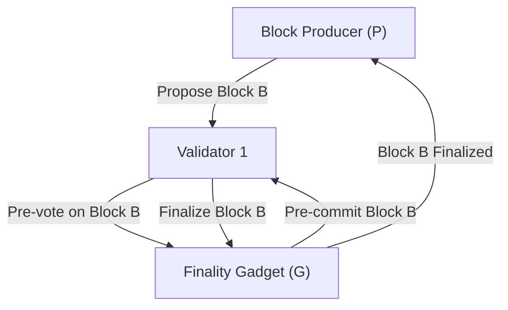
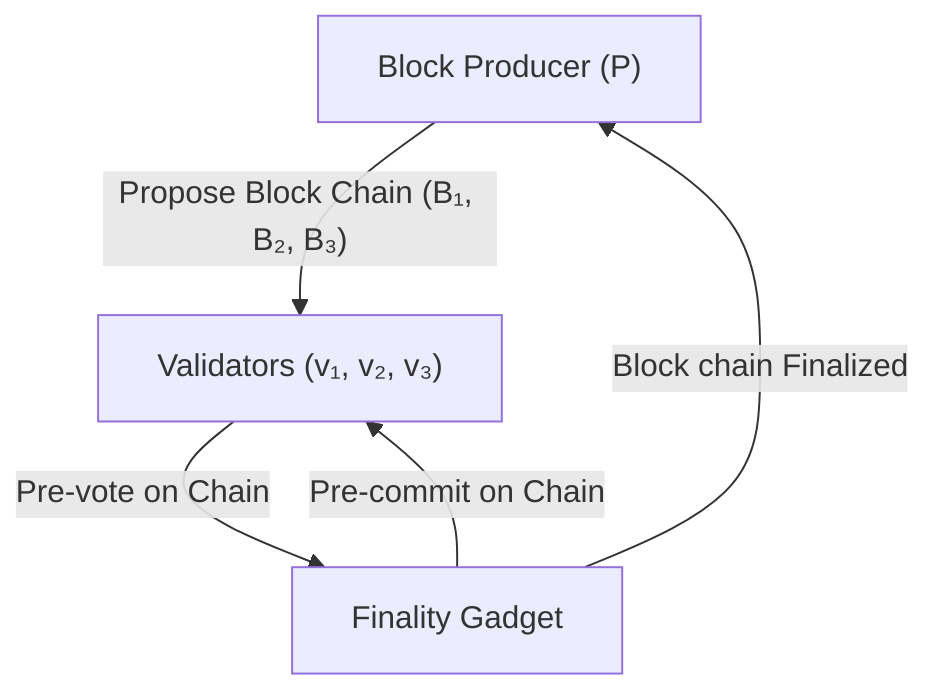

# PlusCal/TLA+ GRANDPA specification

- **Team Name:** Alfredo Garcia
- **Payment Details:** to be added
- **[Level](https://github.com/w3f/Grants-Program/tree/master#level_slider-levels):** 2

## Project Overview :page_facing_up:

https://grants.web3.foundation/docs/RFPs/formal_guarantees_for_grandpa

### Overview

The proposal is to develop a PlusCal specification of the GRANDPA consensus protocol, which will subsequently be translated into TLA+ for execution in the TLC model checker.

By creating this model, our ultimate goal is to evaluate the finality, liveness, and safety properties of the specified algorithm.

The ecosystem relies on the GRANDPA finality gadget. Having a formal specification will not only help identifying bugs in current implementations but also assist new implementations by providing a robust design framework.

I have been interested in formalization and specifications for quite some time, but until now, I have not had the opportunity to apply these skills in a production project.

### Project Details

We propoe to specify the GRANDPA finality gadget in TLA+, as outlined in the [GRANDPA paper](https://github.com/w3f/consensus/blob/master/pdf/grandpa.pdf), and to analyze various properties, invariants, and potential deadlocks.

As an initial step, we will create a foundational specification of the algorithm. While we abstract away from the block production role, we assume that participants are active in both the block production protocol (`P`) and the finality gadget (`G`).

- Although the block production protocol will be abstracted, examples such as `PoW` or `BABE` can be utilized for initialization.
- The finality gadget specifically refers to the GRANDPA protocol.

Each network participant maintains its own view of both the finality gadget and block production. However, we can assume an eventually consistent oracle for block production, which will provide the same block hash to all participants after a certain period. Similarly, the finality gadget will eventually finalize the same block for each honest participant at each block number.

The following diagrams offer a simplified high-level overview of the process.

This diagram shows a interaction between a single participant and the finality gadget across the different phases for finalizing a block:

1. The block producer proposes a new block (Block B) to Validator 1.
2. Validator 1 pre-votes on Block B in the finality gadget.
3. The finality gadget processes the pre-commit phase with Validator 1.
4. The finality gadget finalizes Block B, and the final decision is communicated back to the block producer.

This diagram illustrates a similar interaction but between a block producer proposing a chain of blocks to multiple validators in the GRANDPA finality protocol:

1. The block producer (P) proposes a chain of blocks (B₁, B₂, B₃) to a group of validators (v₁, v₂, v₃). This initial step sets the stage for consensus on the proposed blocks.

2. The validators collectively participate in the pre-vote process, signaling their initial support for the block chain to the finality gadget (G). This phase sets initial consensus agreement among participants.

3. Once the pre-vote is successful, the finality gadget instructs the validators to pre-commit to the block chain, solidifying their agreement on the proposed blocks. This step ensures that there is a clear consensus before finalizing the chain.

4. Finally, the finality gadget communicates the finalized status of the block chain back to the block producer (P), indicating that the blocks have been accepted and committed to the ledger.

### Ecosystem Fit

While the target audience for this project may be relatively narrow, consisting in developers and researchers, its importance to the entire ecosystem reliant on the GRANDPA finality gadget is substantial. This project seeks to strengthen the foundation of consensus mechanisms within the Polkadot, Substrate, and Kusama ecosystems by ensuring the reliability and correctness of the finality protocol.

Furthermore, this initiative poses no risks to the ecosystem; instead, it has the potential to uncover bugs and vulnerabilities in both current and future production implementations of the GRANDPA protocol. By providing a formal specification, we gain greater confidence in the system's robustness and reliability.

To my knowledge, there are currently no other formalization efforts within the Polkadot/Substrate/Kusama ecosystem. This project could pave the way for further research and development in formal methods.

## Team :busts_in_silhouette:

### Team members

- Alfredo Garcia

### Contact

- **Contact Name:** Alfredo Garcia
- **Contact Email:** oxarbitrage@gmail.com
- **Website:** https://github.com/oxarbitrage

### Legal Structure

- **Registered Address:** 
- **Registered Legal Entity:** Alfredo Garcia

### Team's experience

I am an open-source developer actively involved in several blockchain projects. Currently, I work at the Zcash Foundation as a Rust engineer, where I have deepened my understanding of cryptography and software design principles. This role allows me to apply my skills effectively in developing secure and efficient protocols.

### Team Code Repos

The following are experimental specifications I have developed for educational purposes, all written in PlusCal:

- [Zcash P2P Specification](https://github.com/oxarbitrage/zcash-p2p-spec)
- [Sinsemilla Specification](https://github.com/oxarbitrage/sinsemilla/tree/main/spec)
- [Zebra gRPC Scan Specification - gRPC Overview](https://github.com/oxarbitrage/zebra-grpc-scan-spec/blob/main/grpc.md)
- [Zebra gRPC Scan Specification - Client Integration](https://github.com/oxarbitrage/zebra-grpc-scan-spec/blob/main/client_integration.md)

## Development Status :open_book:

Research stage. Development not started.

## Development Roadmap :nut_and_bolt:

Based on the [deliverables section of the RFP](https://grants.web3.foundation/docs/RFPs/formal_guarantees_for_grandpa#deliverables) but splitting it out into 3 milestones.

### Overview

- **Total Estimated Duration:** 5 months
- **Full-Time Equivalent (FTE):**  0.5 FTE
- **Total Costs:** 30,000 USD
- **DOT %:** Percentage of Total Costs to be paid in (vested) DOT (≥ 50%)

### Milestone 1 — Basic functionality

- **Estimated duration:** 2 months
- **FTE:**  0,5
- **Costs:** 12,000 USD

| Number | Deliverable | Specification |
| -----: | ----------- | ------------- |
| **0a.** | License | Apache 2.0 / MIT |
| **0b.** | Proof Artifact | Models and specs in TLA+ that adhere to protocol implementations with reasonable abstraction gaps. As a stepping stone, the block production mechanism could be instantiated with PoW or BABE. |
| **0c.** | Documentation | A document describing the design decisions in the modeling process, including justification for abstractions and assumptions (e.g. on the network model, latency, behavior of validators, nature of faults) w.r.t to protocol in the Paper and Spec. In-line comments in the TLA+/ PlusCal models that provide a clear mapping to the feature/property. |
| **0d.** | Engagements | Engage with the Web3 research team via regular meetings to refine the models and specs. For eg., clarify any assume/ rely reasoning made in the protocols. Engage with Web3 team to determine if detected bugs's are spurious. |

### Milestone 2 — Liveness and safety properties

- **Estimated Duration:** 2 months
- **FTE:**  0,5
- **Costs:** 12,000 USD

| Number | Deliverable | Specification |
| -----: | ----------- | ------------- |
| **0a.** | Proof Artifact | Formalize the validity, finality and liveness of GRANDPA as temporal properties in TLA+. |
| **0b.** | Testing Guide | Instructions to set up the required environment to run the analysis, preferably a docker image with all the tools pre-installed. |
| **0c.** | Project | Refinement and improvements to the specifications and documents based on feedback or self found.  |
| **0d.** | Engagements | Engage with the Web3 research team via regular meetings to refine the models and specs. For eg., clarify any assume/ rely reasoning made in the protocols. Engage with Web3 team to determine if detected bugs's are spurious. |

### Milestone 3 — Adjustments and results

- **Estimated Duration:** 1 month
- **FTE:**  0,5
- **Costs:** 6,000 USD

| Number | Deliverable | Specification |
| -----: | ----------- | ------------- |
| **0a.** | Proof Artifact | Final improvements to the specifications. |
| **0b.** | Documentation | Final improvements to the documentation. |
| **0c.** | Article | High-level document summarizing the results of the verification efforts as well as a final presentation for a broader audience that summarizes the key take-aways. |
| **0d.** | Project | Present a follow up plan to continue the formalization work at other parts of the ecosystem or in the finality gadget itself. |
| **0e.** | Project | Transfer repository or other final logistic changes needed. |

## Future Plans

No future plans at the moment.

## Additional Information :heavy_plus_sign:

**How did you hear about the Grants Program?** Web3 Foundation Website