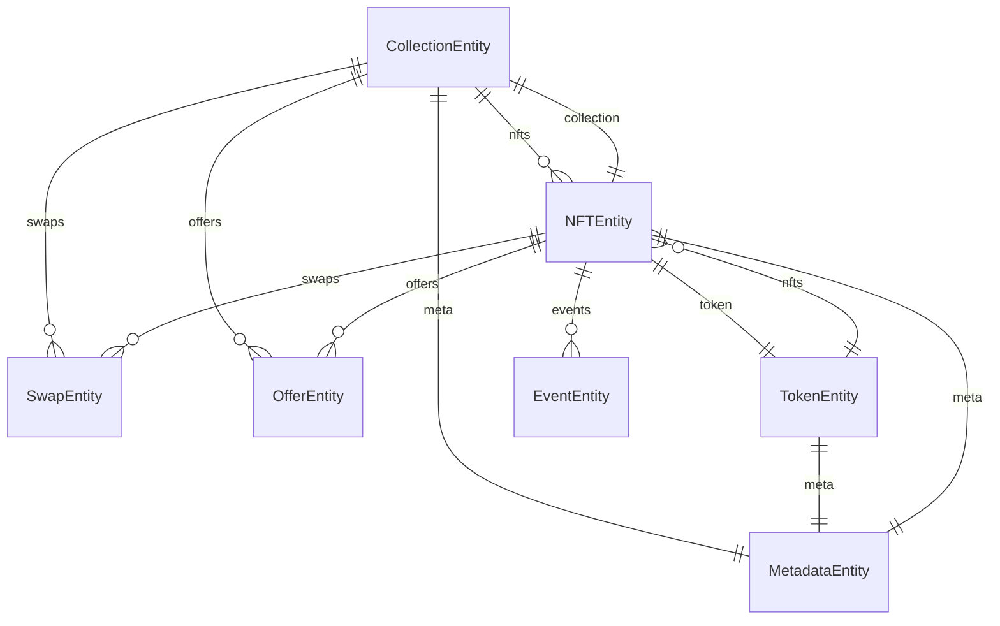

# AssetHub NFT Indexer (M2)

- **Team Name:** KodaDot
- **Payment Details:**
  - **DOT**: 15BZFbMsCR1ki59mJHo8iAjgAozGJaYHR3oVRPQWNnoEZiL9
  - **Payment**: FIAT
- **[Level](https://github.com/w3f/Grants-Program#baby_chick-level-2):** 2

Previously delivered:
[Proposal 1 for AssetHub NFT indexer](https://github.com/w3f/Grants-Program/blob/master/applications/kodadot_assethub_nft_indexer_statemine_statemint.md)

### Overview

The AssetHub Indexer is a GraphQL service designed to streamline the interaction with Uniques, NFT non-fungible assets, and fungible assets on AssetHubs (Polkadot/Kusama). This service is specifically tailored to serve as a robust data layer for NFT-oriented dApps, taking advantage of the simplicity of GraphQL and the REST API.

In the current landscape, developers need help interacting with Uniques and Assets on AssetHubs due to the complexity and time-consuming nature of querying fungible and non-fungible assets on AssetHub. AssetHub Indexer aims to address these challenges by providing a user-friendly GraphQL interface, thus reducing the time and effort required to query these assets.

In Milestone 2, we focus on significant enhancements to the AssetHub Indexer to streamline NFT transactions and improve collection management on the Polkadot network. Our updates are centred around integrating Atomic Swaps, Offers, Architectural Upgrades, and overall developer experience improvements.

### Project Details

[Building on the success of Milestone 1](https://grants.web3.foundation/applications/kodadot_assethub_nft_indexer_statemine_statemint), where we focused on establishing a solid foundation for the AssetHub Indexer with GraphQL schema development for NFTs and Collections, Milestone 2 aims to extend the indexer's capabilities into new dimensions of NFT interaction and management.

In short, the AssetHub Indexer is a state-of-the-art infrastructure tool designed to address developers' challenges when querying NFTs from the chain. Currently, developers are limited to querying NFTs in batches from RPC nodes, which can be time-consuming and inefficient for customer-facing products. This limitation often results in long waiting times and heavy device data loads.

To overcome these challenges, we have developed the AssetHub Indexer. This tool leverages the power of GraphQL to provide a more efficient and user-friendly interface for developers. With the AssetHub Indexer, developers can easily query NFTs and build on top of the new [NFTs pallet by Parity](https://github.com/paritytech/substrate/blob/master/frame/nfts/src/lib.rs), opening up a wide range of potential use cases, such as creating [fandom shops](https://fandom.deno.dev) for art.

Recognizing that many web developers may have little experience with GraphQL, we have also built a TypeScript-based SDK that can be easily imported into any existing project. This SDK simplifies interacting with Uniques and Assets on AssetHub, making it more accessible for developers of all skill levels.

The AssetHub Indexer uses TypeScript and leverages the Squid framework (ArrowSquid) for data processing. It interacts with a Postgres database and provides a GraphQL interface for querying data. The project structure includes directories for generated model/server definitions, server extensions, data type definitions, and mapping modules. It also uses environment variables defined in a .env file or supplied by a shell for configuration.

This milestone aims to bring Atomic Swaps and Offers capability to the AssetHub Indexer. Swaps and Offers are novel mechanisms allowing users to trade NFTs and create a new dynamic for the NFT ecosystem on Polkadot. To make integration seamless, we will also provide a Typescript SDK for developers to integrate the new features into their applications easily.

These enhancements are not just incremental; they represent a strategic evolution of the AssetHub Indexer's role in the Polkadot ecosystem, addressing specific needs identified through user feedback and our ongoing analysis of the blockchain's development landscape.

#### Architecture 🏗

The AssetHub Indexer architecture is designed with simplicity and efficiency, ensuring seamless interaction with Atomic Swaps and Offers on the AssetHub.

At the core of our architecture is TypeScript, a statically typed superset of JavaScript that adds optional types to the language. TypeScript ensures robustness and reliability in our codebase, allowing us to catch errors early in the development process and write more maintainable code.

To handle data processing, we leverage the ArrowSquid framework. ArrowSquid is a powerful tool that allows us to process and index blockchain data efficiently. It provides a set of utilities for defining and running data processing tasks, making handling complex requirements easier.

Our project interacts with a Postgres database, a powerful, open-source object-relational database system that uses and extends the SQL language. Postgres provides us with the robustness, scalability, and performance we need to handle large amounts of data.

On the architectural level, we have a few layers, as described in the picture above.
We need to obtain the data for the correct function of our indexer. AssetHub indexer combines the SubSquid archive (the pre-indexed storage) and RPC node for the new data. When the indexer obtains a new event, it is automatically processed by the defined handler. As previously mentioned, we processed data stored in the Postgres DB.

How do we imagine the Database model? The diagram below represents a database schema with six entities: `CollectionEntity`, `NFTEntity`, `TokenEntity`, `MetadataEntity`, `SwapEntity`, and `OfferEntity`. As `CollectionEntity` and `NFTEntity` are well-known entities from Milestone 1, there are new entities that are going to be implemented.`TokenEntity` represents a list of `NFTEntity` grouped by the same `MetadataEntity`. Grouping NFTs allows developers to perform search operations effectively. Next are `SwapEntity` and `OfferEntity` that will represent Atomic Swaps and Offers built on top of the Atomic Swaps. Why decide to make it as two separate entities? As with the effective implementation, we would offload the heavy logic, and it would make it easier for presentations to implement it.

To expose the data to clients, we provide a GraphQL interface. GraphQL is a query language for APIs and a runtime to execute those queries with our existing data. It allows clients to ask for exactly what they need and nothing more, making it easier to evolve and enabling powerful developer tools.

The project structure is organized into several key directories. The `src/generated` directory contains model/server definitions created by codegen. The `src/server-extension` directory contains a module with custom type-graphql-based resolvers. The `src/types` directory contains data type definitions for chain events and extrinsic created by `typegen`. The `src/mappings` directory contains the mapping module. The `lib` directory contains compiled js files, reflecting the structure of the `src` directory.

Finally, the project configures the environment variables defined in an.env file or supplied by a shell. This approach allows us to easily manage and change the configuration without altering the codebase.

The second state-of-the-art is our Client-first SDK called Uniquery. As we can see in the picture below, the only thing that client applications need to do is import the Uniquery package via ESM/CJS (Javascript targets). Once we have the Uniquery package, we can access query builder implementation (such as `client.getCollectionById(id)`). Additionally, because many developers are familiar with REST API, we build a similar fetch strategy without needing a third party (every client fetches data directly from SubSquid). The REST looks like this: `$fetch(/collectionById/${id}).`

#### Technology Stack 💻

- TypeScript
- Node.js
- Docker
- SubSquid (ArrowSquid for Substrate)
- Postgres
- GraphQL

### Ecosystem Fit

The AssetHub Indexer is a crucial addition to the Polkadot and Substrate SDK ecosystem. It addresses the challenges developers often encounter when building on top of runtime pallets, particularly when interacting with Uniques, NFTs, and Assets on AssetHub. The AssetHub Indexer provides a comprehensive NFT-oriented data solution, simplifying the development process and enhancing the efficiency of dApps within the ecosystem.

Our solution stands out within the Polkadot and Substrate SDK ecosystem due to its user-friendly GraphQL interface and TypeScript-based SDK. These features streamline interaction with Uniques and Assets on AssetHub, reducing the complexity of querying these assets.

Furthermore, the AssetHub Indexer is designed to be versatile, supporting a wide range of use cases. Developers can also leverage our [sub-scaffold UI](https://github.com/kodadot/sub-scaffold) template to bootstrap their projects quickly. This template, a forkable Substrate dev stack focused on rapid product iterations, accelerates the development process and allows developers to focus on creating innovative and user-friendly dApps rather than getting bogged down in the initial setup.

Our target audience for this proposal includes Web3 projects and blockchain developers, whether they are just starting out or already established within the Polkadot and Substrate SDK ecosystem. We believe the AssetHub Indexer can provide significant value to these developers, enabling them to build more efficient and user-friendly dApps like [KodaDot](https://kodadot.xyz/).

AssetHub also plays a significant for the [KodaDot](https://kodadot.xyz/) NFT marketplace, which is one of the main consumers for this indexer. Thanks to that, developers can find real-world examples of effectively making GraphQL queries and learn more about using Uniquery.

Regarding competition within the Polkadot and Substrate SDK ecosystem, the AssetHub Indexer differentiates itself through its focus on NFT-oriented data solutions, user-friendly interface, and commitment to simplifying the development process. Including the sub-scaffold UI template further sets it apart, providing developers with a ready-to-use foundation for their projects. Moreover, [Subsocial](https://twitter.com/SubsocialChain/status/1674435226334904320), [Talisman](https://github.com/TalismanSociety/talisman-web/blob/44ea24f60f96a8629d84833682903da6e77dddbd/packages/nft/src/generators/substrateNftPolkadotAssetHub.ts#L15) and [NovaWallet](https://github.com/novasamatech/nova-wallet-ios/blob/ef7caf6445dfd0658bd1e59e3bce8c5cce67b42a/novawallet/Modules/Nft/Services/KodaDot/KodaDotNftOperationFactory.swift#L14) are already using the AssetHub indexer, demonstrating its practical application and effectiveness. We plan to promote the indexer within the ecosystem further to onboard new developers and explore new solutions. These factors position the AssetHub Indexer as a unique and valuable tool within the Polkadot and Substrate SDK ecosystem, ultimately serving as a Common Good solution.

## Team :busts_in_silhouette:

### Team members (In order of joining time)

- Matej Nemček - Project Lead
- Viktor Valaštín - Developer

### Contact 📞

- **Contact Name:** Viktor Valaštín
- **Contact Email:** viktorko99@gmail.com

### Legal Structure

- **Registered Address:** Ljubljanska cesta 4, 4260 Bled, Slovenia, Europe
- **Registered Legal Entity:** KodaLabs, Viktor Valaštín s.p.

### Team's experience

**Viktor Valaštín**, also known as Viki Val, is the Co-founder of KodaDot. He is responsible for the technical aspects of the project. Viktor has been working on implementing MoonBeam and MoonRiver NFT EVM smart contracts and enabling read-only access to existing components for seamless end-user interaction. His technical expertise has been crucial in successfully launching the Basilisk NFT Marketplace pallet in the Fall of 2022.

**Matej Nemček** is the Founder and CEO of [KodaDot](https://kodadot.xyz/). He has been instrumental in the growth and development of KodaDot, leading the team to create the best end-user experience on the Asset hub. Matej's leadership and vision have been pivotal in transforming KodaDot into a collaborative hub where creators, developers, and community members work collectively for decision-making.

Matej and Viktor are strongly committed to the Polkadot ecosystem and have demonstrated their ability to deliver high-quality, impactful projects. They bring a wealth of knowledge and experience to the AssetHub Indexer project. Their work has earned KodaDot the number one rank as a decentralized dapp in the Polkadot ecosystem on [Github](https://github.com/topics/polkadot). You can read more about their work and KodaDot's contributions to the Polkadot ecosystem on the [Polkadot Wiki](https://wiki.polkadot.network/docs/learn-nft-projects#kodadot).

### Team Code Repos

- [https://github.com/kodadot/stick](https://github.com/kodadot/stick)
- [https://github.com/kodadot/nft-gallery](https://github.com/kodadot/nft-gallery)

#### Team GitHub accounts 🧑‍💻

- [Viktor Valaštín](https://github.com/vikiival)
- [Matej Nemček](https://github.com/yangwao)

### Team LinkedIn Profiles 🧑‍🎓

- [Viktor Valastin](https://linkedin.com/in/vikival/)
- [Matej Nemcek](https://linkedin.com/in/mnemcek/)

## Development Status :open_book:

- [github.com/kodadot/stick/milestone/3](https://github.com/kodadot/stick/milestone/3) - Milestone 2 track
- [github.com/kodadot/stick](https://github.com/kodadot/stick) This is the repo for AssetHub Indexer.
- [github.com/kodadot/uniquery](https://github.com/kodadot/uniquery) This is the repo for SDK.

## Development Roadmap :nut_and_bolt:

### Overview

- **Estimated duration:** 3 months ⌛️
- **FTE:** 2 FTE
- **Costs:** 30,000 USD 💰

## Milestone 1 - AssetHub Indexer Swaps, Offers and Tokens Implementation

- **Estimated duration:** 3 months ⌛️
- **FTE:** 2 FTE
- **Costs:** 30,000 USD 💰

| Sequence | Deliverable                                         | Description                                                                                                   |
|----------|-----------------------------------------------------|---------------------------------------------------------------------------------------------------------------|
| 0a.   | Licensing                                             | MIT License will continue to apply.                                                                               |
| 0b.   | Documentation                                       | Comprehensive inline code documentation and an explicit README file to guide the project setup and execution.|
| 0c.   | Test Guidelines                                      | Testing will cover major functionality with unit tests and provide a guide for executing these tests.|
| 0d.   | Docker Integration                                   | A Dockerfile will enable the project to run within a Docker container.                          |
| 1a.      | Atomic Swaps Schema Development       | Creating and designing a GraphQL schema entity to represent Atomic Swaps.                         |
| 1b.   | Atomic Swaps CREATE Handler            | Deployment of a handler for indexing creates swap events from the chain.                            |
| 1c.   | Atomic Swaps CANCEL Event              | Implement a handler to index cancel swap events from the chain.                                     |
| 1d.   | Atomic Swaps CLAIM Event                | Development of a handler to index claim swap events from the chain.                                |
| 1e.   | Atomic Swaps with Surcharge Handler | creation of an indexing handler for swap events with a surcharge from the chain.                       |
| 2a.   | Offers Schema Development       | Creating and designing a GraphQL schema entity to represent Offers.                         |
| 2b.   | Offers CREATE Handler            | Deployment of a handler for indexing creates offer events from the chain.                            |
| 2c.   | Offers CANCEL Event              | Implement a handler to index cancel offer events from the chain.                                     |
| 3a.   | Token Schema Development       | Creating and designing a GraphQL schema entity to represent Tokens.                         |
| 3b.   | Token CRUD Handler            | Deployment of a handler handling CREATE, READ, UPDATE, DELETE events from chain                            |
| 4a. | API Implementation: collectionById       |API to fetch collection using its id.                                                                           |
| 4b. | API Implementation: collectionListByIssuer |API to fetch collections with a specified address as the issuer (creator).                                      |
| 4c. | API Implementation: collectionListByName  |API to fetch collections containing the specified name.                                                         |
| 4d. | API Implementation: collectionListByOwner  |API to fetch collections owned by the specified address.                                                        |
| 4e. | API Implementation: eventList                   |API that returns all events.                                                                                    |
| 4f. | API Implementation: eventListByAddress      |API that yields events bound to a specified address.                                                            |
| 4g. | API Implementation: eventListByCollectionId |API that generates events for NFTs belonging to the specified collection.                                        |
| 4h. | API Implementation: eventListByInteraction   |API fetching events by specific interaction.                                                                   |
| 4i. | API Implementation: eventListByItemId         |API that fetches events associated with the specified NFT id.                                                   |
| 4j. | API Implementation: itemById                       |API that fetches a NFT using its id.                                                                           |
| 4k. | API Implementation: itemListByCollectionId    |API fetching NFTs from a collection with specified id.                                                         |
| 4l. | API Implement: itemListByCollectionIdAndOwner |API to fetch NFTs from a collection with a specific id and owned by a specified address.                           |
| 4m. | API Implement: itemListByCollectionIdList        |API to retrieve a list of NFTs from specified collections.                                                     |
| 4n. | API Implementation: itemListByIssuer                |API to fetch NFTs where the issuer (creator) is equal to the specified address.                                    |
| 4o. | API Implementation: itemListByName                    |API to retrieve NFTs containing the specified name.                                                            |
| 4p. | API Implementation: itemListByMetadataId             |API to fetch NFTs with specified metadata uri.                                                                 |
| 4r. | API Implement: itemListByMetadataIdMatch             |API to fetch NFTs with metadata matching the provided CID.                                                     |
| 4s. | API Implementation: itemListByOwner                     |API fetching NFTs owned by the specified address.                                                              ||

## Future Plans 🔭

Upon successful implementation of Milestone 2, the team plans to focus on further enhancing the AssetHub Indexer's capabilities based on community feedback, including improving the user interface, introducing additional functionalities for NFT management, and expanding the project's reach within the Polkadot ecosystem. We have outlined several key enhancements and upgrades that we aim to implement:

1. Development of an explorer to facilitate navigation within the Atomic Swaps ecosystem.
2. Introduction of atomic swap pages functionality for systematic organization of Atomic swaps.
3. Creation of view modules to visually present Offers details.
4. Establishment of user profiles to enable personalized user offers.
5. Incorporation of constituent elements for individual Offers representation.
6. Implement action components for functionalities like CREATE, CANCEL, CLAIM for Atomic Swap.
7. Development of comprehensive statistical representations and analytics mechanisms for Atomic Swaos.
8. Maintenance of compatibility with runtime upgrades and changes in the Kusama/AssetHub ecosystem.
9. Regular updates to keep up with Substrate for continuous system enhancement.
10. Management of upgrades to parachain runtime versions, including indexer enhancements and related costs.

## Additional Information ➕

The AssetHub Indexer project continues our team's various projects and implementations in the Polkadot ecosystem. We have already attracted interest from developers within the Polkadot and Kusama ecosystems. Notably, we have in 2019 previously received a grant from the W3F for creating Vue.js UI utilities, components, and libraries, details of which can be found [here](https://github.com/w3f/General-Grants-Program/blob/master/grants/speculative/Vuejs_ui-components.md).

This previous grant allowed us to reimplement keyring into Vue.js & TypeScript, demonstrating our hands-on experience with the polkadot.js.org/common utilities. The result of this work can be seen in the [web-based Subkey](https://subkey.netlify.com/) tool.

We learned about the Grants Program through a personal recommendation. We believe that our project aligns well with the program's goals, and we are excited about the potential to further contribute to the Polkadot ecosystem.
