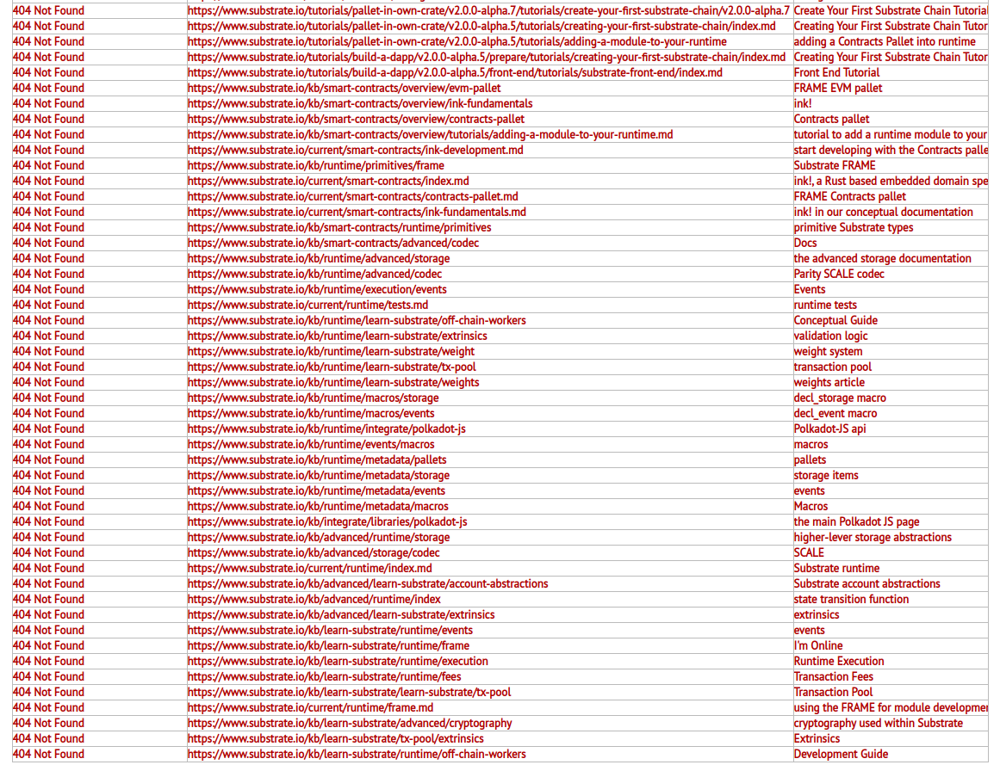

# Open Grant Proposal

> This document is referenced in the terms and conditions and therefore needs to contain all the required information. Don't remove any of the mandatory parts presented in bold letters or as headlines! See the [Open Grants Program Process](https://github.com/w3f/Open-Grants-Program/blob/master/README_2.md) on how to submit a proposal.

* **Project:** Improve Substrate Documentation - make the documentation great again
* **Proposer:** @tomaszwaszczyk
* **Payment Address:** bc1q0dklrl2dl2q2q87xls6vdqxcn9eyr8zyp3er8c

## Project Description :page_facing_up:

I am software enginner which within company where I look for business outcomes which potentially can Substrate delivers. I know that the best way to learn is to build and after listining to presentation given by Tomasz Drwięga (Core Dev in Polkadot) in Warsow and then some talk with Him I decided to dive deeper into Substrate.  

When I got some free time I decided to dive into technicals and start from the documentation and during presentation for management board of Substrate I discovered that many, many links in documentation just does not work. Some scanner which looks for 404's links shown me around ~500 bad links on the following page https://www.substrate.io/. At the begining of reading the documentation I was thinking that I just found one bad link and decided to contribute by making the pull request https://github.com/substrate-developer-hub/knowledgebase/pull/78 but then I found many of them and decided to apply of the grant just to improve the documentation of the software.

Where is see the value in the grant? I just want to make the documentation more readable for builders and new comming software engineers just like me.

Below a part of report from the scanner of not working links:

## Team :busts_in_silhouette:

* **Members:** Tomasz Waszczyk
* **LinkedIn Profiles:** [Tomasz Waszczyk](https://www.linkedin.com/in/tomaszwaszczyk)
* **Code Repos:** https://github.com/substrate-developer-hub/knowledgebase/pull/78
* **Legal Structure:** personal address will be provided via the invoice form
* **Team's Experience:** I am a software enginner since around 10 years, I was working in hedge fund where I was invloved in optimizing algorithms (JVM stack), currently I work for IoT company where we look for optimising supply chain tracing in many manufacturies.

## Development Roadmap :nut_and_bolt: 

* **Total Estimated Duration:** ~2months
* **Full-time equivalent (FTE):**  0.5
* **Total Costs:** 0.9BTC

### Milestone 1

The output of the grant will be many PRs to Substrate's official documentation like that that one https://github.com/substrate-developer-hub/knowledgebase/pull/78 to clean and improve links and details. Here is an example of dead links: https://github.com/TomaszWaszczyk/silesia-blockchain-meetup/blob/master/_PLANNED/PolkaDot/404s.png and output of the grant will be fully updated documentation, not just a part. Currently there is many dead links eg. to Rust palettes and is hard to read for new programmers comming to the Community. I know that there is no specific milestones, but as I said - fully update dead links, not some of them, not two of them but all of them. 

## Additional Information :heavy_plus_sign:

The main goal of the grant is to answer the question whether Substrate can help us to deliver the value for our clients. Currently I am an one guy team in the company which knows and is interested in Substrate and I need to get to know about Substrate as much as possible. When I saw that the docs does not work properly (I guess that there was some migration of the documentation) I decided to apply. Also few days ago I organining the meetup with Plasm Network (https://www.meetup.com/Silesia-Blockchain-Meetup/events/270449669/) and the presentation was promising.
