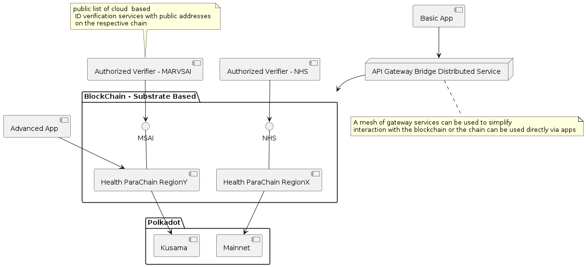

# W3F Grant Proposal

> This document will be part of the terms and conditions of your agreement and therefore needs to contain all the required information about the project. Don't remove any of the mandatory parts presented in bold letters or as headlines! Lines starting with a `>` (such as this one) can be removed.
>
> See the [Grants Program Process](https://github.com/w3f/Grants-Program/#pencil-process) on how to submit a proposal.

- **Project Name:** MarvSai Personal Medical Data Chain
- **Team Name:** Marvsai Team
- **Payment Address:** 0x8f1013fa606c6fcbcd3eff057e5b320b0c5f72e2
- **[Level](https://github.com/w3f/Grants-Program/tree/master#level_slider-levels):** 3

> ⚠️ *The combination of your GitHub account submitting the application and the payment address above will be your unique identifier during the program. Please keep them safe.*

## Project Overview
A blockchain API built on Substrate by ISO/IEC 27001:2013 security process approved. 
We plan to integrate ID verification and data storage like IPFS through a substrate api eleminating the need for 
integrating security on top of projects such as FileCoin. The idea is to make data a first class citizen of the Poladot ecosystem. 
NFT based data exchange infrastructure for data ownership and medical data submission for use by our own propriatory app as well as any other apps so that medical data can both be sold and exchanged.

We anticipate participation incentivization via built in token and use of Data Extraction engine built as part of team members PhD.

### Overview

Please provide the following:

Project Name Medical Stats and AI- users store any medical documents through scanning with camera app , the part we want polkadot cooperation is for storage of the medical data on the blockchain
- This proposal is for creation of medical specific blockchain API to securely store the data collected by our and other apps . The api will be open and allow users to maintain ownership while remaining public.
- A heath focused blockchain we are proposing should be standardized as an API layer for substrate
- An indication of why your team is interested in creating this project.  
  Many patients use clinics worlwide and it is inconvenient to carry data over from clinic to clinic especially worldwide.  
  In addition one of our team was a user of a medical data as part of a GSK Welcomme trust funded PhD.  
  Dr Ali Marvasti's research with medical data made evident the need for such a project and the total uselessness of existing   
  solutions like MedicalChain and Binance Health.   
  Sample screen of users view of the data can be seen https://docs.google.com/presentation/d/1XEQ6qtTLwkmc6JgtpytEUJqhh1behskOWh3s4uE1cXw/edit?usp=sharing
### Project Details

We expect the teams to already have a solid idea about your project's expected final state. Therefore, we ask the teams to submit (where relevant):

 Data models
We propose to store encrypted natively and only allow owners of NFT to decrypt these details via the smart contract.
- The data 
  - Medical ID - consisting of HASH And JSON details which are encrypted and optional only the ID reference is required. The decryption native the the parachain and requires ownership of NFT. 
  - ID are verified by special validation addresses linked to special trusted organizations  on the parachain
  - ID verification is for users of data to require which authorities they accept. Initially it will be us or other organization we work with like the NHS in the UK.
| hashID | health system id | dob (o)| sex(o) | blood type(o) |
|--------|----------------------|-----|-----|------------|
|        |                      |     |     |            |

| hashID | SignedVerifier |
|--------|----------------|
|        |                |
|        |                |
|        |                |

  - Medical documents consisting of ID HASH and encrypted JSON of the following details: 

        Type  - ultrasound - xray etc
        Detail
        Date
        Place

| Type       | Detail         | Date    | Place   | Result | Link to BLOB                                 |
|------------|----------------|---------|---------|-------|:---------------------------------------------|
| Ultrasound | sonogram liver | 1-1-20  | Ukraine | normal | native::xjslfdjl                             |
| Xray      | Chest          | 1-30-20 | London  | pneumonia | external:https://wwww.files.com/xkjdslkdjslk |

- Medical Lab Document - date format US

| Type           | Detail      | Date    | Result   |    Link to BLOB    |
|----------------|-------------|---------|----------|-----|
| Blood          | creatinine  | 1-1-20  | 1/2 mm/l |  native::xjslfdjl      |
| Urine          | bacteria    | 9-30-20 | Negative |   native::xjslfdjl     |
| Histopathology | Skin Legion | 4-30-20 | Melanoma |  native::xjslfdjl      |
 
Addition of MSAI parachain webassembly smart contract for effecient encryptyion and decryption if necessary 
although in the first instance encryption maybe provided off chain through the bridge.
Storage of NFT
- An overview of the technology stack to be used
- Image: 
- Documentation of core components, protocols, architecture, etc. to be deployed
- PoC/MVP we have built backend services using Google GCP and need to now integrate with the polkadot chain
What we will provide :
App connecting to the Polkadot chain with storage on the blochchain of hash and encryption keys to medical data.
Ultlimately when the correct modules are written we intend to store the entire medical data on a sidechain. 
- What we will not provide
  - Data extraction will be a separate project that we may or may not deliver with this
  - This is a place for you to manage expectations and to clarify any limitations that might not be obvious
  Data storage for images on chain will be a difficult and may be placed securely on IPFS. The API will be public but our UI and APP will not be.

### Ecosystem Fit

Help us locate your project in the Polkadot/Substrate/Kusama landscape and what problems it tries to solve by answering each of these questions:

- Where and how does your project fit into the ecosystem?

The project is a real useful application of web3 technologies which we intend to build on polkadot if we receive funding
The project is intending to design and develop a parachain so that we do not have to rely on private chains or limited blockchains catering just for the healthcare environment.
The project is intending to show that PolkaDot can scale by having patients in each region have their own MarvSai sidechains made possible with the pluggable nature of polkadot.
- Who is your target audience (parachain/dapp/wallet/UI developers, designers, your own user base, some dapp's userbase, yourself)?
  Health patients who travel in multiple jurisdictions (e.g. Ukranians who arrive in UK have no medical history and it is difficult to carry and validate scans from different countries)
Target audience is any healthcare data silo and any health patients who can contribute their data and earn ERC20 like tokens on this chain.
- What need(s) does your project meet?
Specialising public blockchain for exchange of health data and creation of the backbone fabric of a federated healthcare system.
- Are there any other projects similar to yours in the Substrate / Polkadot / Kusama ecosystem?
Not that we know of
  No project has been able to create a public health blockchain as it is either too slow or for data privacy
  Medicalchain
  BNB Chain all projects dead in the water either because they use a private unscalable chain or use public blockchains which are too expensive to use at scale.

## Team :
Marvsai team www.marvsai.com

### Team members

- Dr Salman Alim Marvasti --  Experienced Finance and Blockchain Senior Developer currently at Blockchain.com
- Dr Ali Marvasti -- Consultant Neurologist - NHS , Cambridge University
- Dr Atefeh Alihossieni - Internal Medicine Specialist - Medical App Design Baan Clinic- Millway medical practice
- Dr Luke Riley - Blockchain post doc and Innovation labs head at Quant Network
- Rahim Lalani CEO Text services and contract app development company in Pakistan 
### Contact

- **Contact Name:**Salman Marvasti
- **Contact Email:** salman_marvasti@yahoo.co.uk
- **Website:** marvasi.com

### Legal Structure

- **Registered Address:** Ibrandnewdirect Flat 903, E14 OBN 
- **Registered Legal Entity:**Ibrannewdirect LTD

### Team's experience

Dr Ali Marvasti is an AI specialist PhD candidate at UCL and a practicing neurologist with Python coding skills
- He is author of open source tools for seminology https://github.com/thenineteen/Semiology-Visualisation-Tool
Dr Salman Marvasti is a senior IT graduate from Imperial College and 
If anyone on your team has applied for a grant at the Web3 Foundation previously, please list the name of the project and legal entity here.

### Team Code Repos

- https://github.com/thenineteen/Semiology-Visualisation-Tool
- https://github.com/SalmanMarvasti/ResearchCode
- https://github.com/SalmanMarvasti/CryptonCapital

Please also provide the GitHub accounts of all team members. If they contain no activity, references to projects hosted elsewhere or live are also fine.

- https://github.com/SalmanMarvasti/
- https://github.com/thenineteen/

### Team LinkedIn Profiles (if available)

- https://www.linkedin.com/in/marvastisalman/
- https://www.linkedin.com/in/atefeh-alihoseini-a3850a202/
- https://www.linkedin.com/in/ali-alim-marvasti-1a846855/
- https://www.linkedin.com/in/rahim-lalani-9823691/
## Development Status :open_book:
- data extraction is proprietary

## Development Roadmap :nut_and_bolt:

- Development of backend

- 1- Basic Blockchain parachain detailed design
  - Milestone one basic API layer design integration with elements of configuring Substrate for new parachain with smart contract facility and verification of structured data (10000 USD )
  - Development of reusable mechanism for storing data on chain through API service that connects to the polkadot node (10000 USD)
  - 
  2- Customisation of efinity NFT capability in our subtrate based parachain with a storage layer (40K USD 1 man year)
  - development of backend mock based on substrate and Poladot or other blockchain tech
  - Connection of app directly to node infrastructure provider to provide non-custodial functionality (10000 USD)
  - Development of data access NFT smart contract -- smart contract depending on substrate functionality we incorporate based on 
  3- testing on Kusama 
  - Development of example scripts for interaction with new parachain based on docker files (10000 USD)
  - Development of reference APP based on cutomisation of Alphawallet or other suitable wallet for the new Polkadot parachain 6 months (50000)

### Overview

- **Total Estimated Duration:** 1.5 years for MVP parachain
- **Full-Time Equivalent (FTE):** 3 
- **Total Costs:** 500 000 of which some will be covered by founders Requested amount in USD for the whole project 100,000 USD till MVP stage. 

### Milestone 1 Example — Implement Substrate Chain API

- **Estimated duration:** 4 month
- **FTE:**  1
- **Costs:** 40,000 USD
* API design of subtrate blockchain with native data structures outlined above
| Number | Deliverable | Specification |
| -----: | ----------- | ------------- |
| 0a. | License | Apache 2.0 / GPLv3 / MIT / Unlicense |
| 0b. | Documentation | We will provide both **inline documentation** of the code and a basic **tutorial** that explains how a user can (for example) spin up one of our Substrate nodes and send test transactions, which will show how the new functionality works. |
| 0c. | Testing Guide | Core functions will be fully covered by unit tests to ensure functionality and robustness. In the guide, we will describe how to run these tests. |
| 0d. | Docker | We will provide a Dockerfile(s) that can be used to test all the functionality delivered with this milestone. |

### Milestone 2 Example — Implement NFT based decryption access only for NFT owners

- **Estimated Duration:** 3-6 months
- **FTE:**  1.5
- **Costs:** 50,000 USD

| 1. | Substrate module: X | We will create a Substrate module for NFT based storage of hash against the KV pairs defined above |  
| 2. | Substrate module: Y | We will create a Substrate module that will... |  
| 3. | Kusama based testing : Z | We will deploy the Substrate module for integration and performance testing of the parachian using Locust |  
| 4. | Substrate chain | Modules X, Y & Z of our custom chain will interact in such a way... (Please describe the deliverable here as detailed as possible) |  

### Milestone 3 Example — Implement sample Andriod app

- **Estimated Duration:** 3-6 months
- **FTE:**  2
- **Costs:** 60,000 USD

| 1. | App structure: X | We will create a Substrate module for NFT based storage of hash against the KV pairs defined above |  
| 2. | Connection to the substrate module: Y | We will create a Substrate module that will... |  
| 3. | Substrate module: Z | We will create a Substrate module that will... |  
| 4. | Substrate chain | Modules X, Y & Z of our custom chain will interact in such a way... (Please describe the deliverable here as detailed as possible) |

## Future Plans

Extention module to connect to NHS app and other health systems around the work.
Already negotiated with NHS Heal app team 
Please include here
Offchain bridger for faster processing in case of trusted thirdparties
Promotion will be through parternships with private and public clinics 
Promotion will be through coin giveaways on the side chain.

## Additional Information :heavy_plus_sign:

**How did you hear about the Grants Program?** Web3 Foundation Website 

This is an ambitious project but with your help we will be able to deliver the frontend and make the changes needed to the backend to support these medical usage of web3
