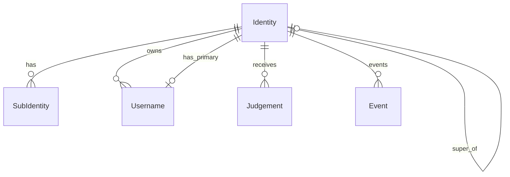

# Multichain Identity Indexer - Identics

- **Team Name:** KodaLabs
- **Payment Details:**
  - **DOT**: 14QBw4Feq5d53wg4haQ1gL4PvPMv74WLkBqt2oQFRkoLgZ3x
  - **Payment**: FIAT
- **[Level](https://github.com/w3f/Grants-Program#baby_chick-level-2):** 2

## Project Overview :page_facing_up:

### Overview

The Multichain Identity Indexer—Identics is a GraphQL service designed to streamline interaction with the Identity pallet that was initially on Relay-chain and now resides on People Chain. This service is specifically tailored to serve as a robust data layer for socially oriented dApps, leveraging the simplicity of GraphQL and REST API.

In the current landscape, developers face challenges interacting with Identity due to the complexity and time-consuming nature of querying an identity pallet for many accounts in parallel. The second problem is that historical data related to identities is stored on the Relay Chain, where real-time updates happen on the People Chain. Identics aims to address these challenges by providing a user-friendly GraphQL interface, thus reducing the time and effort required to query these assets.

The key advantages of Identics include its focus on ease of use, versatility for a broad range of use cases, and commitment to bringing People chain utilization and documentation closer to developers. Furthermore, Identics is an entirely decentralized, open-source solution that respects user privacy by not collecting user data.

By reducing the time required to query identities and providing a more development-friendly interface, Identics aims to foster the growth and development of the Web 3.0 ecosystem in Polkadot.

### Project Details

The Identics is a state-of-the-art infrastructure tool that addresses developers' challenges when querying identities from the chain. Currently, developers are limited to querying identities in batches from RPC nodes, which can be time-consuming and inefficient for customer-facing products. This limitation often results in long waiting times and heavy device data loads.

To overcome these challenges, we have developed the Identics. This tool leverages the power of GraphQL to provide a more efficient and user-friendly interface for developers. With the Identics, developers can easily query identity-related and build on top of the [identity pallet by Parity](https://github.com/paritytech/polkadot-sdk/blob/master/substrate/frame/identity/src/lib.rs) that was migrated from Relay chain to People chain. This service opens up a wide range of potential use cases, such as having Polkadot-native "Name service" or empowering social apps like [dotmemo.xyz](dotmemo.xyz).

Recognizing that many web developers may have little experience with GraphQL, we will also build a REST API that can be easily imported into any existing project. This API simplifies interacting with identities in any programming, making it more accessible for developers of all skill levels.

The Identics uses TypeScript and leverages the Squid framework (ArrowSquid) for data processing. It interacts with a Postgres database and provides a GraphQL interface for querying data. The project structure includes directories for generated model/server definitions, server extensions, data type definitions, and mapping modules. It also uses environment variables defined in a .env file or supplied by a shell for configuration.

The project's goal is to allow developers to interact with identities as simply as possible, ensuring all tasks can be done quickly and without extended searching. We aim to reduce the time necessary to query identity-related data on the People chain, making it easier for developers to build innovative social decentralized apps.

#### Architecture 🏗

The Identics architecture is designed with simplicity and efficiency, ensuring a seamless interaction with historical data from the relay chain and present data from the People chain.

At the core of our architecture is TypeScript, a statically typed superset of JavaScript that adds optional types to the language. TypeScript ensures robustness and reliability in our codebase, allowing us to catch errors early in the development process and write more maintainable code.

To handle data processing, we leverage the ArrowSquid framework. ArrowSquid is a powerful tool that allows us to process and index blockchain data efficiently. It provides a set of utilities for defining and running data processing tasks, making handling complex requirements easier.

Our project interacts with a Postgres database, a powerful, open-source object-relational database system that uses and extends the SQL language. Postgres provides us with the robustness, scalability, and performance we need to handle large amounts of data.

On the architectural level, we have a few layers, as described in the picture above. We need to obtain the data for the correct function of our indexer. Identics combines the sqd.dev archive (the data lake) and RPC node for the new data. When the indexer obtains a new event, it is automatically processed by the batch processor, which selects the defined handler. As previously mentioned, we processed data stored in the Postgres DB.

To expose the data to clients, we provide a GraphQL interface. GraphQL is a query language for APIs and a runtime for executing those queries with our existing data. It allows clients to ask for exactly what they need and nothing more, making it easier to evolve and enabling powerful developer tools.

The project structure is organized into several key directories. The 'src/generated' directory contains model/server definitions created by codegen. The 'src/server-extension' directory contains a module with custom type-graphql-based resolvers. The 'src/types' directory contains data type definitions for chain events and extrinsics created by typegen. The 'src/mappings' directory contains the mapping module. The 'lib' directory contains compiled js files, reflecting the structure of the 'src' directory.

Finally, the project configures environment variables, defined in a .env file or supplied by a shell. This approach allows us to easily manage and change the configuration without altering the codebase.

The second state-of-the-art is our REST API. REST API is currently the most popular way to interact with web services. Thanks to its agnostic nature, it can be easily imported into any existing project and used in any programming language. The REST looks like this: `GET /identities/${address}.`
We have decided to implement REST API via Hono and Typescript, which provides the highest versatility and works in any environment.

#### Technology Stack 💻

- TypeScript
- Node.js
- Docker
- sqd.dev (ArrowSquid for Substrate)
- Postgres
- GraphQL
- Hono (REST API)

### Ecosystem Fit

The Identics is a crucial addition to the Polkadot and Polkadot SDK ecosystem. It addresses the challenges developers often encounter when building on top of runtime pallets, particularly when interacting with Identities. The Identics provides a comprehensive identity-oriented data solution, simplifying the development process and enhancing the efficiency of dApps within the ecosystem.

Furthermore, the Identics is designed to be versatile, supporting a wide range of use cases. Developers can also leverage our [sub-scaffold UI](https://github.com/kodadot/sub-scaffold) template to bootstrap their projects quickly. This template, a forkable Substrate dev stack focused on rapid product iterations, accelerates the development process and allows developers to focus on creating innovative and user-friendly dApps rather than getting bogged down in the initial setup.

Our target audience for this proposal includes Web3 projects and blockchain developers, whether they are just starting out or already established within the Polkadot and Polkadot SDK ecosystem. We believe the Identics can provide significant value to these developers, enabling them to build more efficient and user-friendly dApps like [KodaDot](https://kodadot.xyz/).

Identities also play a significant role in social and user-facing apps like [KodaDot](https://kodadot.xyz/) NFT marketplace, which could leverage Identics instead of their off-chain-based solution (profiles). Thanks to that, developers can find real-world examples of effectively making GraphQL queries and learn more about using Identics.

Regarding competition within the Polkadot and Substrate SDK ecosystem, the Identics differentiates itself through its focus on identity-oriented data solutions, user-friendly interface, and commitment to simplifying the development process. Including the REST API further sets it apart, providing developers with a ready-to-use foundation for their projects. Moreover, the Identics will be being utilized by [KodaDot](https://x.com/kodadot) and [.memo](http://x.com/polkadotmemo), demonstrating its practical application and effectiveness. We plan to further promote the indexer within the ecosystem to onboard new developers and explore new solutions. Additionally, Open-Gov services do not need to rely on custom APIs and implementations when they can use Identics to query data from the chain. These factors position the Identics as a unique and valuable tool within the Polkadot and Substrate SDK ecosystem, ultimately serving as a Common Good solution.

## Team :busts_in_silhouette:

### Team members

- Viktor Valaštín - Project Lead
- Adam Hladik - Developer

### Contact

- **Contact Name:** Viktor Valaštín
- **Contact Email:** viktorko99@gmail.com

### Legal Structure

- **Registered Address:** Ljubljanska cesta 4, 4260 Bled, Slovenia, Europe
- **Registered Legal Entity:** KodaLabs, Viktor Valaštín s.p.

### Team's experience

**Viktor Valaštín**, also known as Viki Val, is the Co-founder of KodaDot. He has been instrumental in the technical aspects of the project. Viktor has been leading the team to create the best end-user experience for NFTs on the AssetHub. He also implemented AssetHub, EVM, and ink!-based NFTs to demonstrate the technical ability and versatility of the Polkadand ecosystem. His technical expertise has been crucial in successfully launching the AssetHub NFT Marketplace in 2023.

**Adam Hladík** is a full-stack developer focusing on blockchain technologies. He has been developing [.memo](https://dotmemo.xyz), which will provide easy UI for claiming onchain memories on AssetHub. He sees the importance of Identics as it can drastically improve user experience and promote the Polkadot ecosystem's social factor. He has vast experience in developing data processors and API services, notably for big corporations like IBM.

Viktor and Adam are strongly committed to the Polkadot ecosystem and have demonstrated their ability to deliver high-quality, impactful projects. They bring a wealth of knowledge and experience to the Identics project.

Viktor also has delivered following grants in the past:
- [Polkadot VueJS UI](https://github.com/w3f/General-Grants-Program/pull/144)
- [AssetHub NFT indexer](https://github.com/w3f/Grants-Program/blob/master/applications/kodadot_assethub_nft_indexer_statemine_statemint.md)
- [AssetHub NFT M2](https://github.com/w3f/Grants-Program/blob/master/applications/kodadot_assethub_nft_m2.md)

### Team Code Repos

- https://github.com/kodadot/nft-gallery
- https://github.com/dotmemo/app

- [Viktor Valaštín](https://github.com/vikiival)
- [Adam Hladík](https://github.com/hladikes)

### Team LinkedIn Profiles

- [Viktor Valastin](https://linkedin.com/in/vikival/)
- [Adam Hladík](https://linkedin.com/in/adam-hladík-a3583611a/)

## Development Status :open_book:

We have initialized the [vikiival/identics](https://github.com/vikiival/identics) repository with sqd.dev and configured connections to the Polkadot network and People chain. As mentioned, we have drafted an initial schema for GraphQL as it will be a base point of our development. All tasks related to the development are tracked in [github.com/vikiival/identics/1](https://github.com/vikiival/identics/milestone/1) - Milestone 1 track.

Regarding the research, we have observed 3 points of interest:
1. [related past and present identity issues on Kodadot](https://github.com/kodadot/nft-gallery/issues?page=4&q=is%3Aissue+identity+is%3Aclosed)—We have identified that Identics would be a perfect fit for Kodadot as it would allow users to query user data from the chain and display it in the UI.
2. We have also identified that [SubIdentity](https://github.com/w3f/Grants-Program/blob/master/applications/SubIdentity.md) was an original project to have all-in-one solution for identity on Polkadot. However, based on the research we have conducted [their repo seems to have had yet to have activity for the past 3+ years](https://github.com/Shard-Labs/identity-hub/tree/main). Moreover, the SubIdentiy has used old technologies and is incompatible with the current Polkadot ecosystem. SQD.dev is flexible enough to handle future changes in the Polkadot ecosystem.
3. To ensure we did not miss any crucial points, We have researched how [identity migration was handled](https://hackmd.io/@vikiival/dot-identities).

## Development Roadmap :nut_and_bolt:

### Overview

- **Total Estimated Duration:** 3 months ⌛️
- **Full-Time Equivalent (FTE):** 2 FTE
- **Total Costs:** 30,000 USD 💰
- **DOT %:** 50%

### Milestone 1 - Indexer and API Implementation

- **Estimated duration:** 3 months ⌛️
- **FTE:** 2 FTE
- **Costs:** 30,000 USD 💰

| Sequence | Deliverable | Description |
|----------|-------------|-------------|
| 0a. | Licensing | MIT License will be applicable. |
| 0b. | Documentation | Comprehensive inline code documentation and an explicit README file to guide the project setup and execution. |
| 0c. | Testing Guidelines | Testing will cover major functionality with unit tests and provide a guide for executing these tests. |
| 0d. | Docker Integration | Dockerfile for running Identics in an isolated environment. |
| 0e. | Github Wiki queries | WIKI will be created with a list of queries/subscriptions that can be used. |
| 1a. | Identity Registration Schema | Development of core identity storage schema including registration, judgements, and deposit management. |
| 1b. | Identity Management Handlers | Implementation of handlers for `set_identity`, `clear_identity`, and `kill_identity` functions. |
| 1c. | Identity Events Processing | Event handlers for `IdentitySet`, `IdentityCleared`, and `IdentityKilled` events. |
| 2a. | Registrar System Schema | Design and implementation of registrar management schema including fee structures and field identifiers. |
| 2b. | Registrar Management Handlers | Implementation of `add_registrar`, `set_fee`, `set_fields`, and `set_account_id` functionality. |
| 2c. | Judgment System Implementation | Handlers for `request_judgement`, `provide_judgement`, and `cancel_request` functions. |
| 3a. | Sub-Identity Schema Development | Creation of sub-identity data model including deposit tracking and naming systems. |
| 3b. | Sub-Identity Management Handlers | Implementation of `set_subs`, `add_sub`, `rename_sub`, `remove_sub`, and `quit_sub` functions. |
| 3c. | Sub-Identity Events Processing | Handlers for `SubIdentityAdded`, `SubIdentityRemoved`, and `SubIdentityRevoked` events. |
| 4a. | Username System Schema | Development of username management schema including authority properties and pending approvals. |
| 4b. | Username Authority Handlers | Implementation of `add_username_authority` and `remove_username_authority` functions. |
| 4c. | Username Management Handlers | Handlers for `set_username_for`, `accept_username`, and `set_primary_username` functions. |
| 4d. | Username Cleanup Handlers | Implementation of `remove_expired_approval` and `remove_dangling_username` functionality. |
| 5a. | Query Interface Development | Creation of efficient data access methods for identity information. |
| 5b. | Data Views Implementation | Development of specialized views for identity and username lookups. |
| 6a. | API Implementation: identityByAccount | API that fetches complete identity information for a specified account address. |
| 6b. | API Implementation: identityListByJudgement | API that retrieves all identities with a specific judgement status. |
| 6c. | API Implementation: identityListByRegistrar | API fetching all identities verified by a specific registrar. |
| 6d. | API Implementation: subsByAccount | API to fetch all sub-accounts associated with a main identity account. |
| 6e. | API Implementation: subsListByName | API to retrieve sub-accounts containing specified name pattern. |
| 6g. | API Implementation: registrarList | API to retrieve complete list of registrars with their fees and fields. |
| 6h. | API Implementation: usernameByAccount | API to fetch the primary username for a specified account. |
| 6i. | API Implementation: accountByUsername | API for reverse lookup to find account associated with a username. |
| 6j. | API Implementation: usernameListByAuthority | API to fetch all usernames issued by a specific authority. |
| 6k. | API Implementation: usernameListBySuffix | API to retrieve all usernames with a specific suffix. |
| 6l. | API Implementation: pendingUsernamesByAccount | API to fetch all pending username approvals for an account. |
| 6m. | API Implementation: identityListByField | API to retrieve identities that have specific fields verified. |
| 6n. | API Implementation: superAccountBySubAccount | API to fetch the main identity account for a given sub-account. |
| 6o. | API Implementation: identityEventsByAccount | API that fetches all identity-related events for a specified account. |
| 6p. | API Implementation: judgementRequestsByRegistrar | API to retrieve all pending judgement requests for a specific registrar. |
| 6q. | API Implementation: authorityListByAllocation | API to fetch username authorities based on their remaining allocation. |
| 6r. | API Implementation: identityListByVerificationStatus | API to retrieve identities based on their verification status. |
| 6s. | API Implementation: identityHistoryByAccount | API to fetch historical changes to an account's identity information. |
| 6t. | API Implementation: registrarStatistics | API providing statistics about registrar activities and verifications. |

## Future Plans 🔭

Upon successfully implementing the Identity Indexer, our team plans to enhance its capabilities based on community feedback, improve the developer experience, and expand the project's reach within the Polkadot ecosystem. We have outlined several key enhancements and upgrades that we aim to implement:

1. Development of an identity explorer to facilitate easy browsing of on-chain identities and usernames
2. Enhancement of IPFS integration for identity metadata storage
3. Creation of comprehensive view modules to present identity details and history
4. Implementation of bulk identity querying system for efficient data retrieval
5. Management of upgrades for cross-chain identity resolution between Relay chain and People Chain
6. Creation of social graph visualization tools for identity relationships
7. Implementation of action components for everyday identity operations (SET, CLEAR, VERIFY)
8. Integration with KodaDot and .memo social features
9. Regular maintenance to ensure compatibility with People Chain runtime upgrades
10. Development of comprehensive statistical representations for identity usage and verification patterns

The project maintenance and future development will be primarily supported through:
- Community contributions and feedback
- Active participation in the Polkadot ecosystem
- Collaboration with other parachain teams

Regular updates will be provided to maintain compatibility with Substrate changes and continuously enhance the system's capabilities.

## Referral Program (optional) :moneybag:

- **Referrer:** Luu (ex Polkadot Ambassador / Meetups Bounty Curator)
- **Payment Address:** 1NFfEH3yspdEgLnhZ5QWgb7B2z5LNCAE3HUo5nDxF5MqTcj

## Additional Information :heavy_plus_sign:

The Identity Indexer project continues our team's various projects and implementations in the Polkadot ecosystem. We have already attracted interest from developers within the Polkadot and Kusama ecosystems.

Notably, we previously received a grant from the W3F in 2019 for creating Vue.js UI utilities, components, and libraries. Details of this grant can be found [here](https://github.com/w3f/General-Grants-Program/blob/master/grants/speculative/Vuejs_ui-components.md).

We have a strong track record of delivering high-quality projects and have been actively contributing to the Polkadot ecosystem. Our team has a deep understanding of the Polkadot ecosystem. It is well-equipped to deliver the Identity Indexer project successfully.

We learned about the Grants Program through a personal recommendation. Our project aligns well with the program's goals, and we are excited about the potential to contribute further to the Polkadot ecosystem.
