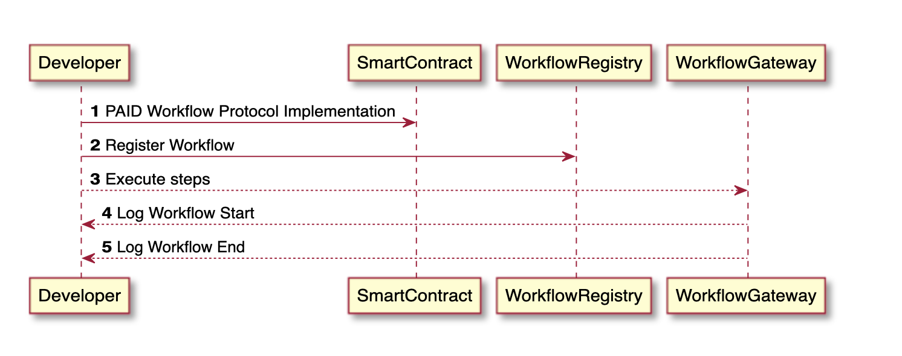

# Open Grant Proposal

> This document is referenced in the terms and conditions and therefore needs to contain all the required information. Don't remove any of the mandatory parts presented in bold letters or as headlines! See the [Open Grants Program Process](https://github.com/w3f/Open-Grants-Program/blob/master/README_2.md) on how to submit a proposal.

* **Project:** PAID Smart Agreements / DID Method based in the Standard W3C DID CORE, for Decentralized Identifiers (DIDs) / named proposal **DID:PAID**
* **Proposer:** [Master Ventures](https://github.com/MasterVentures)
* **Payment Address:** BTC payment address. We don't accept payments for the program in other currencies at this stage. 

*The above combination of your GitHub account and payment address will be your unique identifier during the program. Please keep them safe.*

## Project Overview :page_facing_up: 
This Decentralized identifier is a development of its own for the PAID Network, to handle a standard Decentralized Identifier DID Method, for self-sovereign digital identity, verifiable credential and Proof of Citizenship for users of PAID Smart Agreements Protocol.

### Overview

This Decentralized identifier is a development of its own for the PAID Network, to handle a standard Decentralized Identifier DID Method, for self-sovereign digital identity, verifiable credential and Proof of Citizenship how two-step verification, within the W3C standard for Decentralized Identifiers, allowing to create a decentralized identifier, transparent and secure method of attestation of user data within a `chain of trust` scheme.

#### Technologies
* OpenLaw
* PAID Network
* XDV
* JSON SCHEMA
* JEXL
* ICAO TRIP

#### Integration with Plasm Network

Our development pipeline consists of standard EVM compatible tooling with the exception of compilation, which is done by the Solang compiler, which allows us to deploy contracts compiled to Plasm Network in Multiple VM, like eg. EVM contracts compatible based on solidity and WebAssembly contracts compatible based on RUST, both support for Substrate.io/PolkaDOT.

### Project Details 

This image explains the process of build/register and verify **DID:PAID** Identifier, since of PAID Smart Agreements Protocol.

A DID Method / **DID:PAID** workflow looks like:

* User registers in PAID Network, creating his Wallet in Dapp, PAID-Wallet.

* User creates an template agreement or selected a pre existing template.
 
* If it is the first time that the user creates a Smart Agreements, a process of verification of credentials and Proof of Citizenship begins, Through the creation of a decentralized identifier **DID:PAID**,  for the attestation of the user's data and their legal residence.

* PAID Smart Agreements, takes the user's data and builds a JSON SCHEMA based on the VC MODEL standard of the W3C DID.

* Then the DID Resolver of the **DID:PAID**, based on the W3C DID Standard, validates through the MRTD standard (ICAO TRIP), the user's credentials loaded in the JSON Schema, which gives attestation of the user's data and generates a verifiable decentralized identity of the user.

* User adjusts the parameters and conditions of the selected template agreements, and creates an instance of the Smart Agreements appropriate to your particular requirement.

* Alice sends signed agreement used your **DID:PAID**, to Bob, which then executes the agreement request party signatures.

* Attestation and Verifiable credentials through the **DID:PAID** digital signatures of the parties, with the DID Resolver, based on the W3C DID Standard.

* Signed agreement is stored on chain and off chain and PAID Smart Agreements Protocol workflow is created, compiled and registered.

* On Contract execution, workflow is executed by a follow-up module, which whitelist allowed users.  

* Contracts calls that are integrated with oracles are called and allows:
    * Applies agreement terms (terms must be classify to numeric, similar to ML Classification).
    * Verify agreement terms subjects (Only supports token price subject in first release).

### Previous Work

- **XDV Technology**: Contains components to create digital signatures for documents using HD Wallet technology and integrates with Swarm (ethereum) and compatible with hardware modules that support PKCS#11 and PKCS#12. Links: https://app.xdv.digital/about/#/ (Spanish), https://app.xdv.digital/
- **PAIDNetwork**: A Solidity state  machine and workflow engine, using optimized code with RLP encoding. Links: https://gist.github.com/molekilla/b85f1c9de63be3afacbfeca703bb3fe4 (Spanish)

### Ecosystem Fit 

Our project is different in that our team has had more than a year of experience with making wallets for blockchain dapps and then half a year with deep experience in DID, Swarm, IPFS and document signing, which are the bulk of tech experience as defined in OpenLaw. But our protocol takes it a bit further and uses oracles and Machine Learning to make it more automated and allows for hybrid scenarios, where a ML business logic can rank or tag a dispute and then it can be further review by an incentivized human arbitrator, allowing for consensus of a dispute, our protocol excels not only in the dispute/arbitrage, but also at transcribing using RLP instead of a Markup Language based ion JEXL.

Further along, by adding the latest in identity technology, with a standard of W3C DID METHOD develop for us (**DID:PAID**) allows us to delegate authority to smart contracts using the DID decentralized identity of the individual or smart contract.

Additionally, in the second stage it will allow identity verification through a Certification Authority such as Let's Encrypt, allowing to be part of a `chain of trust`, where each hardware and software component is verifiable through a private key and an X.509 certificate. Ensuring that the protocol can be an integral part of any verifiable end-to-end communication scheme or like is known `chain of trust`.

We think this project, while developed in EVM, will allow for better and transparent DeFi projects to be used in the PolkaDOT ecosystem.

## Team :busts_in_silhouette:

### Team members
* Rogelio Morrel
* Alfredo Lopez
* Patricia Carrillo

### Team Website	
* https://www.master.ventures

### Legal Structure 
Please provide the name and registered address of the legal entity executing the project.

### Team's experience
Please describe the team's relevant experience.  If the project involves development work, then we'd appreciated if you can single out a few interesting code commits made by team members on their past projects. For research-related grants, references to past publications and projects in a related domain are helpful.  

### Team Code Repos
* https://github.com/decent-bet/solido
* https://github.com/decent-bet/vuex-solido
* https://github.com/decent-bet/solido-repl
* https://github.com/decent-bet/solido-web-console
* https://github.com/decent-bet/solido-provider-web3
* https://github.com/decent-bet/solido-provider-thorify
* https://github.com/decent-bet/solido-provider-connex
* https://github.com/decent-bet/solido-cli
* https://github.com/decent-bet/solido-block-date-converter
* https://github.com/xdvplatform/odenplan-wallet
* https://github.com/xdvplatform/xdvplatform-wallet

### Team LinkedIn Profiles
* https://www.linkedin.com/in/rogelio-morrell-575aa51/
* https://www.linkedin.com/in/alfredolopez80/

## Development Roadmap :nut_and_bolt: 

Master Ventures, foresees the development of the PAID Smart Agreements Protocol in three clearly defined stages

* **Milestone 1:** Development of a Smart Agreement Template Builder, which converts that contract to the logic of a Smart Contract based on Solidity / Solang, with a set of design patterns that will allow interaction with it in a more dynamic way and malleable. Additionally, a platform to execute actions in that Smart Agreements Template, based on the conditions defined by the Smart Agreements signature parties. Along with the Decentralized Identification System (DID based in standard W3C) with a Credential Verification, based on the DID-CORE / VC-MODEL, named **DID:PAID**, and a two-step authentication option based on MTRD / ICAO TRIP, all this verifiable through of a Certification Authority that generates a PKCS#12 Certificate, the `chain on trust` for the certification of Smart Agreements.

### Overview
* **Total Estimated Duration:** 3 month
* **Full-time equivalent (FTE):**  Workload of an employed person ([see](https://en.wikipedia.org/wiki/Full-time_equivalent)) 
* **Total Costs:** 25K

### Milestone 1 Example — Implement Plasm Modules 
* **Estimated Duration:** 3 month
* **FTE:**  1
* **Costs:** 2 BTC

| Number |   Deliverable   | Specification |
| ------------- | ------------- | ------------- |
| 0a. | License | Apache 2.0 / MIT / Unlicensed |
| 0b. | Documentation | We will provide both inline documentation of the code and a basic tutorial that explains how a user can (for example) spin up one of our Plasm VM's. It will be possible to send test transactions that will show how the new functionality works. |
| 0c. | Testing Guide | The code will have proper unit-test coverage of 95% to ensure functionality and robustness. In the guide we will describe how to run these tests, And after this a Bounty policy for error detection. | 
| 1. | Plasm module: Builder Template and Instance of Smart Agreements | We will create a Plasm module that will allow the creation of predesignated templates with the conditions (clauses) and events most common to the type of contract to which the template will be oriented, additionally, an instance of this template will be handled allowing its subsequent execution and follow-up of events in a way decentralized. |  
| 2. | Plasm module: Builder Digital Signature in `Chain of Trust` | We will create a Plasm module that will allow the verification by a Certification Authority of the digital signature to be used by Smart Agreements users, allowing PAID Smart Agreements within a `Chain of Trust` scheme, where the entire system, both hardware and software is insured and verified. |  
| 3. | Plasm module: Follow-up of Smart Agreements | We will create a Plasm module that will allow monitoring of the variables events and functions defined in the PAID Smart Agreements, and verify with them and the interactions of the signature parties, the execution of the Smart Agreements, according to the pre-established conditions at the time of creation, keeping in At all times, a monitoring scheme completely auditable by the parties, or any higher instance, be it arbitration and / or court, as defined in the contract when creating it. |  
| 4. | Plasm Network | The modules Builder Template of Smart Agreements, Builder Digital Signature in Chain of Trust, and Follow-up of Smart Agreements, which will be deployed in the Blockchain PolkaDOT, which is done by the solang compiler, which allows us to deploy contracts compiled in Multiples VM of Plasm Network to EVM as WASM contracts over Plasm Network compatible with Substrate.io / PolkaDOT. |  
| 5. | External Module of Plasm | External support modules for the verification of credentials, proof of citizenship and utilities and services associated with the **DID:PAID** Method. |
| 6. | Docker | We will provide a dockerfile to demonstrate the full functionality of our Protocol |

## Future Plans
Integrate **DID:PAID** method in the entire PAID Smart Agreement Protocol workflow, in PAID Network Services. And it includes the options for handling data verification by a Certification Authority (CA) like Let's Encrypt, for the **DID:PAID** decentralized identifier, allowing to generate a PKCS#12 Certificate and guarantee that the PAID Smart Agreements can be implemented within a `chain of trust` scheme.
