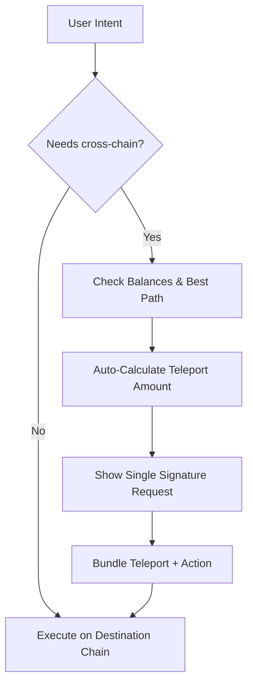

# ParaPort – Revolutionizing Cross-Chain Experiences in the Polkadot Ecosystem

- **Team Name:** ParaPort
- **Payment Details:**
  - **DOT**: 13pa5ASHLLYLbEqN8EK2CzJbJ4BxXGcJ7xnVAwkMN7dTEkmY
  - **Payment**: USDC
- **[Level](https://github.com/w3f/Grants-Program#baby_chick-level-2):** 2

## Project Overview :page_facing_up:

### Overview

**ParaPort** is an embedded auto-teleport solution designed to simplify cross-chain transactions in the Polkadot ecosystem. Its primary function is to detect when users need tokens on different parachains and seamlessly handle the entire teleportation process alongside the user's intended action with minimal additional friction. Originally developed as an internal feature within [KodaDot](https://kodadot.xyz/) for minting NFTs on AssetHub, ParaPort has evolved into a comprehensive plug-and-play integration that any application in the Polkadot ecosystem can implement, bridging the gap between complex XCM mechanisms and intuitive user experiences without requiring extensive technical knowledge from developers or users.

ParaPort is based on the academic research paper ["Protocol for Unifying Cross-Chain Liquidity on Polkadot" (Valaštín et al., 2024)](https://www.frontiersin.org/journals/blockchain/articles/10.3389/fbloc.2024.1413840/full). The building blocks implement *ParaSpell*, an intelligent XCM library, the most efficient way for moving tokens between chains. As a result, developers no longer need to manually build or maintain complicated cross-chain logic, and users no longer need to guess how many tokens to bridge or which route to use.

**Key Features of ParaPort include:**

- Automatic detection of cross-chain token requirements
- Streamlined processing that handles bridging before executing user-intended transactions in a seamless flow
- Simple, customizable user interface requiring only signatures from the user
- Readily embeddable with minimal configuration
- Out-of-the-box support for parachains like AssetHub and Hydration

By simplifying cross-chain operations, ParaPort aims to increase the adoption of Polkadot parachains, create a more cohesive user experience across the ecosystem, and enable new possibilities for cross-chain applications.

### Project Details

**ParaPort** addresses the fundamental challenge Polkadot users often face when moving tokens between chains to execute transactions—such as minting NFTs, staking, participating in governance, or swapping tokens. Traditionally, users must manually initiate teleports, confirm completion, and re-initiate their primary action. This cumbersome, multi-step process can feel overwhelming and lead to drop-offs or errors.

ParaPort solves these issues by detecting the need for cross-chain transfers and optimally composes cross-chain messages behind the scenes. Users simply initiate their intended action (e.g., minting an NFT on a specific parachain). ParaPort automatically calculates how many tokens need to be teleported and then guides the user in the step-by-step signature process. Afterward, the user's main transaction proceeds as if everything were local—no manual bridging required.

For developers, our SDK offers:

1. **Modularity**: Developers can embed it as an integrated flow or a standalone modal.
2. **Customization**: Configurable UI matching existing application styles.
3. **Scalability**: Designed to handle cross-chain transactions efficiently, providing a standardized bridging approach that any Polkadot parachain can integrate with minimal configuration.
4. **Future-Proofing**: Continually updated for Polkadot's evolving XCM specifications, requiring little or no developer intervention.

Ultimately, ParaPort hides complicated cross-chain operations behind a single, user-friendly interface, enabling frictionless user experiences throughout the Polkadot ecosystem.

)

### Architecture 🏗

At the heart of ParaPort lies a modular architecture designed with simplicity and efficiency, ensuring seamless integration for developers.

At the core of our architecture is TypeScript, a statically typed superset of JavaScript that adds optional types to the language. TypeScript ensures robustness and reliability in our codebase, allowing us to catch errors early in the development process and write more maintainable code.

To properly handle cross-chain message creation, we leverage the ParaSpell framework. ParaSpell is a handy tool that allows us to efficiently create and compose cross-chain messages. It provides a set of utilities for defining calls, making handling complex requirements easier.

Our project interacts with the Vue and React frameworks. These powerful, open-source, and popular frontend frameworks are used by most Web3 developers.

)

On the architectural level, we have a few layers, as described in the picture above. From the top down (from user to core), we have an SDK that is installable for popular frontend frameworks (Vue, React). SDK provides embeddable UI components that seamlessly integrate into existing dApps. Additionally, developers can adapt components into their custom branding and user flow with minimal changes. Most importantly, SDK is very verbose, offering detailed error handling, including retries, partial teleports, or user cancellations. In the heart of our SDK, we have a core library.
Core contains all the important logic shown to the user via SDK and offers reactive hooks that can then spawn an interaction. When Core receives a request for teleportation, it automatically finds the best route, calculates and verifies balances, and prepares transactions for the user so they can be signed.

What does the flow look like?

As we can see on the mermaid chart below, everything starts with a user's intent to perform an operation (e.g., "Mint an NFT on AssetHub, but the user's DOT is somewhere"). In case DOT is not present on the chain (AssetHub), ParaPort will start checking for suitable balances on the other chains. Once we find the best path, we will do one more re-check to see if the user has enough funds to pay for XCM fees. After that, we can proceed with signatures. Therefore, the user is prompted to sign the transaction with the wallet (we support all the major Polkadot wallets). The transaction is dispatched thereafter, and we observe its on-chain status on both chains. This creates a streamlined user experience where the user only approves one extra step. All of this is, however, nicely packaged into interactive and user-friendly components that can be easily integrated into any existing front. UI components offer detailed error handling, including retries, partial teleports, or user cancellations.

The project structure is organized into several key directories. The `packages/core` directory contains the core implementation of Paraparport that can be reused across different frameworks. The `packages/sdk` directory contains Vue components that can be installed on any Vue/React projects with proper type definition. The `packages/statick` directory contains configuration for currently supported chains and a list of RPC nodes.

This architecture ensures *invisible complexity* for the user while preserving developer freedom to tailor the UI to their specific application domain.

#### Technology Stack 💻

- **TypeScript & Node.js** – Base layer for the ParaPort SDK, providing a robust, asynchronous environment  
- **Polkadot.js & XCM** – Used under the hood for parachain interactions, bridging, and message passing  
- **React & Vue (Components)**  – UI integration layers  

### Ecosystem Fit

**ParaPort** adds value to the Polkadot ecosystem by providing an essential bridging abstraction for any cross-chain operation. Without it, dApp developers must implement complicated bridging logic or force users through manual transfers. ParaPort revolutionizes the user experience by eliminating context switching, delivering a consistent bridging flow across all applications, and making cross-chain complexity invisible—letting users focus on their intended actions. At the same time, the SDK intelligently handles token movements behind the scenes.

With the upcoming transition of assets from the Polkadot Relay Chain to Polkadot Hub, ParaPort's expansion to support parachains like Hydration ensures that users will continue to experience seamless cross-chain operations regardless of architectural changes in the ecosystem.

- **Use Cases**  
  - **NFT Minting**: Move DOT or parachain-specific tokens for minting fees automatically.  
  - **Swapping & DEX**: Cross-chain token exchanges can incorporate ParaPort to route liquidity from any chain.  
  - **Social Apps**: Simplify bridging of tokens for interacting with features like MEMOs or Identity-based services.  
  - **DeFi**: Provide frictionless deposit and withdrawal flow for yield farming or liquidity providing.  

By removing friction and ensuring a near-invisible bridging process, ParaPort encourages more advanced cross-chain use cases while significantly improving Polkadot's end users' day-to-day experience.

---

## Team :busts_in_silhouette:

### Team members

- **Ondrej Pulc** – Project Lead, Designer, Frontend developer  
- **Hussnain Sharif** – Full-stack Developer in KodaDot, specialized in TypeScript

### Contact

- **Contact Name:** Ondrej Pulc  
- **Contact Email:** pulcondrej@gmail.com  

### Legal Structure

- **Registered Address:** Hausenská 836, 56151 Letohrad, Czechia  
- **Registered Legal Entity:** Ondřej Pulc, IČO: 19448287

### Team's experience

**Ondrej Pulc** is the Lead designer of KodaDot. He has delivered multiple Polkadot solutions and designs, including the design of the NFT Atomic Swaps on AssetHub Polkadot. Ondrej's deep technical understanding of cross-chain operations and Polkadot's XCM capabilities led to the conceptual foundation of ParaPort.

**Hussnain Sharif** is a versatile full-stack developer with experience building robust frontend solutions and API services. His involvement in the Polkadot ecosystem includes integrating cross-chain transactions into user-friendly UIs dApps such as [KodaDot](https://kodadot.xyz).

Ondrej and Hussnain are a dedicated duo that brings best-in-class solutions for the Polkadot ecosystem. Their user-centric approach allows them to have a positive impact on the ecosystem.

### Team Code Repos

- [KodaDot (NFT Marketplace)](https://github.com/kodadot/nft-gallery)  
- [.memo (Polkadot POAP)](https://github.com/dotmemoxyz/app)  
- [Ondrej Pulc](https://github.com/exezbcz)
- [Hussnain Sharif](https://github.com/hassnian)

### Team LinkedIn Profiles

- [Ondrej Pulc](https://www.linkedin.com/in/ondřej-pulc-1b4132268/)  

### Advisors
Ecosystem developers who agreed to provide advisory help during the project implementation phase:
- [Viki Val](https://github.com/vikiival), co-founder of KodaDot

## Development Status :open_book:

We have initialized the [exezbcz/paraport](https://github.com/exezbcz/paraport) repository and are ready for SDK development. Polkadot network and People chain. As mentioned, we have installed the Polkadot package and an initial setup for the Relay chain, People chain, Hydration parachain and Polkadot AssetHub, as they will be the base point of our development. All development tasks are tracked in [github.com/exezbcz/paraport/1](https://github.com/exezbcz/paraport/milestone/1)—Milestone 1 track.

## Development Roadmap :nut_and_bolt:

### Overview

- **Total Estimated Duration:** 3 months ⌛  
- **Full-Time Equivalent (FTE):** 2 FTE  
- **Total Costs:** 30,000 USD 💰  
- **DOT %:** 50%

### Milestone 1 – ParaPort SDK Core & Single-Hop Teleports

| ID | Component | Description |
|----|-----------|-------------|
| 0a.   | Licensing      | MIT License will be applied. |
| 0b. | Documentation | Comprehensive API reference, integration guides, configuration documentation, example implementations, troubleshooting guidance, architecture overview, and performance optimization tips. |
| 0c. | Testing Guidelines | Complete testing framework with unit tests, integration tests, UI component tests, coverage requirements, mock chain setup, performance benchmarking, error simulation, and CI integration. |
| 0d. | CD/CI Pipeline | Automated GitHub action workflows for testing, code quality checks, build verification, security scanning, release automation |
| 1a. | Cross-Chain Messaging Implementation | XCM message construction, transfer instruction generation, execution engine, protocol adapters, transaction signing, verification, and recovery management. |
| 1b. | Bridge & Network Management | Network discovery, bridge registry, connection management, health monitoring, protocol selection, asset mapping, and configuration management. |
| 1c. | Teleport Calculation System | Fee calculation, quote generation, route analysis, balance validation, funds assessment, subscription management, fund detection, and volatility handling. |
| 1d. | Foundation & Lifecycle Management | Foundational architecture providing clean API interfaces, unified event system, centralized configuration management, and pluggable component registry, ensuring stability and extensibility while maintaining optimal resource utilization across diverse application environments. |
| 2a. | Vue/React components | Modular, installable components available via NPM. |
| 2b. | Inline UI | Progress visualization, customization API, error recovery UI, mobile-first design, state management, and minimal configuration options. |
| 2c. | UI Component Library | Open-source Figma file containing all UI components, states, and design patterns for easy customization and implementation. |
| 3a. | Basic Error Handling | System, network, transaction, and user interaction error handlers with recovery strategies, retry mechanisms, and transaction reset capabilities. |
| 3b. | Hydration Parachain Integration | Full integration of Hydration parachain with support for its native tokens and cross-chain operations |

As the table with deliveries can be hard to comprehend, we list a detailed list of deliverables below.

## 0. Project Infrastructure

### 0b. Documentation
- **API Reference**: Comprehensive documentation of all public APIs, including methods, parameters, return types, and example usage.
- **Integration Guide**: Step-by-step guide for integrating the SDK into existing applications, with code samples for both Vue and React.
- **Configuration Guide**: Detailed explanation of all configuration options, environment setup, and customization possibilities.
- **Example Implementations**: Collection of common use-cases with complete code examples and explanations.
- **Troubleshooting Guide**: Common issues, error messages, and their solutions, including debugging tips and best practices.
- **Architecture Overview**: High-level documentation of the SDK's architecture, components, and their interactions.

### 0c. Testing Guidelines
- **Unit Testing Framework**: Comprehensive test suite for core SDK functions and fee calculations.
- **Integration Testing**: End-to-end tests for cross-chain operations, focusing on successful transfers between different network combinations.
- **CI Pipeline Integration**: Automated test execution in GitHub Actions with proper caching and parallel test runs.

### 0d. CD/CI Integration Pipeline
- **Automated Testing Workflow**: Implement GitHub Actions workflow for running unit tests on every pull request and commit to main branches.
- **Code Quality Gates**: Set up automated code quality checks including linting, type checking, and coding standards enforcement.
- **Dependency Scanning**: Implement security scanning of dependencies to identify potential vulnerabilities.
- **Release Automation**: Create streamlined process for generating release candidates with proper version tagging.

## 1. Core 

### 1a. Cross-Chain Messaging Implementation
- **XCM Message Construction**: Build a system to create correctly formatted XCM messages for various cross-chain operations.
- **Transfer Instruction Generation**: Develop functionality to convert user-friendly transfer parameters into precise blockchain instructions.
- **Message Execution Engine**: Create an execution system that submits messages to appropriate chains and tracks their processing through the network.
- **Transaction Signing Integration**: Build a flexible system to integrate with various wallet and signing solutions for secure transaction authorization.
- **Transfer Verification**: Implement comprehensive verification of transfer completion, including confirmation monitoring and receipt validation.
- **Transfer Retry Management**: Develop mechanisms to identify, track, and resolve failed or stuck transfers with automated recovery procedures.

### 1b. Bridge & Network Management
- **Network Discovery System**: Create a system that automatically identifies and catalogs available networks for a given teleport parameters.
- **Bridge Adapters Architecture**: Design a flexible adapter system that standardizes interactions with various cross-chain bridge protocols, enabling seamless integration of current and future bridging solutions.
- **Connection Management**: Build a unified connection handling system that maintains stable connections to multiple networks simultaneously.
- **Endpoint Optimization Service**: Implement an intelligent service that continuously benchmarks and selects the best-performing RPC endpoints for each network, automatically switching to faster alternatives when performance degrades.

### 1c. Teleport Calculation System
**Unified Fee Calculator**: This is a comprehensive system that estimates total transfer costs by calculating transaction fees across different chains and adding appropriate safety margins.
- **XCM Quote**: Function that identifies the source chain with the highest balance, calculates required transfer amounts with fees, and generates detailed quotes for optimal asset transfers between chains.
- **Unified Balance Validation**: Service that checks, aggregates, and monitors balances across multiple chains in real-time, ensuring accurate fund verification throughout the teleport process.
- **Funds Assessment Module**: Module that verifies balance sufficiency, checks cross-chain fund availability, and implements no-funds detection.
- **Subscription System**: Develop a balance monitoring system that watches for changes across multiple chains.
- **Fund Detection**: Create a mechanism that detects when expected funds arrive on target chains.

### 1d. Foundation & Lifecycle Management
- **Initialization**: Design a robust initialization system with dependency injection, configuration validation, and graceful startup sequencing.
- **State Management Core**: Create a centralized state management system with immutable data patterns for consistent application state across components.
- **Asynchronous Operation Engine**: Design a system for managing long-running operations with cancellation, timeout handling, and resource cleanup.
Resource Optimization: Implement intelligent connection pooling, request batching, and subscription management to minimize network and memory usage.
- **Observability Infrastructure**: Create comprehensive logging, metrics collection, and diagnostic capabilities for monitoring SDK health and performance.
- **Versioning & Compatibility**: Develop systems to handle versioned APIs, migration paths, and backward compatibility across SDK versions.

## 2. UI Components

### 2a. Vue/React Libraries

- **React components** - Composable components compatible with React Hooks, Reactive teleport status tracking, Customizable UI elements.
- **Vue components** - Composable components compatible with Vue 3's Composition API, Reactive teleport status tracking, Customizable UI elements with slot support.

### 2b. Inline UI
- **Progress Visualization**: Clear, minimalist progress indicators showing transfer status and estimated completion time.
- **Customization API**: Flexible styling API allowing components to match the host application's design system while maintaining consistent UX.
- **Error Recovery UI**: User-friendly error messages with suggested actions and automatic retry capabilities.
- **Mobile-First Design**: Responsive components optimized for desktop and mobile interfaces.
- **State Management**: Built-in state handling for transfer progress, balances, and network status.
- **Minimal Configuration**: Simple props-based setup with smart defaults for quick integration.

### 2c. UI Component Library
- **Comprehensive Asset Collection**: Complete set of all UI components, screens, and states in a structured Figma file.
- **Design System Documentation**: Detailed specifications for typography, colors, spacing, and component variants.
- **Component States**: All possible component states, including loading, success, error, and empty states.
- **Design Tokens**: Exportable design values for consistent platform implementation.

## 3. System Components

### 3a. Basic Error Handling
- **Network Error Handler**: Component that handles network-related issues such as timeouts, connection drops, and API failures.
- **Transaction Error Handler**: Component that manages transaction-specific errors, including signature failures, insufficient gas, and failed executions.
- **User Interaction Error Handler**: Component that handles user-related errors such as invalid inputs, permission denials, and wallet connection issues.
- **Recovery Strategy Handler**: Component that implements recovery mechanisms, including transaction retries, fallback options, and error state management.
- **Retry Mechanism**: Develop functionality to identify and restart failed teleport operations with error handling.
- **Transaction Reset**: Design functionality to reset failed transactions to their initial state for retry attempts.

### 3b. Hydration Parachain Integration
- **Chain Configuration**: Set up Hydration parachain configuration within the ParaPort system, including RPC endpoints and network identifiers.
- **Token Support**: Add support for native token on the Hydration parachain.
- **Cross-Chain Routes**: Establish and test cross-chain routes between Hydration and other supported chains (Polkadot relay chain).
- **Fee Calculation**: Implement accurate fee calculation for transfers to and from the Hydration parachain.
- **Example Implementation**: Create a reference implementation showcasing cross-chain operations with Hydration.
- **Documentation**: Provide specific documentation for Hydration integration and use cases.

## Future Plans 🔭

After successfully implementing ParaPort's core bridging functionalities, our focus will shift toward the following expansions and improvements:

1. **Fee-Optimized Routing**  
   - Continually update route selection logic with real-time on-chain fees for optimal user experience.
2. **Support for Complex Flows**  
   - E.g., multi-chain yield-farming flows, multi-step NFT auctions, or advanced DeFi interactions.
3. **Deeper Ecosystem Integrations**  
   - Partnerships with other parachains, wallets, and tooling providers to standardize bridging flows across Polkadot.
4. **Developer Community & Hackathons**  
   - Expand community support via sample code, workshops, hackathons, and reference implementations.

5. **Ux feedback and integration**  
    - Implement a continuous feedback system with early adopters and end-users to gather insights, conduct usability testing, and iterate on the interface based on real-world usage data and community input.

6. **XCM bridge modal**
    - Develop an easy-to-plug cross-chain bridging modal that maintains a consistent user experience across all integrated applications.

7. **Additional Parachain Support**
    - Continue to expand support for emerging parachains in the Polkadot ecosystem based on user demand and ecosystem growth.

## Referral Program (optional) :moneybag:

- **Referrer:** Viki Val (co-founder of KodaDot)
- **Payment Address:** 14BZFbYEGoWWPjbbZUdLZ1TqDtdXvdeCy3R3t4QXqJmS91Dx

## Additional Information :heavy_plus_sign:

> [!NOTE]
> We call it SDK because we provide building blocks which are built on top of the ParaSpell, XCM and Polkadot API

**ParaPort** is positioned as a **public good** for the Polkadot ecosystem—an SDK that any dApp can adopt to radically improve user experience. Eliminating friction from cross-chain token transfers fosters broader adoption of Polkadot's multi-chain paradigm.

- The initiative has garnered interest from various ecosystem players, who see automated bridging as a key to unlocking genuinely *cross-chain* applications.
- **ParaPort** aligns with the Polkadot vision of interoperability, letting developers innovate while leaving bridging complexities to a proven, standardized solution.

ParaPort complements other initiatives in the Polkadot ecosystem (such as **UX Bounty**) by further lowering the barrier to entry for Polkadot-based apps. Our team is committed to building developer-friendly tooling, delivering robust user experiences, and expanding real-world utility in the Polkadot ecosystem.

**We look forward to furthering cross-chain capabilities with ParaPort, helping Polkadot reach its full potential as an interconnected network of specialized blockchains.**

