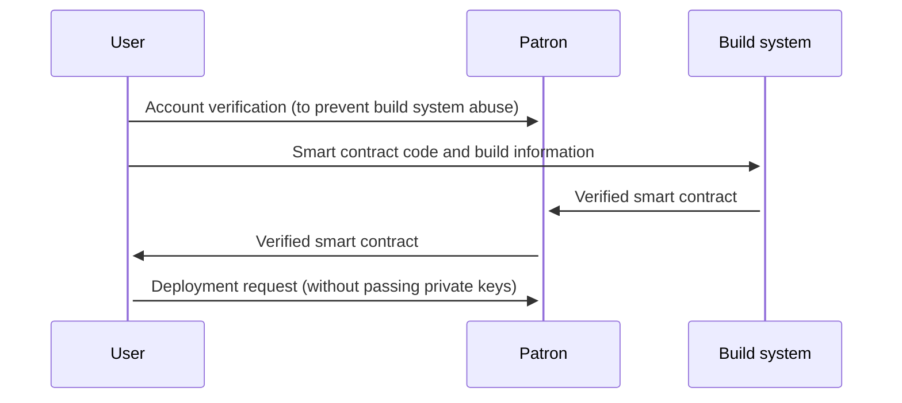
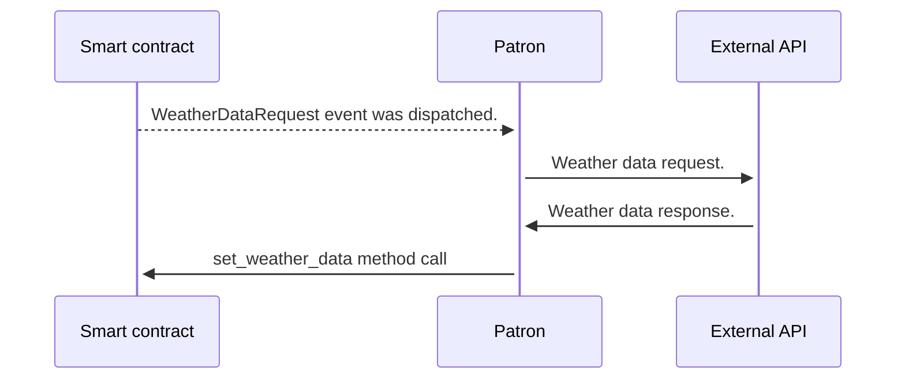
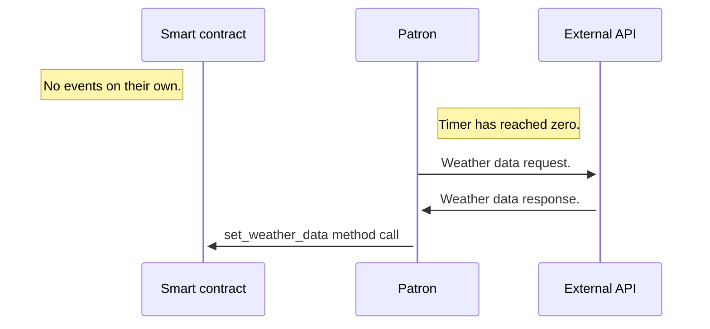

# Patron 

- **Team Name:** [727.ventures](https://github.com/727-Ventures)
- **Payment Address:** ERC 20 ADDRESS (DAI):
0x352F779203202c99699CdA8cc95adF06CcC8abEf 
- **[Level](https://github.com/w3f/Grants-Program/tree/master#level_slider-levels):** 3

## Project Overview :page_facing_up:

Patron is your one stop smart contract manager for Polkadot ecosystem.

Patron's tech stack consists of Rust (with [`axum`](https://docs.rs/axum) being used as an HTTP server), TypeScript (React, Next.js, polkadot{.js}), PostgreSQL.

### Overview

Nowadays, smart contracts are one of the main instruments of development in the blockchain world. As blockchain itself should be open and reliable, we want to create a registry of all available contracts, so everyone could understand the risks and check whether a specific contract is safe or not.

The other side of it - manager of smart contracts, so every developer could manage his own contracts just like using GitHub. It is very important for users to have connection with what developers do, so that will increase trust between them.

## Existing problems

1. Seamless verification ✅. An ability to seamless get your on-chain deployed contract logic verified and matched with existing source code, using the usual deployment flow without obscure actions.
2. Inefficient build flow. No automatic build flow results in awful developer experience for those developing on ink!. This means that developers have to manually start builds and manually deploy contract on each development iteration. 
3. Inefficient contract deployment. CLI/script deployment usually are not sufficient for local/testnet development while existing UI instruments are rather complicated . 
Also, there is no common deploy flow for every stage - local/testnet/production, a tool that would combine both CLI automation and UI playground. 
4. Unified contract management. Deployed smart contract management is currently done with the usage of hard-to-use CLI tools or UI instruments with just the basic features available. Also, developer contract management(UI used during development) and post-deployment contract management are different tools and interfaces(UIs). 
5. Vulnerability research is done mostly ad-hoc, with no unified platform being available to assist users in covering common vulnerabilities. Ecosystem also lacks automatic vulnerability scanning platform, which will catch common mistakes in smart contracts that could lead to security issues.
6. Interaction with external resources (like HTTP APIs) based on events is obscure and has to be implemented manually.

## Project details

UI concept can be previewed [here](https://www.figma.com/file/Q50Z11g0LKROslWIIbgR8K/Patron-Concept).

### Smart contract explorer

Explorer that behaves similarly to Subscan, which allows users to find smart contracts by their address
and see the data of the smart contract (code, dependencies, version of the compiler, chain etc.).

### Smart contract verification module

As part of our deployment flow, the verification module will provide a reproducible verification environment to build and verify ink! smart contracts.

Users will be able to supply smart contract code and tooling versions, which will be invoked inside of an isolated environment.

After user supplied code build, smart contract explorer users can see verification details (similar to how it's implemented in EtherScan).

To start using verification module, users will need to pay a fee. This will protect the verification module from abuse.

### Deployment tool

As part of our platform, we plan to provide users with a unified deployment tool that builds and publishes smart contracts for popular mainnets and testnets.

The contract build process is done on our platform side using isolated containers and contract verification workflow, while the deployment itself is done on user's side,
without delegating any private keys to us.

Eventually, we plan to unify our tools into Patron CLI, allowing developers to create new ink! contracts,
use existing smart contract templates, transpile existing Solidity contracts, or generate Typechain bindings
without leaving the same unified interface they will already be familiar with.

## Future work

Our long-term plans are to become a unified solution for developers to verify and deploy smart contracts, and for regular users to discover new smart contracts on.

We are eventually planning on providing monetization features in Patron, however the details are to be worked on later. We will not gatekeep
users from the general hosted Patron functionality, while also providing all the necessary means to deploy a self-hosted instance.

### Smart contract manager

Manager that will allow users to register and deploy their contracts and invoke various actions on existing contracts available on the platform, such as periodic invocation and vulnerability scanning.

Unified ink! smart contract manager solution allows us to provide improved transparency (by building a contract ourselves and publishing it or by verifying an already published contract to match the provided source code), security (integrated vulnerability scanning, audit publishment capabilities) and versatility (periodic contract invocation, integrated scripting features.).

Smart contract manager should provide most (if not all) of its functionality while keeping user’s private keys private, without delegating them to Patron.

### Build/Compile flow

Our unified deployment tool will also include code watching capabilities, allowing developers to quickly test application locally in an interactive fashion, without wasting time on manual smart contract deployment and instantiation.

### Vulnerability scanning and bug bounty program

We plan to integrate security features into our platform by providing users with capabilities to review existing smart contract audits done by third-party companies and eventually provide a platform to audit smart contracts.

Vulnerability scanning can be invoked automatically to detect various common vulnerabilities via pre-configured intrinsics, while still allowing users to review contracts in more detail if necessary.

### Scripting functionality

As part of the smart contract manager, we plan to provide a scripting functionality that will allow smart contract developers to access external APIs and implement complex workflows that depend on external data.

Patron will automatically (and in a verifiable way) request external APIs and call user’s smart contract methods with data obtained from the response.

This workflow may be executed based on the contract’s dispatched events or just by periodic contract calls.

We can also provide a smart contract with external data based on timer:

This feature can be expanded with vast scripting support, allowing user to execute arbitrary off-chain code that interacts with external services and the smart contract itself.

## Ecosystem fit

### Where and how does your project fit into the ecosystem?

Our platform can significantly improve the ink! ecosystem by covering transparency and security and providing versatile features, allowing developers and smart contract users to discover, discuss and improve.

### Who is your target audience?

Our target audience is WebAssembly smart contract developers, independent auditors, vulnerability researchers, and users who want to discover new smart contracts to use and discuss.

### What need(s) does your project meet?

Our project can significantly improve the general trust of users in smart contracts while also improving developer user experience by providing a versatile feature set.

### Are there any other projects similar to yours in the Substrate/Polkadot/Kusama ecosystem?

We are aware of Epirus Substrate explorer project (as well as an active project to create an ink! verification server).

Epirus explorer provides smart contract explorer features, however, no known effort to create a smart contract manager (similar to [OpenZeppelin Defender](https://www.openzeppelin.com/defender) functionality) is ongoing.

Verification will be part of the deploy flow and thus with mass adoption will be out of the box for every product deployed.

## Team members

- **Markian Ivanichok** (СEO of 727.ventures)
- **Dominik Krížo** (Head of Engineering | 727.ventures)
- **Ivan Leshchenko** (Blockchain Developer | 727.ventures)
- **Nameless Endless** (Blockchain Developer | 727.ventures)
- **Varex Silver** (Blockchain Developer | 727.ventures)
- **Artem Lech** (Blockchain Developer | 727.ventures)
- **Matviy Matsipura** (Designer | 727.ventures)

**Contact**

- **Contact Name:** Ivan Leshchenko
- **Contact Email:** ivan.leshchenko@727.ventures
- **Website:** [727.ventures](https://727.ventures)

**Legal Structure**

- **Registered Address:** The registered office shall be in Coastal Building, Wickham’s

Cay II, P. O. Box 2221, Road Town, Tortola, VG1110, British Virgin Islands.

- **Registered Legal Entity:** Seven2seven Ventures Ltd

**Team's experience**

- **Markian Ivanichok**

CEO of 727.ventures, a blockchain entrepreneur, and a software engineer. 

I began my engineering career at the age of 15 and have since gained extensive experience in both engineering and leadership. Having founded a couple of startups, I also gained entrepreneurial experience. I was inspired to co-found and invest in Sector F, one of the top consulting companies in Ukraine that helps entrepreneurs to accelerate their growth.

- **Dominik Krížo**

Head of Engineering

Started programming his own games at the age of 15 as a hobby, then went to University to study informatics and object-oriented programming, becoming an Android developer and eventually switching to work in web3. Dominik played a crucial role in the OpenBrush and Sol2Ink development and is currently developing the ink! smart contracts tools as part of Brushfam.

- **Ivan Leshchenko**

Blockchain Developer

Blockchain developer with proficiency in the Rust programming language. Developed various libraries and applications using Rust, with a primary interest in developing the WASM smart contract ecosystem.

- **Nameless Endless**

Blockchain Developer

Became interested in programming at the age of 16. At this time, he tried web development and created a website. Then decided to go to University to study system programming and object-oriented programming. Most often, he used C and C++ languages. Nameless likes innovations of web3 technologies and believes in the potential of Rust language and WASM standards for smart contracts.

- **Varex Silver**

Blockchain Developer

Student of Computer Science at the Kyiv National University of Taras Shevchenko. Participated in programming competitions of different stages in school since 2017 (C++). Was a Backend developer (Go), Solidity developer(Solidity, Hardhat, Typescript), and now a Blockchain developer (Rust, Typescript).

- **Artem Lech**

Blockchain Developer

Student of Applied Mathematics at the Kyiv National University of Taras Shevchenko. Started programming in 2016 and participated in a lot of Ukrainian and international competitions of competitive programming. Worked as a lecturer of algorithms at the school of competitive programming and as Intern Backend Engineer (Rust). Now works as Blockchain Developer on Polkadot Blockchain (Rust, Typescript).

**Matviy Matsipura**

Gained professional experience as a lead designer in a product company, where he was responsible for creating packaging and visual designs for a popular milk
brand in Ukraine. Transitioned to the field of web3 design and is currently leading the design process for blockchain projects.

**Team Code Repos**

- https://github.com/727-Ventures

Please also provide the GitHub accounts of all team members. If they contain no activity, references to projects hosted elsewhere or live are also fine.

- https://github.com/coreggon11
- https://github.com/ivan770
- https://github.com/o-tsaruk
- https://github.com/varex83
- https://github.com/Artemka374

**Team LinkedIn Profiles**

- https://www.linkedin.com/in/mivanichok/
- https://www.linkedin.com/in/dominik-krizo/
- https://www.linkedin.com/in/tsaruk-olexandr/
- https://www.linkedin.com/in/bogdan-ogorodniy/
- https://www.linkedin.com/in/artem-fomiuk-31249b226/

## Development roadmap

### Overview

Total duration: 7 weeks

FTE: 3

Total cost: 63,000 USD

### Milestone 1 - MVP with verification functionality only

Duration: 7 weeks (Frontend, Backend, CLI utility implementations).

FTE: 3

Total cost: 63,000 USD

| Number | Deliverable | Specification |
| --- | --- | --- |
| 0a. | License | MIT |
| 0b. | Documentation | We will provide API documentation for contributors to get along with the codebase, as well as a detailed self-hosting instructions for users to create their own nodes. |
| 0c. | Testing guidelines | Core functionality will be covered by a comprehensive unit test suite. |
| 0d. | Docker | We will prepare Docker images for users to spin up their own nodes more easily and conveniently. |
| 0e. | Article | We will publish an article that explains the achievements done as part of the grant. |
| 1a. | Backend storage | Backend implementation with contract discovery and persistent storage. |
| 1b. | Sync server | A separate server that catches new contract deployments and events will be implemented. |
| 1c. | Smart contract builder | Immutable, pre-configured smart contract builders are to be implemented for verified smart contract deployment. |
| 2a. | Web UI | A simple web UI will be implemented to expose Patron functionality. |
| 2b. | Detailed contract information | Frontend to display detailed contract info (as well as verification status) will be implemented. |
| 2c. | User authentication | We will implement a web3-oriented authentication solution |
| 3a. | Developer CLI utility | A deployment workflow unified, developer-oriented CLI utility will be implemented. |

## Additional Information :heavy_plus_sign:

**How did you hear about the Grants Program?** Personal recommendation
