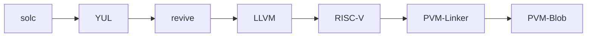

# LimeChain Polkadot VM - EVM Compatibility Checker

- **Team Name:** LimeChain
- **Payment Address:** 14dut6zGgdVmKijePZzrQAy2gZ6FmMDmzzp7VqjzPV9E4ujR
- **[Level](https://github.com/w3f/Grants-Program/tree/master#level_slider-levels):** 3

## **Project Overview** 📄

This is an application for a Research Grant. It involves deploying Solidity Contracts and Chai Test scripts in order to identify and report incompatibilities of the PVM and EVM runtimes.

### **Overview**

- **Title:** PVM <> EVM Compatibility Checker
- **Summary:** This project attempts to identify inconsistencies in the PVM runtime that would manifest themselves when running arbitrary EVM Solidity contracts. For the purposes of the compatibility tests, we have chosen some of the more common use cases and contracts, focusing on open-source contracts available for the Ethereum Ecosystem. Our goal is to deploy these contracts onto a testnet, and run the Chai Tests that would usually run locally on Hardhat, on-chain.
- **Relevance:** We intend to deploy these contracts on the Paseo Network, and run live tests on a functioning testnet. The goal is to evaluate the functionality in a non-synthetic environment. Our team has previously built EVM compatibility verification tools, and we are interested in increasing the adoption of blockchain technology, and believe that having transferrable skills is necessary to accelerate this adoption.
- **Result:** The results of the automated tests are to be collated and eventually published to [Parity's issue tracker](https://github.com/paritytech/contract-issues)

### **Project Details**

Currently, the PVM is a fairly new piece of technology, developed for the explicit purpose of providing Solidity developers a mechanism to deploy their contracts on Polkadot. Building a Smart Contract from Solidity to a PVM blob requires the use of multiple tools:

During the build process it has been shown that there can be inconsistencies in the management of 256-bit integers and certain opcodes may react differently. What we inted to explore is to what level of maturity has the compatibility reached, and if there are any issues discovered, to report those to the Parity team so that they can identify and improve the compatibility of their compiler.

The methodology followed involves the following:

1. Identifying the test-cases that should fall under the category of "Common" use-cases.
2. Gather the relevant contracts into a repository
3. Write/adapt tests for the contracts
4. Design a testbench that executes and gathers results from tests
5. Build CI/CD pipeline to execute the following flow
    - Compile contracts to Blobs
    - Deploy contracts to Paseo network
    - Spin up a testbench
    - Execute tests
    - Collate test results
6. Push results to [Parity's issue tracker](https://github.com/paritytech/contract-issues)

Considering that the project will be open sourced, we expect contributors to be able to add their own tests in the future, or re-run tests in order to validate the repeatability of issues, and verify if issues were fixed.

### **Ecosystem Fit**

The PVM Compatibility checker should provide developers with the necessary information to appropriately develop their Smart Contracts for Polkadot, especially considering and knowing the differences between the two ecosystems and how PVM differs from EVM. For the ecosystem that would mean that developers can adopt Polkadot more readily, and confidently deploy their contracts, knowing that their use-case has been verified.

Eventually we expect that the tool does not just become informative, but also the driver for improvement in compatibility. We hope that by bringing a full list of incompatibilities for the most used contracts, and eventually enriching into the more niche contracts, we can encourage improvements into the PVM and Revive compiler.

There is a similar project that has been done for Hedera, where they used a similar approach to [validate and track compatibility with EVM](https://hedera.com/blog/evm-equivalence-unveiling-hederas-strategy-for-enhanced-programmability-and-network-adoption) for their network.

### **Team** 👥

Team Members

- Stoyan Panayotov, Technical Lead
- Viktor Todorov, Blockchain Architect
- Yordan Atanasov, Quality Assurance Engineer
- Nikola Stanimirov, Project Manager

### Contact

- Rumen Yanakiev
- rumen.yanakiev@limechain.tech
- **Website:** [limechain.tech](https://limechain.tech)

### **Legal Structure**

- **Registered Address:** Sofia 1113, Sofia Municipality, Iztok District, 23A “Dragan Tsankov” Blvd., office 6, Bulgaria
- **Registered Legal Entity:** Lime Labs Ltd.

### **Team's experience**

At LimeChain, а tech-agnostic blockchain development company, we believe in a multi-chain future, based on the priniciples of interoperability, decentralization and adoption. Our vision is to help contribute to a world where  individuals, businesses, and organisations have more agency to connect, cooperate, and create value through blockchain products and solutions. We’ve been a major contributor to tge to the Polkadot ecosystem for 5+ years, namely through a suite of projects like

[Gosemble, a framework for building Substrate compatible Runtimes in Go](https://github.com/LimeChain/gosemble), [a framework for runtimes in AssemblyScript](https://github.com/LimeChain/subsembly), [Fruzhin a Polkadot Java Host Implementation](https://github.com/limechain/fruzhin), [Parachain Validation Conformance Testing](https://polkadot.polkassembly.io/motion/389), [Giant Squid Main](https://github.com/LimeChain/giant-squid-main) - providing the community with access to on-chain data in the form of GraphQL gateways and [Polkadot DevGround](https://devground.xyz/).  Our team has also worked extensively on the EVM compatibility of Hedera, and the accumulated knowledge, approach and expertise is directly transferrable and  relevant for this research.

### **Team Code Repos**

- [LimeChain GitHub](https://github.com/limechain/)
- [Polkadot Java Host (Fruzhin) Implementation](https://github.com/LimeChain/Fruzhin)
- [Polkadot devGround (DevTools)](https://github.com/LimeChain/polkadot-devground-client)
- [Polkadot Runtime in Go](https://github.com/LimeChain/gosemble)
- [Polkadot Java Host (Fruzhin) Implementation in Web](https://github.com/LimeChain/Fruzhin-Web)
- [Polkadot Giant Squid (GraphQL indexer)](https://github.com/LimeChain/giant-squid-main)
- [Polkadot Parachain Validation Conformance Tests](https://github.com/LimeChain/polkadot-conformance)
- [Framework for Runtimes in AssemblyScript](https://github.com/LimeChain/subsembly)

### **Team Members GitHub Accounts**

- [https://github.com/stoqnkpL](https://github.com/stoqnkpL)
- [https://github.com/vikinatora](https://github.com/vikinatora)
- [https://github.com/Zurcusa](https://github.com/Zurcusa)

## **Development Status** 📖

The idea behind this grant came up during discussions with W3F, with the idea being to carry out research into the Ethereum incompatibility of the PVM and the revive compiler, and deploying different well-known solidity smart contracts on the testnet to create a list of issues. 

## **Development Roadmap** 🔩

### **Architectural Components**

1. Contract Compilation Pipeline
    - solc Compiler: Converts Solidity source code to intermediate YUL representation.
    - revive and LLVM: Translates YUL into RISC-V bytecode, ensuring compatibility and correctness.
    - PVM-Linker: Assembles the final PolkaVM-compatible binary blobs (PVM-Blobs).
2. Continuous Integration/Continuous Deployment (CI/CD)
    - GitHub Actions: Automates the entire workflow from compilation to deployment, testing, and result aggregation.
    - Deployment Automation: Automatically deploys PVM blobs onto Paseo Network testnet, ensuring consistent and repeatable setups.
3. Testbench Environment
    - Chai Test Framework: Executes Chai tests adapted specifically for on-chain execution, ensuring EVM compatibility tests are thorough.
    - Test Execution Management: Configured to execute tests against the deployed contracts systematically and consistently.
4. Data Aggregation and Reporting
    - Results Aggregator: Captures outputs from on-chain tests and compiles structured reports for easy analysis and review.
    - Integration with Parity’s Issue Tracker: Automatically creates or updates issues based on test outcomes, facilitating timely responses and fixes.

### **Implementation Overview**

1. Automated Pipeline Development: Implement and fine-tune the CI/CD pipeline to manage end-to-end testing processes.
2. Testbench Implementation: Develop robust testbench solutions enabling efficient on-chain testing of Solidity contracts.
3. Integration & Reporting Tools: Develop integrations for automated issue reporting to streamline communication and bug-tracking processes with Parity.
    - **Total Estimated Duration:** 2 months
    - **Full-Time Equivalent (FTE):** 2.5 FTE
    - **Total Costs:** 82,000 USD
    - **DOT %:** 50% ( 41,000 USD)

### **Milestone 1: Collecting and Organizing Test-Cases**

- **Estimated duration:** 2 weeks
- **FTE:** 2.5
- **Costs:** 20,500 USD

| Number | Deliverable | Specification |
| --- | --- | --- |
| 0a. | Copyright and Licenses | Apache 2.0 |
| 0b. | Documentation | Detailed documentation listing all identified "common" use-cases for EVM contracts with clear explanations of why each use-case is relevant and commonly used. |
| 0c. | Methodology | Comprehensive documentation outlining the identification and categorization criteria used for selecting test cases. |
| 0d. | Infrastructure | Setup of foundational CI/CD pipeline using GitHub Actions for automated deployment and testing on Paseo Network. |
| 0e. | Article | A detailed article published in the GitHub repository describing the goals, methodology, and anticipated outcomes, with appropriate W3F attributions. |
| 1. | List of all Use-Cases | Exhaustive list of selected common Solidity contract use-cases sourced from Ethereum, categorized and explained clearly. |
| 2. | List of all tests | Complete list of tests adapted or written specifically for the selected contracts. |
| 3. | Documentation in project scaffold | Repository initialized with scaffold documentation clearly detailing project structure, dependencies, and CI/CD integration steps. |
| 4. | Documenting test flows | Documentation clearly defining the test execution flows including environment setup, execution steps, and troubleshooting guidelines. |
| 5. | Documenting data pipeline and result collation | Detailed documentation describing the architecture for test result aggregation and collation processes. |
| 6. | Enumerating licenses, dependencies, and attributions | Clear enumeration and documentation of all third-party licenses, project dependencies, and attributions. |

### **Milestone 2: Development and Execution of Testbench**

- **Estimated Duration:** 6 weeks
- **FTE:** 2.5 FTE
- **Costs:** 61,500 USD

| Number | Deliverable | Specification |
| --- | --- | --- |
| 1. | Contract Compilation Pipeline | Fully automated pipeline converting Solidity contracts into PolkaVM-compatible PVM blobs via CI/CD. |
| 2. | Contract Deployment Automation | Robust automation deploying compiled PVM blobs onto Paseo Network, with verifiable deployment scripts and logs. |
| 3. | Testbench Implementation | Fully functional test-bench environment, capable of running Chai test scripts directly against deployed contracts on-chain. |
| 4. | Execution and Result Collection | Automated execution of tests with comprehensive result aggregation and structured output reports clearly showing test outcomes. |
| 5. | Issue Reporting Integration | Integration setup with Parity’s issue tracker, automatically creating and updating issues from test outcomes. |
| 6. | Final Report and Documentation | Comprehensive final report and documentation detailing test results, insights, identified incompatibilities, and recommendations for improvements. |
| 7. | Community Engagement | Detailed documentation and guidelines for the community on contributing additional tests or rerunning existing tests. |

## **Future Plans**

This project is expected to be open sourced. As a result we hope that the community will use it afterward to enrich the compatibility testing of the PVM.

All packages are self-contained and executable, which means that anyone can fork it, make their own modifications and run it without any external assistance. LimeChain intends to continue work with the W3F after the completion of this project to better understand what the Long-term needs would be for a tool like this, and collaborating with the W3F to enrich it with new features.

## **Additional Information** ➕

**How did you hear about the Grants Program?** We learnt about the grants program from several places, including the Web3 Foundation website, and have since then applied for several grants. We have been a major contributor to the Polkadot ecosystem for the last 5+ years and are always looking for ways to help improve the ecosystem and drive greater adoption.
