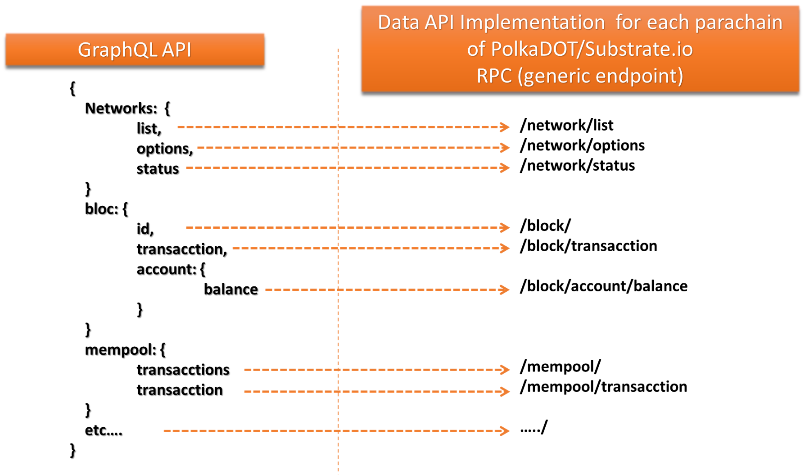

# Open Grant Proposal

> This document is referenced in the terms and conditions and therefore needs to contain all the required information. Don't remove any of the mandatory parts presented in bold letters or as headlines! See the [Open Grants Program Process](https://github.com/w3f/Open-Grants-Program/blob/master/README_2.md) on how to submit a proposal.

* **Project:** An unified client RPC using GraphQL connectors to Rosetta APIs for Substrate and bridges
* **Proposer:** [PAID Network](https://github.com/PAIDNetwork)
* **Payment Address:** BTC payment address. We don't accept payments for the program in other currencies at this stage. 

*The above combination of your GitHub account and payment address will be your unique identifier during the program. Please keep them safe.*

## Project Overview :page_facing_up: 
Development a unified client RPC using GraphQL connectors to Rosetta APIs for Substrate and bridges for each specific substrate parachains or bridge, defining a template to mapping for each one.

### Overview

The project contemplates the development of an open source platform focused on existing tools but implemented within the PolkaDOT / Substrate.io ecosystem such that it allows a rapid adoption of said ecosystem as a single point of interaction between different blockchains both at the information and the level of digital assets, and with the overcommimng of open finance such as Defi and its associated oracles. This seeks to have a standard interface for dapp's developers, on Polkadot / Substrate, regardless of the parachain or blockchain with which it is going to interact, all based on open standards and widely used in the industry

This would dramatically speed up the implementation of !Ink as the language for smart contract development on substrato.io, thus allowing early adoption of these platforms in the smart contract production environment  , almost totally dominated by solidity at the moment. Mainly due to the fact that there are very few quick and easy tools to implement for Dapp developers on the PolkaDOT/Substrate.io platform.

#### Technologies
* XDV
* NodeJS / NPM
* IBM package Open API to GraphQL
* Rosetta Specifications
* PolkaDOT{.js}

#### An unified client RPC using GraphQL connectors to Rosetta APIs for Substrate and bridges

The possibility of developing an RPC client using GraphQL connectors based on Rosseta API's specifications such that it allows the use of defined and standard connectors for the different PolkaDOT/Substrate parachain or blockchain bridge, for any dapp in an elegant, standard and predefined way regardless of the parachains or bridge to connect within the Substrate, accelerating its adoption at the developer level in the blockchain ecosystem, in addition to connectors and middleware in the business world that could also take advantage of said connectors and interact with multiple blockchains through a simple, standard and elegant interface.

### Project Details 

This image explains how Client RPC using GraphQL connectors, completely abstracts the interaction layer of the dapp with PolkaDOT/Substrate platform and the different parachains (or blockchain bridges) with the defined connector.

* Build out a rosetta api for each specific substrate chain (eg Plasm) using a fork  from https://github.com/coinbase/rosetta-specifications
* Use from NPM, IBM package Open API to GraphQL
* For each specific substrate chain, define a template mapping
* The unified client consumes one or more GraphQL API sources
* Uses GraphQL to build out queries and send mutations
* Client must have built-in wallet secure storage to manage cryptographic keys used for signing mutations
* Client  must have a read-only and transaction mode and be able to be used both in client/browser environments and in server environments. if server, wallet secure storage must have a HSM or Env Var provider

### Previous Work

- **XDV Technology**: Contains components to create digital signatures for documents using HD Wallet technology and integrates with Swarm (ethereum) and compatible with hardware modules that support PKCS#11 and PKCS#12. Links: https://app.xdv.digital/about/#/ (Spanish), https://app.xdv.digital/
- **MDV**: A Solidity state  machine and workflow engine, using optimized code with RLP encoding. Links: https://gist.github.com/molekilla/b85f1c9de63be3afacbfeca703bb3fe4 (Spanish)
- **SOLIDO FORM**: Solido is a contract entity mapper, which annotates a Solidity contract based from its generated ABI. Once a contract is annotated with decorators or auto generated, you can enable it to a blockchain by using a plugin vendor. Link: https://github.com/decent-bet/solido

### Ecosystem Fit 

Our project is different in that our team has had more than a year of experience with making wallets for blockchain dapps and then half a year with deep experience in DID, Swarm, IPFS and document signing, and libp2p form messaging, which are the bulk of tech experience as defined a new protocols for handle docuements, in a system legal and para legal in one parachains (like moonbeam or plasm) of polkaDOT, and after in native pallet of PolkaDOT/Substrate.io.

This has allowed us to identify the drawbacks and obstacles in the development of dapp on the PolkaDOT/Substrate platform, mainly in the interaction with the basic functions of the pallet and / or parachains, through a unified interface that facilitates its implementation within a dapp, abstracting all the RPC logic of each parachains for the developer, simplifying and accelerating the adoption curve, through an RPC client, based on the specifications of [rosseta-api] (https://github.com/coinbase/rosetta- specifications), but using GrahpQL and Typewritten Connectors, which allow to build queries from the frontend and send mutations in a standard and elegant way.

Additionally, with the integration of these connectors with other tools of our previous developments, the client would have the possibility of managing the cryptographic keys used, employing the secure storage of the built-in wallet to sign the mutations sent from the GraphQL queries. significantly raising the security levels of dapp deployments all within the polkaDOT / Substrate.io ecosystem.

## Team :busts_in_silhouette:

### Team members
* Rogelio Morrel
* Alfredo Lopez
* Patricia Carrillo

### Team Website	
* [PAID Network](https://paidnetwork.com/)

### Legal Structure 
Please provide the name and registered address of the legal entity executing the project.

### Team's experience
Please describe the team's relevant experience.  If the project involves development work, then we'd appreciated if you can single out a few interesting code commits made by team members on their past projects. For research-related grants, references to past publications and projects in a related domain are helpful.  

### Team Code Repos
* https://github.com/decent-bet/solido
* https://github.com/decent-bet/vuex-solido
* https://github.com/decent-bet/solido-repl
* https://github.com/decent-bet/solido-web-console
* https://github.com/decent-bet/solido-provider-web3
* https://github.com/decent-bet/solido-provider-thorify
* https://github.com/decent-bet/solido-provider-connex
* https://github.com/decent-bet/solido-cli
* https://github.com/decent-bet/solido-block-date-converter
* https://github.com/xdvplatform/odenplan-wallet
* https://github.com/xdvplatform/xdvplatform-wallet

### Team LinkedIn Profiles
* https://www.linkedin.com/in/rogelio-morrell-575aa51/
* https://www.linkedin.com/in/alfredolopez80/

## Development Roadmap :nut_and_bolt: 

PAID Network, foresees the development of Client RPC using GraphQL connectors, completely abstracts the interaction layer of the dapp with PolkaDOT/Substrate platform and the different parachains (or blockchain bridges) with the defined connector.

* **Milestone 1:** Development of  Client RPC using GraphQL connectors, completely abstracts the interaction layer of the dapp with PolkaDOT/Substrate platform.

### Overview
* **Total Estimated Duration:** 3 month
* **Full-time equivalent (FTE):**  Workload of an employed person ([see](https://en.wikipedia.org/wiki/Full-time_equivalent)) 
* **Total Costs:** 25K
* **BTC Address:** 3QcdnKnCAGnHRJJPQuBMmvQmJZY6GoT78C

### Milestone 1 Example — Implement Plasm Modules 
* **Estimated Duration:** 3 month
* **FTE:**  1
* **Costs:** 1.3 BTC

| Number |   Deliverable   | Specification |
| ------------- | ------------- | ------------- |
| 0a. | License | Apache 2.0 / MIT / Unlicensed |
| 0b. | Documentation | We will provide both inline documentation of the code and a basic tutorial that explains how a user can (for example) spin up one of our Substrate Runtime Module and Plasm VM's. It will be possible to send and call test transactions and meta transactions that will show how the new functionality works. |
| 0c. | Testing Guide | The code will have proper unit-test coverage of 95% to ensure functionality and robustness. In the guide we will describe how to run these tests, And after this a Bounty policy for error detection. | 
| 1. | TypeScript module: | Development of templates for using graphQL as a tool to interact through these tools with each of the RPC interfaces of the different parachains that make life in polkaDOT, which in a first phase will allow the management of schema and mutations, using a single client to multiple GraphQL API's. |
| 2. | TypeScript module: | Development of templates to use GraphQL as a tool to interact through these tools with each of the RPC interfaces of the different parachains, but in a second phase integrated into a wallet with capacity for multiple types of signatures, such that the client uses said built-in storage wallet safe to manage cryptographic keys used to sign mutations have greater security in the interaction between the client and GraphQL APIs. |
| 3. | Docker | We will provide a dockerfile to demonstrate the full functionality of our Protocol |

## Future Plans
Integrate with [Solido](https://github.com/decent-bet/solido/) Form,  so that together they can develop an interconnection scheme with multiple providers in the industry such as web3.js, ethers.js, metamask, connex, in addition to allowing developers to integrate signing and encryption options that they would not natively handle within their wallet or dapp, through xdv platform.