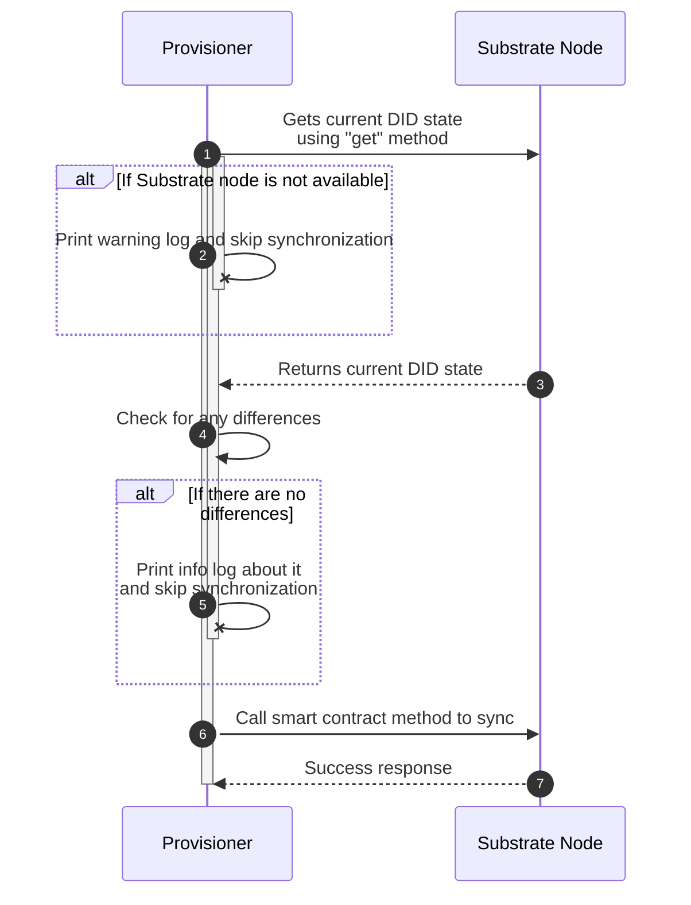

# StaexIoD

- **Team Name:** Staex
- **Payment address**: Fiat 15.01.2024, 18:36
- **[Level](https://github.com/w3f/Grants-Program/tree/master#level_slider-levels):** 3

## Project Overview :page_facing_up:

### Overview

Staex Internet of Data.

The goal of this project is to create a Web3 IoT data infrastructure with a stable economy. In simple words we want to simplify Web3 onboarding process and bring more IoT device owners to share their useful data from their devices with some profit and other people to find and use such data transparently, securely and easily for their life or research.

We want to bring Web3 data access infrastructure to your ecosystem. As a part of Web3 Foundation ecosystem we want to use Shiden parachain for our smart contracts and ecosystem tokens for project economy.

Our team is interested in creating this project because Staex are working on several distributed solutions for IoT devices, so we are fully interesting to propose such topics to community and improve IoT field at all with new solutions.

### Project Details

#### Architecture


### Milestone 1 - IoT device indexing

#### DID smart contract

To give users possibility to find particular type of data or particular IoT device from user interface we need to index them somehow. Indexing part we want to implement through DIDs smart contract in **ink!**.

Smart contract will contain following methods:

- `create` - method to create DID on-chain record.

This is the required method to start work with DID for IoT device owner. Before add or update DID attributes this method should be executed as it contains several required fields which should be present in every DID: type of data, location, public key, different prices for data access.

- `get` - get DID and all attributes related to it.
- `update_attribute` - add or update required or additional DID attribute.
- `delete_attribute` - delete DID attribute.

`delete_attribute` smart contract method will restrict to delete required attributes which will be predefined on smart contract deployment (initialization).

All these methods will produce smart contract events which will be stored in blockchain state and can be indexed by us later at any time.

As smart contract will store all attributes on-chain, in future data access smart contract can do checks using DID smart contract that user requests available data type and sent required amount of token for data access and revert otherwise. This will be implemented in M3 with data access smart contract.

Attributes which we want to store in DIDs (required):

- Type of data - type of data which IoT device produces, it can be temperature, humidity or something like CCTV camera output, etc.
- Location - it can be coordinates or name of the place.
- Public key - IoT device owner public key. We will need it later to create shared secret key and know exact files location in IPFS (IPNS).
- Price to access data per KB.
- Price to pin data per second.

Also, device can include some other additional attributes, but it is optional. Users can use such attributes in UI while check particular device data and use them while searching.

#### Indexer

To index and retrieve IoT devices (DIDs) we want to implement our custom indexer as a part of provisioner (provisioner will be described later and implemented in M2).

Indexer will be optionally embedded to provisioner as a module and will scan for smart contract events using [subxt library](https://github.com/paritytech/subxt) sequentially block by block, then parse and index DID attributes to local database (SQLite atm.). We already made a [research](https://github.com/staex-mcc/staex-iod/tree/main/provisioner/src) how to retrieve blocks and parse events in it.

"Optionally embedded" means we will use conditional compilation to embed or not embed indexer to provisioner. As some devices don't want to index on-chain data we can produce for them less-sized binary through not including indexer functionality at all. Also, even if indexer is included in provisioner it can be turned off by specifying field in config file.

Indexer will have an HTTP API with several routes to retrieve indexed information by user interface with pagination:

- `/devices?search=&limit=&offset=` - get devices filtered by attributes and paginated
- `/devices/{on-chain-id}` - get particular device information

Users can use some public indexers or start its own. It will be possible to start indexer separately without other provisioners features if user wants to have such functionality separately.

#### DID sync

To make process of setup or update DID for IoT device owner easier, we will implement such logic in our provisioner to automate it. So device owner will need just to set some fields in config file and provisioner will sync DID attributes with network through smart contracts calls.

To interact with Substrate node we will use [subxt](https://github.com/paritytech/subxt) library.

<details>
<summary>Provisioner config file example to setup DID attributes</summary>

```toml
[did.attributes]
type = ""
location = ""
price_access = ""
price_pin = ""
```
</details>

<details>
<summary>Synchronization flow diagram</summary>


</details>

#### UI

After that we will implement a UI where users can see devices and find necessary one through filters. UI will be quite simple: header/footer + a table with device list, each row will have an information from DID. Plus we need an input or select field for filters. By clicking to row user can see a separate page with information about particular device and additional attributes.

UI will be embedded to provisioner binary to give user possibility to use one binary for the whole interaction with the project. And can be disable by conditional compilation or in config file in the same way as indexer itself.

### Milestone 2 - Provisioner & Applications

Provisioner is a background daemon which will be written in Rust. It is responsible for:

- Manage applications lifecycle through Docker containers (M2).
- Sync local DIDs attributes from config file with smart contract (M1).
- Manage local IPFS node lifecycle (M2) and distribute data through it (M3).
- Listen for on-chain events to response for data access request (M3)
- Index IoT devices (indexer part from M1).

Applications are small programs to read data from different types of sensors. Through CLI IoT device owner can simply start them and see how data from sensors are securely distributed through IPFS to users on request.

We see applications as simple programs which can read data from sensors and print that data to stdout and stop with exit code 0. Using this flow writing new applications will be not so difficult because there are no any protocols or other flows how to send data to provisioner or synchronize it somehow with it, so it is only required to write data from sensors to stdout.

In the current version applications are Docker containers because it is simple to build them for different IoT devices and provisioner will be responsible for their lifecycle as an orchestrator. Also with Docker containers applications can be written in any language. In future we will add possibility to use Linux system processes and runC containers as a lightweight alternative.

#### Applications lifecycle management

Applications are Docker containers so we will write a module which will maintain their lifecycle on owner IoT device using API requests: start, stop, list, delete, etc.

To interact with Docker containers we will use Rust [std process module](https://doc.rust-lang.org/std/process/struct.Command.html). So it will be a wrapper on system processes and docker commands.

<details>
<summary>Example</summary>

```rust
Command::new("sh")
        .arg("-c")
        .arg("docker run -d --name <application-name> registry.image.io:latest")
        .output()
        .expect("failed to execute system process").stdout
```
</details>

To start new application device owner will need to provide config file and make an API request using our provisioner CLI. After that provisioner will save application to database and will start it.

<details>
<summary>Application configuration in JSON format</summary>

```json
{
  "image": "example.registry.io/project/name",
  "command": "/bin/sh",
  "args": ["1", "2"],
  "envs": ["key=val"],
  "interval": "1s" // this field will be described later
}
```
</details>

#### Data exchange

Provisioner is responsible to deliver data to consumers through IPFS node. Applications are responsible to read data from sensors. So this is a part when we need to send data to provisioner from applications.

We choose a way when provisioner will have a job scheduler for each application. As applications configurations are stored in provisioner database, it can restart applications by interval.

Application config file has `interval: "1s"` field, which is related to how often provisioner will start application.

So every interval provisioner will read application state from database and start container by it, application produces their data (read from sensor) and write it to stdout. Provisioner sees that container exited with code 0, it means it successfully stopped and this data is useful and can be synced with IPFS. If code is not 0 provisioner will ignore such data.

#### IPFS application

Provisioner will have at least one running application - IPFS node. It is required because it needs it to encrypt and deliver data to consumers (as a device) or to retrieve and decrypt data from device (as a consumer). User can't delete this application by CLI or by other methods.

This application will be based on [Kubo](https://github.com/ipfs/kubo) implementation. So in general provisioner will run this application (as a Docker container) on start and maintain it lifecycle. Through Kubo RPC requests provisioner will work and synchronize data in IPFS. Configuration for this application will be embedded to provisioner binary to start everything automatically without user interaction.

This application will be different than others. This application will be started once and will work through all provisioner lifecycle. So no restart interval which other applications have.

#### Example application

Example application is required to demonstrate how to write applications for this project and how to interact with the provisioner. And also for demo purposes. This application will be written in Go and will produce random mock data on start as a IoT sensor simulation. Also this application sometimes will demonstrate error behaviour to see how provisioner handles it.

#### Provisioner CLI

Provisioner CLI is responsible to interact with provisioner and has following commands:

- `applications create <name> <config-file-path>` - create new application using configuration from file.
- `applications get <name>` - get exact application and their status (running, stopped), last time data was inserted.
- `applications list` - get all applications.
- `applications delete <name>` - delete application.

To interact with provisioner CLI uses predefined unix socket like `/tmp/staex-iod.sock`. But this socket can be changed through flags.

We want to use for it CLI instead of UI because it is the same experience as with kubectl for Kubernetes. It will be easier and useful to manage application lifecycle with just some commands instead of going to the web interface.

CLI interacts with provisioner through unix socket server. To encode/decode RPC requests we will use [bincode](https://github.com/bincode-org/bincode) library.

Also provisioner will have several commands for itself:

- `run` - run provisioner; also through flags it will be possible to start just explorer or disable it.
- `config` - print default config.

### Milestone 3 - ACL - 1

Access control layer is here to restrict data usage from users which didn't pay for a data to IoT device owner.

As the goal of the platform is to give IoT device owners possibility to share their data from their devices, so to not share this data for everyone, we need smart contract (which will be implemented in **ink!**) to restrict accessing data by everyone and open access only for particular users. So ACL will be implemented in a following way: provisioner will encrypt data before saving it into IPFS and only particular user can decrypt data using shared secret key (data decrypting will be implemented in M4).

Here is a general flow: 

1. User puts some tokens to data access smart contract for exact owner and points which type of data it needs and how much.
2. Provisioner on IoT device sees an event from smart contract that there is new data access request.
3. If provisioner can produce such data.
4. Provisioner gets tokens from smart contract.
5. Creates shared secret key using requested user public key.
6. Encrypts data using this shared secret key.
7. Starts to distribute data for this user by saving encrypted data to IPFS.

#### Data access smart contract

To implement flow below we will implement a kind of multisig **ink!** smart contract with three methods:

- `request` - user requests for particular data access and sends required amount of tokens.
- `accept` - device accepts request and gets required amount of tokens.
- `reject` - device rejects request and tokens will be returned to user.

Device can reject request because of:

- Requested data is not available at the moment: for example table with data of requested type is empty.

This contract will use DID smart contract to check that user sent required amount of tokens otherwise will reject automatically. Also data request will be rejected automatically if there are no such data type in DID contract which can be produced by requested owner.

We call it "a kind of multisig" because on request user puts some tokens for exact device owner to smart contract and only device owner can withdraw these tokens from smart contract.

#### Data distribution

Provisioner subscribes and listens for on-chain events using [subxt](https://github.com/paritytech/subxt) library from data access smart contract. When it sees data request on-chain event it makes new record in "requests" table and by trigger SQLite updates "consumers" table fields to start process of synchronization.

To distribute data for exact user we want to use IPFS as it is fully open source, distributed and IoT devices don't need to have public IP address.

To make device root folder static in IPFS network we will use IPNS. With IPNS user which requested for data can look for exact place in IPFS to find it. So IPFS structure will be following:

```shell
/ipfs/<device public key>/<user public key>/<file name>
```

With such structure every user can know where requested data is located.

When provisioner gets tokens from smart contract it will start distributing process. To prevent data reading from IPFS by users which didn't pay for it, provisioner will encrypt data before upload. To generate encrypt key we will use Diffie–Hellman key exchange. With this algorithm we can generate encrypt/decrypt key without transferring it in the network. So device private key + user public key and device public key + user private key can generate exact the same shared secret key which provisioner will use for encryption.

After getting data from database and encrypting it provisioner will save and pin data in IPFS and notify requested user through IPFS pub/sub protocol.

#### Sync process

On data access request provisioner sees an event about it. It also sees how much data requested. Provisioner can save every request to database in `data_requests` table. Each row represent a data access user request.

So it will be a job in provisioner. This job, let's say every minute, will check available data requests and will create rows for future synchronization in `data_sync` table. While saving rows in `data_sync` table it points that these rows (data) is not synced. After creating rows in `data_sync` table, it calculates how much data was created in `data_sync` table it points in as consumed in `data_requests` table.

And there will be another job, which gets all not synchronized data from `data_sync` table and syncs it with IPFS.

#### Provisioner CLI

To interact with new provisioner features we need to introduce new commands:

- `consumers` - get information about consumers and synchronization process, show requested and consumed amount of data.
- `consumers <on-chain-id>` - the same as above but for exact consumer.
- `data <app-name>` - information about how much data from sensors already saved into database and synchronized.

Consumed amount of data - it is amount of data which is synced with IPFS or in other words already encrypted and pushed to IPFS and can be downloaded and decrypted by user. IoT device owner doesn't care is requested user really download data or not. It thinks data was provided after it is pushed to IPFS.

### Milestone 4 - ACL - 2

In this milestone we will implement data retrieving from IPFS and its decryption.

Also, this milestone is also about improving data access and distribution flow. As store data is not free for IoT device owner, we need to implement a feature to store this data for a particular time and delete it after expiring. But sometimes user wants to prolong storing this data on user request if user can't download it in time or need it for future and want to keep it on IoT device.

As we want to have all functionality in one binary, we want to use conditional compilation to provide binaries with or without downloading and decrypting part. So users can choose which binary to user with which functionality.

#### Data accessing and decrypting

To access decrypted data automatically user can start provisioner on their own laptop or server. Provisioner will start local IPFS node and subscribe for IPFS events and start sync files from IPFS to local database. Also it will generate shared secret key and decrypt all data while sync process.

So to start looking for encrypted data in IPFS, user's provisioner will listen for IPFS pub/sub events. When provisioner gets an event that there is new encrypted data, it starts downloading and decrypting.

In case user wants to start looking for encrypted data in IPFS before event, or provisioner was started after data access request and IPFS pub/sub event already gone, user can use several flags from provisioner CLI to start looking for a new data without an event.

As we use IPNS, user's provisioner can look for data in `/ipfs/<device public key>/<user public key>` folder in interval to see for new data.

To make it possible we will add some flags, so user can point which folders from which devices provisioner can start to synchronize without events.

```shell
staex-iod sync --devices-public-keys "asd,dsa,qwe" --interval "1m"
```

Synced and decrypted data will be saved to local database (atm. SQLite) to particular table.

#### Data access expiration

Through data access smart contract user can request data pinning for exact time interval. So while this time interval provisioner will keep data inside IPFS and will notify user in case data is expired through IPFS pub/sub.

To give IoT device owner and user such possibility we extend data access smart contract to point how much time device should pin data in IPFS. So it will be third parameter in `request` method, and user can point how much time device should pin data in seconds.

As user can execute `request` method of smart contract with different data expiration, provisioner will save the amount if seconds in the row with data request in the `data_requests` table.

So when provisioner synchronizes data with IPFS and when points in `data_sync` table, that data was actually synced, it also calculate timestamp when data will be expired: `now() + amount of seconds requested`.

And provisioner will have a scheduled job, for example every 5 minutes, and in this job it will check all timestamps for expirations in `data_sync` table and unpin data in IPFS.

Also data access smart contract should be improved to check that user sent required amount of tokens for data pinning.

#### Synchronization status

It is useful to understand the status of synchronization. User wants to know how much data it requested, how much data was delivered to IPFS and how much data was downloaded and decrypted.

To know how much data was requested we want to improve provisioner indexer to listen for data request events from data access smart contract and index them. So users can ask some indexer about requested amount of data. We want to use indexer for it to not store accumulated data on-chain.

To know how much data was downloaded and decrypted user can use provisioner CLI. It asks provisioner by RPC request how much data is located in local database.

To know how much data was actually synchronized by IoT device, we can use IPFS RPC API and request this information.

So to do it we want to implement additional command in provisioner CLI: `status`. This command will print a table with described information.

#### Data access prolongation

So sometimes user wants to download data later or keep data on device for some reasons: not enough space right now,some disk corruption or internet problems.

To give to user such opportunity, we want to improve our data access smart contract. We will add new method: `prolong`. This method will have two parameters: `<amount_of_data_in_KB>` and `seconds`. This smart contract method will spawn an event. Device provisioner will see this event and update expiration in their `data_sync` table. So data will be on IPFS for some time.

To know how much tokens user should send to prolong data, user can use an attribute `price_pin` from device DID. This attribute contains required amount of tokens to pin data for 1s. Also data access smart contract will have a check that user sent required amount of token and will reject otherwise.

### SQLite database structure

<details>
<summary>Database tables description</summary>

<table>
  <thead>
    <tr>
      <th>Field</th>
      <th>Type</th>
      <th>Description</th>
    </tr>
  </thead>

  <thead>
    <tr>
      <th colspan="3" style="text-align: right;">Table "applications" - to store applications state.</th>
    </tr>
  </thead>
  <tbody>
    <tr><td>id</td><td>serial</td><td>-</td></tr>
    <tr><td>name</td><td>text</td><td>Application name.</td></tr>
    <tr><td>config</td><td>text</td><td>Stored as JSON. Configuration: image, command, args, envs, interval.</td></tr>
  </tbody>

  <thead>
    <tr>
      <th colspan="3" style="text-align: right;">Table "data_requests" - to store on-chain request for the data.</th>
    </tr>
  </thead>
  <tbody>
    <tr><td>id</td><td>serial</td><td>-</td></tr>
    <tr><td>key</td><td>text</td><td>For idempotency: <code>%block_number%_%event_index_in_block%</code>.</td></tr>
    <tr><td>requested</td><td>integer</td><td>Requested amount of data in KB.</td></tr>
    <tr><td>consumed</td><td>integer</td><td>Consumed amount of data in KB.</td></tr>
  </tbody>

  <thead>
    <tr>
      <th colspan="3" style="text-align: right;">Table "data" - to store data produced by applications.</th>
    </tr>
  </thead>
  <tbody>
    <tr><td>id</td><td>serial</td><td>-</td></tr>
    <tr><td>app_id</td><td>integer</td><td>Link to <code>applications</code> table by id: <code>applications.id</code>.</td></tr>
    <tr><td>data</td><td>blob</td><td>Data itself.</td></tr>
  </tbody>

  <thead>
    <tr>
      <th colspan="3" style="text-align: right;">Table "data_sync" - to process synchronization with IPFS.</th>
    </tr>
  </thead>
  <tbody>
    <tr><td>id</td><td>serial</td><td>-</td></tr>
    <tr><td>data_id</td><td>integer</td><td>Link data from <code>data</code> table by id: <code>data.id</code>.</td></tr>
    <tr><td>request_id</td><td>integer</td><td>Link request from <code>data_requests</code> table by id: <code>data_requests.id</code>.</td></tr>
    <tr><td>synced_at</td><td>integer</td><td>Timestamp. Can be NULL in case data is not synced with IPFS.</td></tr>
    <tr><td>expired_at</td><td>integer</td><td>Timestamp.</td></tr>
  </tbody>

  <thead>
    <tr>
      <th colspan="3" style="text-align: right;">Table "devices" - to store and index decentralized identities attributes to find particular data type or device.</th>
    </tr>
  </thead>
  <tbody>
    <tr><td>id</td><td>serial</td><td>-</td></tr>
    <tr><td>public_key</td><td>text</td><td>Device public key.</td></tr>
    <tr><td>data_type</td><td>text</td><td>Data type like temperature, speed, etc.</td></tr>
    <tr><td>location</td><td>text</td><td>Location as coordinates or place name.</td></tr>
    <tr><td>price_access</td><td>text</td><td>Price to access the data.</td></tr>
    <tr><td>price_pin</td><td>text</td><td>Price to pin the data for a second.</td></tr>
    <tr><td>additional</td><td>text</td><td>Additional attributes which is stored as JSON.</td></tr>
  </tbody>

  <thead>
    <tr>
      <th colspan="3" style="text-align: right;">Table "system" - to store additional data for properly provisioner work. For example in this table we can store last indexed block number.</th>
    </tr>
  </thead>
  <tbody>
    <tr><td>id</td><td>serial</td><td>-</td></tr>
    <tr><td>key</td><td>text</td><td>-</td></tr>
    <tr><td>val</td><td>text</td><td>-</td></tr>
  </tbody>
</table>
</details>

#### Technologies

- IPFS - for decentralized data distribution and notifications.
- Rust - to effectively implement provisioner.
- Docker - to ship applications and manage their lifecycle.
- **ink!** - smart contracts as a transparent and honest way to implement data access economy.
- Vue - for fast and comfortable implementation of user interfaces.
- SQLite - to share data between applications, IPFS and provisioner.

### Ecosystem Fit

Help us locate your project in the Polkadot/Substrate/Kusama landscape and what problems it tries to solve by answering each of these questions:

- Where and how does your project fit into the ecosystem? - our project is fit into the ecosystem as distributed data access infrastructure.
- Who is your target audience? - our target audience is IoT device owners and data researches. Moreover data like real-time temperature from particular place can be interesting for a lot of people and other type data too.
- What need(s) does your project meet? - our project meets easier, secure and honest data access.
- Are there any other projects similar to yours in the Substrate / Polkadot / Kusama ecosystem? - we didn't find similar projects.

## Team :busts_in_silhouette:

### Team members

- **Alexandra Mikityuk, CEO.** PhD in Computer Science. Previously co-founder of IT companies, startup consultant, 17 years in the software industry.
- **Paksy Plackis-Cheng, CSO.** Award-winning entrepreneur, 20 years executive management experience in (deep) tech startups and renowned global corporations. IPO and M&A experience. Strategic partnerships, BizDev, GTM.
- **Ivan Gankevich, Product lead / system architect.** PhD in computer science. Previously a researcher in the field of distributed systems with 10 years of experience.
- **Maksim Sukhotin, Senior software engineer.** 13 Years Experience in various corporate projects as senior software engineer. Specialization in industrial process control and automation.
- **Sergei Lavrentev, Senior software engineer.** M.Sc. in Computer Science and 6 years of experience in software development in different areas.

### Contact

- **Contact Name:** Sergei Lavrentev
- **Contact Email:** sergei@staex.io
- **Website:** https://staex.io

### Legal Structure

- **Registered Address:** Staex GmbH, c/o Unicorn, Am Neuen Markt 9 e-f, 14467 Potsdam, HRB 36981 P 
- **Registered Legal Entity:** Staex GmbH

### Team's experience

Our team has huge experience in IoT infrastructure field. As a part of projects from T-Labs (Deutsche Telekom) and Staex, we were able to implement orchestrators for Blockchain networks, distributed networks and currently VPN with IoT focus. https://staex.io/product here you can find more about our benchmarks and we are able to implement this solution.

- https://staex.io/product/features/low-data-usage
- https://staex.io/product/features/high-performance

Our solution at Staex is written in Rust.

Also to prove our team experience we want to mention that we have some patents: https://staex.io/patent.

### Team Code Repos

- https://github.com/staex-mcc/staex-iod (this project)
- https://github.com/staex-mcc/rise-next - dRone InfraStructure paymEnts - our solution for automotive drone infrastructure.

Please also provide the GitHub accounts of all team members. If they contain no activity, references to projects hosted elsewhere or live are also fine.

- https://github.com/igankevich
- https://github.com/lavrd

### Team LinkedIn Profiles (if available)

- https://www.linkedin.com/in/dr-alexandra-mikityuk/
- https://www.linkedin.com/in/paksy/
- https://www.linkedin.com/in/ivan-gankevich/
- https://www.linkedin.com/in/max-sukhotin/
- https://www.linkedin.com/in/lavrdx/

## Development Status :open_book:

We have started this project in this repository: https://github.com/staex-mcc/staex-iod. Also we did a research about possible implementation which is described in this document.

## Development Roadmap :nut_and_bolt:

### Overview

- **Total Estimated Duration:** 4 months
- **Full-Time Equivalent (FTE):** 2
- **Total Costs:** 52,000 USD

### Milestone 1 — IoT device indexing

- **Estimated duration:** 1 month
- **FTE:**  2
- **Costs:** 13,000 USD

| Number | Deliverable | Specification |
| -----: | ----------- | ------------- |
| **0a.** | License | MIT |
| **0b.** | Documentation | 1. How to use and interact with DID smart contract.<br>2. How to start and setup indexer node.<br>3. How to configure provisioner to sync DID with on-chain.<br>4. DID attribute definitions and their meaning.<br>5. How to start UI and use it, screenshots.<br>6. How to start local Substrate based node for completely local setup.<br>7. How to use ink! for our local development: testing and deploy.<br>8. General description of the first milestone and why.<br>9. Current architecture diagram.<br>10. Instruction how to test with local development.<br>11. How to start end-to-end tests.<br>12. How to use conditional complication for provisioner to include or not indexer with UI.<br>13. Indexer OpenAPI specification. |
| **0c.** | Testing and Testing Guide | 1. ink! smart contract will be covered by unit tests.<br>2. Provisioner DID logic will be covered through end-to-end tests in Rust.<br>3. Indexer will be covered by end-to-end tests in Rust. |
| **0d.** | Docker | We will provide docker compose to setup local development. |
| **1.** | DID smart contract | DID smart contract description and implementation with following methods: `create`, `get`, `update_attribute`, `delete_attribute` with corresponding events. |
| **2.** | Indexer | A software to index on-chain events produced by our DID smart contract and to save them to database. Provide possibility to exclude indexer and its UI from provisioner by conditional compilation. HTTP API with at least two routes and OpenAPI. |
| **3.** | DID sync | Sync DID attributes from config file by provisioner in auto way on start using subxt library by provided flow. |
| **4.** | UI | Embedded UI to get data from indexer and show filtered indexed IoT devices. |

### Milestone 2 — Provisioner & Applications

- **Estimated Duration:** 1 month
- **FTE:**  2
- **Costs:** 13,000 USD

| Number | Deliverable | Specification |
| -----: | ----------- | ------------- |
| **0a.** | License | MIT |
| **0b.** | Documentation | 1. How to run and interact with provisioner through CLI.<br>2. How to write new applications.<br>3. How data exchange process works.<br>4. Provisioner RPC documentation.<br>5. How to configure and start new applications. |
| **0c.** | Testing and Testing Guide | 1. End-to-end tests in Rust for lifecycle management.<br>2. End-to-end tests in Rust for data exchange.<br>3. End-to-end tests in Rust to check IPFS application integration. |
| **0d.** | Docker | We will provide docker compose to setup local development. |
| **1.** | Applications lifecycle management | Source code in Rust which is responsible for managing Docker containers lifecycle though configuration files (Docker commands wrapper): start, get, list, delete. |
| **2.** | Job scheduler | Scheduling applications to run them in interval. |
| **3.** | IPFS application | Embedded application (Docker container and provisioner configuration) with IPFS node which can be run by provisioner on start. |
| **4.** | Example application | Application (written in Go) which simulate reading from IoT device sensor and send data to provisioner through data exchange. |
| **5.** | Data exchange | Implementation of data exchange through reading applications output and save it to database. |
| **6.** | Provisioner CLI & Unix socket | CLI to manage applications lifecycle and provisioner itself. Unix socket and RPC server to interact with provisioner from CLI. |

### Milestone 3 — ACL 1

- **Estimated Duration:** 1 month
- **FTE:**  2
- **Costs:** 13,000 USD

| Number | Deliverable | Specification |
| -----: | ----------- | ------------- |
| **0a.** | License | MIT |
| **0b.** | Documentation | 1. How to use data access smart contract.<br>2. How data distribution works.<br>3. How data requesting works.<br>4. Describe new provisioner CLI commands with examples. |
| **0c.** | Testing and Testing Guide | 1. Data access smart contract unit tests.<br>2. Data distribution end-to-end tests in Rust. |
| **0d.** | Docker | We will provide docker compose to setup local development. |
| **1.** | Data access smart contract | Smart contract to implement data access requests and tokens flow: `request`, `accept`, `reject` methods. |
| **2.** | DID smart contract integration | Cross smart contract call to reject automatically based on data in DID smart contract. |
| **3.** | Provisioner integration | Use data access smart contract events from provisioner to update database and start sync process. Reject data access request in case of table with data is empty. |
| **4.** | Sync process | Shared secret key creation, data encryption. Saving data to IPFS, pinning, IPNS. |
| **5.** | Notifications | Notify about new data using IPFS pub/sub. |
| **6.** | Provisioner CLI | New commands to get consumers and sync process state and information about data from sensors. |

### Milestone 4 — ACL 2

and access end-to-end tests

- **Estimated Duration:** 1 month
- **FTE:**  2
- **Costs:** 13,000 USD

| Number | Deliverable | Specification |
| -----: | ----------- | ------------- |
| **0a.** | License | MIT |
| **0b.** | Documentation | 1. Describe new features of our data accessing smart contract.<br>2. Describe how prolongation and expiration work.<br>3. Describe how to use our new CLI features: like check synchronisation status.<br>4. How to use provisioner to download and decrypt data. |
| **0c.** | Testing and Testing Guide | 1. End-to-end test in Rust for prolongation and expiration cases.<br>2. Unit tests for new features in smart contract.<br>3. End-to-end test for data downloading and decrypting. |
| **0d.** | Docker | We will provide docker compose to setup local development. |
| 0e. | Article | We will write an article that explains the work done as part of the grant. We will publish this article to our dev.to organization and to our website and blog (https://blog.staex.io). Also we want to post non-technical article on LinkedIn. |
| **1.** | Data accessing and decrypting| Implement this part in provisioner: listen for IPFS events about new data from device, look for the new data on start without an event, download and decrypt data, save it to database. |
| **2.** | Data access expiration: smart contract | Implement new parameter in smart contract to point how much time data should be pinned in IPFS. |
| **3.** | Data access expiration: provisioner | Implement handling expiration parameter by provisioner and delete data on expiration. |
| **4.** | Synchronization status | Implement CLI command to understand sync status by user. |
| **5.** | Data access prolongation: smart contract | Add mew method in data access smart contract: `prolong`. |
| **6.** | Data access prolongation: provisioner | Implement handling `prolong` method in provisioner. |

## Future Plans

We already have a lot of improvement and plans for feature:

1. At the moment we will implement history or near-realtime data access. But sometimes devices want to distribute their data in realtime. So it is a huge task and we really want to implement it. It will be implemented with MQTT and some kind of mesh network solution which provide fast and secure access to IoT device data stream (possible usage of StaexMCC?). Btw we already have some docs how to implement it.
2. It is crucial to implement some kind of oracle to check that data was delivered to user and this data is not a garbage.
3. Some kind of data indexing in a folder so user can apply some filters or make data sorting.
4. Marketplace - some kind of public marketplace on IPFS to distribute applications and provide reward for application developers.
5. Sometimes it is not possible to start so many services on single IoT device or store a lof of data, so we want to give devices possibility to use remote IPFS for data distribution or data pinning.
6. Support small boards like STM32/ESP32.
7. Provide user possibility to request historical data, for example for the past year.
8. Auto-detecting sensors on IoT device and start applications according to it.
9. New type of data consuming. In this grant we will implement counting by amount of data, but it is also possible to request for a data not in "bytes" but in events count.
10. More user friendly price system for mass adoption. IoT device can ask for their data in some token, for example, DOT, but on the website we can ask for data access, for example, USDT. So we can automatically make an exchange or teleport tokens to parachain to make it easier to sell or buy data access.
11. To not scan every on-chain block by provisioner to see to which user it should send data by request, provide possibility to provisioner to use external indexer and sync with it.

For project promotions we want to use our community from LinkedIn and partners. As a part of our content marketing we will put some articles to our own blog on our website and through dev.to organisation. Also we are almost started our podcast.

## Referral Program (optional) :moneybag:

You can find more information about the program [here](../README.md#moneybag-referral-program).

- **Referrer:** [David Hawig](https://github.com/Noc2)

## Additional Information :heavy_plus_sign:

**How did you hear about the Grants Program?** Web3 Foundation Website / Medium / Twitter / Element / Announcement by another team / personal recommendation / etc.

We found this program by suggestion after winning in [Web3 Foundation hackathon](https://staex.io/paris-blockchain-week-2023). [External article](https://www.essec.edu/en/news/unlocking-future-web3-key-highlights-after-paris-blockchain-week-exclusive-talk-michael-amar-chairman-pbw/).

[Our YouTube channel with podcast and videos.](https://www.youtube.com/@staex5585)

**Staex itself doesn't collect any revenue or pay to IoT device owners or to users which request data from devices or to any other entity.**
