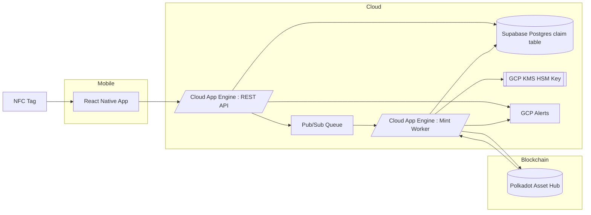

# 📝 stampika

(Known as Sutanpu in EasyA Consensus 2025)

## 🌟 Project Overview

- stampika lets travelers mint NFT stamps from real-world visits through NFC Tags - building digital identity while helping sites engage and track visitors
- The 2 key stakeholders of our project would be the users (travelers) and organizations (tourism board, landmark owners).

- We would like to bring the social experience at the end of travels where people share where they have been with friends and families online. Users would be to view other people’s stamps and when they have collected them as they are publicly on the blockchain.

- An NFC Sticker Tag would be placed at landmarks and users would be able to scan the NFC Tag and instantly claim a stamp, similar to a proof-of-location. We would then provide organizations with information of when users visit, allowing them to obtain more data points for boosting visits.

- We will be deploying the Stamp Contracts (Modified ERC721) on Polkadot Hub and sponsor users with their gas fees through our backend. This will help with onboarding masses to Polkadot as we would only be using blockchain under the hood, abstracting away the complicated part of blockchain.

- This project aligns with the team’s core values of encouraging activity and movement. In a world where AI-driven productivity increasingly reduces the human need for traditional work, there’s been a noticeable long-term shift in investment toward the entertainment and experience economy. At the heart of this trend lies a paradox: as technology accelerates, so does the human longing for nature, authenticity, and offline experiences. That’s precisely the space we’re targeting.

- Pitch Deck: <https://www.canva.com/design/DAGnogxARvE/EC2ZigywHsxXm7_VCZytMA/edit>

### 🔍 Project Details

Mobile UI

| Empty Home Page  | Full Home Page  | Social Page  | Profile Page  |
|---|---|---|---|
|   |   |   |   |

We demonstrate a working prototype here: <https://www.youtube.com/watch?v=pzqG57ep1mI>

- Tech Stack

  - Landing Page: NextJS, TailwindCSS
  - Application: React Native, Privy, RNR UI
  - Backend: NestJS, Viem, Supabase
  - Contracts: Hardhat, Solidity

- Architecture
  - We will have the following repositories `contracts`, `backend`, `frontend` and `landing-page`
  - NFC scans from the mobile app will be handled by the frontend, which makes an API call to the backend to mint an NFT on chain.

We will be working on abstracting blockchain as much as possible. We will only be launching on testnet for our pilot testing.

We will not include the data analysis dashboard and related endpoints for the Tourism Boards in this Fast Grant and will leave that as future work.

#### Example Flow

```mermaid
sequenceDiagram
    participant U as User Phone
    participant T as NFC Tag
    participant FE as App
    participant API as /claim Endpoint
    participant DB as Supabase
    participant Q as Pub/Sub Queue
    participant MW as Mint Worker
    participant AH as Asset Hub (EVM)

    U->>T: Tap
    T-->>U: https://stampika.xyz/tag/123
    U->>FE: Open App
    FE->>API: POST /claim {jwt, tagId}
    API->>API: Verify JWT + rate-limit
    API->>DB: Verify Duplicate
    DB-->>API: 
    API->>DB: INSERT (wallet, tagId)
    API->>Q: Publish job
    API-->>FE: 202 Accepted (optimistic UI)
    FE-->>U: Display Confetti 🎉

    MW-->>Q: Batch pull ≤25 claims
    MW->>AH: Mint batch NFT tx
    AH-->>MW: Tx receipt + events
    MW->>DB: UPDATE claims → Minted
```

#### Planned Architecture Diagram

This is our planned architecture, it is subjected to change in the future based on our use case.

#### Gas Fee Sponsorship

stampika promises a **one-tap experience**. Asking first-time tourists to purchase DOT or sign raw transactions would kill adoption, so we shoulder gas costs in the pilot.

##### Why we chose the *backend-wallet* method for v1  

| Option | Pros | Cons | Verdict |
|--------|------|------|---------|
| **Backend wallet pays every mint** | • Zero UX friction • One key to harden • Cost easy to monitor | • Custodial risk if key leaks | **Chosen** for 3-month pilot |
| **Faucet each Privy wallet** | • Users self-sign, no hot key | • Extra drip service • Sybil drain risk • More support overhead | v2 upgrade once Asset Hub integrates paymasters or EIP7702 |

We chose the backend wallet for the 3-month pilot because it saves engineering time and keeps the onboarding path literally one tap. This is more similar to typical Web2 apps which most of the travel useres will be from, allowing for better onboarding.

##### Operational safeguards  

1. **HSM custody** – Polkadot key stored in **GCP Cloud KMS HSM**
2. **Queue + batch** – `/claim` → Pub/Sub → Cloud Run worker mints ≤25 stamps per tx; absorbs peak spikes and prevents nonce clash.
3. **Real-time alerts** – Stackdriver alarms on low balance (<1 DOT) or 5xx spikes.  
4. **Kill switch** – `MINT_ENABLED=false` disables the worker loop instantly.  
5. **Audit trail** – Each mint maps to Pub/Sub ID + Privy user ID for forensic traceability.

This setup delivers a friction-free UX while capping financial risk to a few dollars per day—ideal for a grant-funded pilot.

#### Anti-Attack Mechanism

stampika runs a custodial minting service since every tap triggers our backend wallet to submit an on-chain transaction and pay the fee. If an attacker can spam that API, replay a claim link, or trick the contract into minting many stamps, the result is (a) gas drained from the sponsorship wallet, (b) bogus NFTs that pollute the dataset, and (c) degraded trust with venues and the Polkadot community. Because pilot events may see sudden surges—school field-trips, festival gates — our defences must block abuse without slowing legitimate bursts of traffic.

Goal: guarantee on-chain stamps for valid users AND prevent non-registered users not at the location from obtaining a stamp

Threat model we defend against:

- Anonymous API spammers who do not hold a stampika account.
- Replay attackers who forward a tag URL or capture network traffic.
- Scripted “gas-grief” bots that hammer /claim to drain DOT.
- Key-compromise or logic-bypass attempts aimed at minting arbitrary NFTs.

| Layer | Control | Attack stopped |
|-------|---------|----------------|
| **1 Request auth** | Privy User JWT in every `/claim`. | Anonymous API spam. |
| **2 Rate-limit** | 5 claims/min per IP + 30 claims/hr per wallet | Flood / DDoS during peak. |
| **3 Duplicate guard (DB)** | `(tagId, wallet)` table — reject if already claimed. | Replay / link-forward cheats. |
| **4 On-chain guard** | `claimed[tagId][wallet]` mapping in contract and `onlyOwner` modifier | Backend bypass and double-mint. |
| **5 Alerting** | Alerts if **rejected-rate > 5 %** or **gas/day > 0.3 DOT**. | Early detection. |
| **6 Kill-Switch Flag**| `MINT_ENABLED=false` env flag to halt minting while investgating | Immediate halt. |

```mermaid
graph TD
    A(User tap) -->|Static URL /tag/ID| B[Mobile Web/App]
    B -->|Privy JWT, tagId| C(Backend /claim)
    C --> D{Rate-limit OK?}
    D -- no --> R1[429 Slow down]
    D -- yes --> E{Already claimed?}
    E -- yes --> R2[409 Duplicate]
    E -- no --> F[Mint via backend wallet]
    F --> G[(Polkadot Asset Hub)]
    G --> H[Tx event ➜ success to app]
```

### 🧩 Ecosystem Fit

stampika is an application is built on Polkadot Hub. It is designed for avid explorers and travel enthusiasts who delight in visiting landmarks—whether on domestic adventures or overseas getaways. Inspired by traditions such as Japan’s iconic stamp-collecting culture, where travelers collect physical stamps in notebooks, stampika brings this experience into the digital age.

stampika addresses the need for:

- **Proof of Location & Attendance**: Tourism companies can leverage stampika to authenticate a user’s visit to specific landmarks. This is particularly valuable for implementing loyalty programs or gamified travel experiences, where visitors earn rewards for exploring multiple locations.
- **Actionable Visitor Insights**: By capturing scan data, stampika channels anonymized travel patterns and behavior to relevant organizations. These insights can inform marketing strategies, optimize tourist flows, and support cultural and urban planning efforts.

There aren’t any similar projects in the Polkadot Ecosystem. We believe that this is one of the pioneer efforts to apply Web3 to the tourism industry. This could be due to the fact that this project is quite dependent on our business development efforts and the fact that NFC libraries are not as easy to work with in the past.

**Ecosystem Impact**:
These values are estimated based on an number of 250 users and 1,000 stamp NFTs minted in a timespan of 90 days.

Boost to on-chain activity.
stampika’s pilot plans to creates 250 new wallets; if even 10 % return to claim stamps each day, Asset Hub’s daily active accounts jump from ~300 to ~325 — a 10 % lift <https://assethub-polkadot.subscan.io/tools/charts?type=account>. With 1,000 stamp claims over the period (≈11/day - 1,000 / 90 days) the network can also see signed extrinsics climb from ~600 <https://assethub-polkadot.subscan.io/tools/charts?type=extrinsic> to ~611 per day.

NFT volume catalyst.
Those 1,000 stamps are NFT Mints, and will boost NFT mint numbers on Asset Hub by roughly 50% from ~600 (average mint rate per month ≈ 333 - 1,000/3 months). Number of Active NFT Users can also jump by 250, a big contrast to the current active number of 60.

Feed for KodaDot and other dApps.
KodaDot and other Hub-compatible markets can index stampika collections on day one, unlocking a fresh stream of travel-themed NFTs for collectors and giving the marketplace new, non-profile-picture inventory to trade if users so wish to trade them.

Further Knock-on benefits.
More wallets and stamps mean richer data for indexers, extra fee revenue for collators and a live showcase for Venue <-> User Stamps that other Polkadot dApps can query for airdrops, on-chain reputation or cross-parachain quests. By onboarding stampika, Polkadot can position itself as a blockchain with more real-life usage and more than just for financial purposes.

## 👥 Team

- **Team Name:** stampika
- **Contact Name:** Wei Rong Chu
- **Contact Email:** <chuweiron18@gmail.com>
- **Website:** <https://github.com/wr1159/stamply>

### Team members

- Charlyn Kwan Ting Yu
- Kai Jie Leow
- Kyoeun Kim
- Wei Rong Chu

#### LinkedIn Profiles (if available)

- <https://www.linkedin.com/in/charlyn-kwan-20651a233/>
- <https://www.linkedin.com/in/sg-leow-kai-jie/>
- <https://www.linkedin.com/in/kyoeun-kim/>
- <https://www.linkedin.com/in/wei-rong-chu/>

### Team Code Repos

Team GitHub

- <https://github.com/wr1159/stamply>

Individual GitHub

- <https://github.com/charkty/>
- <https://github.com/kaijie0102>
- <https://github.com/kyoeun-kim>
- <https://github.com/wr1159/>

### Team's experience

We are all final year School of Computing students from National University of Singapore. Collectively, we have won prizes at 7 hackathons in the past. 3 of our members are part of NUS Overseas College, a very selective programme from NUS that provide opportunities for students to intern in start-up companies in leading entrepreneurial hotspots across the world - in our case, it’s Toronto.

Our team has also worked for Web3 companies like CoinGecko, Mavennet while also contributing to open source blockchain repositories like Cosmos-sdk.

## 📊 Development Status

We developed a prototype Android Mobile App at EasyA Consensus Hackathon. stampika can now only scan NFC tags, send a request to our backend, which mints an NFT on the Polkadot Hub chain.

## 📅 Development Roadmap

### Success KPI (By End of Pilot Testing)

- 250 Users onboarded
- 1000 Stamps collected
- 20 Landmarks collaborated with (Live NFC Stamps available to be collected)

### Overview

- **Estimated Duration:** 3 months
- **Full-Time Equivalent (FTE):** 2 (4 x 0.5)
- **Total Costs:** $10,000 USD

| Number | Deliverable                                            | Specification                                                                                                                                                                                                                                                                      |
| ------ | ------------------------------------------------------ | ---------------------------------------------------------------------------------------------------------------------------------------------------------------------------------------------------------------------------------------------------------------------------------- |
| 0a.    | License                                                | GPLv3                                                                                                                                                                                                                                                                              |
| 0b.    | Documentation                                          | We will provide both **inline documentation** of the code and a basic **tutorial** that explains how a user can create an account and start collecting stamps.                                                                                                                     |
| 0c.    | Testing and Testing Guide                              | Core functions will be fully covered by tests to ensure functionality and robustness. In the guide, we will describe how to run these tests on the application.                                                                                                                    |
| 0d.    | Article                                                | We will publish an **article** on our website that explains what was done/achieved as part of the grant.                                                                                                                                                                           |
| 1.     | Branding Design + UI Revamp                            | We will create a branding guide for stampika and revamp UI, creating components according to our new design system.                                                                                                                                                                |
| 2.     | Landing Page                                           | We will create a landing page according to the brand design to introduce stampika and its features. This will be the front of our project and will be shared to other people who are interested in our project.  \- Features of stampika \- Waiting List subscription  |
| 3.     | Mobile App Development                                 | We will work on creating a more scalable mobile app, both for IOS and Android. We faced some Build issues due to version mismatch while integrating with Privy, hence we plan to re-setup the mobile app.                                                                          |
| 4.     | User Management System (With Gmail and other OAuths)  | We will integrate Privy into our application to allow users to login and seamlessly create an embedded blockchain address for them. Users will also be able to add their name, age and other information in the settings.   \- Gmail Login \- Telegram / Wallet Login                                                                                 |
| 5.     | Designing NFC Sticker Stamps                           | We will design and produce our custom NFC Sticker Stamps with our branding similar to below   |
| 6.     | Integrate Social Profile                              | The social profile feature will allow users to view stamps other people have collected.  This will be integrated with our backend system.  \- Stamps Collected Database \- Information on themselves                                                  |
| 7.     | Integrate Comment Feature                              | This feature will build on top of the Social feature where users can now comment on stamps / stamp collection point after scanning the NFC tag so they can interact with other people about their thoughts - providing a new form of engagement.  \- Text comments  \- Image comments                                        |
| 8.     | Publish Test Application                               | We will publish the application on TestFlight iOS and Google Play Console or available as an .apk file.  Users will be able to download a beta version of the app.                                                                                                        |
| 9.     | Pilot Testing with Mississauga Authorities             | This is where we will work with landmarks in Mississauga (where the team is currently based) and integrate stampika with landmarks + allowing users to test out the full application flow.                                                                                |

### 💰 Budget Breakdown

Please provide a breakdown of your budget by milestone:

| Milestone | Deliverables          | Cost (USD)  | Estimated Completion |
| --------- | --------------------- | ----------- | -------------------- |
| 1         | 0a, 0b, 1, 2, 3, 4, 5 | $5,000      | 1.5 months           |
| 2         | 0c, 0d, 5, 6, 7, 8, 9 | $5,000      | 1.5 months           |
| **Total** |                       | **$10,000** | **3 months**         |

| **Cost Category** |  **Deliverables / Activity** | **Rate × Qty** | **Sub-total (USD)** | **Section Total (USD)** |
|-------------------|--------------|-----------------------------|----------------|---------------------|
| **1 Personnel** |
| Software Engineering | Mobile rebuild (iOS + Android), Privy integration, backend API, social timeline & comments, blockchain calls, smart contracts, tests | 200 hrs × $25 | $5 000 |
| UI / Brand Design | Brand guide, design system, landing & mobile mock-ups, NFC sticker layout | 35 hrs × $25 | $875 |
| QA & Test Ops | Device matrix, TestFlight / Play uploads | 20 hrs × $25 | $500 |
| Business / Partnerships | Museum outreach, pilot onboarding | 110 hrs × $25 | $2 750 |
| **Personnel subtotal** | | | | **$9 125** |
| **2 Software & Cloud** |
| Apple Developer Program | Required for TestFlight & App Store | 1 licence | $100 |  |
| Google Play Console | Android beta distribution | 1 licence | $25 |  |
| Hosting / RPC / DB | Vercel, Supabase, RPC Provider (3 mo) | $50 / mo × 3 | $150 |  |
| Domains & Email | stampika.xyz + <hello@stampika.xyz> registration | lump sum | $50 |  |
| **Software subtotal** | | | | **$325** |
| **3 Hardware & Materials** |
| NFC NTAG 215 stickers | 250 pcs @ $0.30 + custom print @ $0.10 | | $100 |  |
| **Hardware subtotal** | | | | **$100** |
| **4 Pilot Ops** |
| Local transport | 8 on-site visits | $40 / trip (including tickets) | $320 | |
| Demo signage & holders | Posters, acrylic mounts, QR backups | lump sum | $130 |  |
| **Pilot ops subtotal** | | | | **$450** |
| **TOTAL** | | | | **$10 000** |

## 🔮 Future Plans

- Development
  - After completing the pilot testing in Mississauga, the team would be relocating back to Singapore where we will work on acquiring more users and landmarks in Singapore.
  - We will integrate a data analytics dashboard for tourism boards that collaborate with us to provide them more information
- Vision for Polkadot:
  - We believe that an onchain future will be the default for most people.
  - We will seemlessly onboard users as we abstract a lot of the blockchain nitty gritty out of the way, making it simple for first time users
  - We can introduce new users to parts of the ecosystem e.g. NFT Marketplace like KodaDot to allow users to potentially trade their stamps
  - stampika would also support an Onchain Identity Layer as we will be able to add more flair and personality to each wallet address. This is optional as well to the users so there will be no privacy concerns.
  - Cross-Project Airdrops & Perks could also be done with stampika as other projects would be able to query the different stamps each wallet address has, thus verifying the proof of location of the users. For example, an NFT project might want to only airdrop to people who have travelled to Japan in 2025 and we could help achieve that goal with Proof of Locations.
  - A very far reach goal will be to allow users to bridge the stamps to other parachains so that it could be used directly in other contracts.
- Additional Funding
  - National University of Singapore (NUS) Venture Initiation Program (SGD$10k)
  - As NUS Students, we plan to submit and pitch our project to gain backing of our University

## ℹ️ Additional Information

EasyA Consensus Hackathon 2025 Achievements

- Polkadot (Build Track): 1st Place
- Forte: 3rd Place

The project is fresh out of EasyA Consensus Hackathon. We focused intensely on the stampika for the whole 3 days and we are looking to take it to the next level

### Answers to Questions during Review

> How do you plan to cover user gas fees? We don't see this reflected in your budget breakdown or technical deliverable

We plan to deploy on testnet for our pilot testing so we will be slowly collecting DOT tokens from the faucet. In the future when we launch on mainnet, we have spoken to Eric from Distractive and he mentioned that Minting gas-fees can be covered by the Marketing Bounty in the future.

 If needed, we are more than happy to deploy the pilot testing on the mainnet and can re-allocate the budget from elsewhere.

Regarding the technical aspect, the minting will be done via our backend server as of now. We will consider moving to using EIP7702 smart wallets in the future when it is less experimental and available on Polkadot Asset Hub. Upon scanning of the NFC tags, the users' client will call the backend with their privy access token and the backend server will then call the mint function with the backend wallet.

> What mechanisms do you plan to include to prevent attacks (e.g. spam/replay attacks during busy periods)?

We will be implementing the following mechanisms

1. Privy Access Token - With Privy as our account management system, we will ensure that every backend call before the actual minting must be accompanied with a valid privy access token
2. Rate-limiting & IP throttling - We will limit requests from the same access token and same IP to prevent users from claiming too many via the same.
3. Access Control Minting - Since we have the backend wallet performing the mints, we will add access control such that only the registered wallets such as the backend wallets will be able to mint, thus thwarting bot accounts minting. We will perform safe security industry practices with the backend wallet.
4. User Address Registry - Depending on the scale and frequency of attacks, we will consider an on-chain address registry as part of the Stamp Contracts only allows verified users of stampika to be minted a stamp.

With the current mechanisms, a busy period would consist of many stampika users trying to mint at the same time which should be handled properly. Bad actors such as non stampika users would not be able to mint in the first place.
