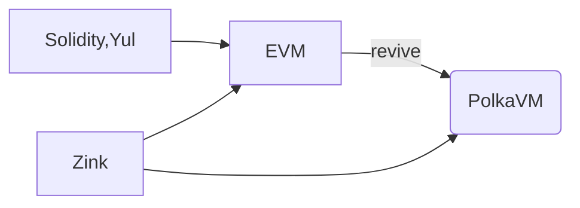

# PolkaVM target in Zink

- **Team Name:** Zink Language
- **Payment Details:**
  - **DOT**: 13VmF1UwYCv2Y2uhttupeMrm5eDo1tFc729gm4uN9CG7Ycv2
  - **Payment**: 13VmF1UwYCv2Y2uhttupeMrm5eDo1tFc729gm4uN9CG7Ycv2(USDC)
- **[Level](https://github.com/w3f/Grants-Program/tree/master#level_slider-levels):** 2

## Project Overview :page_facing_up:

### Overview

Compiler of RISC-V for EVM.

[Zink](https://github.com/zink-lang/zink) is a rustic smart contract langauge targets all VMs , currently using WASM as IR and can be compiled into EVM bytecode, we're focus on the future that **developers write one contract in zink, deploy on all VMs**.

### Project Details

Zink Language comes with a frontend code generator [zingen](https://github.com/zink-lang/zink/tree/main/codegen) which uses instruction set
generated by rust compiler like WASM or RISC-V as `IR` to generate EVM target bytecode.

After the development in the past two years, [zink-lang](https://github.com/zink-lang/zink) already can be compiled to EVM bytecode elegantly, plus, it has its own testing framework [zint](https://github.com/zink-lang/zink/tree/main/zint) to do e2e tests with EVM directly.

### Ecosystem Fit

Most of the smart contract developers are working on EVM, as parity recently just introduced [revive](https://github.com/paritytech/revive), Zink Language is about to solve the same thing but in a different way.

## Team :busts_in_silhouette:

### Team members

- Tianyi - Founder

### Contact

- **Contact Name:** Tianyi Zhang
- **Contact Email:** tianyi.gc@gmail.com
- **Website:** https://clearloop.xyz

### Team's experience

Previous working at [@Gear Tech](https://github.com/gear-tech) and [@ChainSafe](https://github.com/chainsafe).

Have been working in polkadot ecosystem for over 5 years, was developing wasm smart contract toolchains @gear-tech,
used to replace tcp with nym in libp2p, implement uniswap-v3 as substrate contract, and developed the relayer of arweave for thegraph protocol @chainsafe.

### Team Code Repos

- **Zink Language**: https://github.com/zink-lang/zink
- **Tianyi on Github**: https://github.com/clearloop

### Team LinkedIn Profiles (if available)

- https://www.linkedin.com/in/clearloop

## Development Roadmap :nut_and_bolt:

### Overview

- **Total Estimated Duration:** 4
- **Full-Time Equivalent (FTE):**  2FTE
- **Total Costs:** $30,000
- **DOT %:** 50%

### Milestone 1 — PolkaVM target POC

- **Estimated duration:** 1 month
- **FTE:**  1.5
- **Costs:** 15,000 USD

| Number | Deliverable | Specification |
| -----: | ----------- | ------------- |
| **0a.** | License | GPL-3.0-or-later |
| **0b.** | Documentation | We will provide both **inline documentation** of the code and a basic **tutorial** that explains how a user can (for example) spin up one of our Substrate nodes and send test transactions, which will show how the new functionality works. See the [delivery guidelines](https://grants.web3.foundation/docs/Support%20Docs/milestone-deliverables-guidelines#documentation) for details. |
| **0c.** | Testing and Testing Guide | Core functions will be fully covered by comprehensive unit tests to ensure functionality and robustness. In the guide, we will describe how to run these tests. See the [delivery guidelines](https://grants.web3.foundation/docs/Support%20Docs/milestone-deliverables-guidelines#testing-guide) for details. |
| **0d.** | Article | We will publish an **article**/workshop that explains [...] (what was done/achieved as part of the grant). (Content, language, and medium should reflect your target audience described above.) |
| 1. | PolkaVM ABI Declaration | Wrap the ABI of zink lang with field `VM`, make polkaVM as a target |
| 2. | Compiler option | introduce config `vm` in [the zink compiler](https://github.com/zink-lang/zink/blob/main/compiler/src/cli.rs#L11) |
| 3. | RISC-V target | support RISC-V target in [the zink cli](https://github.com/zink-lang/zink/blob/main/elko/src/build.rs#L47) |
| 4. | Contract Instance | [zink contract instance](https://github.com/zink-lang/zink/blob/main/zint/src/contract.rs#L16) for polkaVM  |
| 5. | PolkaVM Executor | Introduce a [polkaVM executor in zint](https://github.com/zink-lang/zink/blob/main/zint/src/lib.rs#L6) |
| 6. | addition example | Introduce an addition example with polkaVM |

### Milestone 2 — PolkaVM Program Interface

- **Estimated Duration:** 1 month
- **FTE:**  2
- **Costs:** 15,000 USD

| Number | Deliverable | Specification |
| -----: | ----------- | ------------- |
| **0a.** | License | GPL-3.0-or-later |
| **0b.** | Documentation | We will provide both **inline documentation** of the code and a basic **tutorial** that explains how a user can (for example) spin up one of our Substrate nodes and send test transactions, which will show how the new functionality works. See the [delivery guidelines](https://grants.web3.foundation/docs/Support%20Docs/milestone-deliverables-guidelines#documentation) for details. |
| **0c.** | Testing and Testing Guide | Core functions will be fully covered by comprehensive unit tests to ensure functionality and robustness. In the guide, we will describe how to run these tests. See the [delivery guidelines](https://grants.web3.foundation/docs/Support%20Docs/milestone-deliverables-guidelines#testing-guide) for details. |
| **0d.** | Article | We will publish an **article**/workshop that explains [...] (what was done/achieved as part of the grant). (Content, language, and medium should reflect your target audience described above.) |
| 1. | Program interface | generate [zink program interface](https://github.com/zink-lang/zink/issues/266) for polkaVM |
| 2. | Storage | [storage interfaces for PolkaVM](https://github.com/zink-lang/zink/tree/main/zink/src/storage) |
| 3. | Events | [event interfaces for PolkaVM](https://github.com/zink-lang/zink/issues/255) |
| 4. | Error | [error interfaces for PolkaVM](https://github.com/zink-lang/zink/issues/258) |
| 5. | Example Mappings | Map all zink examples with polkaVM as target |

As polkaVM is still in early stage, no official host functions are provided at the moment, but the integration of zink examples are required since zink is about to target both EVM & PolkaVM,
the implementions in this milestone introduce `proc-macro`s for `Storage`, `Events` and `Error` in zink for the RISC-V target with our mocked RISC-V interfaces which will be changed to the real
PolkaVM interfaces once PolkaVM set up the offical host function set.

## Future Plans

Will sync with the development of polkaVM, in the meanwhile, we're about to introduce an AI-powered smart contract editor based on Zink which supports both EVM & PVM and SVM in the future. 

## Additional Information :heavy_plus_sign:

My friend @nulltea recently sent me the repo [revive](https://github.com/paritytech/revive), while we were talking about VMs, we realized that zink can actually contribute to PolkaVM as well!
