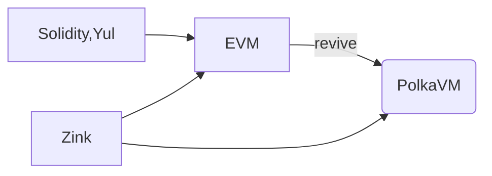

# EVM target compiler for RISC-V

- **Team Name:** Zink Language
- **Payment Details:**
  - **DOT**: 13VmF1UwYCv2Y2uhttupeMrm5eDo1tFc729gm4uN9CG7Ycv2
  - **Payment**: 13VmF1UwYCv2Y2uhttupeMrm5eDo1tFc729gm4uN9CG7Ycv2(USDC)
- **[Level](https://github.com/w3f/Grants-Program/tree/master#level_slider-levels):** 3

## Project Overview :page_facing_up:

### Overview

Compiler of RISC-V for EVM.

[Zink](https://github.com/zink-lang/zink) is a rustic smart contract langauge targets all VMs , currently using WASM as IR and can be compiled into EVM bytecode, we're focus on the future that **developers write one contract in zink, deploy on all VMs**.

### Project Details

Zink Language comes with a frontend code generator [zingen](https://github.com/zink-lang/zink/tree/main/codegen) which uses instruction set
generated by rust compiler like WASM or RISC-V as `IR` to generate EVM target bytecode.

After the development in the past two years, [zink-lang](https://github.com/zink-lang/zink) already can be compiled to EVM bytecode elegantly, plus, it has its own testing framework [zint](https://github.com/zink-lang/zink/tree/main/zint) to do e2e tests with EVM directly.

### Ecosystem Fit

Most of the smart contract developers are working on EVM, as parity recently just introduced [revive](https://github.com/paritytech/revive), Zink Language is about to solve the same thing but in a different way.

## Team :busts_in_silhouette:

### Team members

- Tianyi - Founder

### Contact

- **Contact Name:** Tianyi Zhang
- **Contact Email:** tianyi.gc@gmail.com
- **Website:** https://clearloop.xyz

### Team's experience

Previous working at [@Gear Tech](https://github.com/gear-tech) and [@ChainSafe](https://github.com/chainsafe).

Have been working in polkadot ecosystem for over 5 years, was developing wasm smart contract toolchains @gear-tech,
used to replace tcp with nym in libp2p, implement uniswap-v3 as substrate contract, and developed the relayer of arweave for thegraph protocol @chainsafe.

### Team Code Repos

- **Zink Language**: https://github.com/zink-lang/zink
- **Tianyi on Github**: https://github.com/clearloop

### Team LinkedIn Profiles (if available)

- https://www.linkedin.com/in/clearloop

## Development Roadmap :nut_and_bolt:

### Overview

- **Total Estimated Duration:** 4
- **Full-Time Equivalent (FTE):**  2FTE
- **Total Costs:** $80,000
- **DOT %:** 50%

### Milestone 1 Example — Arithmetic Instructions Mapping

- **Estimated duration:** 1 month
- **FTE:**  1.5
- **Costs:** 20,000 USD

| Number | Deliverable | Specification |
| -----: | ----------- | ------------- |
| **0a.** | License | GPL-3.0-or-later |
| **0b.** | Documentation | We will provide both **inline documentation** of the code and a basic **tutorial** that explains how a user can (for example) spin up one of our Substrate nodes and send test transactions, which will show how the new functionality works. See the [delivery guidelines](https://grants.web3.foundation/docs/Support%20Docs/milestone-deliverables-guidelines#documentation) for details. |
| **0c.** | Testing and Testing Guide | Core functions will be fully covered by comprehensive unit tests to ensure functionality and robustness. In the guide, we will describe how to run these tests. See the [delivery guidelines](https://grants.web3.foundation/docs/Support%20Docs/milestone-deliverables-guidelines#testing-guide) for details. |
| **0d.** | Article | We will publish an **article**/workshop that explains [...] (what was done/achieved as part of the grant). (Content, language, and medium should reflect your target audience described above.) |
| 1. | RISC-V target | support RISC-V as target in the testing environment of zink lang |
| 2. | RISC-V parser | a risc-v parser based on the implementation of polkavm-common |
| 3. | Arithmetic Instructions | Mapping arithmetic instructions from RISC-V to EVM instructions, convert register based operations to stack based operations |
| 4. | Function generator | Abstract function generator for RISC-V as IR, it should support getting calldata for inner function blocks and the control flow of return at the end of function in this milestone  |
| 5. | Addition example | Intorudce a basic addition contract as an example |
| 6. | Testing Tool | Adapt the RISC-V arch in zink's testing toolchain |
| 7. | Contract Tests | Introduce tests for all arithmetic instructions with REVM |

The uncertain parts of this milestone is the RISC-V parser and the conversion between register-based bytecode and stack-based bytecode:

1. `polkavm-common` contains the logic we need but it is under heavy development atm, need extra work adapting it
2. even RISC-V instruction set is clean and simple, the conversion from resiger-based bytecode to stack-based bytecode is also a challenge.

Implementaion in this milestone should also be considered as a POC of this proposal, if we can deliever this milestone successfully, everything will be possible in this proposal.

### Milestone 2 — RISC-V IR as Option in Zink

- **Estimated Duration:** 1 month
- **FTE:**  2
- **Costs:** 20,000 USD

| Number | Deliverable | Specification |
| -----: | ----------- | ------------- |
| **0a.** | License | GPL-3.0-or-later |
| **0b.** | Documentation | We will provide both **inline documentation** of the code and a basic **tutorial** that explains how a user can (for example) spin up one of our Substrate nodes and send test transactions, which will show how the new functionality works. See the [delivery guidelines](https://grants.web3.foundation/docs/Support%20Docs/milestone-deliverables-guidelines#documentation) for details. |
| **0c.** | Testing and Testing Guide | Core functions will be fully covered by comprehensive unit tests to ensure functionality and robustness. In the guide, we will describe how to run these tests. See the [delivery guidelines](https://grants.web3.foundation/docs/Support%20Docs/milestone-deliverables-guidelines#testing-guide) for details. |
| **0d.** | Article | We will publish an **article**/workshop that explains [...] (what was done/achieved as part of the grant). (Content, language, and medium should reflect your target audience described above.) |
| 1. | `zingen` integration | support RISC-V as an optional source of the zink code generator |
| 2. | Environment Call | support addressing environment calls of RISC-V in the code generator |
| 3. | Storage interface | storage operations, sstore, sload with environment call |
| 3. | Jump Table | Adapt RISC-V instructions to the exist zink jump table |
| 4. | Locals | Resolver for function locals, extract and store them in memory |
| 4. | Control Stack | register RISC-V related argument types & return output in control stack.  |
| 4a. | Inner Function Call | Control stack for inner function call, as for the details: jump to inner function, execute, leave the ouput on stack and jump back to the last PC |
| 4b. | Control Flow | `if`, `if-else` and `match` in the original rust code should be compiled correctly |
| 5. | Contract Tests | Tests for storage interface and control flow with REVM |

### Milestone 3 — Function selector and Creation bytecode

- **Estimated Duration:** 1 month
- **FTE:**  2
- **Costs:** 20,000 USD

| Number | Deliverable | Specification |
| -----: | ----------- | ------------- |
| **0a.** | License | GPL-3.0-or-later |
| **0b.** | Documentation | We will provide both **inline documentation** of the code and a basic **tutorial** that explains how a user can (for example) spin up one of our Substrate nodes and send test transactions, which will show how the new functionality works. See the [delivery guidelines](https://grants.web3.foundation/docs/Support%20Docs/milestone-deliverables-guidelines#documentation) for details. |
| **0c.** | Testing and Testing Guide | Core functions will be fully covered by comprehensive unit tests to ensure functionality and robustness. In the guide, we will describe how to run these tests. See the [delivery guidelines](https://grants.web3.foundation/docs/Support%20Docs/milestone-deliverables-guidelines#testing-guide) for details. |
| **0d.** | Article | We will publish an **article**/workshop that explains [...] (what was done/achieved as part of the grant). (Content, language, and medium should reflect your target audience described above.) |
| 1. | Creation bytecode | generate creation bytecode with the RISC-V source |
| 2. | Function selector | generate function selector from the RISC-V source |
| 3. | Memory allocator | reserve memory on different storage types in contracts |
| 4. | Complex storage | storage mapping and double key mapping support |
| 5. | Logging interface | support of EVM logging |
| 6. | Revert macro | revert with message |
| 7. | ABI generator | function ABI integration with RISC-V environment call |
| 8. | ERC20  | Compile ERC20 using RISC-V |
| 9. | Contract Tests | ERC20 contract tests |

### Milestone 4 — Dynamic types and Consistency tests

- **Estimated Duration:** 1 month
- **FTE:**  2
- **Costs:** 20,000 USD

| Number | Deliverable | Specification |
| -----: | ----------- | ------------- |
| **0a.** | License | GPL-3.0-or-later |
| **0b.** | Documentation | We will provide both **inline documentation** of the code and a basic **tutorial** that explains how a user can (for example) spin up one of our Substrate nodes and send test transactions, which will show how the new functionality works. See the [delivery guidelines](https://grants.web3.foundation/docs/Support%20Docs/milestone-deliverables-guidelines#documentation) for details. |
| **0c.** | Testing and Testing Guide | Core functions will be fully covered by comprehensive unit tests to ensure functionality and robustness. In the guide, we will describe how to run these tests. See the [delivery guidelines](https://grants.web3.foundation/docs/Support%20Docs/milestone-deliverables-guidelines#testing-guide) for details. |
| **0d.** | Article | We will publish an **article**/workshop that explains [...] (what was done/achieved as part of the grant). (Content, language, and medium should reflect your target audience described above.) |
| 1. | Backtrace | address RISC-V instructions with EVM Opcodes  |
| 2a. | Dynamic Types (calldata) | handle dyanmic types in arguments |
| 2b. | Dynamic Types (locals) | handle dyanmic types in locals |
| 2c. | Dynamic Types (result) | handle dyanmic types in result |
| 2d. | Dynamic Types (storage) | handle dyanmic types in storage |
| 3. | Consistency testing util | Introduce a tool that can test contracts in parallel ( same input same output for both EVM and PolkaVM ) |
| 4. | Consistency tests | Introduce consistency tests for all provided instructions & examples in this proposal |

## Future Plans

As a new smart contract langauge, we'd like starting from on-chain tests of EVM contracts, in details, developers wirte zink contracts as the tests of their
EVM contracts, while running tests, the zink testing toolchain compiles zink contracts and deploy them along with the target contract, then run the tests, like
the tests implemnted in foundry project but in zink, no more solidity.

While developing and maintaining the testing toolchain, we'd like to introduce more standard libraries like what openzepplin provides, again and again till there's
no obviously bugs...

After that, we'll focus on promoting zink to DApp developers & L2s, one contract, deploy anywhere.

## Additional Information :heavy_plus_sign:

My friend @nulltea recently sent me the repo [revive](https://github.com/paritytech/revive), while we were talking about VMs, we realized that zink can actually contribute to PolkaVM as well!
