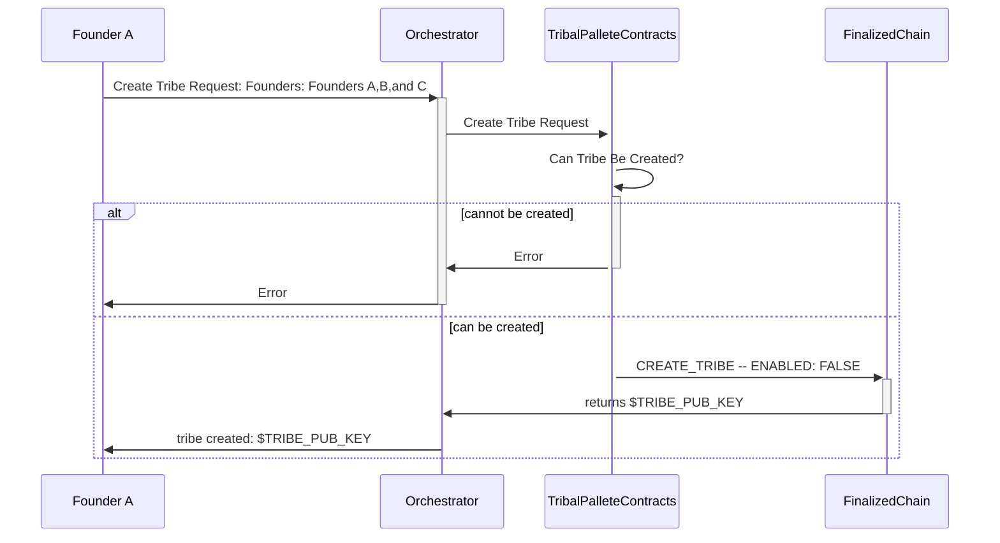
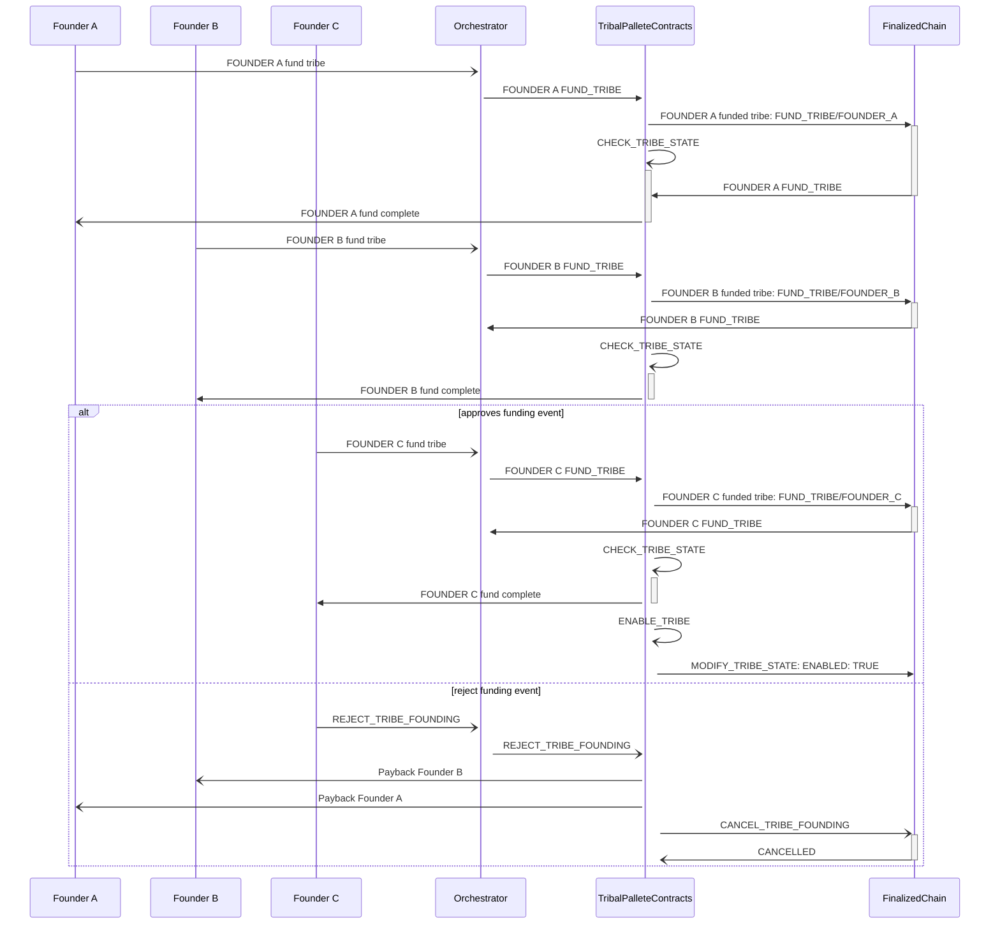

# Web3 Foundation Submission

- **Project Name:** Tribal Protocol Smart Contract Development - Phase 1
- **Team Name:** Tribal Protocol Labs
- **BTC** **Payment Address:** bc1qvvd32azksdlgqdcer5e6wkxg38yfplg4lyjh0m
- **Level 2 Grant Submission**

## **Project Overview 📄**

### Smart Contract development to power the future L1 Social Network - Tribal Protocol

Our long term goal is to launch our own chain and open source products to allow anyone to create their own niche social media platform. The key component to these social networks, are what we call ***Tribes.*** A tribe is governed by smart contracts and owned by the very same users that power the network. This allows for each social network to truly operate as a DAO and be co-owned and co-created by anyone on the internet. Each tribe will have their own shared treasury, governance, norms and rules that run their shared social network.

This grant submission is specifically for research and the development of the primary ink! smart contracts which will be the backbone of our Tribal Protocol. Our team has deep experience in systems design, development, implementation, and DevOps; but the biggest risks associated with our Tribal Protocol are the technical unknowns regarding the smart contract components. By leveraging this web3 grant to develop the hardest part of our system first, we’ll be putting ourselves in a great position for further protocol development in the future.

### **Team Motivation**

We’re a tight group of technologists, product guys, and developers that are investing our time and skills to solve problems in this critically important part of people’s everyday lives in a novel and compelling way.

**It's all about Ownership**. We believe the users — real people — should own and monetize their own thoughts and opinions. It’s becoming more apparent every day that there is something deeply wrong with today’s social media platforms, and we can see that a new wave is coming. 

There needs to be a “people focus” on what web3 should be. While there has been an explosion of interest and development in the web3 social space, so much of it has fallen flat and failed to activate the network effects of its user base.  

We believe in designing **first** for non-technical **everyday users**, and hope to leave the focus on crypto and blockchain as non-blocking technical details. Discovering Substrate, with its near turn-key ability to bootstrap our own “blockchain backend” to craft full end to end products, energizes us. This grant is the first step towards building that future:

The Tribal Protocol.

### **Tribal Protocol**

The value of a social network is directly related to its users and their content. User ownership of content is just one of the promises of web3 that we seek to fulfill. With the Tribal Protocol:

1. Creators **always own** their content.
2. Creators **can choose to lease their content** to any number of tribes. This action controls who and what can ***view*** the content.
3. Either party (creator or tribe) can end a lease at any time.
4. The creator can delete their content — ensuring the right to be forgotten.

Another key promise of web3 is that the [same users that power social networks can be owners of the platforms they power.](https://every.mirror.xyz/y_WLA-Tk3VF5uPqHi-glDLVVfHxLUbjXakRI7SMISas#:~:text=4.%20DAOs%20and%20community%20ownership) The Tribal Protocol provides a collection of utilities, and modules that assist with:

1. Governance
2. L2 Tokenization/Treasury
3. Communication/Coordination
4. Other functionality to create, and maintain Decentralized Autonomous Organizations.

### **Relevance to Substrate & Polkadot**

At the very least this work will contribute to the open source ink! community as well as provide open source tooling for DAOs in the Substrate & Polkadot ecosystem. Our ultimate goal is to launch Tribal Protocol (that this grant work is foundational to) as either our own L1 network or as a Polkadot parachain. Web3 Social Media is one of the most promising segments across the blockchain landscape today and has the potential to create a massive user on-boarding ramp into the Substrate and Polkadot ecosystems. A key reason for building on a Substrate foundation is for all the opportunities for interoperability across the Polkadot ecosystem and the rich feature sets our network developers and users will be able to leverage into the future. 

### **Project Details**

### **Key Deliverables**

1. Custom Pallet: `pallet_tribal`
    - Creation of the tribal pallet will serve as an initial container for the various smart contracts used to customize substrate to support our requirements.
2. ink! Smart Contract: `create_tribe` 
    - Tribes have the ability to have multiple founders, and **every potential founder must approve the** `create_tribe` **event.**
3. ink! Smart Contract: `lease_content`
    - Users — who are using the Tribal chain — can upload content that the **user owns**. The **content creator** can decide which **tribe** to **lease** their content to, via the `lease_content` ink contract.
4. ink! Smart Contract:  `revoke_lease`
    - Content **leased** to specific **tribes** can be disassociated from said tribes via the `revoke_lease` contract. This contract can be invoked by **any party described within the lease (owners, and recipients)**
5. Client Library:  `Orchestrator`
    - The `Orchestrator` will be a **client-side wasm** library, not **server-side**. This is where interaction between smart contracts on chain and UI will happen. Additionally this allows private keys to remain client side, invisible to the chain.
6. Initial Implementation: 
    - Once the above contracts are built, we must express these contracts, and pallet on-chain. This test will prove our concepts above.

### Deliverable Details

**Create Tribe — Initiate “Create Tribe” request**  

To create a tribe, **one** founder submits a `create_tribe` contract transaction, proxied via the `Orchestrator`. The `Orchestrator` submits the signed transaction to the smart contract itself, digests the response, and returns the specified tribe’s `public_key` to the founder.

Once the above operation is complete, tribes are left in a **disabled** state, until all listed founders approve the creation of the tribe.

**Create Tribe — Founder(s) approval**

To activate an instantiated tribe, all listed founders must accept the terms, and conditions of said tribe, as defined in the initial `create_tribe` event.

In the above diagram, after all the founders accept the creation of the tribe, the tribe is set to an **active** state. Once the tribe is active, it can participate in content leasing events.

Alternatively, as depicted in the diagram above, if **any** founder rejects the `create_tribe` event, the tribe ****will not be activated**,** and is marked as closed. 

In order to continue, a new tribe must be **created from scratch**,  and once again be approved by each **founder**. 

**Lease Content**

Content leasing is how we expect to enable individual content ownership and distribution. Leasing expects 2 actors: the content creator (lessor) and the tribe (lessee).

`lease_content` contract creates the on-chain representation between the specified tribe and the **user-owned** **content** by creating a cryptographic key that **unlocks** the original cryptographic content key which is used to decrypt that specific user’s content. 

This model allows content to be encrypted with a single key-pair, that is stored using the user’s own key-pair. A lease will **decrypt** the original content key, and create a new cryptographic key which can **also** unlock the original content’s key. Any key that is able to unlock the original content key will be **derived** from the original. 

### **Technology Stack**

The tribal smart contracts will be written in ink!, which is native `rustlang`. The CLI, and other core components will use reputable libraries like `clap` to construct the actual CLI, and `tokio` to provide asynchronous task execution from within our libraries. 

All cryptographic functions will be derived from stock `substrate`  libraries, and pallets.

Most lower-level blockchain related functionality will also **initially** use stock `substrate` pallets like `BABE` and/or `GRANDPA`.

At this time, any UX functionality will be mostly custom, with the exception of base substrate modules that can be loaded via `WASM`. We expect to have some client-side services to communicate with back-end services in real time via REST calls, and web sockets to communicate with multiple back-ends simultaneously. We expect all of this communication to be contained within what we are calling the `Orchestrator`, which will negotiate backend data, and transaction signing/submission **with user approval**. Because of the nature of it’s utilities, we have determined that this workload should exist client-side exclusively. 

### **Proof-of-Concept (prior work)**

An initial implementation of Tribal Protocol was written in C# from scratch without forking another chain to work out some of our system design questions. While we were able to get past rudimentary P2P networking and proof-of-stake consensus issues, the enormity of the task ahead caused us to re-evaluate. In the course of re-evaluating we determined that a language like C#, while powerful in its own right, was not suited to developing a L1 blockchain. This led us to Rust, and eventually to Substrate. 

Once we settled on the proper tooling, we were able to think more clearly about the problem domain, and how to go about implementing it. We discovered that we *had* to have smart contracts at the heart of our system if we wanted it to have the utility desired while remaining open to decentralization. 

After deep diving in ink! we realized that Substrate mitigated many of our network level architecture concerns, and gave us a smart contracting framework to build from. We spent some time building out small projects in Rust (including these crates: [1](https://crates.io/crates/deso/0.2.1),[2](https://crates.io/crates/base58check-encode/0.1.1)) and basic ink contracts in order to get more familiar with Rust, ink!, and Substrate prior to this grant submission.

### **Non-Goals**

We’ll take this chance to be very clear that the work associated with this grant is not intended to create a production ready network or a consumer quality user interface. This is a designed to be the first major milestone towards building out our Tribal Network. Think of it as the first real development epic after completing our research spike on Substrate, ink!, and Rust over the last few months. The outputs of this grant are limited to the key deliverables detailed above and the deliverables outlined in the milestones below.

### **Ecosystem Fit**

Tribal Protocol will be a social media protocol that enables anyone to create their own web3 native social media platform on top of it. There are plenty of others that are attempting to fulfill a similar vision of “decentralizing social media”:

- Early attempts: [Steemit.com](http://Steemit.com), [Hive.com](http://Hive.com), [Minds.com](http://Minds.com)
- Modern attempts on ETH: Lens, Farcaster
- Non-ETH based modern attempts: SubSocial, Solcial, [DeSo](http://DeSo.Org)

However we don’t believe that any of these projects have found sufficient levers and ways of mixing crypto and social to unlock the user growth needed for meaningful consumer adoption.

What makes Tribal Protocol unique is our full stack approach to serve a very specific customer - **people who want to become founders, co-owners, and contributors to entirely new niche social networks that they control.** The vast majority of the space today is attempting to enable the “decentralized twitter or facebook” products while not actually enabling early stage social networks to form. Our most critical differentiator from all other attempts in this space is the creation of DAOs that are directly tied to niche social networks. The economic alignment that DAOs unlock combined with the content moat from user driven content leasing is the secret sauce that allow nascent social networks to form.

We will be “dog-fooding” our own stack to build out multiple non-crypto user base focused social networks with the goal creating 10 tribes / tribal protocol based apps each with 5K Daily Active Users (solid base of 50K DAU across protocol). Once we reach this milestone we plan to productize our no-code platform for non-technical individuals to launch and manage their own social networks built on tribal protocol. This last step would amount to something like a Wix for social media app creation + day-to-day DAO management tooling that we’ll either build out or integrate with existing products from the ecosystem.

The open source tech stack we’re developing will help move the substrate and Polkadot ecosystem forward in ink! smart contract development, practical applications of DAOs and their associated management tooling. Please reference our [whitepaper](http://tribal.fyi) for more depth on the use cases Tribal Protocol unlocks and insight into our go to market strategy.

## **Team 👥**

### **Team members**

- Jason Devlin (team leader/ CEO)
- Chris Erker (CTO)
- Alec Ghazarian (CIO)

### **Contact**

- **Contact Name:** Jason Devlin
- **Contact Email:** [j](mailto:john@duo.com)ason@tribalprotocol.io
- **Website:** tribal.fyi

### **Legal Structure**

- **Registered Address:** 2929 E Commercial Blvd Ste 409, Fort Lauderdale FL 33308
- **Registered Legal Entity:** Tribal Protocol Labs (Delaware C-Corp)****

### **Team's experience**

Chris, Alec, and Jason launched a startup called [CloutCast](http://cloutcast.io) in April of 2021 and were a part of the first [DeSo Foundation Octane Fund](https://www.deso.org/blog/octane-fund-w22-cohort) backed projects. CloutCast is “web3’s promoted post platform” - and aims to re-imagine what sponsored posts look like in the emerging web3 social media space. This project was a full contact immersion into web3 and gave us a lot of our technical and personal exposure to the major ecosystems and players in decentralized social media today.

Prior to CloutCast the three members of this team met and built products together for a Miami based corporate startup studio. At that time Chris was the lead software architect, Alec was head of Dev-Ops, and Jason was head of product - churning out scalable software products from ideation to scale for a now $10B public company.

From our years of working at a startup studio and our experience building out products on top of current social media products and protocols - we realized that we could do a better job of building a full stack solution in this space rather than continuing to play within other protocol’s limitations. Taking on the L1 Tribal Protocol allows us to have full technical design flexibility as well as being able to capture the upside if our vision succeeds.

Chris is a software engineer, system architect, and entrepreneur with 25+ years of experience.

Alec is a software engineer, Dev-Ops leader, and entrepreneur with 10+ years of experience.

Jason is a product leader, entrepreneur and a former US Army Officer with 10+ years of experience.

### **Team Code Repos**

[https://github.com/cloutcast/cloutcast-ui](https://github.com/cloutcast/cloutcast-ui)

[https://github.com/cloutcast/cloutcast-api](https://github.com/cloutcast/cloutcast-api)

[https://github.com/desphere](https://github.com/desphere)

### **Team LinkedIn Profiles**

- [Jason Devlin](http://www.linkedin.com/in/jasontdevlin)
- [Alec Ghazarian](https://www.linkedin.com/in/alecghazarian)
- [Chris Erker](https://www.linkedin.com/in/christophererker/)

## **Development Status 📖**

[Tribal Protocol White Paper](http://tribal.fyi)

**Open Source Rust familiarization work** 
* [Crate 1](https://crates.io/crates/deso/0.2.1)
* [Crate 2](https://crates.io/crates/base58check-encode/0.1.1)
* [Tribal Protocol R&D Github](https://github.com/tribal-protocol)

## **Development Roadmap 🔩**

### **Overview**

- **Total Estimated Duration:** 4 Months
- **Full-Time Equivalent (FTE):** 3
- **Total Costs:** 40,000 USD (BTC equivalent)

### ****Milestone 1 — Implement Local Development Chain + Create Tribes****

- **Estimated duration:** 45 Days (~240 development hours)
- **FTE:** 2
- **Costs:** 15,000 USD (BTC equivalent)

A Tribe is the key actor in the tribal protocol - it is the DAO entity that allows for co-ownership of social networks on the protocol. This milestone will allow for the operation of a local development chain, including the custom Tribal Substrate pallet. The key output of this milestone is the ability to create tribes via an ink smart contract. In this milestone we will implement the basic structure of the Tribe entity and validations around Tribe creation.

|Number|Deliverable                |Specification                                                                                                                                                                                                                                     |
|------|---------------------------|--------------------------------------------------------------------------------------------------------------------------------------------------------------------------------------------------------------------------------------------------|
|0a.   |License                    |Apache 2.0                                                                                                                                                                                                                                        |
|0b.   |Documentation              |We will provide both inline documentation of the code and a basic tutorial that explains how a user can create a basic Tribe and how to create a local development chain. Once the node is up, it should produce blocks and tribes can be created.|
|0c.   |Testing Guide              |Core functions will be fully covered by unit tests to ensure functionality and robustness. In the documentation and blog post, we will describe how to run these tests.                                                                           |
|0d.   |Article                    |We will publish a blog post that explains the architecture of Tribal as it relates to Substrate, how to create tribes on the protocol, and how to run a local development chain.                                                                  |
|1.    |Design Document            |A detailed description of key system components, entities, and pallets that comprise the local development tribal chain.                                                                                                                          |
|2.    |tribal_pallet              |Pallet initialization to contain Tribal smart contracts                                                                                                                                                                                           |
|3.    |Ink! Contract: create_tribe|Extensible ink! contract to spawn a tribe entity                                                                                                                                                                                                  |
|4.    |Initial Tribe Struct       |Represent tribe entity within Tribal Pallet. Tribe entity includes metadata to support said tribe.                                                                                                                                                |
|5.    |Orchestrator Client        |Initial Orchestrator lib crate      

### ****Milestone 2 — Implement Content Leasing Ink! Contract****

- **Estimated Duration:** 45 Days (~240 development hours)
- **FTE:** 2
- **Costs:** 15,000 USD (BTC equivalent)

As a social media protocol content management, ownership, and control is critically important. A fundamental component of Tribal is the ability for users to “lease” content to tribes, as well as for tribes to dictate the conditions under which content can be leased.

In this milestone the primary deliverable is the extensible ink smart contract for content leasing between user and tribes.

|Number|Deliverable                |Specification                                                                                                                                                                                                                                     |
|------|---------------------------|--------------------------------------------------------------------------------------------------------------------------------------------------------------------------------------------------------------------------------------------------|
|0a.   |License                    |Apache 2.0                                                                                                                                                                                                                                        |
|0b.   |Documentation              |We will provide both inline documentation of the code and a basic tutorial that explains how a user can create leased content and how to create a local development chain.                                                                        |
|0c.   |Testing Guide              |Core functions will be fully covered by unit tests to ensure functionality and robustness. In the documentation and blog post, we will describe how to run these tests.                                                                           |
|0d.   |Article                    |We will publish a blog post that explains the smart contract implementation and implications of content leasing for production use cases going forward.                                                                                           |
|1.    |Design Document            |A detailed description of key system components, the tribal pallet, and the ink contracts in play.                                                                                                                                                |
|2.    |ink contract: lease_content|Extensible ink! contract to lease content between user and tribes.                                                                                                                                                                                |
|3.    |Content leased to a specific tribe can be identified and listed|API allows for the identification and listing of all leased content to a specified tribe. This becomes important for UI rendering in future development.                                                                                          |
|4.    |Txn level validation testing|Ensure content keys are not able to be leased multiple times, handle insufficient funds, conditional  leasing checks                                                                                                                              |
|5.    |Pallet Release v0.2        |Implementations of Milestone 2, wrapped in a compiled pallet.                                                                                                                                                                                     |

### ****Milestone 3 — Extend Ink! Contract for Revoke Content Lease & End to End Functional/Integration Code Coverage****

- **Estimated Duration:** 30 Days (~160 development hours)
- **FTE:** 2
- **Costs:** 10,000 USD (BTC equivalent)

The final milestone will focus on delivering the ability to revoke content leases initiated from either member of the lease (user or tribe) as well as deliver integration testing so the community benefits from clean, usable code.

|Number|Deliverable                |Specification                                                                                                                                                                                                                                     |
|------|---------------------------|--------------------------------------------------------------------------------------------------------------------------------------------------------------------------------------------------------------------------------------------------|
|0a.   |License                    |Apache 2.0                                                                                                                                                                                                                                        |
|0b.   |Documentation              |We will provide both inline documentation of the code and a basic tutorial that explains how a user can create and revoke leased content and how to create a local development chain.                                                             |
|0c.   |Testing Guide              |Core functions will be fully covered by unit tests to ensure functionality and robustness. In the documentation and blog post, we will describe how to run these tests.                                                                           |
|0d.   |Article                    |We will publish a blog post that explains the smart contract implementation and implications for production use cases going forward.                                                                                                              |
|1.    |Design Document            |A detailed description of key system components, the tribal pallet, and the ink contracts in play.                                                                                                                                                |
|2.    |revoke_lease               |Implement revoke_lease contract, and transaction types.                                                                                                                                                                                           |
|3.    |Integration/Functional Test(s): Mock Content|Mock Content can be Created. CREATE_CONTENT dummy transaction. (targeting ~75%+ Code Coverage)                                                                                                                                                    |
|4.    |Integration Test: Lease Content|Content can be leased to a tribe. LEASE_CONTENT transaction against a CREATE_CONTENT transaction. (targeting ~75%+ Code Coverage)                                                                                                                 |
|5.    |Integration Test: Multi Tribe Content Leasing|Content can be leased to multiple tribes simultaneously. LEASE_CONTENT to a tribe. (targeting ~75%+ Code Coverage)                                                                                                                                |
|6.    |Integration Test: Revoke Lease from one of multiple|Content can be revoked from one tribe, but not on another. REVOKE_CONTENT from a tribe. (targeting ~75%+ Code Coverage)                                                                                                                           |
|7.    |Integration Test: Revoke Lease from all tribes|Content can be revoked from all tribes. REVOKE_CONTENT from ALL tribes. (targeting ~75%+ Code Coverage)                                                                                                                                           |
|8.    |Pallet Release v0.3        |Implementations of Milestone 3, wrapped in a compiled pallet.                                                                                                                                                                                     |

## **Future Plans**

### **Short-term**

- Apply to the Substrate Builders Program.
- Close our seed fundraising round and build out our engineering and product teams.
- Continue user discovery process for niche social media networks in pilot focus areas.

### **Long-term**

### **Apply for a series of follow-on open grants to implement protocol enhancements:**

- Open Grant 1: Implement DAO Rules for Tribes, Governance and “L2” Tribal Tokens
- Open Grant 2: Implement fully co-owned social media web app built on Tribal Protocol

### **Continue towards mainnet launch**

1. Launch a public Tribal Protocol testnet.
2. Convert to an incentivized testnet under Tribal Protocol.
3. Convert to mainnet, as a stand alone L1 or parachain depending on technical discovery.

## **Additional Information ➕**

**How did you hear about the Grants Program?**

Jason was seeking some mentorship and advise from Jeremiah Wagstaff, co-founder of SubSpace, who recommended that we seriously consider a web3 grant as a great way to enter the ecosystem. Very glad those two connected! 