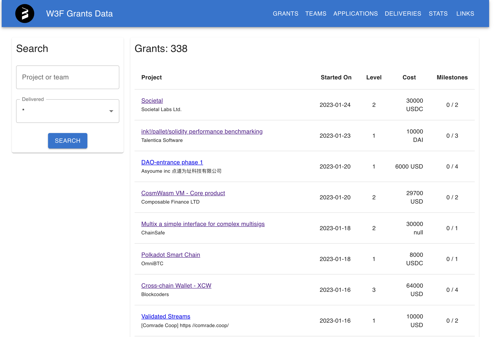
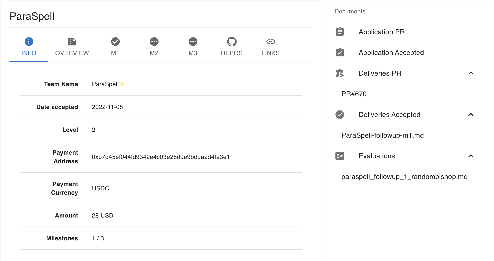

# Grant Management Web Application

* **Status:** Open
* **Proposer:** [randombishop](https://github.com/randombishop)

## Context

Web3 Foundation manages grant applications and deliveries in two github repositories:
* [Grants](https://github.com/w3f/Grants-Program)
* [Deliveries](https://github.com/w3f/Grant-Milestone-Delivery)

All the grant applications, approvals, deliveries and evaluations are pushed into github as PRs and documents, 
so that all processes are public and transparent.

You can find all the details about how applications and deliveries are submitted in the [Grants Program Website](https://w3f.github.io/Grants-Program/),
or by browsing the two repositories above.

## Project Description :page_facing_up: 

The objective of this RFP is a web application that publishes all the information contained in 
the W3F grants repositories in a way that facilitates easier navigation for the grants committee. Though the software would initially be used for the W3F Grants Program, any interested third parties would ideally be able to utilize the application for their own grants program. 

By providing an API, it will also allow for pulling the data in a structured way in order to make it easy to calculate statistics or track different metrics.

The Web3 Foundation Grants Program is unique in that everything is openly and transparently published on GitHub. As a result of this RFP, we hope the W3F Grants Program can set an example of how other grant programs can leverage a simple yet powerful process to manage their grants.
Therefore, the web application and the structure of our repositories can be re-used by other grant programs.

## Existing prototype

A quick and dirty prototype already exists for the application:
- [Backend](https://github.com/w3f/w3f_grants_backend)
- [Frontend](https://github.com/w3f/w3f_grants_frontend)

These examples are just an initial experiment to test how the app could work, and are completely undocumented, 
but please feel free to contact [us](grants@web3.foundation) if you need help trying them out or simply discuss.

Also, these are just an option, and the RFP doesn't require building from these. Proposers are free to propose the framework and approach of their choice.

## Deliverables :nut_and_bolt:

### Grants Page

- Lists grants and their status.
- Search
- Filter

For example:

### Grants details

- Shows the grant information
- Overview of the grant project
- Milestones details and status
- All documents related to the grant and links to their pull requests (application, deliveries and evaluations)

For example:

### Teams

- Provide a view at the team level.
- Contact information.
- Grants and applications, and their current status.

### Applications

- Current grant applications.
- Links to the PR on github, link to the team page to check their history.
- Status of the application, date opened, number of approvals so far and how many remaining.

### Deliveries

- Shows current deliveries pending evaluation.
- Links to all relevant information and history.
- Status of the delivery, submission date, evaluator, and if it's on stale.

### Stats

- Number of applications approved by month, with the corresponding total amount, and paid so far.
- Map of applications by country of origin.
- Chart of applications by status (Not yet delivered / delivered first milestone / completed / terminated)

### API

- The web app should ideally separate frontend from backend logic, and publish an API to fetch the structured data.

## Additional Notes

- The features proposed above represent an opinion on what the grant management webapp should do and look like,
but are neither exhaustive nor strict requirements. Teams are welcome to propose their own design and vision for this product.

- Web3 Foundation's grants program should be just an example/first step. 
Ideally, the tool (combining GitHub + website) can benefit other grant programs and on-chain treasuries.

- Long term goals: 
  * Oracles/pallets for treasury integration.
  * Using a decentralized alternative instead of github.
