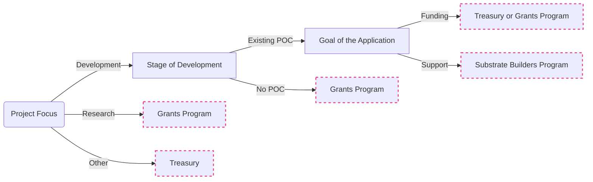

:::tip
Check out the [Substrate Square One](https://substrate.io/ecosystem/square-one/) website for all kinds of ecosystem support opportunities. 

:::
If you are certain you want to apply for a W3F grant, head straight to our [application process documentation](Process/how-to-apply.md). Alternatively, the flowchart below outlines where we think the grants program fits in relation to other popular funding opportunities.

## Funding Opportunities Overview

For a longer list and a description of the programs listed below, check out the [Substrate Square One](https://substrate.io/ecosystem/square-one/) website and [our page on alternative funding opportunities](funding.md).
