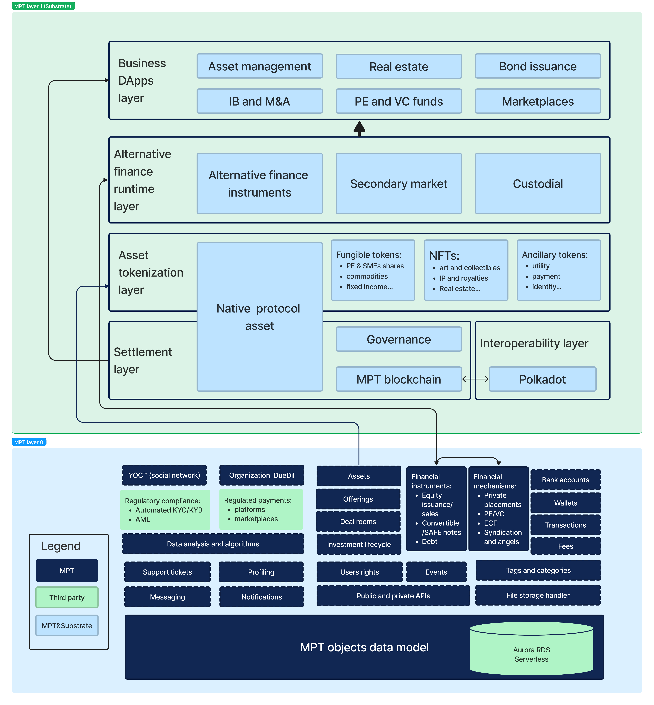

# Marco Polo Technologies - Primary and secondary issuance of RWAs for private markets with Substrate

- **Team Name:** Marco Polo Technologies
- **Payment Address:** In the case of fiat payment, please share your bank account privately with grants@web3.foundation via your contact email (see below) and enter the date when you shared the information with us (e.g. Fiat 24.12.1971, 11:59) here. Otherwise, provide the BTC, Ethereum (USDC/DAI) or Polkadot/Kusama (USDT) payment address. Please also specify the currency. (e.g. 0x8920... (DAI))
- **Level:** 2 or 3

## Project Overview :page_facing_up:

### Overview

#### A liquidity protocol for real-world assets (RWAs) to securely and compliantly automate primary and secondary token issuance in digital private markets.

#### Description

Marco Polo Technologies is an infrastructure as a service company that bridges the gap between traditional finance and innovative digital solutions, aiming at connecting real-world assets with digital finance. Our infrastructure serves as a secure and compliant foundation to support diverse business models and for companies in turnaround phases seeking a technological edge. With customizable workflows and a range of pre-built and _ad hoc_ functions, businesses can integrate our solution into existing digital or offline models. Additionally, we are developing a user-friendly UI architecture, enabling non-tech-savvy clients to swiftly create their alternative finance platforms with a close to _drag-and-drop_ experience.

Moreover, businesses can expand into previously underserved markets, connecting real-world assets to a broader audience. Our ongoing efforts harness the synergy between asset owners, investors, and issuers, facilitating transformative changes within private markets into public-like, frictionless models, injecting liquidity, accessibility, and transparency into digital private market investments, making them more impactful, appealing, and inclusive.

#### Marco Polo Technologies, Substrate and Polkadot - A brief description of our project.

Our first layer of the infrastructure is built on Rust, and we chose _Substrate_ as our development framework as a natural addition to our existing technology, in order to add a blockchain layer that focuses on the primary and secondary issuance of tokens representing real-world assets (RWAs) in private markets, while enabling access to many different investor classes. By building a liquidity protocol for RWAs on _Substrate_ and connecting it with our comprehensive infrastructure, Marco Polo Technologies (MPT) aims to share, among others, the following benefits with the Polkadot ecosystem:

- Promoting financial inclusion on platforms: onboarding reliable clients through established social connections, making digital private markets more accessible to a wider range of investors and asset owners, leveraging our proprietary social network.
- Enhancing asset interoperability: by enabling the seamless transfer and trading of RWAs across the Polkadot network, we will increase liquidity and accessibility for all market participants.
- Expanding market access: providing a gateway for a diverse range of participants to access private markets and RWAs issuance and trading, enriching the Polkadot ecosystem's financial landscape.
- Fostering DeFi innovation: leveraging RWAs within the decentralized finance (DeFi) space, supporting existing possibilities for DeFi applications such as fractional ownership, collateralization, and asset-backed lending, to attract new clients and assets to the Polkadot ecosystem.
- Building a robust ecosystem: adding a layer of financial functionality that complements and strengthens the overall infrastructure of Polkadot, to attract more platforms and clients to the ecosystem and expand its use cases.
- Interoperability with other blockchains: supporting a variety of RWAs and facilitate easy trading and investments across the network.
- Wallet support: our protocol will be interoperable with other wallets in the Polkadot ecosystem, supporting various fiat currencies, to simplify how users can store and manage their RWAs.

#### Team interest

Our team is a small, senior, and resourceful group with expertise in global private markets, investments, and technology. Our project has naturally evolved towards supporting the development of private markets and our current iteration is driven by our goal of tokenizing RWAs, which allows for fractional ownership representation and exchanges, while breaking down historical barriers such as illiquidity and limited access for smaller investors. We aim to harness the benefits of transparency, immutability, automated compliance and ownership records by leveraging Substrate and Polkadot's robust technologies. These benefits instill trust and reduce friction within the alternative finance market, making it more accessible and appealing to a wider range of investors and asset owners.

### Project Details

We expect the teams to already have a solid idea about your project's expected final state. Therefore, we ask the teams to submit (where relevant):

- Data models / API specifications of the core functionality
- An overview of the technology stack to be used
- Documentation of core components, protocols, architecture, etc. to be deployed
- PoC/MVP or other relevant prior work or research on the topic
- What your project is _not_ or will _not_ provide or implement
  - This is a place for you to manage expectations and to clarify any limitations that might not be obvious

Our intention is to deliver an initial implementation of a liquidity protocol that focuses on private markets and allows for asset tokenization, to support the build out of alternative finance platforms on top of our infrastructure. Our first steps for the MVP of this project would be to:

1) Set up our RWAs focused blockchain for private markets and develop its initial attributes: specifically designed for issuance and trading of RWAs, whereas primary issuance would be the focus in the initial phase.
2) Set up the initial role of the tokens for primary and eventually secondary issuance through smart contracts: creating a token standard that will make it swift for asset owners to issue tokens that represent their RWAs, and allow investors to invest in and trade these tokens on private exchanges.
3) Set up the initial wallet functions to allow for interaction with multiple users owning multiple assets: we aim at implementing a wallet that will allow users to store and manage their RWAs.

The image below represents the two layers of our infrastructure and how we would be using the _Substrate_ layer to support all sorts of alternative finance platform implementations. 

Among the diverse work of our team members, here are some platforms that have been built and deployed in the past ten years, clients vary from boutique adviosry firms to banks:
- [Professional investment network] (www.kobofunds.com)
### Ecosystem Fit

Help us locate your project in the Polkadot/Substrate/Kusama landscape and what problems it tries to solve by answering each of these questions:

- Where and how does your project fit into the ecosystem?
- Who is your target audience (parachain/dapp/wallet/UI developers, designers, your own user base, some dapp's userbase, yourself)?
- What need(s) does your project meet?
- Are there any other projects similar to yours in the Substrate / Polkadot / Kusama ecosystem?
  - If so, how is your project different?
  - If not, are there similar projects in related ecosystems?

## Team :busts_in_silhouette:

### Team members

- Name of team leader
- Names of team members

### Contact

- **Contact Name:** Full name of the contact person in your team
- **Contact Email:** Contact email (e.g. john@duo.com)
- **Website:** Your website

### Legal Structure

- **Registered Address:** Address of your registered legal entity, if available. Please keep it in a single line. (e.g. High Street 1, London LK1 234, UK)
- **Registered Legal Entity:** Name of your registered legal entity, if available. (e.g. Duo Ltd.)

### Team's experience

Please describe the team's relevant experience. If your project involves development work, we would appreciate it if you singled out a few interesting projects or contributions made by team members in the past. 

If anyone on your team has applied for a grant at the Web3 Foundation previously, please list the name of the project and legal entity here.

### Team Code Repos

- https://github.com/<your_organisation>/<project_1>
- https://github.com/<your_organisation>/<project_2>

Please also provide the GitHub accounts of all team members. If they contain no activity, references to projects hosted elsewhere or live are also fine.

- https://github.com/<team_member_1>
- https://github.com/<team_member_2>

### Team LinkedIn Profiles (if available)

- https://www.linkedin.com/<person_1>
- https://www.linkedin.com/<person_2>

## Development Status :open_book:

Here you can find some documentation on the research and our preliminary conversation with a Parity team member: [MPT market research](MPT_market_research.pdf) and [Reference of previous conversation with Parity](Parity_Marco_Polo_preliminary.pdf).

## Development Roadmap :nut_and_bolt:

Our team is working on the creation and implementation of other features in the wider context of our infrastructure, outside of this grant application. We would have the equivalent of two senior engineers working full-time on this project and the intended language of development would be Rust.

on This section should break the development roadmap down into milestones and deliverables. To assist you in defining it, we have created a document with examples for some grant categories [here](../docs/Support%20Docs/grant_guidelines_per_category.md). Since these will be part of the agreement, it helps to describe _the functionality we should expect in as much detail as possible_, plus how we can verify and test that functionality. Whenever milestones are delivered, we refer to this document to ensure that everything has been delivered as expected.

Below we provide an **example roadmap**. In the descriptions, it should be clear how your project is related to Substrate, Kusama or Polkadot. We _recommend_ that teams structure their roadmap as 1 milestone ≈ 1 month.

> :exclamation: If any of your deliverables is based on somebody else's work, make sure you work and publish _under the terms of the license_ of the respective project and that you **highlight this fact in your milestone documentation** and in the source code if applicable! **Projects that submit other people's work without proper attribution will be immediately terminated.**

### Overview

- **Total Estimated Duration:** ~3 months
- **Full-Time Equivalent (FTE):**  2 FTE
- **Total Costs:** 60,000 USD

### Milestone 1

- **Estimated duration:** ~1 month
- **FTE:** 2
- **Costs:** 20,000 USD

| Number | Deliverable | Specification |
| -----: | ----------- | ------------- |
| **0a.** | License | Apache 2.0 / GPLv3 / MIT / Unlicense |
| **0b.** | Documentation | We will provide both **inline documentation** of the code and a basic **tutorial** that explains how a user can (for example) spin up one of our Substrate nodes and send test transactions, which will show how the new functionality works. |
| **0c.** | Testing and Testing Guide | Core functions will be fully covered by comprehensive unit tests to ensure functionality and robustness. In the guide, we will describe how to run these tests. |
| **0d.** | Docker | We will provide a Dockerfile(s) that can be used to test all the functionality delivered with this milestone. |
| 1. | Substrate module: X | We will create a Substrate module that will... (Please list the functionality that will be implemented for the first milestone. You can refer to details provided in previous sections.) |
| 2. | Substrate module: Y | The Y Substrate module will... |
| 3. | Substrate module: Z | The Z Substrate module will... |
| 4. | Substrate chain | Modules X, Y & Z of our custom chain will interact in such a way... (Please describe the deliverable here as detailed as possible) |
| 5. | Library: ABC | We will deliver a JS library that will implement the functionality described under "ABC Library" |
| 6. | Smart contracts: ... | We will deliver a set of ink! smart contracts that will...

### Milestone 2

- **Estimated Duration:** ~1 month
- **FTE:** 2
- **Costs:** 20,000 USD

| Number | Deliverable | Specification |
| -----: | ----------- | ------------- |
| **0a.** | License | Apache 2.0 / GPLv3 / MIT / Unlicense |
| **0b.** | Documentation | We will provide both **inline documentation** of the code and a basic **tutorial** that explains how a user can (for example) spin up one of our Substrate nodes and send test transactions, which will show how the new functionality works. |
| **0c.** | Testing and Testing Guide | Core functions will be fully covered by comprehensive unit tests to ensure functionality and robustness. In the guide, we will describe how to run these tests. |
| **0d.** | Docker | We will provide a Dockerfile(s) that can be used to test all the functionality delivered with this milestone. |
| 1. | Substrate module: X | We will create a Substrate module that will... (Please list the functionality that will be implemented for the first milestone. You can refer to details provided in previous sections.) |
| 2. | Substrate module: Y | The Y Substrate module will... |
| 3. | Substrate module: Z | The Z Substrate module will... |
| 4. | Substrate chain | Modules X, Y & Z of our custom chain will interact in such a way... (Please describe the deliverable here as detailed as possible) |
| 5. | Library: ABC | We will deliver a JS library that will implement the functionality described under "ABC Library" |
| 6. | Smart contracts: ... | We will deliver a set of ink! smart contracts that will...

### Milestone 3

- **Estimated Duration:** ~1 month
- **FTE:** 2
- **Costs:** 20,000 USD

| Number | Deliverable | Specification |
| -----: | ----------- | ------------- |
| **0a.** | License | Apache 2.0 / GPLv3 / MIT / Unlicense |
| **0b.** | Documentation | We will provide both **inline documentation** of the code and a basic **tutorial** that explains how a user can (for example) spin up one of our Substrate nodes and send test transactions, which will show how the new functionality works. |
| **0c.** | Testing and Testing Guide | Core functions will be fully covered by comprehensive unit tests to ensure functionality and robustness. In the guide, we will describe how to run these tests. |
| **0d.** | Docker | We will provide a Dockerfile(s) that can be used to test all the functionality delivered with this milestone. |
| 0e. | Article | We will publish an **article**/workshop that explains [...] (what was done/achieved as part of the grant). (Content, language and medium should reflect your target audience described above.) |
| 1. | Substrate module: X | We will create a Substrate module that will... (Please list the functionality that will be implemented for the first milestone. You can refer to details provided in previous sections.) |
| 2. | Substrate module: Y | The Y Substrate module will... |
| 3. | Substrate module: Z | The Z Substrate module will... |
| 4. | Substrate chain | Modules X, Y & Z of our custom chain will interact in such a way... (Please describe the deliverable here as detailed as possible) |
| 5. | Library: ABC | We will deliver a JS library that will implement the functionality described under "ABC Library" |
| 6. | Smart contracts: ... | We will deliver a set of ink! smart contracts that will...

## Future Plans

Please include here

- how you intend to use, enhance, promote and support your project in the short term, and
- the team's long-term plans and intentions in relation to it.

## Additional Information :heavy_plus_sign:

**How did you hear about the Grants Program?** Web3 Foundation Website / Medium / Twitter / Element / Announcement by another team / personal recommendation / etc.

Here you can also add any additional information that you think is relevant to this application but isn't part of it already, such as:

- Work you have already done.
- If there are any other teams who have already contributed (financially) to the project.
- Previous grants you may have applied for.
